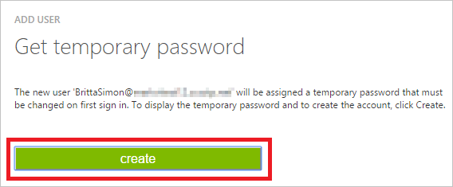

<properties
    pageTitle="Didacticiel : Intégration d’Azure Active Directory avec Litmos | Microsoft Azure"
    description="Découvrez comment configurer l’authentification unique entre Azure Active Directory et Litmos."
    services="active-directory"
    documentationCenter=""
    authors="jeevansd"
    manager="femila"
    editor=""/>

<tags
    ms.service="active-directory"
    ms.workload="identity"
    ms.tgt_pltfrm="na"
    ms.devlang="na"
    ms.topic="article"
    ms.date="09/29/2016"
    ms.author="jeedes"/>

# Didacticiel : Intégration d’Azure Active Directory avec Litmos

L’objectif de ce didacticiel consiste à vous montrer comment intégrer Litmos Azure Active Directory (AD Azure).  
Intégration de Litmos avec Azure AD vous offre les avantages suivants : 

- Vous pouvez contrôler dans Azure AD qui accèdent à Litmos 
- Vous pouvez autoriser les utilisateurs à automatiquement obtenir connecté-on to Litmos (SSO) avec leurs comptes Azure AD
- Vous pouvez gérer vos comptes dans un emplacement central - Azure Active Directory 

Si vous souhaitez en savoir plus d’informations sur l’intégration de l’application SaaS avec Azure Active Directory, voir [qu’est l’accès aux applications et l’authentification unique avec Azure Active Directory](active-directory-appssoaccess-whatis.md).

## Conditions préalables 

Pour configurer l’intégration Azure AD avec Litmos, vous devez les éléments suivants :

- Un abonnement Azure AD
- Une authentification unique Litmos lors de l’abonnement activé

> [AZURE.NOTE] Pour tester les étapes décrites dans ce didacticiel, nous ne recommandons pas à l’aide d’un environnement de production.

Pour tester les étapes décrites dans ce didacticiel, vous devez suivre ces recommandations :

- Vous ne devez pas utiliser votre environnement de production, sauf si cela est nécessaire.
- Si vous n’avez pas un environnement de version d’évaluation Azure AD, vous pouvez obtenir un mois d’évaluation [ici](https://azure.microsoft.com/pricing/free-trial/). 

 
## Description du scénario
L’objectif de ce didacticiel consiste à vous permettent de tester Azure AD SSO dans un environnement de test.  
Scénario présenté dans ce didacticiel se compose de trois grands blocs de construction :

1. Ajout de Litmos à partir de la galerie 
2. Configuration et test Azure AD authentification unique

## Ajout de Litmos à partir de la galerie
Pour configurer l’intégration des Litmos dans Azure AD, vous devez ajouter Litmos à partir de la galerie à votre liste d’applications SaaS gérées.

**Pour ajouter Litmos à partir de la galerie, procédez comme suit :**

1. Dans le **portail classique Azure**, dans le volet de navigation gauche, cliquez sur **Active Directory**. 

    ![Active Directory][1]

2. Dans la liste **répertoire** , sélectionnez le répertoire pour lequel vous souhaitez activer l’intégration d’annuaire.

3. Pour ouvrir la vue applications, dans l’affichage du répertoire, cliquez sur **Applications** dans le menu supérieur.

    ![Applications][2]

4. Cliquez sur **Ajouter** en bas de la page.

    ![Applications][3]

5. Dans la boîte de dialogue **que voulez-vous faire** , cliquez sur **Ajouter une application à partir de la galerie**.

    ![Applications][4]

6. Dans la zone Rechercher, tapez **Litmos**.

    ![Applications][5]

7. Dans le volet résultats, sélectionnez **Litmos**, puis cliquez sur **Terminer** pour ajouter l’application.

    ![Applications][500]

##  Configuration et test Azure AD authentification unique
L’objectif de cette section consiste à vous montrer comment configurer et tester Azure AD SSO avec Litmos basée sur un utilisateur de test appelé « Brian Simon ».

Pour de l’authentification unique pour l’utiliser, Azure AD doit détermine-t-il ce qui est l’utilisateur homologue dans Litmos à un utilisateur dans Active Directory Azure. En d’autres termes, une relation de liaison entre un utilisateur Azure AD et l’utilisateur connexe dans Litmos doit être établie.  
Cette relation lien est établie en affectant la valeur du **nom d’utilisateur** dans Active Directory Azure en tant que la valeur **nom d’utilisateur** dans Litmos.
 
Pour configurer et tester Azure AD SSO avec Litmos, vous devez effectuer les blocs de construction suivantes :

1. **[Configuration Azure AD SSO](#configuring-azure-ad-single-single-sign-on)** - pour permettre à vos utilisateurs utiliser cette fonctionnalité.
2. **[Création d’une annonce Azure tester l’utilisateur](#creating-an-azure-ad-test-user)** - permettent de tester Azure AD SSO avec Britta Simon.
4. **[Création d’un Litmos tester l’utilisateur](#creating-a-halogen-software-test-user)** - d’avoir un homologue de Britta Simon dans Litmos est liée à la représentation Azure AD de lui.
5. **[Attribution de l’annonce Azure tester l’utilisateur](#assigning-the-azure-ad-test-user)** - activer Britta Simon utiliser Azure AD SSO.
5. **[Test de l’authentification unique](#testing-single-sign-on)** - afin de vérifier si la configuration fonctionne.

### Configuration d’authentification Azure AD unique

L’objectif de cette section est pour activer Azure AD SSO dans le portail classique Azure AD et configurer l’authentification unique dans votre application Litmos.  
Dans le cadre de cette procédure, vous êtes obligé de créer un fichier de certificat codé base 64.  
Si vous n’êtes pas familiarisé avec cette procédure, voir [comment convertir un certificat binaire dans un fichier texte](http://youtu.be/PlgrzUZ-Y1o).

Dans le cadre de la configuration, vous devez personnaliser les **Attributs jeton SAML** pour votre application Litmos.  

![Authentification Azure AD unique][17] 

**Pour configurer Azure AD SSO avec Litmos, effectuez les opérations suivantes :**

1. Dans le portail classique Azure AD, dans la page de l’intégration **Litmos** application, cliquez **sur Configurer l’authentification unique** pour ouvrir la boîte de dialogue **Configuration de l’authentification unique** .

    ![Configurer l’authentification unique][6] 

2. Dans la page **Comment souhaitez-vous aux utilisateurs de se connecter à Litmos** , sélectionnez **Azure AD SSO**, puis cliquez sur **suivant**.
 
    ![Authentification Azure AD unique][7] 

1. Ouverture de session sur le site de votre entreprise Litmos (par exemple : *https://azureapptest.litmos.com/account/Login*) en tant qu’administrateur.

    ![Authentification Azure AD unique][21] 

1. Dans la barre de navigation sur le côté gauche, cliquez sur **comptes**.

    ![Authentification Azure AD unique][22] 

1. Cliquez sur l’onglet **intégrations d’entreprise** .

    ![Authentification Azure AD unique][23] 

1. Sous l’onglet **intégrations d’entreprise** , faites défiler jusqu'à **3e partie intégrations**, puis cliquez sur onglet **SAML 2.0** .

    ![Authentification Azure AD unique][24] 

1. Copiez la valeur sous **est le SAML endoiint pour litmos :**.

    ![Authentification Azure AD unique][26] 

3. Dans le portail classique Azure, dans la page de la boîte de dialogue **Configurer les paramètres de l’application** , effectuez les opérations suivantes :

    ![Authentification Azure AD unique][8] 
 
    un. Dans la zone de texte **identificateur** , tapez l’URL utilisée par vos utilisateurs pour vous connecter à votre application Litmos (par exemple : *https://azureapptest.litmos.com/account/Login*).
     
    b. Dans la zone de texte **URL de réponse** , collez la valeur que vous avez copiée à partir de l’application Litmos à l’étape précédente.

    c. Cliquez sur **suivant**.
 
4. Dans la page **configuration de l’authentification unique en Litmos** , effectuez les opérations suivantes :

    ![Authentification Azure AD unique][2] 

    un. Cliquez sur Télécharger le certificat, puis enregistrez le fichier sur votre ordinateur.

1. Dans votre application **Litmos** , effectuez les opérations suivantes :

    ![Authentification Azure AD unique][25] 

    un. Cliquez sur **Activer SAML**.

    b. Créer un fichier **codé en base 64** à partir de votre certificat téléchargé.  

    >[AZURE.TIP] Pour plus d’informations, voir [comment convertir un certificat binaire dans un fichier texte](http://youtu.be/PlgrzUZ-Y1o)

    c. Ouvrez votre certificat codé base 64 dans le bloc-notes, copiez le contenu de celle-ci dans votre Presse-papiers et collez-le dans la zone de texte **Certificat X.509 SAML** .

    d. Cliquez sur **Enregistrer les modifications**.

6. Dans le portail classique Azure AD, sélectionnez la confirmation de la configuration de l’authentification unique, puis cliquez sur **suivant**. 

    ![Authentification Azure AD unique][10]

7. Dans la page de **confirmation d’authentification unique** , cliquez sur **Terminer**.  
  
    ![Authentification Azure AD unique][11]

20. Dans le menu dans la partie supérieure, cliquez sur **attributs** pour ouvrir la boîte de dialogue **Attributs jeton SAML** . 

    ![Configurer l’authentification unique][12]

24. Dans la boîte de dialogue **Ajouter un attribut utilisateur** , effectuez les opérations suivantes : 

    ![Configurer l’authentification unique][14]

  	| Nom de l’attribut | Valeur de l’attribut |
  	| ---            | ---             |
  	| Messagerie          | User.Mail       |
  	| Prénom      | User.GivenName  |
  	| Nom       | User.Surname    |

    Pour chaque ligne de données dans le tableau ci-dessus, effectuez les opérations suivantes :
   
    un. Cliquez sur **Ajouter un attribut de l’utilisateur**. 

    ![Configurer l’authentification unique][15]

    un. Dans la zone de texte **Nom de l’attribut** , tapez le **Nom de l’attribut** affichées pour cette ligne.

    b. Sélectionnez la **Valeur de l’attribut** affichée pour cette ligne.

    c. Cliquez sur **Terminer** pour fermer la boîte de dialogue **Ajouter un attribut utilisateur** .

25. Cliquez sur **appliquer les modifications**. 

    ![Configurer l’authentification unique][16]

### Création d’un utilisateur de test Azure AD
L’objectif de cette section consiste à créer un utilisateur de test dans le portail classique Azure appelé Britta Simon.  

![Créez Azure AD utilisateur][20]

**Pour créer un utilisateur de test dans Azure AD, effectuez les opérations suivantes :**

1. Dans le **portail clasic Azure**, dans le volet de navigation gauche, cliquez sur **Active Directory**.

      

2. Dans la liste **répertoire** , sélectionnez le répertoire pour lequel vous souhaitez activer l’intégration d’annuaire.

3. Pour afficher la liste des utilisateurs, dans le menu dans la partie supérieure, cliquez sur **utilisateurs**.

     
 
4. Pour ouvrir la boîte de dialogue **Ajouter un utilisateur** , dans la barre d’outils en bas, cliquez sur **Ajouter un utilisateur**. 

     

5. Dans la page de dialogue **dites-nous sur cet utilisateur** , effectuez les opérations suivantes : 

      

    un. En tant **Type d’utilisateur**, sélectionnez **nouvel utilisateur de votre organisation**.

    b. Dans la **zone de texte**du nom d’utilisateur, tapez **BrittaSimon**.

    c. Cliquez sur **suivant**.

6.  Dans la page de la boîte de dialogue **Profil utilisateur** , procédez comme suit : 

     
 
    un. Dans la zone de texte **nom** , tapez **Brian**.  

    b. Dans la zone de texte **Nom** , type, **Simon**.

    c. Dans la zone de texte **Nom complet** , tapez **Brian Simon**.

    d. Dans la liste **rôle** , sélectionnez **utilisateur**.
    e. Cliquez sur **suivant**.

7. Dans la page de dialogue **obtenir le mot de passe temporaire** , cliquez sur **créer**.

     
 
8. Dans la page de dialogue **obtenir le mot de passe temporaire** , procédez comme suit :

     
  
    un. Notez la valeur de **Nouveau mot de passe**.

    b. Cliquez sur **terminé**.   

  
 
### Création d’un utilisateur de test Litmos

L’objectif de cette section consiste à créer un utilisateur appelé Britta Simon dans Litmos.  
Prend en charge l’application Litmos juste à temps de mise en service. Cela signifie que, un compte d’utilisateur est créé automatiquement si nécessaire au cours d’une tentative d’accès de l’application en utilisant le panneau d’accès.

**Pour créer un utilisateur appelé Britta Simon dans Litmos, effectuez les opérations suivantes :**

1. Ouverture de session sur le site de votre entreprise Litmos (par exemple : *https://azureapptest.litmos.com/account/Login*) en tant qu’administrateur.

    ![Authentification Azure AD unique][21] 

1. Dans la barre de navigation sur le côté gauche, cliquez sur **comptes**.

    ![Authentification Azure AD unique][22] 

1. Cliquez sur l’onglet **intégrations d’entreprise** .

    ![Authentification Azure AD unique][23] 

1. Sous l’onglet **intégrations d’entreprise** , faites défiler jusqu'à **3e partie intégrations**, puis cliquez sur onglet **SAML 2.0** .

    ![Authentification Azure AD unique][24] 

1. Sélectionnez **génère automatiquement les utilisateurs :**.

    ![Authentification Azure AD unique][27] 

### Affectation de l’utilisateur de test Azure AD

L’objectif de cette section est à l’activation Britta Simon à utiliser Azure de l’authentification unique en l’octroi d’accès aux Litmos.

![Affecter utilisateur][200] 

**Pour attribuer Britta Simon à Litmos, effectuez les opérations suivantes :**

1. Dans le portail classique Azure, pour ouvrir la vue applications, dans l’affichage du répertoire, cliquez sur **Applications** dans le menu supérieur.

    ![Affecter utilisateur][201] 

2. Dans la liste des applications, sélectionnez **Litmos**.

    ![Affecter utilisateur][202] 

1. Dans le menu dans la partie supérieure, cliquez sur **utilisateurs**.

    ![Affecter utilisateur][203] 

1. Dans la liste des utilisateurs, sélectionnez **Brian Simon**.

2. Dans la barre d’outils en bas, cliquez sur **attribuer**.

    ![Affecter utilisateur][205]

### Test de l’authentification unique

L’objectif de cette section consiste à tester votre Azure AD unique authentification configuration à l’aide du panneau d’accès.  
Lorsque vous cliquez sur la vignette Litmos dans le panneau d’accès, vous devez obtenir automatiquement connecté-sur à votre application Litmos.

## Ressources supplémentaires

* [Liste des didacticiels sur l’intégration des applications SaaS avec Azure Active Directory](active-directory-saas-tutorial-list.md)
* [Quel est l’accès aux applications et l’authentification unique avec Azure Active Directory ?](active-directory-appssoaccess-whatis.md)

<!--Image references-->

[1]: ./media/active-directory-saas-litmos-tutorial/tutorial_general_01.png
[2]: ./media/active-directory-saas-litmos-tutorial/tutorial_general_02.png
[3]: ./media/active-directory-saas-litmos-tutorial/tutorial_general_03.png
[4]: ./media/active-directory-saas-litmos-tutorial/tutorial_general_04.png
[5]: ./media/active-directory-saas-litmos-tutorial/tutorial_litmos_01.png
[500]: ./media/active-directory-saas-litmos-tutorial/tutorial_litmos_02.png

[6]: ./media/active-directory-saas-litmos-tutorial/tutorial_general_05.png
[7]: ./media/active-directory-saas-litmos-tutorial/tutorial_litmos_03.png
[8]: ./media/active-directory-saas-litmos-tutorial/tutorial_litmos_04.png
[9]: ./media/active-directory-saas-litmos-tutorial/tutorial_litmos_05.png
[10]: ./media/active-directory-saas-litmos-tutorial/tutorial_general_06.png
[11]: ./media/active-directory-saas-litmos-tutorial/tutorial_general_07.png
[12]: ./media/active-directory-saas-litmos-tutorial/tutorial_general_80.png
[13]: ./media/active-directory-saas-litmos-tutorial/tutorial_general_81.png
[14]: ./media/active-directory-saas-litmos-tutorial/tutorial_general_82.png
[15]: ./media/active-directory-saas-litmos-tutorial/tutorial_general_81.png
[16]: ./media/active-directory-saas-litmos-tutorial/tutorial_general_19.png
[17]: ./media/active-directory-saas-litmos-tutorial/tutorial_litmos_67.png

[20]: ./media/active-directory-saas-litmos-tutorial/tutorial_general_100.png
[21]: ./media/active-directory-saas-litmos-tutorial/tutorial_litmos_60.png
[22]: ./media/active-directory-saas-litmos-tutorial/tutorial_litmos_61.png
[23]: ./media/active-directory-saas-litmos-tutorial/tutorial_litmos_62.png
[24]: ./media/active-directory-saas-litmos-tutorial/tutorial_litmos_63.png
[25]: ./media/active-directory-saas-litmos-tutorial/tutorial_litmos_64.png
[26]: ./media/active-directory-saas-litmos-tutorial/tutorial_litmos_65.png
[27]: ./media/active-directory-saas-litmos-tutorial/tutorial_litmos_66.png

[200]: ./media/active-directory-saas-litmos-tutorial/tutorial_general_200.png
[201]: ./media/active-directory-saas-litmos-tutorial/tutorial_general_201.png
[202]: ./media/active-directory-saas-litmos-tutorial/tutorial_litmos_68.png
[203]: ./media/active-directory-saas-litmos-tutorial/tutorial_general_203.png
[204]: ./media/active-directory-saas-litmos-tutorial/tutorial_general_204.png
[205]: ./media/active-directory-saas-litmos-tutorial/tutorial_general_205.png

[400]: ./media/active-directory-saas-litmos-tutorial/tutorial_litmos_400.png
[401]: ./media/active-directory-saas-litmos-tutorial/tutorial_litmos_401.png
[402]: ./media/active-directory-saas-litmos-tutorial/tutorial_litmos_402.png

