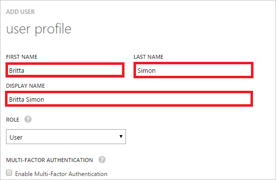

<properties
    pageTitle="Didacticiel : Intégration d’Azure Active Directory avec Optimizely | Microsoft Azure"
    description="Découvrez comment configurer l’authentification unique entre Azure Active Directory et Optimizely."
    services="active-directory"
    documentationCenter=""
    authors="jeevansd"
    manager="femila"
    editor=""/>

<tags
    ms.service="active-directory"
    ms.workload="identity"
    ms.tgt_pltfrm="na"
    ms.devlang="na"
    ms.topic="article"
    ms.date="09/11/2016"
    ms.author="jeedes"/>

# Didacticiel : Intégration d’Azure Active Directory avec Optimizely

Dans ce didacticiel, vous allez apprendre à intégrer Optimizely Azure Active Directory (AD Azure).

Intégration de Optimizely avec Azure AD vous offre les avantages suivants :

- Vous pouvez contrôler dans Azure AD qui accèdent à Optimizely
- Vous pouvez autoriser les utilisateurs à automatiquement obtenir connecté-on to Optimizely (SSO) avec leurs comptes Azure AD
- Vous pouvez gérer vos comptes dans un emplacement central : le portail classique Azure

Si vous souhaitez en savoir plus d’informations sur l’intégration de l’application SaaS avec Azure Active Directory, voir [qu’est l’accès aux applications et l’authentification unique avec Azure Active Directory](active-directory-appssoaccess-whatis.md).

## Conditions préalables

Pour configurer l’intégration Azure AD avec Optimizely, vous devez les éléments suivants :

- Un abonnement Azure AD
- Une authentification unique **Optimizely** lors de l’abonnement activé

> [AZURE.NOTE] Pour tester les étapes décrites dans ce didacticiel, nous ne recommandons pas à l’aide d’un environnement de production.

Pour tester les étapes décrites dans ce didacticiel, vous devez suivre ces recommandations :

- Vous ne devez pas utiliser votre environnement de production, sauf si cela est nécessaire.
- Si vous n’avez pas un environnement de version d’évaluation Azure AD, vous pouvez obtenir un mois d’évaluation [ici](https://azure.microsoft.com/pricing/free-trial/).

## Description du scénario
Dans ce didacticiel, vous testez Azure AD SSO dans un environnement de test. Scénario présenté dans ce didacticiel se compose de deux principaux blocs de construction :

1. Ajout de Optimizely à partir de la galerie
2. Configuration et test Azure AD authentification unique

## Ajout de Optimizely à partir de la galerie
Pour configurer l’intégration des Optimizely dans Azure AD, vous devez ajouter Optimizely à partir de la galerie à votre liste d’applications SaaS gérées.

**Pour ajouter Optimizely à partir de la galerie, procédez comme suit :**

1. Dans le **portail classique Azure**, dans le volet de navigation gauche, cliquez sur **Active Directory**. 

    ![Active Directory][1]

2. Dans la liste **répertoire** , sélectionnez le répertoire pour lequel vous souhaitez activer l’intégration d’annuaire.

3. Pour ouvrir la vue applications, dans l’affichage du répertoire, cliquez sur **Applications** dans le menu supérieur.

    ![Applications][2]

4. Cliquez sur **Ajouter** en bas de la page.

    ![Applications][3]

5. Dans la boîte de dialogue **que voulez-vous faire** , cliquez sur **Ajouter une application à partir de la galerie**.

    ![Applications][4]

6. Dans la zone Rechercher, tapez **Optimizely**.

    

7. Dans le volet résultats, sélectionnez **Optimizely**, puis cliquez sur **Terminer** pour ajouter l’application.

    

##  Configuration et test Azure AD authentification unique
Dans cette section, vous configurez et testez Azure AD SSO avec Optimizely basée sur un utilisateur de test appelé « Brian Simon ».

Pour de l’authentification unique pour l’utiliser, Azure AD doit savoir ce que l’utilisateur homologue dans Optimizely est à un utilisateur dans Active Directory Azure. En d’autres termes, une relation de liaison entre un utilisateur Azure AD et l’utilisateur connexe dans Optimizely doit être établie.
Cette relation lien est établie en affectant la valeur du **nom d’utilisateur** dans Active Directory Azure en tant que la valeur **nom d’utilisateur** dans Optimizely.

Pour configurer et tester Azure AD SSO avec Optimizely, vous devez effectuer les blocs de construction suivantes :

1. **[Configuration Azure AD SSO](#configuring-azure-ad-single-single-sign-on)** - pour permettre à vos utilisateurs utiliser cette fonctionnalité.
2. **[Création d’une annonce Azure tester l’utilisateur](#creating-an-azure-ad-test-user)** - permettent de tester Azure AD SSO avec Britta Simon.
4. **[Création d’un Optimizely tester l’utilisateur](#creating-an-optimizely-test-user)** - d’avoir un homologue de Britta Simon dans Optimizely est liée à la représentation Azure AD de lui.
5. **[Attribution de l’annonce Azure tester l’utilisateur](#assigning-the-azure-ad-test-user)** - activer Britta Simon utiliser Azure AD SSO.
5. **[Test de l’authentification unique](#testing-single-sign-on)** - afin de vérifier si la configuration fonctionne.

### Configuration d’authentification Azure AD unique

L’objectif de cette section est pour activer Azure AD SSO dans le portail classique Azure et configurer l’authentification unique dans votre application Optimizely.

Application Optimizely attend les assertions SAML contienne un attribut nommé « messagerie ». La valeur de « messagerie » doit être un message électronique Optimizely reconnu qui peut obtenir authentifié par Azure AD. Configurez la demande « messagerie » pour cette application. Vous pouvez gérer les valeurs de ces attributs à partir de l’onglet **« Atrributes »** de l’application. La capture d’écran suivante montre un exemple de ce. 

 

**Pour configurer Azure AD SSO avec Optimizely, effectuez les opérations suivantes :**

1. Dans le portail classique Azure, dans la page de l’intégration d’application **Optimizely** , dans le menu dans la partie supérieure, cliquez sur **attributs**.
     
    ![Configurer l’authentification unique][5]

2. Dans la boîte de dialogue attributs jeton SAML, ajoutez l’attribut « messagerie ».

    un. Cliquez sur **Ajouter attribut utilisateur** pour ouvrir la boîte de dialogue **Ajouter un attribut utilisateur** . 
    
    

    b. Dans la zone de texte **Nom de l’attribut** , entrez le nom d’attribut « messagerie ».

    c. Dans la liste **Valeur de l’attribut** , sélectionnez la valeur de l’attribut « userprincipalname » ou n’importe quelle valeur qui contient un message électronique reconnu par Azure AD et Optimizely.

    d. Cliquez sur **terminé**.
3. Dans le menu dans la partie supérieure, cliquez sur **Quick Start**.

    ![Configurer l’authentification unique][6]
4. Dans le portail classique, dans la page de l’intégration **Optimizely** application, cliquez **sur Configurer l’authentification unique** pour ouvrir la boîte de dialogue **Configuration de l’authentification unique** .

    ![Configurer l’authentification unique][7] 

5. Dans la page **Comment souhaitez-vous aux utilisateurs de se connecter à Optimizely** , sélectionnez **Azure AD SSO**, puis cliquez sur **suivant**.
    
    

6. Dans la page de la boîte de dialogue **Configurer les paramètres de l’application** , effectuez les opérations suivantes : 

    

    un. Dans la zone de texte **URL de connexion** , tapez :`https://app.optimizely.net/contoso`

    b. Dans la zone de texte **identificateur** , tapez :`urn:auth0:optimizely:contoso`

    c. Cliquez sur **suivant**. 

    > [AZURE.NOTE] Les valeurs de **l’URL de connexion** et **l’identificateur** sont uniquement des espaces réservés pour les valeurs réelles. Vous trouverez des instructions pour lors de l’acquisition les valeurs réelles Optimizely plus loin dans ce didacticiel.

7. Dans la page **configuration de l’authentification unique en Optimizely** , effectuez les opérations suivantes :

    

    un. Cliquez sur **Télécharger le certificat**, puis enregistrez le fichier sur votre ordinateur.

    b. Copiez l' **URL du Service d’authentification unique**.

8. Pour obtenir l’authentification unique configuré pour votre application, contactez votre responsable de compte Optimizely et fournissez les informations suivantes :

    - Votre certificat téléchargé 
    - L’URL du Service d’authentification unique
 
    En réponse à vos messages électroniques, Optimizely vous donne le signe d’URL (exécutée par SP SSO) et les valeurs d’identificateurs (Service fournisseur entité ID).

9. Revenir à la page de dialogue **Configurer les paramètres de l’application** , puis effectuez les opérations suivantes :

    

    un. Dans la zone de texte **URL de connexion** , tapez l' **URL de l’authentification unique exécutée par SP** fournie par Optimizely.

    b. Dans la zone de texte **identificateur** , tapez l' **ID de l’entité Service fournisseur** fourni par Optimizely.

    c. Cliquez sur **suivant**.

10. Dans la page **configuration de l’authentification unique en Optimizely** , effectuez les opérations suivantes :
    
    ![Authentification Azure AD unique][10]

    un. Sélectionnez la confirmation de la configuration de l’authentification unique.

    b. Cliquez sur **suivant**.

11. Dans la page de **confirmation d’authentification unique** , cliquez sur **Terminer**.  
    
    ![Authentification Azure AD unique][11]

12. Dans une fenêtre de navigateur autre authentification à votre application Optimizely.
13. Cliquez sur le compte de nom dans le coin supérieur droit, puis sur **Paramètres du compte**.

    

14. Dans l’onglet compte, cochez la case **Activer l’authentification unique** sous session unique dans la section **vue d’ensemble** .

    

### Création d’un utilisateur de test Azure AD
Dans cette section, vous créez un utilisateur test dans le portail classique appelé Britta Simon.
Dans la liste des utilisateurs, sélectionnez **Brian Simon**.

![Créez Azure AD utilisateur][20]

**Pour créer un utilisateur de test dans Azure AD, effectuez les opérations suivantes :**

1. Dans le **portail classique Azure**, dans le volet de navigation gauche, cliquez sur **Active Directory**.
    
     

2. Dans la liste **répertoire** , sélectionnez le répertoire pour lequel vous souhaitez activer l’intégration d’annuaire.

3. Pour afficher la liste des utilisateurs, dans le menu dans la partie supérieure, cliquez sur **utilisateurs**.
    
     

4. Pour ouvrir la boîte de dialogue **Ajouter un utilisateur** , dans la barre d’outils en bas, cliquez sur **Ajouter un utilisateur**.

     

5. Dans la page de dialogue **dites-nous sur cet utilisateur** , effectuez les opérations suivantes :
 
     

    un. En tant que Type d’utilisateur, sélectionnez nouvel utilisateur de votre organisation.

    b. Dans la **zone de texte**du nom d’utilisateur, tapez **BrittaSimon**.

    c. Cliquez sur **suivant**.

6.  Dans la page de la boîte de dialogue **Profil utilisateur** , procédez comme suit :

     

    un. Dans la zone de texte **nom** , tapez **Brian**.  

    b. Dans la zone de texte **Nom** , type, **Simon**.

    c. Dans la zone de texte **Nom complet** , tapez **Brian Simon**.

    d. Dans la liste **rôle** , sélectionnez **utilisateur**.

    e. Cliquez sur **suivant**.

7. Dans la page de dialogue **obtenir le mot de passe temporaire** , cliquez sur **créer**.

     

8. Dans la page de dialogue **obtenir le mot de passe temporaire** , procédez comme suit :

     

    un. Notez la valeur de **Nouveau mot de passe**.

    b. Cliquez sur **terminé**.   

### Création d’un utilisateur de test Optimizely

Dans cette section, vous créez un utilisateur appelé Britta Simon dans Optimizely.

1. Dans la page d’accueil, cliquez sur onglet **collaborateurs**
2. Cliquez sur **Nouveau collaborateur** pour ajouter un nouveau collaborateur au projet.

    

3.  Renseignez l’adresse de messagerie et les attribuer un rôle. Cliquez sur **inviter**.

    

4. Ils recevront une invitation par courrier électronique. À l’aide de l’adresse de messagerie. ils devront se connecter à Optimizely.

### Affectation de l’utilisateur de test Azure AD

Dans cette section, vous activez Britta Simon à utiliser Azure de l’authentification unique en l’octroi d’accès aux Optimizely.

![Affecter utilisateur][200] 

**Pour attribuer Britta Simon à Optimizely, effectuez les opérations suivantes :**

1. Dans le portail classique, pour ouvrir la vue applications, dans l’affichage du répertoire, cliquez sur **Applications** dans le menu supérieur.

    ![Affecter utilisateur][201] 

2. Dans la liste des applications, sélectionnez **Optimizely**.

     

1. Dans le menu dans la partie supérieure, cliquez sur **utilisateurs**.

    ![Affecter utilisateur][203] 

1. Dans la liste de tous les utilisateurs, sélectionnez **Brian Simon**.

2. Dans la barre d’outils en bas, cliquez sur **attribuer**.

    ![Affecter utilisateur][205]

### Test de l’authentification unique

L’objectif de cette section consiste à tester votre Azure AD unique authentification configuration à l’aide du panneau d’accès.

Lorsque vous cliquez sur la vignette Optimizely dans le panneau d’accès, vous devez obtenir automatiquement connecté-sur à votre application Optimizely.

## Ressources supplémentaires

* [Liste des didacticiels sur l’intégration des applications SaaS avec Azure Active Directory](active-directory-saas-tutorial-list.md)
* [Quel est l’accès aux applications et l’authentification unique avec Azure Active Directory ?](active-directory-appssoaccess-whatis.md)

<!--Image references-->

[1]: ./media/active-directory-saas-optimizely-tutorial/tutorial_general_01.png
[2]: ./media/active-directory-saas-optimizely-tutorial/tutorial_general_02.png
[3]: ./media/active-directory-saas-optimizely-tutorial/tutorial_general_03.png
[4]: ./media/active-directory-saas-optimizely-tutorial/tutorial_general_04.png

[5]: ./media/active-directory-saas-optimizely-tutorial/tutorial_general_05.png
[6]: ./media/active-directory-saas-optimizely-tutorial/tutorial_general_06.png
[7]:  ./media/active-directory-saas-optimizely-tutorial/tutorial_general_050.png
[10]: ./media/active-directory-saas-optimizely-tutorial/tutorial_general_060.png
[11]: ./media/active-directory-saas-optimizely-tutorial/tutorial_general_070.png
[20]: ./media/active-directory-saas-optimizely-tutorial/tutorial_general_100.png

[200]: ./media/active-directory-saas-optimizely-tutorial/tutorial_general_200.png
[201]: ./media/active-directory-saas-optimizely-tutorial/tutorial_general_201.png
[203]: ./media/active-directory-saas-optimizely-tutorial/tutorial_general_203.png
[204]: ./media/active-directory-saas-optimizely-tutorial/tutorial_general_204.png
[205]: ./media/active-directory-saas-optimizely-tutorial/tutorial_general_205.png
