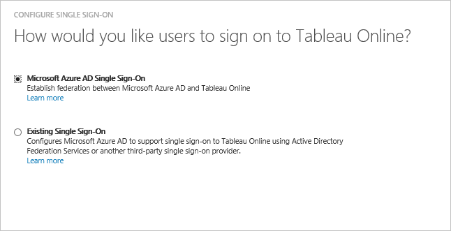

<properties
    pageTitle="Didacticiel : Azure Active Directory intégrant Tableau en ligne | Microsoft Azure"
    description="Découvrez comment configurer l’authentification unique entre Azure Active Directory et de Tableau en ligne."
    services="active-directory"
    documentationCenter=""
    authors="jeevansd"
    manager="femila"
    editor=""/>

<tags
    ms.service="active-directory"
    ms.workload="identity"
    ms.tgt_pltfrm="na"
    ms.devlang="na"
    ms.topic="article"
    ms.date="10/18/2016"
    ms.author="jeedes"/>

# Didacticiel : Azure Active Directory intégrant Tableau en ligne

Dans ce didacticiel, vous allez apprendre à intégrer au Tableau en ligne avec Azure Active Directory (AD Azure).

Intégration de Tableau en ligne avec Azure AD vous offre les avantages suivants :

- Vous pouvez contrôler dans Azure AD qui a accès au Tableau en ligne
- Vous pouvez autoriser les utilisateurs à automatiquement obtenir connecté sur Tableau en ligne (SSO) avec leurs comptes Azure AD
- Vous pouvez gérer vos comptes dans un emplacement central : le portail classique Azure

Si vous souhaitez en savoir plus d’informations sur l’intégration de l’application SaaS avec Azure Active Directory, voir [qu’est l’accès aux applications et l’authentification unique avec Azure Active Directory](active-directory-appssoaccess-whatis.md).

## Conditions préalables

Pour configurer l’intégration Azure AD avec Tableau en ligne, vous devez les éléments suivants :

- Un abonnement Azure AD
- Une **Tableau en ligne** authentification unique lors de l’abonnement activé

> [AZURE.NOTE] Pour tester les étapes décrites dans ce didacticiel, nous ne recommandons pas à l’aide d’un environnement de production.

Pour tester les étapes décrites dans ce didacticiel, vous devez suivre ces recommandations :

- Vous ne devez pas utiliser votre environnement de production, sauf si cela est nécessaire.
- Si vous n’avez pas un environnement de version d’évaluation Azure AD, vous pouvez obtenir un mois d’évaluation [ici](https://azure.microsoft.com/pricing/free-trial/).

## Description du scénario
Dans ce didacticiel, vous testez Azure AD SSO dans un environnement de test. Scénario présenté dans ce didacticiel se compose de deux principaux blocs de construction :

1. Ajout de Tableau en ligne à partir de la galerie
2. Configuration et test Azure AD authentification unique

## Ajout de Tableau en ligne à partir de la galerie
Pour configurer l’intégration de Tableau en ligne dans Azure AD, vous devez ajouter Tableau en ligne à partir de la galerie à votre liste d’applications SaaS gérées.

**Pour ajouter le Tableau en ligne à partir de la galerie, procédez comme suit :**

1. Dans le **portail classique Azure**, dans le volet de navigation gauche, cliquez sur **Active Directory**. 

    ![Active Directory][1]

2. Dans la liste **répertoire** , sélectionnez le répertoire pour lequel vous souhaitez activer l’intégration d’annuaire.

3. Pour ouvrir la vue applications, dans l’affichage du répertoire, cliquez sur **Applications** dans le menu supérieur.

    ![Applications][2]

4. Cliquez sur **Ajouter** en bas de la page.

    ![Applications][3]

5. Dans la boîte de dialogue **que voulez-vous faire** , cliquez sur **Ajouter une application à partir de la galerie**.

    ![Applications][4]

6. Dans la zone Rechercher, tapez **Tableau en ligne**.

    

7. Dans le volet résultats, sélectionnez **Tableau en ligne**, puis cliquez sur **Terminer** pour ajouter l’application.

    

##  Configuration et test Azure AD authentification unique
Dans cette section, vous configurez et testez Azure AD SSO avec Tableau Online basé sur un utilisateur de test appelé « Brian Simon ».

Pour de l’authentification unique pour l’utiliser, Azure AD doit connaître l’utilisateur homologue dans le Tableau en ligne à un utilisateur dans Active Directory Azure. En d’autres termes, une relation de liaison entre un utilisateur Azure AD et l’utilisateur connexe dans le Tableau en ligne doit être établie.
Cette relation lien est établie en affectant la valeur du **nom d’utilisateur** dans Active Directory Azure en tant que la valeur **nom d’utilisateur** dans le Tableau en ligne.

Pour configurer et tester Azure AD SSO avec Tableau en ligne, vous devez effectuer les blocs de construction suivantes :

1. **[Configuration Azure AD SSO](#configuring-azure-ad-single-single-sign-on)** - pour permettre à vos utilisateurs utiliser cette fonctionnalité.
2. **[Création d’une annonce Azure tester l’utilisateur](#creating-an-azure-ad-test-user)** - permettent de tester Azure AD SSO avec Britta Simon.
4. **[Création d’un Tableau en ligne tester l’utilisateur](#creating-a-Tableau-Online-test-user)** - d’avoir un homologue de Britta Simon dans le Tableau en ligne qui est lié à la représentation Azure AD de lui.
5. **[Attribution de l’annonce Azure tester l’utilisateur](#assigning-the-azure-ad-test-user)** - activer Britta Simon utiliser Azure AD SSO.
5. **[Test de l’authentification unique](#testing-single-sign-on)** - afin de vérifier si la configuration fonctionne.

### Configuration d’Azure AD SSO

L’objectif de cette section est pour activer Azure AD SSO dans le portail classique Azure et configurer l’authentification unique dans votre application de Tableau en ligne.

**Pour configurer Azure AD SSO avec Tableau en ligne, procédez comme suit :**

1. Dans le menu dans la partie supérieure, cliquez sur **Quick Start**.

    ![Configurer l’authentification unique][6]
2. Dans le portail classique, dans la page de l’intégration application **Tableau en ligne** , cliquez **sur Configurer l’authentification unique** pour ouvrir la boîte de dialogue **Configuration de l’authentification unique** .

    ![Configurer l’authentification unique][7] 

3. Dans la page **Comment souhaitez-vous aux utilisateurs de se connecter à Tableau en ligne** , sélectionnez **Azure AD SSO**, puis cliquez sur **suivant**.
    
    

4. Dans la page de la boîte de dialogue **Configurer les paramètres de l’application** , effectuez les opérations suivantes : 

    

    un. Dans la zone de texte URL de connexion, tapez une URL à l’aide du modèle suivant :`https://sso.online.tableau.com`

    c. Cliquez sur **suivant**.

5. Dans la page **configuration de l’authentification unique au Tableau en ligne** , cliquez sur **télécharger les métadonnées**, puis enregistrez le fichier sur votre ordinateur.

    

6. Sélectionnez la confirmation de la configuration de l’authentification unique, puis cliquez sur **suivant**.
    
    ![Authentification Azure AD unique][10]

7. Dans la page de **confirmation d’authentification unique** , cliquez sur **Terminer**.  
    
    ![Authentification Azure AD unique][11]
8. Dans une fenêtre de navigateur autre authentification à votre application Tableau en ligne. Accédez à **paramètres** , puis sur **l’authentification**

    

9. Sous la section **Types d’authentification** . Cochez la case **de l’authentification unique avec SAML** pour activer SAML.

    

10. Faites défiler vers le bas jusqu'à la section **Importer le fichier de métadonnées dans le Tableau en ligne** .  Cliquez sur Parcourir et importer le fichier de métadonnées que vous avez téléchargé à partir d’Azure AD. Ensuite, cliquez sur **Appliquer**.

    

11. Dans la section **assertions EQUIV** , insérez le nom d’assertion fournisseur d’identité correspondant pour l’adresse de messagerie, prénom et nom de famille. Pour obtenir ces informations à partir d’Azure AD :

    un. Revenez à Azure AD. Dans le portail classique Azure, dans la page de l’intégration application **Tableau en ligne** , dans le menu de la partie supérieure, cliquez sur **attributs**. Copier le nom pour les valeurs : userprincipalname, prénom et nom de famille.
     
    

    b. Passer à l’application de Tableau en ligne, puis définissez la section **Attributs en ligne du Tableau** comme suit :
    
    -  Adresse de messagerie : **courrier** ou **userprincipalname**
    -  Prénom : **prénom**
    -  Nom : **nom de famille**

    

### Création d’un utilisateur de test Azure AD
Dans cette section, vous créez un utilisateur test dans le portail classique appelé Britta Simon.

![Créez Azure AD utilisateur][20]

**Pour créer un utilisateur de test dans Azure AD, effectuez les opérations suivantes :**

1. Dans le **portail classique Azure**, dans le volet de navigation gauche, cliquez sur **Active Directory**.
    
     

2. Dans la liste **répertoire** , sélectionnez le répertoire pour lequel vous souhaitez activer l’intégration d’annuaire.

3. Pour afficher la liste des utilisateurs, dans le menu dans la partie supérieure, cliquez sur **utilisateurs**.
    
     

4. Pour ouvrir la boîte de dialogue **Ajouter un utilisateur** , dans la barre d’outils en bas, cliquez sur **Ajouter un utilisateur**.

     

5. Dans la page de dialogue **dites-nous sur cet utilisateur** , effectuez les opérations suivantes :
 
     

    un. En tant que Type d’utilisateur, sélectionnez nouvel utilisateur de votre organisation.

    b. Dans la **zone de texte**du nom d’utilisateur, tapez **BrittaSimon**.

    c. Cliquez sur **suivant**.

6.  Dans la page de la boîte de dialogue **Profil utilisateur** , procédez comme suit :

     

    un. Dans la zone de texte **nom** , tapez **Brian**.  

    b. Dans la zone de texte **Nom** , type, **Simon**.

    c. Dans la zone de texte **Nom complet** , tapez **Brian Simon**.

    d. Dans la liste **rôle** , sélectionnez **utilisateur**.

    e. Cliquez sur **suivant**.

7. Dans la page de dialogue **obtenir le mot de passe temporaire** , cliquez sur **créer**.

     

8. Dans la page de dialogue **obtenir le mot de passe temporaire** , procédez comme suit :

     

    un. Notez la valeur de **Nouveau mot de passe**.

    b. Cliquez sur **terminé**.   

### Création d’un utilisateur de test Tableau en ligne

Dans cette section, vous créez un utilisateur appelé Britta Simon dans le Tableau en ligne.

1. Sur **Tableau en ligne**, cliquez sur **paramètres** , puis section **authentification** . Faites défiler jusqu'à la section **Sélectionner des utilisateurs** . Cliquez sur **Ajouter des utilisateurs** , puis **Entrez les adresses de messagerie**.

    
2. Sélectionnez **Ajouter des utilisateurs pour l’authentification (SSO) d’authentification unique**. Dans la zone de texte **Entrez les adresses de messagerie** ajouterbritta.simon@contoso.com

    

3.  Cliquez sur **créer**.

### Affectation de l’utilisateur de test Azure AD

Dans cette section, vous activez Britta Simon utiliser Azure SSO par l’octroi d’accès au Tableau en ligne.

![Affecter utilisateur][200] 

**Pour affecter Britta Simon au Tableau en ligne, procédez comme suit :**

1. Dans le portail classique, pour ouvrir la vue applications, dans l’affichage du répertoire, cliquez sur **Applications** dans le menu supérieur.

    ![Affecter utilisateur][201] 

3. Dans la liste des applications, sélectionnez **Tableau en ligne**.

     

4. Dans le menu dans la partie supérieure, cliquez sur **utilisateurs**.

    ![Affecter utilisateur][203] 

5. Dans la liste de tous les utilisateurs, sélectionnez **Brian Simon**.

6. Dans la barre d’outils en bas, cliquez sur **attribuer**.

    ![Affecter utilisateur][205]

### Test de l’authentification unique

L’objectif de cette section consiste à tester votre Azure AD unique authentification configuration à l’aide du panneau d’accès.

Lorsque vous cliquez sur la vignette Tableau en ligne dans le panneau d’accès, vous devez obtenir automatiquement connecté-on à votre application Tableau en ligne.

## Ressources supplémentaires

* [Liste des didacticiels sur l’intégration des applications SaaS avec Azure Active Directory](active-directory-saas-tutorial-list.md)
* [Quel est l’accès aux applications et l’authentification unique avec Azure Active Directory ?](active-directory-appssoaccess-whatis.md)

<!--Image references-->

[1]: ./media/active-directory-saas-tableauonline-tutorial/tutorial_general_01.png
[2]: ./media/active-directory-saas-tableauonline-tutorial/tutorial_general_02.png
[3]: ./media/active-directory-saas-tableauonline-tutorial/tutorial_general_03.png
[4]: ./media/active-directory-saas-tableauonline-tutorial/tutorial_general_04.png

[5]: ./media/active-directory-saas-tableauonline-tutorial/tutorial_general_05.png
[6]: ./media/active-directory-saas-tableauonline-tutorial/tutorial_general_06.png
[7]:  ./media/active-directory-saas-tableauonline-tutorial/tutorial_general_050.png
[10]: ./media/active-directory-saas-tableauonline-tutorial/tutorial_general_060.png
[11]: ./media/active-directory-saas-tableauonline-tutorial/tutorial_general_070.png
[20]: ./media/active-directory-saas-tableauonline-tutorial/tutorial_general_100.png

[200]: ./media/active-directory-saas-tableauonline-tutorial/tutorial_general_200.png
[201]: ./media/active-directory-saas-tableauonline-tutorial/tutorial_general_201.png
[203]: ./media/active-directory-saas-tableauonline-tutorial/tutorial_general_203.png
[204]: ./media/active-directory-saas-tableauonline-tutorial/tutorial_general_204.png
[205]: ./media/active-directory-saas-tableauonline-tutorial/tutorial_general_205.png
