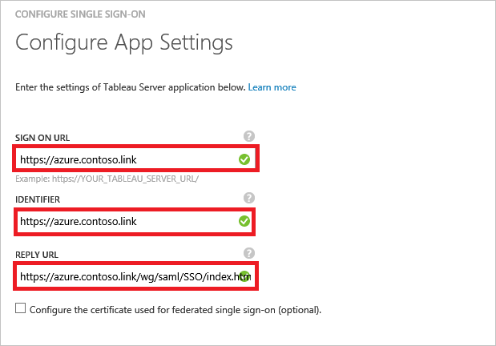

<properties
    pageTitle="Didacticiel : Intégration d’Azure Active Directory avec Tableau serveur | Microsoft Azure"
    description="Découvrez comment configurer l’authentification unique entre Azure Active Directory et le serveur de Tableau."
    services="active-directory"
    documentationCenter=""
    authors="jeevansd"
    manager="femila"
    editor=""/>

<tags
    ms.service="active-directory"
    ms.workload="identity"
    ms.tgt_pltfrm="na"
    ms.devlang="na"
    ms.topic="article"
    ms.date="09/29/2016"
    ms.author="jeedes"/>

# Didacticiel : Intégration d’Azure Active Directory avec serveur de Tableau

L’objectif de ce didacticiel consiste à vous montrer comment intégrer Tableau serveur Azure Active Directory (AD Azure).

Intégration de Tableau Server avec Azure AD vous offre les avantages suivants :

- Vous pouvez contrôler dans Azure AD qui a accès au serveur de Tableau
- Vous pouvez activer vos utilisateurs pour automatiquement obtenir connecté au serveur de Tableau (SSO) avec leurs comptes Azure AD
- Vous pouvez gérer vos comptes dans un emplacement central : le portail classique Azure

Si vous souhaitez en savoir plus d’informations sur l’intégration de l’application SaaS avec Azure Active Directory, voir [qu’est l’accès aux applications et l’authentification unique avec Azure Active Directory](active-directory-appssoaccess-whatis.md).

## Conditions préalables

Pour configurer l’intégration Azure AD avec serveur de Tableau, vous devez les éléments suivants :

- Un abonnement Azure AD
- Une authentification unique Tableau serveur lors de l’abonnement activé

> [AZURE.NOTE] Pour tester les étapes décrites dans ce didacticiel, nous ne recommandons pas à l’aide d’un environnement de production.

Pour tester les étapes décrites dans ce didacticiel, vous devez suivre ces recommandations :

- Vous ne devez pas utiliser votre environnement de production, sauf si cela est nécessaire.
- Si vous n’avez pas un environnement de version d’évaluation Azure AD, vous pouvez obtenir un mois d’évaluation [ici](https://azure.microsoft.com/pricing/free-trial/).

## Description du scénario
L’objectif de ce didacticiel consiste à vous permettent de tester Azure AD SSO dans un environnement de test. 

Scénario présenté dans ce didacticiel se compose de deux principaux blocs de construction :

1. Ajout de serveur de Tableau à partir de la galerie
2. Configuration et test Azure AD authentification unique

## Ajout de serveur de Tableau à partir de la galerie
Pour configurer l’intégration de serveur de Tableau dans Azure AD, vous devez ajouter serveur de Tableau à partir de la galerie à votre liste d’applications SaaS gérées.

**Pour ajouter le serveur de Tableau à partir de la galerie, procédez comme suit :**

1. Dans le **portail classique Azure**, dans le volet de navigation gauche, cliquez sur **Active Directory**. 
 
    ![Active Directory][1]

2. Dans la liste **répertoire** , sélectionnez le répertoire pour lequel vous souhaitez activer l’intégration d’annuaire.

3. Pour ouvrir la vue applications, dans l’affichage du répertoire, cliquez sur **Applications** dans le menu supérieur.

    ![Applications][2]

4. Cliquez sur **Ajouter** en bas de la page.

    ![Applications][3]

5. Dans la boîte de dialogue **que voulez-vous faire** , cliquez sur **Ajouter une application à partir de la galerie**.

    ![Applications][4]

6. Dans la zone Rechercher, tapez le **Serveur de Tableau**.

    

7. Dans le volet résultats, sélectionnez **Tableau serveur**, puis cliquez sur **Terminer** pour ajouter l’application.

    

##  Configuration et test Azure AD authentification unique
L’objectif de cette section consiste à vous montrer comment configurer et tester Azure AD SSO avec serveur de Tableau en fonction d’un utilisateur de test appelé « Brian Simon ».

Pour de l’authentification unique pour l’utiliser, Azure AD doit détermine-t-il ce qui est l’utilisateur homologue dans Server de Tableau à un utilisateur dans Active Directory Azure. En d’autres termes, une relation de liaison entre un utilisateur Azure AD et l’utilisateur connexe dans Tableau Server doit être établie.

Cette relation lien est établie en affectant la valeur du **nom d’utilisateur** dans Active Directory Azure en tant que la valeur **nom d’utilisateur** dans le Tableau Server.

Pour configurer et tester Azure AD SSO avec serveur de Tableau, vous devez effectuer les blocs de construction suivantes :

1. **[Configuration Azure AD SSO](#configuring-azure-ad-single-single-sign-on)** - pour permettre à vos utilisateurs utiliser cette fonctionnalité.
2. **[Création d’une annonce Azure tester l’utilisateur](#creating-an-azure-ad-test-user)** - permettent de tester Azure AD SSO avec Britta Simon.
4. **[Création d’un serveur de Tableau tester l’utilisateur](#creating-a-tableauserver-test-user)** - d’avoir un homologue de Britta Simon dans le serveur de Tableau qui est lié à la représentation Azure AD de lui.
5. **[Attribution de l’annonce Azure tester l’utilisateur](#assigning-the-azure-ad-test-user)** - activer Britta Simon utiliser Azure AD SSO.
5. **[Test de l’authentification unique](#testing-single-sign-on)** - afin de vérifier si la configuration fonctionne.

### Configuration d’authentification Azure AD unique

L’objectif de cette section est pour activer Azure AD SSO dans le portail classique Azure et configurer l’authentification unique dans votre application de serveur de Tableau.

Tableau Server application attend les assertions SAML dans un format spécifique. La capture d’écran suivante montre un exemple de ce. 

 

**Pour configurer Azure AD SSO avec serveur de Tableau, effectuez les opérations suivantes :**

1. Dans le portail classique Azure, dans la page de l’intégration d’application **Server de Tableau** , dans le menu de la partie supérieure, cliquez sur **attributs**.

     

1. Dans la boîte de dialogue **attributs jetons SAML** , effectuez les opérations suivantes :

    

    un. Cliquez sur **Ajouter attribut utilisateur** pour ouvrir la boîte de dialogue **Ajouter utilisateur Attribure** .

     

    b. Dans la zone de texte **Nom affectent** , tapez le **nom d’utilisateur**.

    c. Dans la liste **Valeur de l’attribut** , selsect **user.displayname**.

    d. Cliquez sur **terminé**.  
    

1. Dans le menu dans la partie supérieure, cliquez sur **Quick Start**.

      

1. Cliquez **sur Configurer l’authentification unique** pour ouvrir la boîte de dialogue **Configuration de l’authentification unique** .

    ![Configurer l’authentification unique][6] 

2. Dans la page **Comment souhaitez-vous aux utilisateurs de vous connecter au serveur de Tableau** , sélectionnez **Azure AD SSO**, puis cliquez sur **suivant**.

     

3. Dans la page de la boîte de dialogue **Configurer les paramètres de l’application** , effectuez les opérations suivantes, puis cliquez sur **suivant**:

     

    un. Dans la zone de texte **URL de connexion** , tapez l’URL de votre serveur de Tableau. 

    b. Dans l’identificateur de zone de copie la 

    c. Cliquez sur **suivant**

4. Dans la page **configuration de l’authentification unique sur le serveur de Tableau** , effectuez les opérations suivantes, puis cliquez sur **suivant**:

     

    un. Cliquez sur **télécharger les métadonnées**et puis enregistrez le fichier sur votre ordinateur.

    b. Cliquez sur **suivant**.

6. Pour obtenir l’authentification unique configuré pour votre application, vous avez besoin pour vous connecter à votre client de serveur de Tableau en tant qu’administrateur.

    un. Dans la configuration du serveur de Tableau, cliquez sur l’onglet **SAML** .

     

    b. Activez la case à cocher de **SAML utiliser pour l’authentification unique**.

    c. Recherchez votre fichier de métadonnées de fédération téléchargé à partir d’Azure portal classique et puis téléchargez-le dans le **fichier de métadonnées Idp SAML**.

    d. Serveur de tableau renvoyer URL : URL auxquelles les utilisateurs de Tableau Server ont accès, tels que http://tableau_server. À l’aide de http://localhost n’est pas recommandé. À l’aide d’une URL avec une barre oblique (par exemple, http://tableau_server/) n’est pas pris en charge. Copier **Tableau serveur renvoyer URL** et collez-le dans Azure AD **URL de connexion dans** la zone de texte, comme illustré dans l’étape 3

    e. ID de l’entité SAML : l’ID d’entité identifie de façon unique votre installation de serveur de Tableau pour le IdP. Vous pouvez entrer l’URL de votre serveur de Tableau à nouveau dans ce cas, si vous le souhaitez, mais elle n’a pas à être l’URL de votre serveur de Tableau. Copiez **SAML entité ID** et collez-le dans Azure AD **identificateur** de zone de texte, comme illustré dans l’étape 3.

    f. Cliquez sur le **Fichier de métadonnées exporter** et ouvrez-la dans l’application de l’éditeur de texte. Recherchez les URL du Service Assertion consommateur avec Http Post et l’Index 0 et copiez l’URL. Maintenant collez-le à la zone de texte Azure AD **Réponse URL** comme indiqué à l’étape 3. 

    g. Cliquez sur **OK** dans la page de Tableau Server Configiuration.

    > [AZURE.NOTE] Si vous avez besoin d’aide pour configurer SAML sur serveur de Tableau, consultez cet article [Configurer SAML](http://onlinehelp.tableau.com/current/server/en-us/config_saml.htm) 

6. Dans le portail classique Azure, sélectionnez la confirmation de la configuration de l’authentification unique, puis cliquez sur **suivant**.

    ![Authentification Azure AD unique][10]

7. Dans la page de **confirmation d’authentification unique** , cliquez sur **Terminer**. 
 
    ![Authentification Azure AD unique][11]

### Création d’un utilisateur de test Azure AD
L’objectif de cette section consiste à créer un utilisateur de test dans le portail classique Azure appelé Britta Simon.

Dans la liste des utilisateurs, sélectionnez **Brian Simon**.

![Créez Azure AD utilisateur][20]

**Pour créer un utilisateur de test dans Azure AD, effectuez les opérations suivantes :**

1. Dans le **portail classique Azure**, dans le volet de navigation gauche, cliquez sur **Active Directory**.

     

2. Dans la liste **répertoire** , sélectionnez le répertoire pour lequel vous souhaitez activer l’intégration d’annuaire.

3. Pour afficher la liste des utilisateurs, dans le menu dans la partie supérieure, cliquez sur **utilisateurs**.
 
     

4. Pour ouvrir la boîte de dialogue **Ajouter un utilisateur** , dans la barre d’outils en bas, cliquez sur **Ajouter un utilisateur**.

    

5. Dans la page de dialogue **dites-nous sur cet utilisateur** , effectuez les opérations suivantes :

     

    un. En tant **Type d’utilisateur**, sélectionnez **nouvel utilisateur de votre organisation**.

    b. Dans la zone de texte **Nom d’utilisateur** , tapez **BrittaSimon**.

    c. Cliquez sur **suivant**.

6.  Dans la page de la boîte de dialogue **Profil utilisateur** , procédez comme suit :

     

    un. Dans la zone de texte **nom** , tapez **Brian**.  

    b. Dans la zone de texte **Nom** , type, **Simon**.

    c. Dans la zone de texte **Nom complet** , tapez **Brian Simon**.

    d. Dans la liste **rôle** , sélectionnez **utilisateur**.

    e. Cliquez sur **suivant**.

7. Dans la page de dialogue **obtenir le mot de passe temporaire** , cliquez sur **créer**.

     

8. Dans la page de dialogue **obtenir le mot de passe temporaire** , procédez comme suit :
 
     

    un. Notez la valeur de **Nouveau mot de passe**.

    b. Cliquez sur **terminé**.   

### Création d’un utilisateur de test de serveur de Tableau

L’objectif de cette section consiste à créer un utilisateur appelé Britta Simon dans Tableau Server. Vous devez configurer tous les utilisateurs sur le serveur de Tableau. Notez également ce nom d’utilisateur de l’utilisateur doit correspondre à la valeur que vous avez configurée dans l’attribut personnalisé Azure AD du **nom d’utilisateur**. Avec le mappage adéquat l’intégration doit travailler [Configuration Azure AD SSO](#configuring-azure-ad-single-single-sign-on).

> [AZURE.NOTE] Si vous avez besoin créer manuellement un utilisateur, vous devez contacter l’administrateur du serveur de Tableau dans votre organisation.

### Affectation de l’utilisateur de test Azure AD

L’objectif de cette section est à l’activation Britta Simon utiliser Azure SSO par l’octroi d’accès au serveur de Tableau.

![Affecter utilisateur][200] 

**Pour attribuer Britta Simon au serveur de Tableau, effectuez les opérations suivantes :**

1. Dans le portail classique Azure, pour ouvrir la vue applications, dans l’affichage du répertoire, cliquez sur **Applications** dans le menu supérieur.
 
    ![Affecter utilisateur][201] 

2. Dans la liste des applications, sélectionnez **Tableau serveur**.

     

1. Dans le menu dans la partie supérieure, cliquez sur **utilisateurs**.

    ![Affecter utilisateur][203]

1. Dans la liste des utilisateurs, sélectionnez **Brian Simon**.

2. Dans la barre d’outils en bas, cliquez sur **attribuer**.

![Affecter utilisateur][205]

### Test de l’authentification unique

L’objectif de cette section consiste à tester votre Azure AD unique authentification configuration à l’aide du panneau d’accès.

Lorsque vous cliquez sur la vignette de serveur de Tableau dans le panneau d’accès, vous devez obtenir automatiquement connecté-on à votre application de serveur de Tableau.

## Ressources supplémentaires

* [Liste des didacticiels sur l’intégration des applications SaaS avec Azure Active Directory](active-directory-saas-tutorial-list.md)
* [Quel est l’accès aux applications et l’authentification unique avec Azure Active Directory ?](active-directory-appssoaccess-whatis.md)

<!--Image references-->

[1]: ./media/active-directory-saas-tableauserver-tutorial/tutorial_general_01.png
[2]: ./media/active-directory-saas-tableauserver-tutorial/tutorial_general_02.png
[3]: ./media/active-directory-saas-tableauserver-tutorial/tutorial_general_03.png
[4]: ./media/active-directory-saas-tableauserver-tutorial/tutorial_general_04.png

[6]: ./media/active-directory-saas-tableauserver-tutorial/tutorial_general_05.png
[10]: ./media/active-directory-saas-tableauserver-tutorial/tutorial_general_06.png
[11]: ./media/active-directory-saas-tableauserver-tutorial/tutorial_general_07.png
[20]: ./media/active-directory-saas-tableauserver-tutorial/tutorial_general_100.png

[200]: ./media/active-directory-saas-tableauserver-tutorial/tutorial_general_200.png
[201]: ./media/active-directory-saas-tableauserver-tutorial/tutorial_general_201.png
[203]: ./media/active-directory-saas-tableauserver-tutorial/tutorial_general_203.png
[204]: ./media/active-directory-saas-tableauserver-tutorial/tutorial_general_204.png
[205]: ./media/active-directory-saas-tableauserver-tutorial/tutorial_general_205.png
