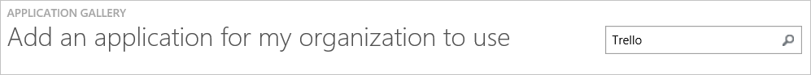
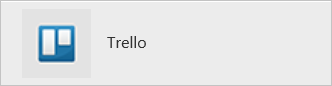
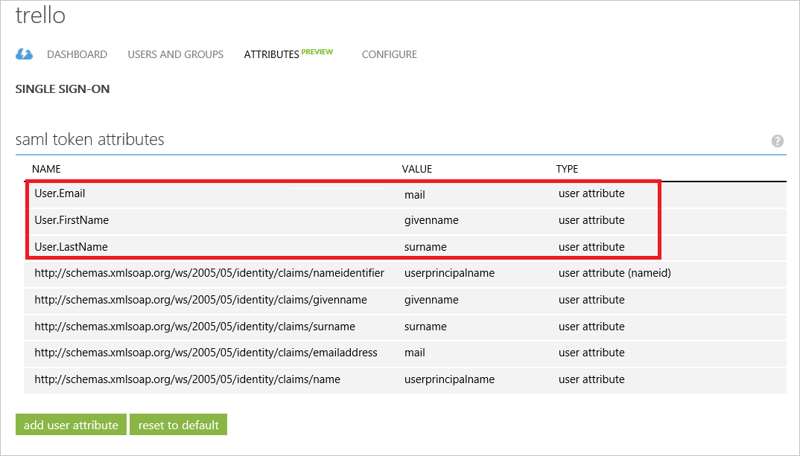
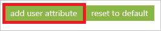
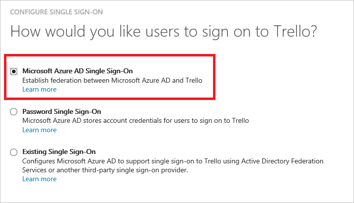
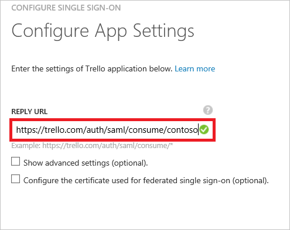
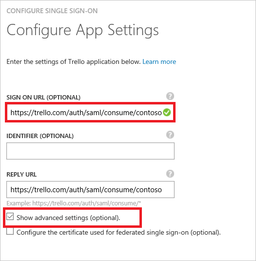
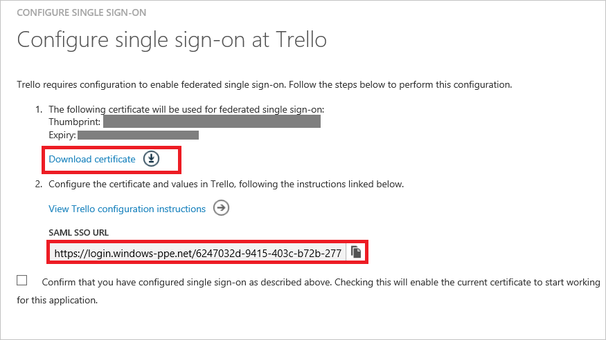
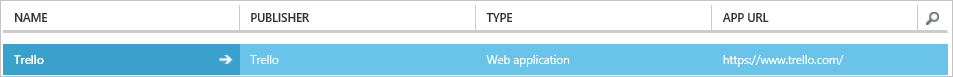

<properties
    pageTitle="Didacticiel : Intégration d’Azure Active Directory avec Trello | Microsoft Azure"
    description="Découvrez comment configurer l’authentification unique entre Azure Active Directory et Trello."
    services="active-directory"
    documentationCenter=""
    authors="jeevansd"
    manager="femila"
    editor=""/>

<tags
    ms.service="active-directory"
    ms.workload="identity"
    ms.tgt_pltfrm="na"
    ms.devlang="na"
    ms.topic="article"
    ms.date="09/26/2016"
    ms.author="jeedes"/>

# Didacticiel : Intégration d’Azure Active Directory avec Trello

Dans ce didacticiel, vous allez apprendre à intégrer Trello Azure Active Directory (AD Azure).

Intégration de Trello avec Azure AD vous offre les avantages suivants :

- Vous pouvez contrôler dans Azure AD qui accèdent à Trello
- Vous pouvez autoriser les utilisateurs à automatiquement obtenir connecté-on to Trello (SSO) avec leurs comptes Azure AD
- Vous pouvez gérer vos comptes dans un emplacement central : le portail classique Azure

Si vous souhaitez en savoir plus d’informations sur l’intégration de l’application SaaS avec Azure Active Directory, voir [qu’est l’accès aux applications et l’authentification unique avec Azure Active Directory](active-directory-appssoaccess-whatis.md).

## Conditions préalables

Pour configurer l’intégration Azure AD avec Trello, vous devez les éléments suivants :

- Un abonnement Azure AD
- Une authentification unique **Trello** lors de l’abonnement activé

> [AZURE.NOTE] Pour tester les étapes décrites dans ce didacticiel, nous ne recommandons pas à l’aide d’un environnement de production.

Pour tester les étapes décrites dans ce didacticiel, vous devez suivre ces recommandations :

- Vous ne devez pas utiliser votre environnement de production, sauf si cela est nécessaire.
- Si vous n’avez pas un environnement de version d’évaluation Azure AD, vous pouvez obtenir un mois d’évaluation [ici](https://azure.microsoft.com/pricing/free-trial/).

## Description du scénario
Dans ce didacticiel, vous testez Azure AD SSO dans un environnement de test. Scénario présenté dans ce didacticiel se compose de deux principaux blocs de construction :

1. Ajout de Trello à partir de la galerie
2. Configuration et test Azure AD authentification unique

## Ajout de Trello à partir de la galerie
Pour configurer l’intégration des Trello dans Azure AD, vous devez ajouter Trello à partir de la galerie à votre liste d’applications SaaS gérées.

**Pour ajouter Trello à partir de la galerie, procédez comme suit :**

1. Dans le **portail classique Azure**, dans le volet de navigation gauche, cliquez sur **Active Directory**. 

    ![Active Directory][1]

2. Dans la liste **répertoire** , sélectionnez le répertoire pour lequel vous souhaitez activer l’intégration d’annuaire.

3. Pour ouvrir la vue applications, dans l’affichage du répertoire, cliquez sur **Applications** dans le menu supérieur.

    ![Applications][2]

4. Cliquez sur **Ajouter** en bas de la page.

    ![Applications][3]

5. Dans la boîte de dialogue **que voulez-vous faire** , cliquez sur **Ajouter une application à partir de la galerie**.

    ![Applications][4]

6. Dans la zone Rechercher, tapez **Trello**.

    

7. Dans le volet résultats, sélectionnez **Trello**, puis cliquez sur **Terminer** pour ajouter l’application.

    

##  Configuration et test Azure AD authentification unique
Dans cette section, vous configurez et testez Azure AD SSO avec Trello basée sur un utilisateur de test appelé « Brian Simon ».

Pour de l’authentification unique pour l’utiliser, Azure AD doit savoir ce que l’utilisateur homologue dans Trello est à un utilisateur dans Active Directory Azure. En d’autres termes, une relation de liaison entre un utilisateur Azure AD et l’utilisateur connexe dans Trello doit être établie.
Cette relation lien est établie en affectant la valeur du **nom d’utilisateur** dans Active Directory Azure en tant que la valeur **nom d’utilisateur** dans Trello. Pour configurer et tester Azure AD SSO avec Trello, vous devez effectuer les blocs de construction suivantes :

1. **[Configuration Azure AD SSO](#configuring-azure-ad-single-single-sign-on)** - pour permettre à vos utilisateurs utiliser cette fonctionnalité.
2. **[Création d’une annonce Azure tester l’utilisateur](#creating-an-azure-ad-test-user)** - permettent de tester Azure AD SSO avec Britta Simon.
4. **[Création d’un Trello tester l’utilisateur](#creating-a-the-funding-portal-test-user)** - d’avoir un homologue de Britta Simon dans Trello est liée à la représentation Azure AD de lui.
5. **[Attribution de l’annonce Azure tester l’utilisateur](#assigning-the-azure-ad-test-user)** - activer Britta Simon utiliser Azure AD SSO.
5. **[Test de l’authentification unique](#testing-single-sign-on)** - afin de vérifier si la configuration fonctionne.

### Configuration d’Azure AD SSO

L’objectif de cette section est pour activer Azure AD SSO dans le portail classique Azure et configurer l’authentification unique dans votre application Trello.

Application Trello attend les assertions SAML contenant des attributs spécifiques. Configurez les attributs suivants de cette application. Vous pouvez gérer les valeurs de ces attributs à partir de l’onglet **« Atrributes »** de l’application. La capture d’écran suivante montre un exemple de ce.

 

**Pour configurer Azure AD SSO avec Trello, effectuez les opérations suivantes :**

1. Dans le portail classique Azure, dans la page de l’intégration d’application **Trello** , dans le menu dans la partie supérieure, cliquez sur **attributs**.
     
    ![Configurer l’authentification unique][5]

2. Dans la boîte de dialogue **attributs jetons SAML** , pour chaque ligne indiqué dans le tableau ci-dessous, effectuez les opérations suivantes :
    

  	| Nom de l’attribut | Valeur de l’attribut |
  	| --- | --- |    
  	| User.Email | User.Mail |
  	| User.FirstName | User.GivenName |
  	| User.LastName | User.Surname |

    un. Cliquez sur **Ajouter attribut utilisateur** pour ouvrir la boîte de dialogue **Ajouter utilisateur Attribure** .

    
    
    b. Dans la zone de texte **Nom de l’attribut** , tapez le nom de l’attribut affiché pour cette ligne.
    
    c. Dans la liste **Valeur de l’attribut** , sélectionnez la valeur indiquée pour cette ligne.
    
    d. Cliquez sur **terminé**. Ensuite, **Appliquer les modifications** dans la partie inférieure de la page.

3. Dans le menu dans la partie supérieure, cliquez sur **Quick Start**.

    ![Configurer l’authentification unique][6]

4. Dans le portail classique, dans la page de l’intégration **Trello** application, cliquez **sur Configurer l’authentification unique** pour ouvrir la boîte de dialogue **Configuration de l’authentification unique** .

    ![Configurer l’authentification unique][7] 

5. Dans la page **Comment souhaitez-vous aux utilisateurs de se connecter à Trello** , sélectionnez **Azure AD SSO**, puis cliquez sur **suivant**.
    
    

6. Dans la page de la boîte de dialogue **Configurer les paramètres de l’application** , si vous souhaitez configurer l’application en **mode initialisé par l’IDP**, procédez comme suit :

    

    un. Dans la zone de texte URL de réponse, tapez une URL à l’aide du modèle suivant : `https://trello.com/auth/saml/consume/<enterprise>`.

    b. Cliquez sur **suivant**.

> [AZURE.NOTE] Vous devez obtenir le ** \<entreprise\> ** ligne-bloc à partir de Trello. Si vous n’avez pas la valeur de ligne-bloc, contactez l’équipe de support Trello <support@trello.com> pour obtenir la ligne-bloc pour vous enterprise.

6. Si vous souhaitez configurer l’application en **SP initié mode** dans la page de la boîte de dialogue **Configurer les paramètres de l’application** , cliquez sur **« Afficher les paramètres (facultatifs) avancés »** , puis entrez l' **URL de connexion**:

    

    un. Dans la zone de texte **URL de connexion** , tapez une URL à l’aide du modèle suivant :`https://trello.com/auth/saml/consume/<enterprise>`

    b. Cliquez sur **suivant**

7. Dans la page **configuration de l’authentification unique en Trello** , cliquez sur **Télécharger le certificat**, puis enregistrez le fichier sur votre ordinateur.

    

6. Pour obtenir l’authentification unique configuré pour votre application, atteindre la page [configuration de l’authentification unique d’entreprise Trello](https://trello.com/sso-configuration) pour envoyer Trello équipe le signe d’URL et joindre le certificat téléchargé.

7. Dans le portail classique, sélectionnez la confirmation de la configuration de l’authentification unique, puis cliquez sur **suivant**.
    
    ![Authentification Azure AD unique][10]

8. Dans la page de **confirmation d’authentification unique** , cliquez sur **Terminer**.  
    
    ![Authentification Azure AD unique][11]

### Création d’un utilisateur de test Azure AD
Dans cette section, vous créez un utilisateur test dans le portail classique appelé Britta Simon.

![Créez Azure AD utilisateur][20]

**Pour créer un utilisateur de test dans Azure AD, effectuez les opérations suivantes :**

1. Dans le **portail classique Azure**, dans le volet de navigation gauche, cliquez sur **Active Directory**.
    
     

2. Dans la liste **répertoire** , sélectionnez le répertoire pour lequel vous souhaitez activer l’intégration d’annuaire.

3. Pour afficher la liste des utilisateurs, dans le menu dans la partie supérieure, cliquez sur **utilisateurs**.
    
     

4. Pour ouvrir la boîte de dialogue **Ajouter un utilisateur** , dans la barre d’outils en bas, cliquez sur **Ajouter un utilisateur**.

     

5. Dans la page de dialogue **dites-nous sur cet utilisateur** , effectuez les opérations suivantes :
 
     

    un. En tant que Type d’utilisateur, sélectionnez nouvel utilisateur de votre organisation.

    b. Dans la **zone de texte**du nom d’utilisateur, tapez **BrittaSimon**.

    c. Cliquez sur **suivant**.

6.  Dans la page de la boîte de dialogue **Profil utilisateur** , procédez comme suit :

     

    un. Dans la zone de texte **nom** , tapez **Brian**.  

    b. Dans la zone de texte **Nom** , type, **Simon**.

    c. Dans la zone de texte **Nom complet** , tapez **Brian Simon**.

    d. Dans la liste **rôle** , sélectionnez **utilisateur**.

    e. Cliquez sur **suivant**.

7. Dans la page de dialogue **obtenir le mot de passe temporaire** , cliquez sur **créer**.

     

8. Dans la page de dialogue **obtenir le mot de passe temporaire** , procédez comme suit :

     

    un. Notez la valeur de **Nouveau mot de passe**.

    b. Cliquez sur **terminé**.   

### Création d’un utilisateur de test Trello

Dans cette section, vous créez un utilisateur appelé Britta Simon dans Trello. Dans cette section, vous créez un utilisateur appelé Britta Simon dans Trello. Trello prend en charge la mise en service à temps et un nouveau compte sera créé la première fois que vous vous connectez à partir d’Azure AD.

### Affectation de l’utilisateur de test Azure AD

Dans cette section, vous activez Britta Simon à utiliser Azure de l’authentification unique en l’octroi d’accès aux Trello.

![Affecter utilisateur][200] 

**Pour attribuer Britta Simon à Trello, effectuez les opérations suivantes :**

1. Dans le portail classique, pour ouvrir la vue applications, dans l’affichage du répertoire, cliquez sur **Applications** dans le menu supérieur.

    ![Affecter utilisateur][201] 

2. Dans la liste des applications, sélectionnez **Trello**.

     

1. Dans le menu dans la partie supérieure, cliquez sur **utilisateurs**.

    ![Affecter utilisateur][203] 

1. Dans la liste de tous les utilisateurs, sélectionnez **Brian Simon**.

2. Dans la barre d’outils en bas, cliquez sur **attribuer**.

    ![Affecter utilisateur][205]

### Test de l’authentification unique

L’objectif de cette section consiste à tester votre Azure AD unique authentification configuration à l’aide du panneau d’accès.

Lorsque vous cliquez sur la vignette Trello dans le panneau d’accès, vous devez obtenir automatiquement connecté-sur à votre application Trello.

## Ressources supplémentaires

* [Liste des didacticiels sur l’intégration des applications SaaS avec Azure Active Directory](active-directory-saas-tutorial-list.md)
* [Quel est l’accès aux applications et l’authentification unique avec Azure Active Directory ?](active-directory-appssoaccess-whatis.md)

<!--Image references-->

[1]: ./media/active-directory-saas-trello-tutorial/tutorial_general_01.png
[2]: ./media/active-directory-saas-trello-tutorial/tutorial_general_02.png
[3]: ./media/active-directory-saas-trello-tutorial/tutorial_general_03.png
[4]: ./media/active-directory-saas-trello-tutorial/tutorial_general_04.png

[5]: ./media/active-directory-saas-trello-tutorial/tutorial_general_05.png
[6]: ./media/active-directory-saas-trello-tutorial/tutorial_general_06.png
[7]:  ./media/active-directory-saas-trello-tutorial/tutorial_general_050.png
[10]: ./media/active-directory-saas-trello-tutorial/tutorial_general_060.png
[11]: ./media/active-directory-saas-trello-tutorial/tutorial_general_070.png
[20]: ./media/active-directory-saas-trello-tutorial/tutorial_general_100.png

[200]: ./media/active-directory-saas-trello-tutorial/tutorial_general_200.png
[201]: ./media/active-directory-saas-trello-tutorial/tutorial_general_201.png
[203]: ./media/active-directory-saas-trello-tutorial/tutorial_general_203.png
[204]: ./media/active-directory-saas-trello-tutorial/tutorial_general_204.png
[205]: ./media/active-directory-saas-trello-tutorial/tutorial_general_205.png
