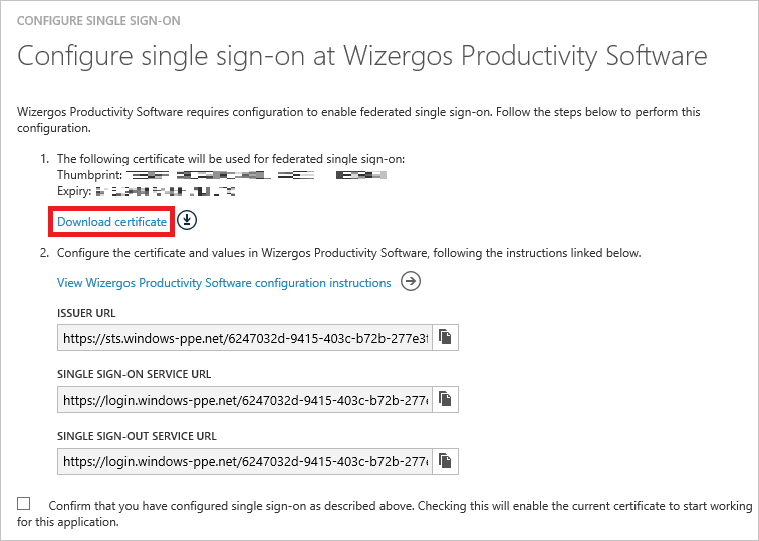

<properties
    pageTitle="Didacticiel : Intégration d’Azure Active Directory avec un logiciel de productivité Wizergos | Microsoft Azure"
    description="Découvrez comment configurer l’authentification unique entre Azure Active Directory et logiciels de productivité Wizergos."
    services="active-directory"
    documentationCenter=""
    authors="jeevansd"
    manager="femila"
    editor=""/>

<tags
    ms.service="active-directory"
    ms.workload="identity"
    ms.tgt_pltfrm="na"
    ms.devlang="na"
    ms.topic="article"
    ms.date="10/17/2016"
    ms.author="jeedes"/>

# Didacticiel : Intégration d’Azure Active Directory avec un logiciel de productivité Wizergos 

L’objectif de ce didacticiel consiste à vous montrer comment intégrer des logiciels de productivité Wizergos Azure Active Directory (AD Azure).

Intégration du logiciel de productivité Wizergos avec Azure AD vous offre les avantages suivants :

- Vous pouvez contrôler dans Azure AD qui accèdent à des logiciels de productivité Wizergos
- Vous pouvez autoriser les utilisateurs à automatiquement obtenir connecté-on pour les logiciels de productivité Wizergos (SSO) avec leurs comptes Azure AD
- Vous pouvez gérer vos comptes dans un emplacement central : le portail classique Azure

Si vous souhaitez en savoir plus d’informations sur l’intégration de l’application SaaS avec Azure Active Directory, voir [qu’est l’accès aux applications et l’authentification unique avec Azure Active Directory](active-directory-appssoaccess-whatis.md).

## Conditions préalables

Pour configurer l’intégration Azure AD avec les logiciels de productivité Wizergos, vous devez les éléments suivants :

- Un abonnement Azure AD
- Une authentification unique logiciels de productivité Wizergos lors de l’abonnement activé

> [AZURE.NOTE] Pour tester les étapes décrites dans ce didacticiel, nous ne recommandons pas à l’aide d’un environnement de production.

Pour tester les étapes décrites dans ce didacticiel, vous devez suivre ces recommandations :

- Vous ne devez pas utiliser votre environnement de production, sauf si cela est nécessaire.
- Si vous n’avez pas un environnement de version d’évaluation Azure AD, vous pouvez obtenir un mois d’évaluation [ici](https://azure.microsoft.com/pricing/free-trial/).

## Description du scénario
L’objectif de ce didacticiel consiste à vous permettent de tester Azure AD SSO dans un environnement de test.

Scénario présenté dans ce didacticiel se compose de deux principaux blocs de construction :

1. Ajout d’un logiciel de productivité Wizergos à partir de la galerie
2. Configuration et test Azure AD authentification unique

## Ajout d’un logiciel de productivité Wizergos à partir de la galerie
Pour configurer l’intégration des logiciels de productivité Wizergos dans Azure AD, vous devez ajouter les logiciels de productivité Wizergos à partir de la galerie à votre liste d’applications SaaS gérées.

**Pour ajouter les logiciels de productivité Wizergos à partir de la galerie, procédez comme suit :**

1. Dans le **portail classique Azure**, dans le volet de navigation gauche, cliquez sur **Active Directory**. 

    ![Active Directory][1]

2. Dans la liste **répertoire** , sélectionnez le répertoire pour lequel vous souhaitez activer l’intégration d’annuaire.

3. Pour ouvrir la vue applications, dans l’affichage du répertoire, cliquez sur **Applications** dans le menu supérieur.
    
    ![Applications][2]

4. Cliquez sur **Ajouter** en bas de la page.
    
    ![Applications][3]

5. Dans la boîte de dialogue **que voulez-vous faire** , cliquez sur **Ajouter une application à partir de la galerie**.

    ![Applications][4]

6. Dans la zone Rechercher, tapez **Les logiciels de productivité Wizergos**.

    

7. Dans le volet résultats, sélectionnez **Logiciels de productivité Wizergos**, puis cliquez sur **Terminer** pour ajouter l’application.

    

##  Configuration et test Azure AD authentification unique
L’objectif de cette section consiste à vous montrer comment configurer et tester Azure AD SSO avec les logiciels de productivité Wizergos basée sur un utilisateur de test appelé « Brian Simon ».

Pour de l’authentification unique pour l’utiliser, Azure AD doit détermine-t-il ce qui est l’utilisateur homologue Wizergos productivité logiciel à un utilisateur dans Active Directory Azure. En d’autres termes, une relation de liaison entre un utilisateur Azure AD et l’utilisateur connexe dans les logiciels de productivité Wizergos doit être établie.

Cette relation lien est établie en affectant la valeur du **nom d’utilisateur** dans Active Directory Azure en tant que la valeur **nom d’utilisateur** dans les logiciels de productivité Wizergos.

Pour configurer et tester Azure AD SSO avec BynWizergos la productivité Softwareder, vous devez effectuer les blocs de construction suivantes :

1. **[Configuration Azure AD SSO](#configuring-azure-ad-single-single-sign-on)** - pour permettre à vos utilisateurs utiliser cette fonctionnalité.
2. **[Création d’une annonce Azure tester l’utilisateur](#creating-an-azure-ad-test-user)** - permettent de tester Azure AD SSO avec Britta Simon.
3. **[Création d’un logiciel de productivité Wizergos tester l’utilisateur](#creating-a-wizergos-productivity-software-test-user)** - d’avoir un homologue de Britta Simon dans les logiciels de productivité Wizergos lié à la représentation Azure AD de lui.
4. **[Attribution de l’annonce Azure tester l’utilisateur](#assigning-the-azure-ad-test-user)** - activer Britta Simon utiliser Azure AD SSO.
5. **[Test de l’authentification unique](#testing-single-sign-on)** - afin de vérifier si la configuration fonctionne.

### Configuration d’Azure AD SSO

Dans cette section, vous activez Azure AD SSO dans le portail classique et configurez l’authentification unique dans votre application de logiciels de productivité Wizergos.

**Pour configurer Azure AD SSO avec les logiciels de productivité Wizergos, effectuez les opérations suivantes :**

1. Dans le portail classique, dans la page de l’intégration des **Logiciels de productivité Wizergos** application, cliquez **sur Configurer l’authentification unique** pour ouvrir la boîte de dialogue **Configuration de l’authentification unique** .
     
    ![Configurer l’authentification unique][6] 

2. Dans la page **Comment souhaitez-vous aux utilisateurs de se connecter à des logiciels de productivité Wizergos** , sélectionnez **Azure AD SSO**, puis cliquez sur **suivant**:
    
    

3. Dans la page de la boîte de dialogue **Configurer les paramètres de l’application** , cliquez sur **suivant**:

    

4. Dans la page **configuration de l’authentification unique en logiciels de productivité Wizergos** , cliquez sur **Télécharger le certificat**et enregistrez le fichier sur votre ordinateur :

    

5. Dans une fenêtre de navigateur web différente, authentification à votre client de logiciels de productivité Wizergos en tant qu’administrateur.

6. Dans le menu hamburger, sélectionnez **administrateur**.

    

7. Dans la page administrateur dans le menu de gauche Sélectionnez **authentification** , puis cliquez sur **Azure AD**.

    

8. Effectuez les opérations suivantes dans la section **authentification** .

    

    un. Cliquez sur **Télécharger** pour télécharger le certificat téléchargé à partir d’Azure AD. 

    b. Dans **l’URL de l’émetteur** zone de texte entrer la valeur de **l’URL de l’émetteur** à partir de l’Assistant configuration d’application Azure AD.

    c. Dans **l’URL d’authentification unique** zone de texte entrer la valeur de **Unique authentification URL du Service** à partir de l’Assistant configuration d’application Azure AD.

    d. Dans l' **URL Sign-Out unique** zone de texte entrer la valeur de **l’URL du Service Sign-out unique** à partir de l’Assistant configuration d’application Azure AD.

    e. Cliquez sur le bouton **Enregistrer** .

9. Dans le portail classique, sélectionnez la confirmation de la configuration de l’authentification unique, puis cliquez sur **suivant**.
    
    ![Authentification Azure AD unique][10]

10. Dans la page de **confirmation d’authentification unique** , cliquez sur **Terminer**.  
    
    ![Authentification Azure AD unique][11]

### Création d’un utilisateur de test Azure AD
L’objectif de cette section consiste à créer un utilisateur de test dans le portail classique appelé Britta Simon.

![Créez Azure AD utilisateur][20]

**Pour créer un utilisateur de test dans Azure AD, effectuez les opérations suivantes :**

1. Dans le **portail classique Azure**, dans le volet de navigation gauche, cliquez sur **Active Directory**.

    

2. Dans la liste **répertoire** , sélectionnez le répertoire pour lequel vous souhaitez activer l’intégration d’annuaire.

3. Pour afficher la liste des utilisateurs, dans le menu dans la partie supérieure, cliquez sur **utilisateurs**.
    
    

4. Pour ouvrir la boîte de dialogue **Ajouter un utilisateur** , dans la barre d’outils en bas, cliquez sur **Ajouter un utilisateur**.

    

5. Dans la page de dialogue **dites-nous sur cet utilisateur** , effectuez les opérations suivantes :

    

    un. En tant que Type d’utilisateur, sélectionnez nouvel utilisateur de votre organisation.

    b. Dans la **zone de texte**du nom d’utilisateur, tapez **BrittaSimon**.

    c. Cliquez sur **suivant**.

6.  Dans la page de la boîte de dialogue **Profil utilisateur** , procédez comme suit :
    
    

    un. Dans la zone de texte **nom** , tapez **Brian**.  

    b. Dans la zone de texte **Nom** , type, **Simon**.

    c. Dans la zone de texte **Nom complet** , tapez **Brian Simon**.

    d. Dans la liste **rôle** , sélectionnez **utilisateur**.

    e. Cliquez sur **suivant**.

7. Dans la page de dialogue **obtenir le mot de passe temporaire** , cliquez sur **créer**.
    
    

8. Dans la page de dialogue **obtenir le mot de passe temporaire** , procédez comme suit :
    
    

    un. Notez la valeur de **Nouveau mot de passe**.

    b. Cliquez sur **terminé**.   

### Création d’un utilisateur de test de logiciels de productivité Wizergos

Dans cette section, vous créez un utilisateur appelé Britta Simon Wizergos productivité logiciel. Contactez équipe de support technique de logiciels de productivité Wizergos via [support@wizergos.com](emailTo:support@wizergos.com) pour ajouter les utilisateurs de la plateforme de logiciels de productivité Wizergos.

### Affectation de l’utilisateur de test Azure AD

L’objectif de cette section est à l’activation Britta Simon à utiliser en accordant son accès aux logiciels de productivité Wizergos Azure de l’authentification unique.
    
   ![Affecter utilisateur][200]

**Pour attribuer Britta Simon aux logiciels de productivité Wizergos, effectuez les opérations suivantes :**

1. Dans le portail classique, pour ouvrir la vue applications, dans l’affichage du répertoire, cliquez sur **Applications** dans le menu supérieur.
    
    ![Affecter utilisateur][201]

2. Dans la liste des applications, sélectionnez **Wizergos les logiciels de productivité**.
    
    

1. Dans le menu dans la partie supérieure, cliquez sur **utilisateurs**.
    
    ![Affecter utilisateur][203]

1. Dans la liste des utilisateurs, sélectionnez **Brian Simon**.

2. Dans la barre d’outils en bas, cliquez sur **attribuer**.
    
    ![Affecter utilisateur][205]

### Test de l’authentification unique

L’objectif de cette section consiste à tester votre Azure AD unique authentification configuration à l’aide du panneau d’accès.
 
Lorsque vous cliquez sur la vignette de logiciels de productivité Wizergos dans le panneau d’accès, vous devez obtenir automatiquement connecté-on à votre application de logiciels de productivité Wizergos.

## Ressources supplémentaires

* [Liste des didacticiels sur l’intégration des applications SaaS avec Azure Active Directory](active-directory-saas-tutorial-list.md)
* [Quel est l’accès aux applications et l’authentification unique avec Azure Active Directory ?](active-directory-appssoaccess-whatis.md)

<!--Image references-->

[1]: ./media/active-directory-saas-wizergosproductivitysoftware-tutorial/tutorial_general_01.png
[2]: ./media/active-directory-saas-wizergosproductivitysoftware-tutorial/tutorial_general_02.png
[3]: ./media/active-directory-saas-wizergosproductivitysoftware-tutorial/tutorial_general_03.png
[4]: ./media/active-directory-saas-wizergosproductivitysoftware-tutorial/tutorial_general_04.png

[6]: ./media/active-directory-saas-wizergosproductivitysoftware-tutorial/tutorial_general_05.png
[10]: ./media/active-directory-saas-wizergosproductivitysoftware-tutorial/tutorial_general_06.png
[11]: ./media/active-directory-saas-wizergosproductivitysoftware-tutorial/tutorial_general_07.png
[20]: ./media/active-directory-saas-wizergosproductivitysoftware-tutorial/tutorial_general_100.png

[200]: ./media/active-directory-saas-wizergosproductivitysoftware-tutorial/tutorial_general_200.png
[201]: ./media/active-directory-saas-wizergosproductivitysoftware-tutorial/tutorial_general_201.png
[203]: ./media/active-directory-saas-wizergosproductivitysoftware-tutorial/tutorial_general_203.png
[204]: ./media/active-directory-saas-wizergosproductivitysoftware-tutorial/tutorial_general_204.png
[205]: ./media/active-directory-saas-wizergosproductivitysoftware-tutorial/tutorial_general_205.png
