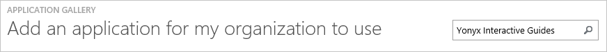
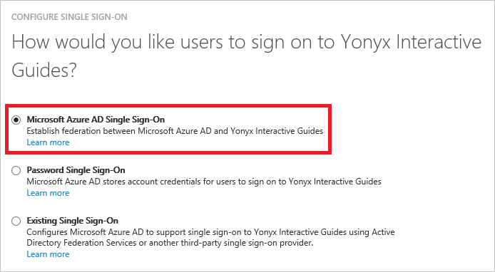
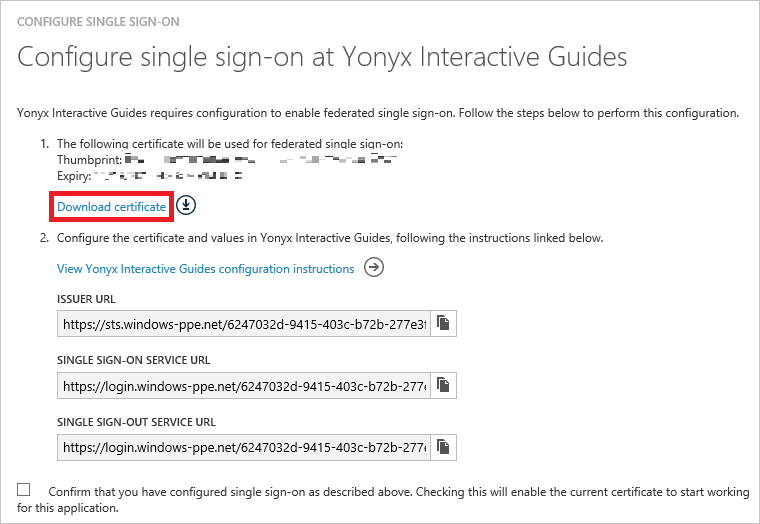
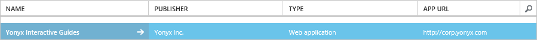

<properties
    pageTitle="Didacticiel : Intégration d’Azure Active Directory avec Guides interactifs Yonyx | Microsoft Azure"
    description="Découvrez comment configurer l’authentification unique entre Azure Active Directory et Guides interactifs Yonyx."
    services="active-directory"
    documentationCenter=""
    authors="jeevansd"
    manager="femila"
    editor=""/>

<tags
    ms.service="active-directory"
    ms.workload="identity"
    ms.tgt_pltfrm="na"
    ms.devlang="na"
    ms.topic="article"
    ms.date="10/26/2016"
    ms.author="jeedes"/>

# Didacticiel : Intégration d’Azure Active Directory avec Guides interactifs Yonyx

L’objectif de ce didacticiel consiste à vous montrer comment intégrer Guides interactifs Yonyx Azure Active Directory (AD Azure).

Intégration de Guides interactifs Yonyx avec Azure AD vous offre les avantages suivants :

- Vous pouvez contrôler dans Azure AD qui accèdent à Guides interactifs Yonyx
- Vous pouvez autoriser les utilisateurs à automatiquement obtenir connecté-on to Guides interactifs Yonyx (SSO) avec leurs comptes Azure AD
- Vous pouvez gérer vos comptes dans un emplacement central : le portail classique Azure

Si vous souhaitez en savoir plus d’informations sur l’intégration de l’application SaaS avec Azure Active Directory, voir [qu’est l’accès aux applications et l’authentification unique avec Azure Active Directory](active-directory-appssoaccess-whatis.md).

## Conditions préalables

Pour configurer l’intégration Azure AD avec Guides interactifs Yonyx, vous devez les éléments suivants :

- Un abonnement Azure AD
- Une authentification unique Guides interactifs Yonyx lors de l’abonnement activé

> [AZURE.NOTE] Pour tester les étapes décrites dans ce didacticiel, nous ne recommandons pas à l’aide d’un environnement de production.

Pour tester les étapes décrites dans ce didacticiel, vous devez suivre ces recommandations :

- Vous ne devez pas utiliser votre environnement de production, sauf si cela est nécessaire.
- Si vous n’avez pas un environnement de version d’évaluation Azure AD, vous pouvez obtenir un mois d’évaluation [ici](https://azure.microsoft.com/pricing/free-trial/).

## Description du scénario
L’objectif de ce didacticiel consiste à vous permettent de tester Azure AD SSO dans un environnement de test.

Scénario présenté dans ce didacticiel se compose de deux principaux blocs de construction :

1. Ajout de Guides interactifs Yonyx à partir de la galerie
2. Configuration et test Azure AD authentification unique

## Ajout de Guides interactifs Yonyx à partir de la galerie
Pour configurer l’intégration des Guides interactifs Yonyx dans Azure AD, vous devez ajouter des Guides interactifs Yonyx à partir de la galerie à votre liste des applications SaaS gérées.

**Pour ajouter des Guides interactifs Yonyx à partir de la galerie, procédez comme suit :**

1. Dans le **portail classique Azure**, dans le volet de navigation gauche, cliquez sur **Active Directory**. 

    ![Active Directory][1]

2. Dans la liste **répertoire** , sélectionnez le répertoire pour lequel vous souhaitez activer l’intégration d’annuaire.

3. Pour ouvrir la vue applications, dans l’affichage du répertoire, cliquez sur **Applications** dans le menu supérieur.
    
    ![Applications][2]

4. Cliquez sur **Ajouter** en bas de la page.
    
    ![Applications][3]

5. Dans la boîte de dialogue **que voulez-vous faire** , cliquez sur **Ajouter une application à partir de la galerie**.

    ![Applications][4]

6. Dans la zone Rechercher, tapez **Guides interactifs Yonyx**.

    

7. Dans le volet résultats, sélectionnez **Guides interactifs Yonyx**, puis cliquez sur **Terminer** pour ajouter l’application.

    

##  Configuration et test Azure AD authentification unique
L’objectif de cette section consiste à vous montrer comment configurer et tester Azure AD SSO avec Guides interactifs Yonyx basée sur un utilisateur de test appelé « Brian Simon ».

Pour de l’authentification unique pour l’utiliser, Azure AD doit détermine-t-il ce qui est l’utilisateur homologue dans Yonyx Guides interactifs à un utilisateur dans Active Directory Azure. En d’autres termes, une relation de liaison entre un utilisateur Azure AD et l’utilisateur connexe dans Guides interactifs Yonyx doit être établie.

Cette relation lien est établie en affectant la valeur du **nom d’utilisateur** dans Active Directory Azure en tant que la valeur **nom d’utilisateur** dans les Guides interactifs Yonyx.

Pour configurer et tester Azure AD SSO avec Guides interactifs Yonyx, vous devez effectuer les blocs de construction suivantes :

1. **[Configuration Azure AD SSO](#configuring-azure-ad-single-single-sign-on)** - pour permettre à vos utilisateurs utiliser cette fonctionnalité.
2. **[Création d’une annonce Azure tester l’utilisateur](#creating-an-azure-ad-test-user)** - permettent de tester Azure AD SSO avec Britta Simon.
3. **[Création d’un Guides interactifs Yonyx tester l’utilisateur](#creating-a-yonyx-interactive-guides-test-user)** - d’avoir un homologue de Britta Simon dans Yonyx Guides interactifs qui est lié à la représentation Azure AD de lui.
4. **[Attribution de l’annonce Azure tester l’utilisateur](#assigning-the-azure-ad-test-user)** - activer Britta Simon utiliser Azure AD SSO.
5. **[Test de l’authentification unique](#testing-single-sign-on)** - afin de vérifier si la configuration fonctionne.

### Configuration d’Azure AD SSO

Dans cette section, vous activez Azure AD SSO dans le portail classique et configurez l’authentification unique dans votre application Guides interactifs Yonyx.

**Pour configurer Azure AD SSO avec Guides interactifs Yonyx, effectuez les opérations suivantes :**

1. Dans le portail classique, dans la page de l’intégration des **Guides interactifs Yonyx** application, cliquez **sur Configurer l’authentification unique** pour ouvrir la boîte de dialogue **Configuration de l’authentification unique** .
     
    ![Configurer l’authentification unique][6] 

2. Dans la page **Comment souhaitez-vous aux utilisateurs de se connecter à Guides interactifs Yonyx** , sélectionnez **Azure AD SSO**, puis cliquez sur **suivant**.
    
    

3. Dans la page de la boîte de dialogue **Configurer les paramètres de l’application** , effectuez les opérations suivantes, puis cliquez sur **suivant**:

    

    un. Dans la zone de texte **URL de connexion** , tapez une URL à l’aide du modèle suivant : `https://<company name>.yonyx.com/y/conversation/?id=<guid number>`.

    b. Dans la zone de texte **identificateur** , tapez une URL en utilisant le modèle suivant : `https://<company name>.yonyx.com`.

    c. Cliquez sur **suivant**

    > [AZURE.NOTE] Veuillez noter que vous devez mettre à jour ces valeurs avec le signe sur URL réelle et l’identificateur. Pour obtenir ces valeurs, contactez Yonyx Guides interactifs prend en charge d’équipe via <mailto:support@yonyx.com>.

4. Dans la page **configuration de l’authentification unique en Guides interactifs Yonyx** , cliquez sur **Télécharger le certificat** , puis enregistrez le fichier sur votre ordinateur :

    

5. Pour obtenir de l’authentification unique configuré pour votre Guides interactifs Yonyx application, contactez l’équipe par le biais de support <mailto:support@yonyx.com> et fournissez-lui ce qui suit :

    • Le **certificat** téléchargé

    • L' **URL de l’émetteur**

    • L' **URL du Service d’authentification unique**

    • L' **URL du Service déconnexion unique**

6. Dans le portail classique, sélectionnez la confirmation de la configuration de l’authentification unique, puis cliquez sur **suivant**.
    
    ![Authentification Azure AD unique][10]

7. Dans la page de **confirmation d’authentification unique** , cliquez sur **Terminer**.  
    
    ![Authentification Azure AD unique][11]

### Création d’un utilisateur de test Azure AD
L’objectif de cette section consiste à créer un utilisateur de test dans le portail classique appelé Britta Simon.

![Créez Azure AD utilisateur][20]

**Pour créer un utilisateur de test dans Azure AD, effectuez les opérations suivantes :**

1. Dans le **portail classique Azure**, dans le volet de navigation gauche, cliquez sur **Active Directory**.

    

2. Dans la liste **répertoire** , sélectionnez le répertoire pour lequel vous souhaitez activer l’intégration d’annuaire.

3. Pour afficher la liste des utilisateurs, dans le menu dans la partie supérieure, cliquez sur **utilisateurs**.
    
    

4. Pour ouvrir la boîte de dialogue **Ajouter un utilisateur** , dans la barre d’outils en bas, cliquez sur **Ajouter un utilisateur**.

    

5. Dans la page de dialogue **dites-nous sur cet utilisateur** , effectuez les opérations suivantes :

    

    un. En tant que Type d’utilisateur, sélectionnez nouvel utilisateur de votre organisation.

    b. Dans la **zone de texte**du nom d’utilisateur, tapez **BrittaSimon**.

    c. Cliquez sur **suivant**.

6.  Dans la page de la boîte de dialogue **Profil utilisateur** , procédez comme suit :
    
    

    un. Dans la zone de texte **nom** , tapez **Brian**.  

    b. Dans la zone de texte **Nom** , tapez **Simon**.

    c. Dans la zone de texte **Nom complet** , tapez **Brian Simon**.

    d. Dans la liste **rôle** , sélectionnez **utilisateur**.

    e. Cliquez sur **suivant**.

7. Dans la page de dialogue **obtenir le mot de passe temporaire** , cliquez sur **créer**.
    
    

8. Dans la page de dialogue **obtenir le mot de passe temporaire** , procédez comme suit :
    
    

    un. Notez la valeur de **Nouveau mot de passe**.

    b. Cliquez sur **terminé**.   

### Création d’un utilisateur de test Guides interactifs Yonyx

L’objectif de cette section consiste à créer un utilisateur appelé Britta Simon dans Guides interactifs Yonyx. Guides interactifs Yonyx prend en charge à temps de mise en service, qui est par défaut activé.

Il n’existe aucun élément d’action pour vous dans cette section. Un nouvel utilisateur est créé au cours d’une tentative d’accès Adobe Creative Cloud s’il n’existe pas encore.

> [AZURE.NOTE] Si vous avez besoin créer manuellement un utilisateur, vous devez contacter l’équipe de support Guides interactifs Yonyx via <mailto:support@yonyx.com>.

### Affectation de l’utilisateur de test Azure AD

L’objectif de cette section est à l’activation Britta Simon à utiliser par l’octroi d’accès aux Guides interactifs Yonyx Azure de l’authentification unique.
    
![Affecter utilisateur][200]

**Pour attribuer Britta Simon à Guides interactifs Yonyx, effectuez les opérations suivantes :**

1. Dans le portail classique, pour ouvrir la vue applications, dans l’affichage du répertoire, cliquez sur **Applications** dans le menu supérieur.
    
    ![Affecter utilisateur][201]

2. Dans la liste des applications, sélectionnez **Guides interactifs Yonyx**.
    
    

3. Dans le menu dans la partie supérieure, cliquez sur **utilisateurs**.
    
    ![Affecter utilisateur][203]

4. Dans la liste des utilisateurs, sélectionnez **Brian Simon**.

5. Dans la barre d’outils en bas, cliquez sur **attribuer**.
    
    ![Affecter utilisateur][205]

### Test de l’authentification unique

L’objectif de cette section consiste à tester votre Azure AD unique authentification configuration à l’aide du panneau d’accès.
 
Lorsque vous cliquez sur la vignette Guides interactifs Yonyx dans le panneau d’accès, vous devez obtenir automatiquement connecté-on à votre application Yonyx les Guides interactifs.

## Ressources supplémentaires

* [Liste des didacticiels sur l’intégration des applications SaaS avec Azure Active Directory](active-directory-saas-tutorial-list.md)
* [Quel est l’accès aux applications et l’authentification unique avec Azure Active Directory ?](active-directory-appssoaccess-whatis.md)

<!--Image references-->

[1]: ./media/active-directory-saas-yonyx-tutorial/tutorial_general_01.png
[2]: ./media/active-directory-saas-yonyx-tutorial/tutorial_general_02.png
[3]: ./media/active-directory-saas-yonyx-tutorial/tutorial_general_03.png
[4]: ./media/active-directory-saas-yonyx-tutorial/tutorial_general_04.png

[6]: ./media/active-directory-saas-yonyx-tutorial/tutorial_general_05.png
[10]: ./media/active-directory-saas-yonyx-tutorial/tutorial_general_06.png
[11]: ./media/active-directory-saas-yonyx-tutorial/tutorial_general_07.png
[20]: ./media/active-directory-saas-yonyx-tutorial/tutorial_general_100.png

[200]: ./media/active-directory-saas-yonyx-tutorial/tutorial_general_200.png
[201]: ./media/active-directory-saas-yonyx-tutorial/tutorial_general_201.png
[203]: ./media/active-directory-saas-yonyx-tutorial/tutorial_general_203.png
[204]: ./media/active-directory-saas-yonyx-tutorial/tutorial_general_204.png
[205]: ./media/active-directory-saas-yonyx-tutorial/tutorial_general_205.png
