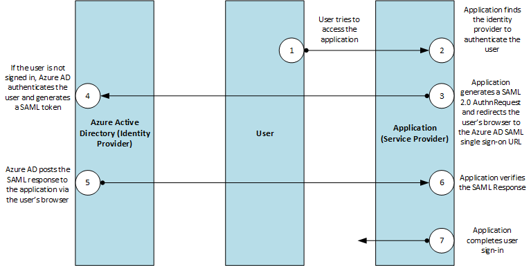

<properties
    pageTitle="Authentification unique Azure SAML protocole | Microsoft Azure"
    description="Cet article décrit le protocole d’authentification unique sur SAML dans Azure Active Directory"
    services="active-directory"
    documentationCenter=".net"
    authors="priyamohanram"
    manager="mbaldwin"
    editor=""/>

<tags
    ms.service="active-directory"
    ms.workload="identity"
    ms.tgt_pltfrm="na"
    ms.devlang="na"
    ms.topic="article"
    ms.date="10/03/2016"
    ms.author="priyamo"/>

# <a name="single-sign-on-saml-protocol"></a>Protocole SAML authentification unique

Cet article traite les demandes d’authentification SAML 2.0 et les réponses qui prend en charge Azure Active Directory (AD Azure) pour de l’authentification unique.

Le diagramme de protocole ci-dessous décrit la séquence d’authentification unique. Le service cloud (le fournisseur de services) utilise une liaison de redirection HTTP pour transmettre un `AuthnRequest` élément (demande d’authentification) à Azure Active Directory (le fournisseur d’identité). Azure AD puis utilise une publication HTTP liaison pour publier un `Response` élément au service cloud.



## <a name="authnrequest"></a>AuthnRequest

Pour demander une authentification des utilisateurs, des services cloud envoyer un `AuthnRequest` élément à Azure Active Directory. Un échantillon SAML 2.0 `AuthnRequest` peut ressembler à ceci :

```
<samlp:AuthnRequest
xmlns="urn:oasis:names:tc:SAML:2.0:metadata"
ID="id6c1c178c166d486687be4aaf5e482730"
Version="2.0" IssueInstant="2013-03-18T03:28:54.1839884Z"
xmlns:samlp="urn:oasis:names:tc:SAML:2.0:protocol">
<Issuer xmlns="urn:oasis:names:tc:SAML:2.0:assertion">https://www.contoso.com</Issuer>
</samlp:AuthnRequest>
```


| Paramètre | | Description |
| ----------------------- | ------------------------------- | --------------- |
| ID | Obligatoire | Azure AD utilise cet attribut pour remplir la `InResponseTo` attribut de la réponse renvoyée. ID ne doit pas commencer par un nombre, pour une stratégie commune consiste à ajouter une chaîne comme « id » à la chaîne représentant un GUID. Par exemple, `id6c1c178c166d486687be4aaf5e482730` est un ID valide. |
| Version | Obligatoire | Il s’agit **2.0**.|
| IssueInstant | Obligatoire | Il s’agit d’une chaîne de date/heure avec une valeur UTC et [format aller-retour (« o »)](https://msdn.microsoft.com/library/az4se3k1.aspx). Azure AD attend une valeur de date/heure de ce type, mais pas évaluer ou utilisez la valeur. |
| AssertionConsumerServiceUrl | facultatif | Si fourni, il doit correspondre à la `RedirectUri` du service cloud dans Azure AD. |
| ForceAuthn | facultatif | Si fourni, cela doit être false. Toute autre valeur génère une erreur.|
| IsPassive | facultatif | Si fourni, cela doit être false. Toute autre valeur génère une erreur. |  

Toutes les autres `AuthnRequest` attributs, tels que consentement, Destination, AssertionConsumerServiceIndex, AttributeConsumerServiceIndex et ProviderName ne sont **pas pris en compte**.

Azure AD ignore également la `Conditions` élément dans `AuthnRequest`.

### <a name="issuer"></a>Émetteur

La `Issuer` élément dans une `AuthnRequest` doit correspondre exactement à un des **ServicePrincipalNames** dans le service cloud dans Azure Active Directory. En règle générale, cela est défini à l' **Application ID URI** spécifié lors de l’inscription d’application.

Un exemple SAML extrait contenant le `Issuer` élément ressemble à ceci :

```
<Issuer xmlns="urn:oasis:names:tc:SAML:2.0:assertion">https://www.contoso.com</Issuer>
```

### <a name="nameidpolicy"></a>NameIDPolicy

Cet élément demande un format ID nom particulier dans la réponse et est facultatif dans `AuthnRequest` éléments envoyés à Azure AD.

Un échantillon `NameIdPolicy` élément ressemble à ceci :

```
<NameIDPolicy Format="urn:oasis:names:tc:SAML:2.0:nameid-format:persistent"/>
```

Si `NameIDPolicy` est fournie, vous pouvez inclure ses facultatif `Format` attribut. La `Format` attribut peut contenir uniquement une des valeurs suivantes ; toute autre valeur génère une erreur.

-  `urn:oasis:names:tc:SAML:2.0:nameid-format:persistent`: Azure Active Directory émet la demande NameID comme un identificateur par paire.
- `urn:oasis:names:tc:SAML:1.1:nameid-format:emailAddress`: Azure Active Directory émet la demande NameID sous la forme d’adresse de messagerie.
- `urn:oasis:names:tc:SAML:1.1:nameid-format:unspecified`: Cette valeur autorise Azure Active Directory pour sélectionner le format réclamer. Azure Active Directory émet la NameID comme un identificateur par paire.

N’incluez pas la `SPNameQualifer` attribut. Azure AD ignore la `AllowCreate` attribut.

### <a name="requestauthncontext"></a>RequestAuthnContext

La `RequestedAuthnContext` élément spécifie les méthodes d’authentification de votre choix. Il est facultatif dans `AuthnRequest` éléments envoyés à Azure AD. Azure AD prend en charge qu’un seul `AuthnContextClassRef` valeur : `urn:oasis:names:tc:SAML:2.0:ac:classes:Password`.

### <a name="scoping"></a>Étendue

La `Scoping` élément, qui inclut une liste de fournisseurs d’identité, est facultative dans `AuthnRequest` éléments envoyés à Azure AD.

Si fourni, n’incluez pas la `ProxyCount` attribut, `IDPListOption` ou `RequesterID` élément, ils ne sont pas pris en charge.

### <a name="signature"></a>Signature

N’incluez pas une `Signature` élément de `AuthnRequest` éléments, comme Azure AD ne prend pas en charge connecté les demandes d’authentification.

### <a name="subject"></a>Objet

Azure AD ignore la `Subject` élément de `AuthnRequest` éléments.

## <a name="response"></a>Réponse

Lorsqu’une ouverture de session demandé est terminée avec succès, Azure AD publie une réponse au service cloud. Un exemple de réponse à une tentative d’ouverture de session réussie ressemble à ceci :

```
<samlp:Response ID="_a4958bfd-e107-4e67-b06d-0d85ade2e76a" Version="2.0" IssueInstant="2013-03-18T07:38:15.144Z" Destination="https://contoso.com/identity/inboundsso.aspx" InResponseTo="id758d0ef385634593a77bdf7e632984b6" xmlns:samlp="urn:oasis:names:tc:SAML:2.0:protocol">
  <Issuer xmlns="urn:oasis:names:tc:SAML:2.0:assertion"> https://login.microsoftonline.com/82869000-6ad1-48f0-8171-272ed18796e9/</Issuer>
  <ds:Signature xmlns:ds="http://www.w3.org/2000/09/xmldsig#">
    ...
  </ds:Signature>
  <samlp:Status>
    <samlp:StatusCode Value="urn:oasis:names:tc:SAML:2.0:status:Success" />
  </samlp:Status>
  <Assertion ID="_bf9c623d-cc20-407a-9a59-c2d0aee84d12" IssueInstant="2013-03-18T07:38:15.144Z" Version="2.0" xmlns="urn:oasis:names:tc:SAML:2.0:assertion">
    <Issuer>https://login.microsoftonline.com/82869000-6ad1-48f0-8171-272ed18796e9/</Issuer>
    <ds:Signature xmlns:ds="http://www.w3.org/2000/09/xmldsig#">
      ...
    </ds:Signature>
    <Subject>
      <NameID>Uz2Pqz1X7pxe4XLWxV9KJQ+n59d573SepSAkuYKSde8=</NameID>
      <SubjectConfirmation Method="urn:oasis:names:tc:SAML:2.0:cm:bearer">
        <SubjectConfirmationData InResponseTo="id758d0ef385634593a77bdf7e632984b6" NotOnOrAfter="2013-03-18T07:43:15.144Z" Recipient="https://contoso.com/identity/inboundsso.aspx" />
      </SubjectConfirmation>
    </Subject>
    <Conditions NotBefore="2013-03-18T07:38:15.128Z" NotOnOrAfter="2013-03-18T08:48:15.128Z">
      <AudienceRestriction>
        <Audience>https://www.contoso.com</Audience>
      </AudienceRestriction>
    </Conditions>
    <AttributeStatement>
      <Attribute Name="http://schemas.xmlsoap.org/ws/2005/05/identity/claims/name">
        <AttributeValue>testuser@contoso.com</AttributeValue>
      </Attribute>
      <Attribute Name="http://schemas.microsoft.com/identity/claims/objectidentifier">
        <AttributeValue>3F2504E0-4F89-11D3-9A0C-0305E82C3301</AttributeValue>
      </Attribute>
      ...
    </AttributeStatement>
    <AuthnStatement AuthnInstant="2013-03-18T07:33:56.000Z" SessionIndex="_bf9c623d-cc20-407a-9a59-c2d0aee84d12">
      <AuthnContext>
        <AuthnContextClassRef> urn:oasis:names:tc:SAML:2.0:ac:classes:Password</AuthnContextClassRef>
      </AuthnContext>
    </AuthnStatement>
  </Assertion>
</samlp:Response>
```

### <a name="response"></a>Réponse

La `Response` élément inclut le résultat de la demande d’autorisation. Azure AD définit la `ID`, `Version` et `IssueInstant` les valeurs dans le `Response` élément. Il définit également les attributs suivants :

- `Destination`: Lorsque l’authentification est terminée avec succès, il est défini sur la `RedirectUri` du fournisseur de service (service cloud).
- `InResponseTo`: Cette option est définie la `ID` attribut de la `AuthnRequest` élément qui a initialisé la réponse.

### <a name="issuer"></a>Émetteur

Azure AD définit la `Issuer` élément à `https://login.microsoftonline.com/<TenantIDGUID>/` où <TenantIDGUID> est l’ID de client du client Azure AD.

Par exemple, un exemple de réponse avec élément de l’émetteur peut ressembler à ceci :

```
<Issuer xmlns="urn:oasis:names:tc:SAML:2.0:assertion"> https://login.microsoftonline.com/82869000-6ad1-48f0-8171-272ed18796e9/</Issuer>
```

### <a name="status"></a>État

La `Status` élément véhicule la réussite ou l’échec de l’authentification. Il inclut la `StatusCode` élément, qui contient un code ou un jeu de codes imbriqués représentant l’état de la demande. Il comprend également le `StatusMessage` élément, qui contient des messages d’erreur personnalisés qui sont générés pendant le processus d’authentification.

<!-- TODO: Add a authentication protocol error reference -->

Voici une réponse SAML à une tentative d’ouverture de session échoue.

```
<samlp:Response ID="_f0961a83-d071-4be5-a18c-9ae7b22987a4" Version="2.0" IssueInstant="2013-03-18T08:49:24.405Z" InResponseTo="iddce91f96e56747b5ace6d2e2aa9d4f8c" xmlns:samlp="urn:oasis:names:tc:SAML:2.0:protocol">
  <Issuer xmlns="urn:oasis:names:tc:SAML:2.0:assertion">https://sts.windows.net/82869000-6ad1-48f0-8171-272ed18796e9/</Issuer>
  <samlp:Status>
    <samlp:StatusCode Value="urn:oasis:names:tc:SAML:2.0:status:Requester">
      <samlp:StatusCode Value="urn:oasis:names:tc:SAML:2.0:status:RequestUnsupported" />
    </samlp:StatusCode>
    <samlp:StatusMessage>AADSTS75006: An error occurred while processing a SAML2 Authentication request. AADSTS90011: The SAML authentication request property 'NameIdentifierPolicy/SPNameQualifier' is not supported.
Trace ID: 66febed4-e737-49ff-ac23-464ba090d57c
Timestamp: 2013-03-18 08:49:24Z</samlp:StatusMessage>
  </samlp:Status>
```

### <a name="assertion"></a>Assertion

En plus de la `ID`, `IssueInstant` et `Version`, Azure AD définit les éléments suivants la `Assertion` élément de la réponse.

#### <a name="issuer"></a>Émetteur

Cette option est définie `https://sts.windows.net/<TenantIDGUID>/`où <TenantIDGUID> est l’ID de client du client Azure AD.

```
<Issuer>https://login.microsoftonline.com/82869000-6ad1-48f0-8171-272ed18796e9/</Issuer>
```

#### <a name="signature"></a>Signature

Azure AD signe l’assertion en réponse à une ouverture de session réussie. La `Signature` élément contient une signature numérique du service cloud peut utiliser pour authentifier la source pour vérifier l’intégrité de l’assertion.

Pour générer la signature numérique, Azure AD utilise la clé de signature dans les `IDPSSODescriptor` élément de son document de métadonnées.

```
<ds:Signature xmlns:ds="http://www.w3.org/2000/09/xmldsig#">
      digital_signature_here
    </ds:Signature>
```

#### <a name="subject"></a>Objet

Cette option spécifie l’entité de sécurité est le sujet des instructions de l’assertion. Il contient un `NameID` élément, qui représente l’utilisateur authentifié. La `NameID` valeur est un identificateur ciblé est uniquement dirigé vers le fournisseur de services qui est destiné le jeton. Il s’agit permanente - peut être révoqué, mais elle n’est jamais réaffectée. Il est également opaque, car il n’affiche pas rien sur l’utilisateur et ne peut pas être utilisé comme identificateur pour les requêtes de l’attribut.

La `Method` attribut de la `SubjectConfirmation` élément est toujours définie sur `urn:oasis:names:tc:SAML:2.0:cm:bearer`.

```
<Subject>
      <NameID>Uz2Pqz1X7pxe4XLWxV9KJQ+n59d573SepSAkuYKSde8=</NameID>
      <SubjectConfirmation Method="urn:oasis:names:tc:SAML:2.0:cm:bearer">
        <SubjectConfirmationData InResponseTo="id758d0ef385634593a77bdf7e632984b6" NotOnOrAfter="2013-03-18T07:43:15.144Z" Recipient="https://contoso.com/identity/inboundsso.aspx" />
      </SubjectConfirmation>
</Subject>
```

#### <a name="conditions"></a>Conditions

Cet élément spécifie les conditions qui définissent l’utilisation acceptable d’assertions SAML.

```
<Conditions NotBefore="2013-03-18T07:38:15.128Z" NotOnOrAfter="2013-03-18T08:48:15.128Z">
      <AudienceRestriction>
        <Audience>https://www.contoso.com</Audience>
      </AudienceRestriction>
</Conditions>
```

La `NotBefore` et `NotOnOrAfter` attributs spécifient l’intervalle pendant lequel l’assertion est valide.

- La valeur de la `NotBefore` attribut est égal à ou légèrement (moins d’une seconde) ultérieure à la valeur de `IssueInstant` attribut de la `Assertion` élément. Azure AD ne tient pas compte des différences de temps entre lui-même et le service cloud (fournisseur de services) et n’ajoute pas de n’importe quel tampon à ce moment.
- La valeur de la `NotOnOrAfter` attribut est 70 minutes plus tard que la valeur de la `NotBefore` attribut.

#### <a name="audience"></a>Audience

Cet onglet contient un URI qui identifie une audience. Azure AD définit la valeur de cet élément à la valeur de `Issuer` élément de la `AuthnRequest` qui a lancé l’authentification. Pour évaluer la `Audience` , utilisez la valeur de la `App ID URI` qui a été spécifié lors de l’inscription d’application.

```
<AudienceRestriction>
        <Audience>https://www.contoso.com</Audience>
</AudienceRestriction>
```

Comme le `Issuer` valeur, la `Audience` valeur doit correspondre exactement à un des noms principaux du service qui représente le service cloud dans Azure Active Directory. Toutefois, si la valeur de la `Issuer` élément n’est pas une valeur d’URI, le `Audience` valeur de la réponse est la `Issuer` valeur le préfixe `spn:`.

#### <a name="attributestatement"></a>AttributeStatement

Cet onglet contient revendications sur l’objet ou l’utilisateur. L’extrait suivant contient un échantillon `AttributeStatement` élément. Les points de suspension indique que l’élément peut contenir plusieurs attributs et valeurs d’attribut.

```
<AttributeStatement>
      <Attribute Name="http://schemas.xmlsoap.org/ws/2005/05/identity/claims/name">
        <AttributeValue>testuser@contoso.com</AttributeValue>
      </Attribute>
      <Attribute Name="http://schemas.microsoft.com/identity/claims/objectidentifier">
        <AttributeValue>3F2504E0-4F89-11D3-9A0C-0305E82C3301</AttributeValue>
      </Attribute>
      ...
</AttributeStatement>
```     

- **Réclamer nom** : la valeur de la `Name` attribut (`http://schemas.xmlsoap.org/ws/2005/05/identity/claims/name`) est le nom d’utilisateur principal de l’utilisateur authentifié, tel que `testuser@managedtenant.com`.
- **Réclamer ObjectIdentifier** : la valeur de la `ObjectIdentifier` attribut (`http://schemas.microsoft.com/identity/claims/objectidentifier`) est la `ObjectId` de l’objet directory qui représente l’utilisateur authentifié dans Azure Active Directory. `ObjectId`est immuable, globalement uniques et réutiliser fiables identifiant de l’utilisateur authentifié.

#### <a name="authnstatement"></a>AuthnStatement

Cet élément indique que l’objet assertion a été authentifié par un moyen particulier à un moment donné.

- La `AuthnInstant` attribut spécifie l’heure à laquelle l’utilisateur authentifié avec Azure AD.
- La `AuthnContext` élément spécifie le contexte d’authentification utilisé pour authentifier l’utilisateur.

```
<AuthnStatement AuthnInstant="2013-03-18T07:33:56.000Z" SessionIndex="_bf9c623d-cc20-407a-9a59-c2d0aee84d12">
      <AuthnContext>
        <AuthnContextClassRef> urn:oasis:names:tc:SAML:2.0:ac:classes:Password</AuthnContextClassRef>
      </AuthnContext>
</AuthnStatement>
```
