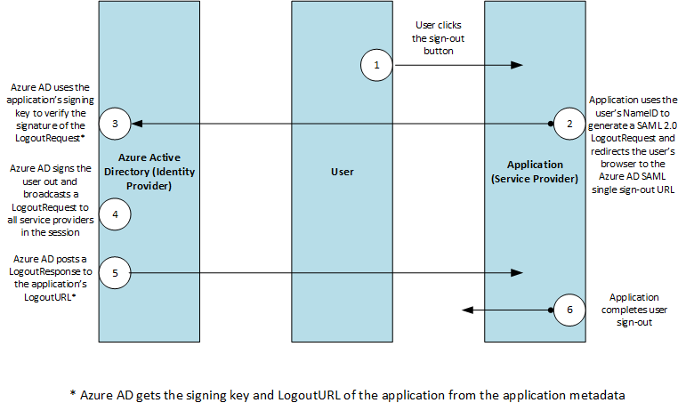

<properties
    pageTitle="Azure déconnexion unique protocole SAML | Microsoft Azure"
    description="Cet article décrit le protocole SAML Sign-Out unique dans Azure Active Directory"
    services="active-directory"
    documentationCenter=".net"
    authors="priyamohanram"
    manager="mbaldwin"
    editor=""/>

<tags
    ms.service="active-directory"
    ms.workload="identity"
    ms.tgt_pltfrm="na"
    ms.devlang="na"
    ms.topic="article"
    ms.date="10/03/2016"
    ms.author="priyamo"/>


# <a name="single-sign-out-saml-protocol"></a>Protocole SAML déconnexion unique

Prend en charge l’Azure Active Directory (AD Azure) le SAML 2.0 web profil déconnexion unique de navigateur. Pour que seule déconnexion pour fonctionner correctement, Azure AD doit enregistrer des son URL de métadonnées lors de l’inscription d’application. Azure AD Obtient l’URL de déconnexion et la clé de signature du service cloud à partir des métadonnées. Azure AD utilise la clé de signature pour vérifier la signature dans la LogoutRequest entrant, et qu’il utilise le LogoutURL pour rediriger les utilisateurs après que qu’ils sont connectés.

Si le service en nuage ne reconnaît pas un point de terminaison de métadonnées, une fois que l’application est enregistrée, le développeur doit contacter le support technique Microsoft pour fournir l’URL de déconnexion et la clé de signature.

Ce diagramme montre le flux de travail du processus de déconnexion unique Azure AD.



## <a name="logoutrequest"></a>LogoutRequest

L’envoie de service cloud un `LogoutRequest` message à Azure AD pour indiquer qu’une session a été interrompue. L’extrait suivant montre un exemple `LogoutRequest` élément.

```
<samlp:LogoutRequest xmlns="urn:oasis:names:tc:SAML:2.0:metadata" ID="idaa6ebe6839094fe4abc4ebd5281ec780" Version="2.0" IssueInstant="2013-03-28T07:10:49.6004822Z" xmlns:samlp="urn:oasis:names:tc:SAML:2.0:protocol">
  <Issuer xmlns="urn:oasis:names:tc:SAML:2.0:assertion">https://www.workaad.com</Issuer>
  <NameID xmlns="urn:oasis:names:tc:SAML:2.0:assertion"> Uz2Pqz1X7pxe4XLWxV9KJQ+n59d573SepSAkuYKSde8=</NameID>
</samlp:LogoutRequest>
```

### <a name="logoutrequest"></a>LogoutRequest

La `LogoutRequest` élément envoyé à Azure AD requiert les attributs suivants :

- `ID`: Identifie la demande de déconnexion. La valeur de `ID` ne doit pas commencer par un nombre. La classique consiste à ajouter **id** à la chaîne représentant un GUID.

- `Version`: Définissez la valeur de cet élément **2.0**. Cette valeur est requise.

- `IssueInstant`: Il s’agit d’un `DateTime` de chaîne avec une valeur de coordonner le temps universel (UTC) et le [format aller-retour (« o »)](https://msdn.microsoft.com/library/az4se3k1.aspx). Azure AD attend une valeur de ce type, mais ne l’assure pas.

- La `Consent`, `Destination`, `NotOnOrAfter` et `Reason` attributs sont ignorés s’ils sont inclus dans une `LogoutRequest` élément.

### <a name="issuer"></a>Émetteur

La `Issuer` élément dans une `LogoutRequest` doit correspondre exactement à un des **ServicePrincipalNames** dans le service cloud dans Azure Active Directory. En règle générale, cela est défini à l' **Application ID URI** spécifié lors de l’inscription d’application.

### <a name="nameid"></a>NameID

La valeur de la `NameID` élément doit correspondre exactement à la `NameID` de l’utilisateur qui est en cours déconnecté.
## <a name="logoutresponse"></a>LogoutResponse

Azure AD envoie une `LogoutResponse` en réponse à une `LogoutRequest` élément. L’extrait suivant montre un exemple `LogoutResponse`.

```
<samlp:LogoutResponse ID="_f0961a83-d071-4be5-a18c-9ae7b22987a4" Version="2.0" IssueInstant="2013-03-18T08:49:24.405Z" InResponseTo="iddce91f96e56747b5ace6d2e2aa9d4f8c" xmlns:samlp="urn:oasis:names:tc:SAML:2.0:protocol">
  <Issuer xmlns="urn:oasis:names:tc:SAML:2.0:assertion">https://sts.windows.net/82869000-6ad1-48f0-8171-272ed18796e9/</Issuer>
  <samlp:Status>
    <samlp:StatusCode Value="urn:oasis:names:tc:SAML:2.0:status:Success" />
  </samlp:Status>
</samlp:LogoutResponse>
```

### <a name="logoutresponse"></a>LogoutResponse

Azure AD définit la `ID`, `Version` et `IssueInstant` les valeurs dans le `LogoutResponse` élément. Il définit également la `InResponseTo` élément à la valeur de la `ID` attribut de la `LogoutRequest` qui provoquée la réponse.

### <a name="issuer"></a>Émetteur

Azure AD définit cette valeur sur `https://login.microsoftonline.com/<TenantIdGUID>/` où <TenantIdGUID> est l’ID de client du client Azure AD.

Pour évaluer la valeur de la `Issuer` élément, utilisez la valeur de l' **Application ID URI** fournie lors de l’inscription d’application.

### <a name="status"></a>État

Azure AD utilise le `StatusCode` élément dans le `Status` élément pour indiquer la réussite ou l’échec de la déconnexion. En cas d’échec de la tentative de déconnexion, la `StatusCode` élément peut contenir des messages d’erreur personnalisés.
