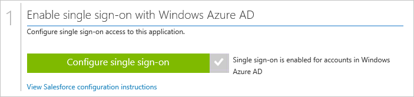
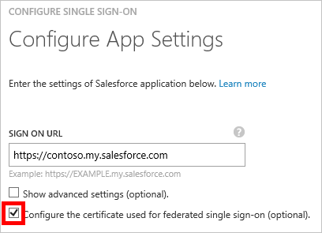
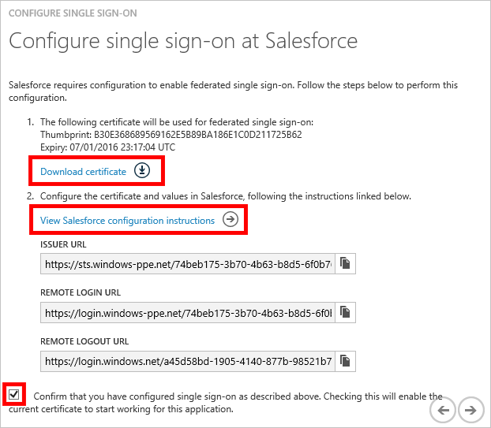

<properties
    pageTitle="Comment gérer les certificats de fédération dans Azure AD | Microsoft Azure"
    description="Découvrez comment personnaliser la date d’expiration pour vos certificats de fédération et comment renouveler les certificats arrive à expiration."
    services="active-directory"
    documentationCenter=""
    authors="asmalser-msft"
    manager="femila"
    editor=""/>

<tags
    ms.service="active-directory"
    ms.workload="identity"
    ms.tgt_pltfrm="na"
    ms.devlang="na"
    ms.topic="article"
    ms.date="02/09/2016"
    ms.author="asmalser-msft"/>

#Gestion des certificats pour fédéré de l’authentification unique dans Azure Active Directory

Cet article répond aux questions relatives aux certificats qu’Azure Active Directory crée pour établir fédéré session unique (SSO) à vos applications SaaS.

Cet article ne s’applique aux applications qui sont configurées pour utiliser **Azure AD SSO**, comme illustré dans l’exemple ci-dessous :

##Comment personnaliser la Date d’Expiration de votre certificat de fédération

Par défaut, les certificats sont configurés pour qu’ils expirent après deux ans. Vous pouvez choisir une autre date d’expiration de votre certificat en suivant les étapes ci-dessous. Les captures d’écran inclus utilisent Salesforce pour cet exemple, mais ces étapes peuvent s’appliquent à n’importe quelle application SaaS fédérée.

1. Dans Azure Active Directory, dans la page de démarrage rapide pour votre application, cliquez sur **de configurer l’authentification unique**.

    

2. Sélectionnez **Azure AD SSO**, puis cliquez sur **suivant**.

3. Tapez l' **URL authentification** de votre application, puis sélectionnez la case à cocher pour **configurer le certificat utilisé pour fédéré de l’authentification unique**. Cliquez sur **suivant**.

    

4. Dans la page suivante, sélectionnez **Générer un nouveau certificat**, puis sélectionnez la durée pendant laquelle vous voulez que le certificat doit être valide pour. Cliquez sur **suivant**.

    

5. Cliquez ensuite sur **Télécharger le certificat**. Pour savoir comment télécharger le certificat dans votre application SaaS particulier, cliquez sur **Afficher les instructions de configuration**.

    

6. Le certificat ne sera autorisé jusqu'à ce que vous activez la case à cocher confirmation au bas de la boîte de dialogue et appuyez sur Envoyer.

##Comment renouveler un certificat qui arrive à expiration

Les étapes de renouvellement ci-dessous doivent entraîner préférence sans interruption de service significative pour vos utilisateurs. Les captures d’écran utilisé dans cette fonctionnalité section Salesforce comme exemple, mais ces étapes peuvent s’appliquent à n’importe quelle application SaaS fédérée.

1. Dans Azure Active Directory, dans la page de démarrage rapide pour votre application, cliquez sur **Configuration de l’authentification unique**.

    

2. Sur la première page de la boîte de dialogue, **Azure AD SSO** doit déjà être sélectionnée, cliquez sur **suivant**.

3. Dans la deuxième page, sélectionnez la case à cocher pour **configurer le certificat utilisé pour fédérées de l’authentification unique**. Cliquez sur **suivant**.

    

4. Dans la page suivante, sélectionnez **Générer un nouveau certificat**, puis sélectionnez la durée pendant laquelle vous voulez que le nouveau certificat valide pour. Cliquez sur **suivant**.

    

5. Cliquez sur **Télécharger le certificat**. Pour correctement rewnew votre certificat, vous devez effectuer les deux étapes suivantes :

    - Téléchargez le nouveau certificat sur écran de configuration de l’authentification unique de l’application SaaS. Pour savoir comment faire pour votre application SaaS particulier, cliquez sur **Afficher les instructions de configuration**.

    - Dans Azure Active Directory, activez la case à cocher confirmation au bas de la boîte de dialogue pour activer le nouveau certificat, puis cliquez sur **suivant** pour envoyer.

    > [AZURE.IMPORTANT] Authentification unique à l’application est désactivée au moment où l’une de ces deux étapes est terminé, mais il sera activé à nouveau une fois la deuxième étape terminée. Par conséquent, pour réduire le temps d’arrêt, préparez accomplir les deux étapes dans un laps de temps entre eux.

    

## Articles connexes

- [Index des articles de gestion des applications dans Azure Active Directory](active-directory-apps-index.md)
- [Accès aux applications et l’authentification unique avec Azure Active Directory](active-directory-appssoaccess-whatis.md)
- [Résolution des problèmes en fonction des SAML de l’authentification unique](active-directory-saml-debugging.md)
