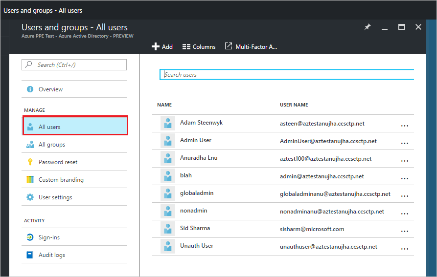

<properties
    pageTitle="Affecter un utilisateur à des rôles d’administrateur dans l’aperçu Azure Active Directory | Microsoft Azure"
    description="Explique comment modifier ses informations d’administration dans Azure Active Directory"
    services="active-directory"
    documentationCenter=""
    authors="curtand"
    manager="femila"
    editor=""/>

<tags
    ms.service="active-directory"
    ms.workload="identity"
    ms.tgt_pltfrm="na"
    ms.devlang="na"
    ms.topic="article"
    ms.date="09/12/2016"
    ms.author="curtand"/>

# Affecter un utilisateur à des rôles d’administrateur dans l’aperçu Azure Active Directory

Cet article explique comment attribuer un rôle d’administration à un utilisateur en mode Aperçu avant Azure Active Directory (AD Azure). [Nouveautés dans l’aperçu](active-directory-preview-explainer.md) Pour plus d’informations sur l’ajout de nouveaux utilisateurs de votre organisation, voir [Ajouter de nouveaux utilisateurs à Azure Active Directory](active-directory-users-create-azure-portal.md). Utilisateurs ajoutés n’ont pas les autorisations d’administrateur par défaut, mais vous pouvez attribuer des rôles leur à tout moment.

## Attribuer un rôle à un utilisateur

1.  Connectez-vous au [portail Azure](https://portal.azure.com) avec un compte qui est un administrateur global pour l’annuaire.

2.  Sélectionnez **plusieurs services**, entrez les **utilisateurs et groupes** dans la zone de texte et puis appuyez sur **entrée**.

    

3.  Dans la carte **utilisateurs et groupes** , sélectionnez **tous les utilisateurs**.

    

4. Sur la carte **utilisateurs et groupes - tous les utilisateurs** , sélectionnez un utilisateur dans la liste.

5. Sur la carte pour l’utilisateur sélectionné, sélectionnez le **rôle d’annuaire**, puis puis affecter l’utilisateur à un rôle dans la liste **rôle d’annuaire** . Pour plus d’informations sur les rôles d’utilisateur et l’administrateur, voir [affectation de rôles administrateur dans Azure Active Directory](active-directory-assign-admin-roles.md).

      

6. Cliquez sur **Enregistrer**.

## Ensuite ?

- [Ajouter un utilisateur](active-directory-users-create-azure-portal.md)
- [Réinitialiser le mot de passe d’un utilisateur dans le nouveau portail Azure](active-directory-users-reset-password-azure-portal.md)
- [Modifier les informations relatives au travail d’un utilisateur](active-directory-users-work-info-azure-portal.md)
- [Gérer les profils utilisateur](active-directory-users-profile-azure-portal.md)
- [Supprimer un utilisateur dans votre annonce Azure](active-directory-users-delete-user-azure-portal.md)
