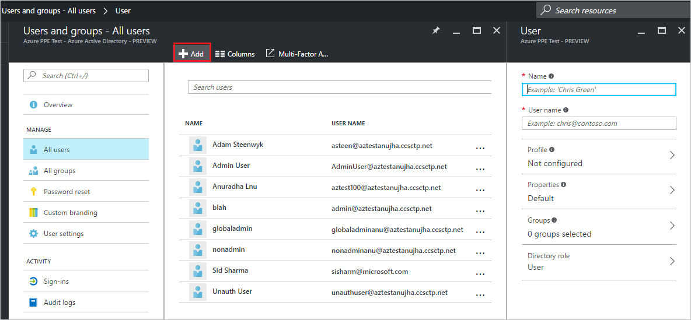

<properties
    pageTitle="Ajouter des utilisateurs à partir d’autres annuaires ou partenaires en mode Aperçu avant Azure Active Directory | Microsoft Azure"
    description="Explique comment ajouter des utilisateurs ou modifier les informations utilisateur dans Active Directory Azure, y compris les utilisateurs externes et l’invité."
    services="active-directory"
    documentationCenter=""
    authors="curtand"
    manager="femila"
    editor=""/>

<tags
    ms.service="active-directory"
    ms.workload="identity"
    ms.tgt_pltfrm="na"
    ms.devlang="na"
    ms.topic="article"
    ms.date="09/12/2016"
    ms.author="curtand"/>

# Ajouter des utilisateurs à partir d’autres répertoires ou sociétés partenaires en mode Aperçu avant Azure Active Directory

> [AZURE.SELECTOR]
- [Portail Azure](active-directory-users-create-external-azure-portal.md)
- [Portail classique Azure](active-directory-create-users-external.md)

Cet article explique comment ajouter des utilisateurs à partir d’autres annuaires en mode Aperçu avant Azure Active Directory (AD Azure) ou à partir de partenaires. [Nouveautés dans l’aperçu](active-directory-preview-explainer.md) Pour plus d’informations sur l’ajout de nouveaux utilisateurs dans votre organisation et ajout d’utilisateurs possédant un compte Microsoft, voir [Ajouter de nouveaux utilisateurs à Azure Active Directory](active-directory-users-create-azure-portal.md). Utilisateurs ajoutés n’ont pas les autorisations d’administrateur par défaut, mais vous pouvez attribuer des rôles leur à tout moment.

## Ajouter un utilisateur

1.  Connectez-vous au [portail Azure](https://portal.azure.com) avec un compte qui est un administrateur global pour l’annuaire.

2.  Sélectionnez **plusieurs services**, entrez les **utilisateurs et groupes** dans la zone de texte et puis appuyez sur **entrée**.

    

3.  Sur la carte **utilisateurs et groupes** , sélectionnez **utilisateurs**, puis **Ajouter**.

    

4. Sur la carte **utilisateur** , fournir un nom d’affichage dans la zone **nom** et se connecter un nom de l’utilisateur dans **nom d’utilisateur**.

5. Copiez ou notez sinon le mot de passe utilisateur généré afin que vous pouvez le fournir à l’utilisateur une fois ce processus terminé.

6. Si vous le souhaitez, sélectionnez **profil** pour ajouter les utilisateurs tout d’abord, nom, prénom, un titre et un nom de service.
    
    

    - Sélectionnez les **groupes** pour ajouter l’utilisateur à un ou plusieurs groupes.

        

    - Sélectionnez le **rôle d’organisation** pour affecter l’utilisateur à un rôle dans la liste des **rôles** . Pour plus d’informations sur les rôles d’utilisateur et l’administrateur, voir [affectation de rôles administrateur dans Azure Active Directory](active-directory-assign-admin-roles.md).

        

7. Sélectionnez **créer**.

8. Distribuer en toute sécurité le mot de passe généré au nouvel utilisateur afin que l’utilisateur peut se connecter.

> [AZURE.IMPORTANT] Si votre organisation utilise plusieurs domaines, vous devez savoir sur les problèmes suivants lorsque vous ajoutez un compte d’utilisateur :
>
> - Pour ajouter des comptes d’utilisateurs avec le nom d’utilisateur principal (UPN) sur plusieurs domaines, **première** ajouter, par exemple, geoffgrisso@contoso.onmicrosoft.com, **suivie** geoffgrisso@contoso.com.
> - **Ne pas** ajouter geoffgrisso@contoso.com avant d’ajouter geoffgrisso@contoso.onmicrosoft.com. Cet ordre est important et peut être difficile à annuler.

Si vous modifiez les informations pour un utilisateur dont l’identité est synchronisée avec votre service d’annuaire Active Directory local, vous ne pouvez pas modifier les informations utilisateur dans le portail classique Azure. Pour modifier les informations utilisateur, utilisez les outils de gestion de votre Active Directory local.

## Ensuite ?

- [Ajouter un utilisateur](active-directory-users-create-azure-portal.md)
- [Réinitialiser le mot de passe d’un utilisateur dans le nouveau portail Azure](active-directory-users-reset-password-azure-portal.md)
- [Affecter un utilisateur à un rôle dans votre annonce Azure](active-directory-users-assign-role-azure-portal.md)
- [Modifier les informations relatives au travail d’un utilisateur](active-directory-users-work-info-azure-portal.md)
- [Gérer les profils utilisateur](active-directory-users-profile-azure-portal.md)
- [Supprimer un utilisateur dans votre annonce Azure](active-directory-users-delete-user-azure-portal.md)
