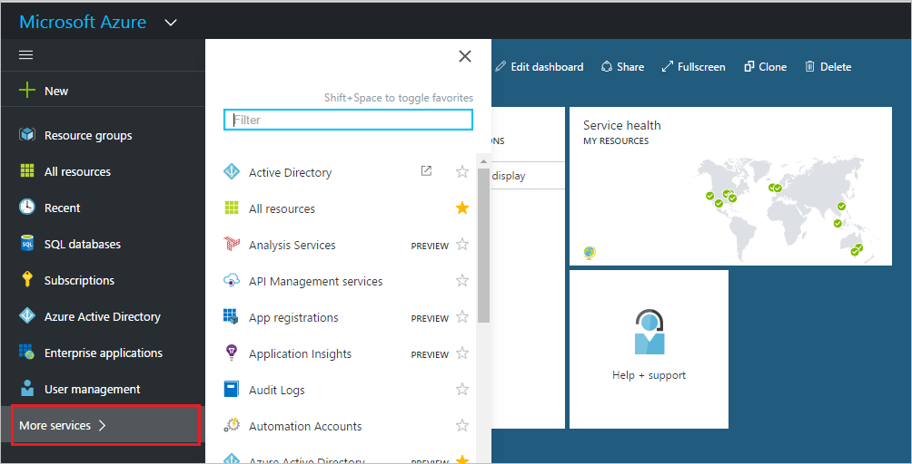

<properties
    pageTitle="Supprimer un utilisateur d’un répertoire en mode Aperçu avant Azure Active Directory | Microsoft Azure"
    description="Explique comment supprimer un utilisateur et toutes ses informations d’Azure Active Directory"
    services="active-directory"
    documentationCenter=""
    authors="curtand"
    manager="femila"
    editor=""/>

<tags
    ms.service="active-directory"
    ms.workload="identity"
    ms.tgt_pltfrm="na"
    ms.devlang="na"
    ms.topic="article"
    ms.date="09/12/2016"
    ms.author="curtand"/>

# Supprimer un utilisateur d’un répertoire en mode Aperçu avant Azure Active Directory

Cet article explique comment supprimer un utilisateur d’un répertoire en mode Aperçu avant Azure Active Directory (AD Azure). [Nouveautés dans l’aperçu](active-directory-preview-explainer.md) Pour plus d’informations sur l’ajout de nouveaux utilisateurs de votre organisation, voir [Ajouter de nouveaux utilisateurs à Azure Active Directory](active-directory-users-create-azure-portal.md).

## Supprimer un utilisateur

1.  Connectez-vous au [portail Azure](https://portal.azure.com) avec un compte qui est un administrateur global pour l’annuaire.

2.  Sélectionnez **plusieurs services**, entrez les **utilisateurs et groupes** dans la zone de texte et puis appuyez sur **entrée**.

    

3.  Dans la carte **utilisateurs et groupes** , sélectionnez **les utilisateurs**.

    

4. Sur la carte **utilisateurs et groupes - utilisateurs** , sélectionnez un utilisateur dans la liste.

5. Sur la carte pour l’utilisateur sélectionné, sélectionnez **vue d’ensemble**, dans la barre de commandes, puis **Supprimer**.

    

## Ensuite ?

- [Ajouter un utilisateur](active-directory-users-create-azure-portal.md)
- [Réinitialiser le mot de passe d’un utilisateur dans le nouveau portail Azure](active-directory-users-reset-password-azure-portal.md)
- [Affecter un utilisateur à un rôle dans votre annonce Azure](active-directory-users-assign-role-azure-portal.md)
- [Modifier les informations relatives au travail d’un utilisateur](active-directory-users-work-info-azure-portal.md)
- [Gérer les profils utilisateur](active-directory-users-profile-azure-portal.md)
