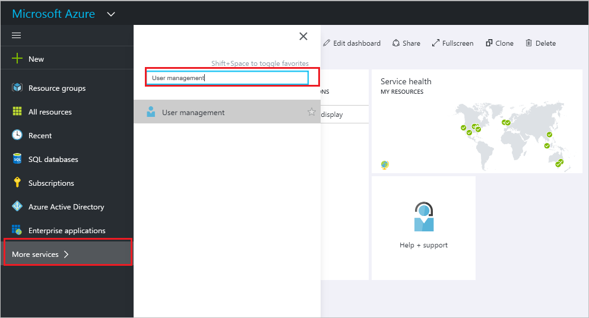

<properties
    pageTitle="Ajouter ou modifier les informations de profil pour un utilisateur en mode Aperçu avant Azure Active Directory | Microsoft Azure"
    description="Explique comment ajouter le profil utilisateur, y compris l’image de profil, dans Azure Active Directory"
    services="active-directory"
    documentationCenter=""
    authors="curtand"
    manager="femila"
    editor=""/>

<tags
    ms.service="active-directory"
    ms.workload="identity"
    ms.tgt_pltfrm="na"
    ms.devlang="na"
    ms.topic="article"
    ms.date="09/12/2016"
    ms.author="curtand"/>

# Ajouter ou modifier les informations de profil pour un utilisateur en mode Aperçu avant Azure Active Directory

Cet article explique comment ajouter des informations de profil utilisateur, par exemple une informations d’authentification du téléphone ou courrier électronique ou image de profil, en mode Aperçu avant Azure Active Directory (AD Azure). [Nouveautés dans l’aperçu](active-directory-preview-explainer.md) Pour plus d’informations sur l’ajout de nouveaux utilisateurs de votre organisation, voir [Ajouter de nouveaux utilisateurs à Azure Active Directory](active-directory-users-create-azure-portal.md).

## Comment modifier les informations de profil

1.  Connectez-vous au [portail Azure](https://portal.azure.com) avec un compte qui est un administrateur global pour l’annuaire.

2.  Sélectionnez **plusieurs services**, entrez les **utilisateurs et groupes** dans la zone de texte et puis appuyez sur **entrée**.

    

3.  Sur les **utilisateurs et groupes** de* carte, sélectionnez * *utilisateurs**.

    

4. Sur la carte **utilisateurs et groupes - utilisateurs** , sélectionnez un utilisateur dans la liste.

5. Sur la carte pour l’utilisateur sélectionné, sélectionnez **profil**.

    

6. Ajouter ou modifier les informations de profil et puis sélectionnez **Enregistrer**dans la barre de commandes.

## Ensuite ?

- [Ajouter un utilisateur](active-directory-users-create-azure-portal.md)
- [Réinitialiser le mot de passe d’un utilisateur dans le nouveau portail Azure](active-directory-users-reset-password-azure-portal.md)
- [Affecter un utilisateur à un rôle dans votre annonce Azure](active-directory-users-assign-role-azure-portal.md)
- [Modifier les informations relatives au travail d’un utilisateur](active-directory-users-work-info-azure-portal.md)
- [Supprimer un utilisateur dans votre annonce Azure](active-directory-users-delete-user-azure-portal.md)
