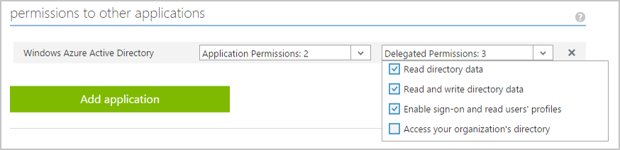

<properties
    pageTitle="Point de terminaison de la version 2.0 Azure AD | Microsoft Azure"
    description="Une comparaison entre l’annonce Azure d’origine et les extrémités de la version 2.0."
    services="active-directory"
    documentationCenter=""
    authors="dstrockis"
    manager="mbaldwin"
    editor=""/>

<tags
    ms.service="active-directory"
    ms.workload="identity"
    ms.tgt_pltfrm="na"
    ms.devlang="na"
    ms.topic="article"
    ms.date="09/16/2016"
    ms.author="dastrock"/>

# <a name="whats-different-about-the-v20-endpoint"></a>Quelle est la différence sur le point de terminaison version 2.0 ?

Si vous avez l’habitude d’Azure Active Directory ou que vous avez intégré des applications à Azure AD par le passé, il peut être des différences entre le point de terminaison version 2.0 vous attendez pas.  Ce document présente les différences pour votre présentation.

> [AZURE.NOTE]
    Pas tous les scénarios Azure Active Directory et fonctionnalités sont prises en charge par le point de terminaison version 2.0.  Pour déterminer si vous devez utiliser le point de terminaison version 2.0, lisez les [limitations de la version 2.0](active-directory-v2-limitations.md).


## <a name="microsoft-accounts-and-azure-ad-accounts"></a>Comptes Microsoft et comptes Azure Active Directory
point de terminaison de la version 2.0 permettent aux développeurs écrire des applications qui acceptent se connecter à partir de comptes Microsoft Accounts et Azure Active Directory, à l’aide d’un point de terminaison auth unique.  Cela vous donne la possibilité d’écrire votre application complètement indépendant du compte ; Il peut être ignorant du type de compte que l’utilisateur se connecte à l’aide.  Bien entendu, vous *pouvez* rendre votre application prenant en charge du type de compte utilisé dans une session particulière, mais vous n’êtes pas obligé.

Par exemple, si votre application appelle la [Microsoft Graph](https://graph.microsoft.io), certaines fonctionnalités supplémentaires et des données est disponibles pour les utilisateurs de l’entreprise, tels que leurs sites SharePoint ou les données de l’annuaire.  Mais, pour de nombreuses actions, telles que la [lecture du courrier d’un utilisateur](https://graph.microsoft.io/docs/api-reference/v1.0/resources/message), le code peut apparaître exactement le même pour les comptes Microsoft Accounts et Azure AD.  

Intégration de votre application avec Microsoft Accounts et comptes Azure Active Directory est maintenant un processus simple.  Vous pouvez utiliser un seul ensemble de points de terminaison, une seule bibliothèque et un enregistrement unique d’application pour accéder aux univers le consommateur et de l’entreprise.  Pour en savoir plus sur le point de terminaison version 2.0, consultez [la vue d’ensemble](active-directory-appmodel-v2-overview.md).


## <a name="new-app-registration-portal"></a>Portail de l’enregistrement nouvelle application
le point de terminaison version 2.0 peut uniquement être enregistrée dans un nouvel emplacement : [apps.dev.microsoft.com](https://apps.dev.microsoft.com/?referrer=https://azure.microsoft.com/documentation/articles&deeplink=/appList).  Il s’agit du portail où vous pouvez obtenir un Id de l’Application, personnaliser l’apparence de la page de connexion de votre application et bien plus encore.  Vous avez seulement besoin pour accéder au portail est un compte Microsoft optimisé - compte personnel ou Professionnel ou scolaire.  

Nous continuent à ajouter des fonctionnalités plus à ce portail de l’enregistrement de l’application dans le temps.  L’objectif est que ce portail sera le nouvel emplacement dans lequel vous pouvez accéder à gérer tout et devoir faire avec les applications Microsoft.


## <a name="one-app-id-for-all-platforms"></a>Une application Id pour toutes les plateformes
Dans le service d’Azure Active Directory d’origine, vous pouvez avoir enregistré plusieurs applications différentes pour un seul projet.  Vous deviez utiliser les enregistrements application distincte pour vos clients natives et les applications web :


Par exemple, si vous avez créé un site Web et une application iOS, vous deviez inscrire séparément, à l’aide de deux ID d’Application différents.  Si vous avez un site Web et un serveur principal web api, vous pouvez avoir enregistré chacun d’eux comme une application distincte dans Azure AD.  Si vous avez une application iOS et une application Android, vous également pourriez avoir enregistré deux applications différentes.  

<!-- You may have even registered different apps for each of your build environments - one for dev, one for test, and one for production. -->

À présent, vous avez seulement besoin est d’un enregistrement unique d’application et un Id d’Application unique pour chacun de vos projets.  Vous pouvez ajouter plusieurs « plateformes » à chaque projet et fournir les données appropriées pour chaque plate-forme que vous ajoutez.  Bien entendu, vous pouvez créer des applications autant que vous souhaitez selon vos besoins, mais pour la plupart des cas qu’un seul Id de l’Application doit être nécessaire.

<!-- You can also label a particular platform as "production-ready" when it is ready to be published to the outside world, and use that same Application Id safely in your development environments. -->

Notre objectif est que cela entraîner une gestion application plus simplifié et une expérience de développement et créer un affichage plus consolidé d’un projet unique qui vous travaillez sur.


## <a name="scopes-not-resources"></a>Étendues, pas de ressources
Dans le service d’Azure AD d’origine, une application peut se comporter comme une **ressource**ou un destinataire de jetons.  Une ressource, définissez un numéro de **étendues** ou **oAuth2Permissions** qu’il comprend, ce qui permet de client applications demander des jetons à cette ressource pour un certain nombre de zones.  Vous pouvez l’API Azure AD Graph, par exemple d’une ressource :

- Identificateur de ressource, ou `AppID URI`:`https://graph.windows.net/`
- Étendues, ou `OAuth2Permissions`: `Directory.Read`, `Directory.Write`, etc..  

Tout cela est vrai pour le point de terminaison de la version 2.0.  Une application peut se comporter toujours en tant que ressource, définition d’étendues et être identifiée par un URI.  Applications clientes peuvent toujours demander l’accès à ces zones.  Toutefois, le mode dans lequel un client demande ces autorisations a changé.  Par le passé, autoriser une 2.0 OAuth demande pour Azure AD ont étaient :

```
GET https://login.microsoftonline.com/common/oauth2/authorize?
client_id=2d4d11a2-f814-46a7-890a-274a72a7309e
&resource=https%3A%2F%2Fgraph.windows.net%2F
...
```

Si un paramètre de la **ressource** indiquée quelle ressource l’application cliente demande d’autorisation pour.  Azure AD vous souhaitez calculer les autorisations requises par l’application basée sur une configuration statique dans le portail Azure et jetons émis en conséquence.  À présent, le même 2.0 OAuth autoriser demande ressemble à :

```
GET https://login.microsoftonline.com/common/oauth2/v2.0/authorize?
client_id=2d4d11a2-f814-46a7-890a-274a72a7309e
&scope=https%3A%2F%2Fgraph.windows.net%2Fdirectory.read%20https%3A%2F%2Fgraph.windows.net%2Fdirectory.write
...
```

où le paramètre **scope** indique quelle ressource et autorisations l’application demande d’autorisation pour. La ressource souhaitée est toujours très présente dans la demande - il est simplement incluse dans chacune des valeurs du paramètre étendue.  En utilisant le paramètre de l’étendue de cette manière permet à l’extrémité de la version 2.0 soit plus conforme à la spécification OAuth 2.0 et mieux adaptée aux pratiques du secteur courantes.  Il permet également des applications effectuer [consentement incrémentiel](#incremental-and-dynamic-consent), qui est décrit dans la section suivante.

## <a name="incremental-and-dynamic-consent"></a>Consentement incrémentiel et dynamique
Applications enregistré dans Azure AD sera-t-il disponible nécessaire pour spécifier les autorisations requises OAuth 2.0 associées dans le portail Azure, au moment de la création de l’application de service :



Les autorisations d’une application requise ont été configurés de **manière statique**.  Tandis que cette configuration de l’application existe dans le portail Azure autorisés tout en conservant le code piles et simple, il présente quelques problèmes pour les développeurs :

- Une application avait connaître toutes les autorisations qu'il devront jamais au moment de création d’une application.  Ajout d’autorisations au fil du temps a été un processus difficile.
- Une application avait connaître toutes les ressources qu'il doit toujours accéder à l’avance.  Il était difficile de créer des applications qui pourraient accéder à un nombre quelconque de ressources.
- Une application avait demander toutes les autorisations qu'il devront jamais lors de la connexion première de l’utilisateur.  Dans certains cas, cela conduit à une longue liste d’autorisation, qui déconseillée aux utilisateurs finaux d’approuver l’accès de l’application sur connexion initiale.

Avec le point de terminaison version 2.0, vous pouvez spécifier les autorisations requises par votre application **dynamiquement**, lors de l’exécution, lors de l’utilisation standard de votre application.  Pour ce faire, vous pouvez spécifier les étendues de votre application doit à un moment donné dans le temps en les incluant dans le `scope` paramètre d’une requête d’autorisation :

```
GET https://login.microsoftonline.com/common/oauth2/v2.0/authorize?
client_id=2d4d11a2-f814-46a7-890a-274a72a7309e
&scope=https%3A%2F%2Fgraph.windows.net%2Fdirectory.read%20https%3A%2F%2Fgraph.windows.net%2Fdirectory.write
...
```

L’autorisation de demandes ci-dessus pour l’application lire les données de l’annuaire de l’utilisateur un Azure AD, ainsi que d’écrire des données dans leur répertoire.  Si l’utilisateur a accepté de ces autorisations par le passé pour cette application particulier, vous entrerez simplement leurs informations d’identification et être connectés à l’application.  Si l’utilisateur n’a pas accepté à certaines de ces autorisations, le point de terminaison version 2.0 vous demandera l’utilisateur consentement à ces autorisations.  Pour plus d’informations, vous pouvez lire sur les [autorisations, accord et étendues](active-directory-v2-scopes.md).

Ce qui permet une application pour demander des autorisations dynamiquement via la `scope` paramètre vous donne un contrôle total sur l’expérience utilisateur.  Si vous le souhaitez, vous pouvez soit frontload votre consentement expérience et demandez pour toutes les autorisations dans une demande d’autorisation initial.  Ou, si votre application requiert un grand nombre d’autorisations, vous pouvez choisir de rassembler par incréments, les autorisations de l’utilisateur lorsqu’ils essaient d’utiliser certaines fonctionnalités de votre application dans le temps.

## <a name="well-known-scopes"></a>Étendues connus

#### <a name="offline-access"></a>Accès hors connexion
le point de terminaison version 2.0 peut-être nécessiter l’utilisation d’une connu d’autorisation pour les applications - la `offline_access` étendue.  Toutes les applications devrez demander cette autorisation s’ils souhaitent accéder aux ressources de la part d’un utilisateur pour une période prolongée, même lorsque l’utilisateur ne peut pas être activement à l’aide de l’application.  La `offline_access` étendue s’affichent à l’utilisateur dans les boîtes de dialogue consentement en tant que « Accéder à vos données en mode hors connexion », dont l’utilisateur doit accepter.  Demander la `offline_access` autorisation permettra à votre application web recevoir OAuth 2.0 refresh_tokens à partir de la version 2.0.  Refresh_tokens sont à long terme et peuvent être échangées pour nouvelle access_tokens 2.0 OAuth pendant une période prolongée d’access.  

Si votre application ne demande pas la `offline_access` étendue, il ne recevrez pas de refresh_tokens.  Cela signifie que lorsque vous échanger un authorization_code dans le [flux de code 2.0 OAuth d’autorisation](active-directory-v2-protocols.md#oauth2-authorization-code-flow), vous ne recevrez que revenir un access_token à partir de la `/token` point de terminaison.  Cette access_token restera valide pour un laps de temps (en général une heure), mais arriveront à expiration.  AT nécessitant des point dans le temps, votre application pour rediriger l’utilisateur en retour vers le `/authorize` point de terminaison pour récupérer un nouveau authorization_code.  Au cours de cette redirection, l’utilisateur peut ou non besoin d’entrer ses informations d’identification à nouveau ou nouveau consentement aux autorisations, selon le type de l’application.

Pour en savoir plus sur 2.0 OAuth, refresh_tokens et access_tokens, consultez la [référence au protocole version 2.0](active-directory-v2-protocols.md).

#### <a name="openid-profile--email"></a>OpenID, profil et messagerie

Dans le service d’Azure Active Directory d’origine, le plus simple OpenID connecter connexion flux fournit une mine d’informations sur l’utilisateur dans l’id_token qui en résulte.  Les revendications dans un id_token peuvent inclure l’utilisateur nom, nom d’utilisateur par défaut, adresse de messagerie, ID de l’objet et plus.

Nous allons maintenant restreindre les informations qui la `openid` étendue offre l’accès de l’application à.  L’étendue 'openid' uniquement votre application pour vous connecter à l’utilisateur dans et de recevoir un identificateur spécifique à l’application pour l’utilisateur.  Si vous souhaitez obtenir des informations d’identification personnelle (informations d’identification personnelle) sur l’utilisateur dans votre application, votre application devez demander des autorisations supplémentaires à partir de l’utilisateur.  Nous vous présentons aujourd'hui deux nouvelles étendues – la `email` et `profile` étendues – qui vous permettent de le faire.

La `email` étendue est très simple : il permet d’accéder de votre application à l’adresse de messagerie principale de l’utilisateur via la `email` réclamer dans l’id_token.  La `profile` étendue offre l’accès d’application à toutes les autres informations de base sur l’utilisateur, son nom, le nom d’utilisateur par défaut, ID de l’objet et ainsi de suite.

Cela vous permet de coder votre application de manière minimales divulgation : vous pouvez demander uniquement à l’utilisateur pour l’ensemble des informations dont votre application a besoin pour faire son travail.  Pour plus d’informations sur ces étendues, reportez-vous à [la référence étendue de la version 2.0](active-directory-v2-scopes.md). 

## <a name="token-claims"></a>Revendications des jetons

Les revendications dans des jetons émis par le point de terminaison version 2.0 ne sera pas identiques à jetons émis par sera-t-il disponible points de terminaison Azure AD - applications migration vers le nouveau service ne doivent pas supposer une demande de remboursement particulier se trouvent dans id_tokens ou access_tokens.   Les jetons émis par le point de terminaison version 2.0 sont compatibles avec les spécifications OAuth 2.0 et OpenID se connecter, mais peuvent suivre sémantique différente sera-t-il disponible service Azure AD.

Pour en savoir plus sur les revendications spécifiques émises dans la version 2.0 jetons, voir la [référence de jeton de version 2.0](active-directory-v2-tokens.md).

## <a name="limitations"></a>Limitations
Il existe quelques restrictions importants lors de l’utilisation du point de la version 2.0.  Veuillez consulter le [document de limitations version 2.0](active-directory-v2-limitations.md) pour voir si un de ces restrictions s’appliquent à votre scénario particulier.
