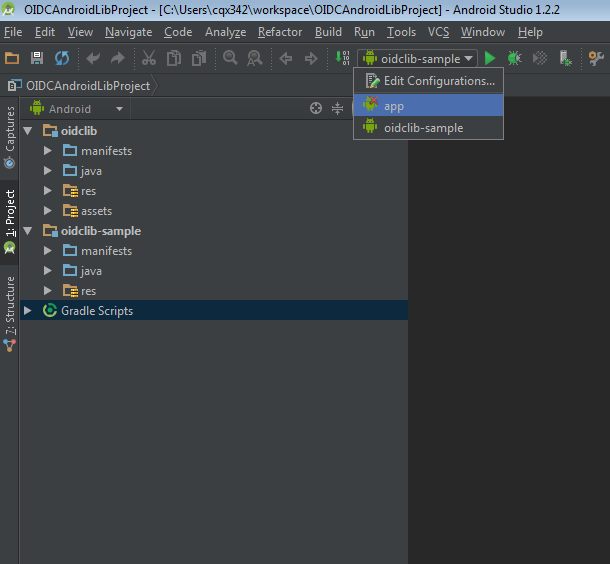
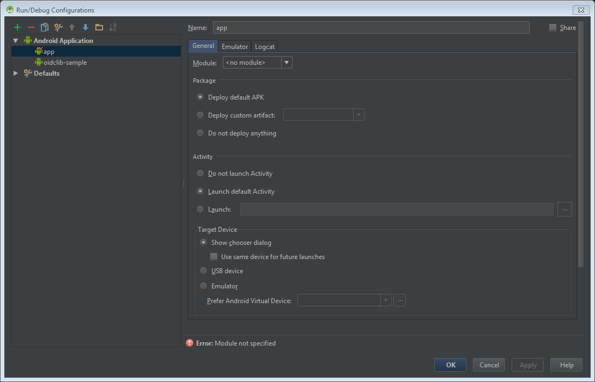

<properties
    pageTitle="Application Android Azure Active Directory 2.0 | Microsoft Azure"
    description="Découvrez comment créer une application Android qui se connecte aux utilisateurs avec personnel compte Microsoft et Professionnel ou scolaire comptes et appels de l’API de graphique à l’aide de bibliothèques tiers."
    services="active-directory"
    documentationCenter=""
    authors="brandwe"
    manager="mbaldwin"
    editor=""/>

<tags
    ms.service="active-directory"
    ms.workload="identity"
    ms.tgt_pltfrm="na"
    ms.devlang="na"
    ms.topic="article"
    ms.date="09/16/2016"
    ms.author="brandwe"/>

#  <a name="add-sign-in-to-an-android-app-using-a-third-party-library-with-graph-api-using-the-v20-endpoint"></a>Ajouter de se connecter à une application Android à l’aide d’une bibliothèque de tiers avec l’API de graphique à l’aide de point de terminaison de la version 2.0

La plateforme d’identité Microsoft utilise des normes ouvertes telles qu’oauth2 n’et OpenID se connecter. Les développeurs peuvent utiliser n’importe quelle bibliothèque qu’ils souhaitent intégrer à nos services. Pour aider les développeurs à utiliser notre plateforme avec d’autres bibliothèques, nous avons écrit quelques procédures pas à pas comme celui-ci pour montrer comment configurer les bibliothèques de tiers pour vous connecter à la plateforme d’identité de Microsoft. La plupart des bibliothèques qui implémentent [la spécification RFC6749 oauth2 ne](https://tools.ietf.org/html/rfc6749) peuvent vous connecter à la plateforme d’identité de Microsoft.

Avec l’application qui crée de cette procédure pas à pas, les utilisateurs peuvent se connecter à leur organisation et puis rechercher eux-mêmes dans leur organisation à l’aide de l’API de graphique.

Si vous débutez avec oauth2 n’ou OpenID se connecter, grande partie de cet exemple de configuration ne peut-être pas sens pour vous. Nous vous recommandons de lire [2.0 protocoles - flux de Code OAuth 2.0 d’autorisation](active-directory-v2-protocols-oauth-code.md) pour l’arrière-plan.

> [AZURE.NOTE] Certaines fonctionnalités de notre plateforme qui ont une expression dans les normes oauth2 n’ou OpenID se connecter, tels qu’accès conditionnel et gestion des stratégies de Intune requièrent vous permettent d’utiliser notre ouvrir la source de Microsoft Azure identité bibliothèques.

Point de terminaison de la version 2.0 ne reconnaît pas tous les scénarios Azure Active Directory et fonctionnalités.

> [AZURE.NOTE] Pour déterminer si vous devez utiliser le point de terminaison version 2.0, lisez les [limitations de la version 2.0](active-directory-v2-limitations.md).


## <a name="download-the-code-from-github"></a>Téléchargez le code à partir de GitHub
Le code de ce didacticiel étant conservée [sur GitHub](https://github.com/Azure-Samples/active-directory-android-native-oidcandroidlib-v2).  Pour suivre, vous pouvez [Télécharger structure de l’application comme un fichier zip](https://github.com/Azure-Samples/active-directory-android-native-oidcandroidlib-v2/archive/skeleton.zip) ou cloner la structure :

```
git clone --branch skeleton git@github.com:Azure-Samples/active-directory-android-native-oidcandroidlib-v2.git
```

Vous pouvez également télécharger l’échantillon et prise en main immédiatement :

```
git@github.com:Azure-Samples/active-directory-android-native-oidcandroidlib-v2.git
```

## <a name="register-an-app"></a>Enregistrer une application
Créer une nouvelle application sur le [portail de l’enregistrement d’Application](https://apps.dev.microsoft.com/?referrer=https://azure.microsoft.com/documentation/articles&deeplink=/appList), ou suivez les étapes détaillées à [l’enregistrement d’une application avec le point de terminaison version 2.0](active-directory-v2-app-registration.md).  Veillez à :

- Copiez l' **Id de l’Application** qui est affectée à votre application, car vous en aurez besoin plus rapidement.
- Ajouter la plateforme **Mobile** pour votre application.

> Remarque : Le portail d’inscription Application fournit une valeur **d’URI rediriger** . Toutefois, dans cet exemple, vous devez utiliser la valeur par défaut `https://login.microsoftonline.com/common/oauth2/nativeclient`.


## <a name="download-the-nxoauth2-third-party-library-and-create-a-workspace"></a>Télécharger la bibliothèque de tiers NXOAuth2 et créer un espace de travail

Pour cette procédure pas à pas, vous allez utiliser la OIDCAndroidLib de GitHub, ce qui correspond à une bibliothèque d’oauth2 n’en fonction du code OpenID connecter de Google. Il vous mettent en œuvre, le profil application native et prend en charge le point de terminaison de l’autorisation de l’utilisateur. Il s’agit tout ce dont vous aurez besoin pour intégrer la plateforme d’identité de Microsoft.

Dupliquer les mis en pension OIDCAndroidLib sur votre ordinateur.

```
git@github.com:kalemontes/OIDCAndroidLib.git
```


## <a name="set-up-your-android-studio-environment"></a>Configurer votre environnement Studio Android

1. Créer un nouveau projet Studio Android et acceptez les paramètres par défaut dans l’Assistant.

    

    

    

2. Pour configurer les modules de votre projet, déplacez la mis en pension cloné à l’emplacement du projet. Vous pouvez également créer le projet et cloner puis directement à l’emplacement du projet.

    

3. Ouvrir les paramètres de modules de projet à l’aide du menu contextuel ou en utilisant le raccourci Ctrl + Alt + Maj + S.

    

4. Supprimer le module d’application par défaut, car vous ne souhaitez que les paramètres de conteneur de projet.

    

5. Importer des modules de la mis en pension cloné au projet en cours.

    
    

6. Répétez ces étapes pour la `oidlib-sample` module.

7. Vérifiez les dépendances oidclib sur la `oidlib-sample` module.

    

8. Cliquez sur **OK** et attendre la synchronisation gradle.

    Votre settings.gradle doit ressembler à :

    

9. Créer l’exemple d’application pour vous assurer que l’exemple fonctionne correctement.

    Vous ne pourrez pas utiliser encore avec Azure Active Directory. Nous avons besoin de configurer tout d’abord quelques points de terminaison. Il s’agit pour vous assurer que vous n’avez pas un problèmes Studio Android avant de commencer à personnaliser l’application exemple.

10. Créer et exécuter `oidlib-sample` comme cible dans Studio Android.

    

11. Supprimer la `app ` répertoire laissé lorsque vous avez supprimé le module du projet, car Studio Android ne le supprimer de la sécurité.

    

12. Ouvrir le menu **Modifier les Configurations** pour supprimer la configuration d’exécution est également restée lorsque vous avez supprimé le module du projet.

    
    

## <a name="configure-the-endpoints-of-the-sample"></a>Configurer les points de terminaison de l’échantillon

À présent que la `oidlib-sample` fonctionne correctement, nous allons modifier certains points de terminaison pour que cela fonctionne correctement avec Azure Active Directory.

### <a name="configure-your-client-by-editing-the-oidcclientconfxml-file"></a>Configurer votre client en modifiant le fichier oidc_clientconf.xml

1. Vous utilisez oauth2 ne flux uniquement à obtenir un jeton et d’appeler l’API Graph, réglez le client pour faire oauth2 n’uniquement. OIDC soient transférés dans un exemple d’une version ultérieure.

    ```xml
        <bool name="oidc_oauth2only">true</bool>
    ```

2. Configurer votre ID client que vous avez reçu à partir du portail de l’enregistrement.

    ```xml
        <string name="oidc_clientId">86172f9d-a1ae-4348-aafa-7b3e5d1b36f5</string>
        <string name="oidc_clientSecret"></string>
    ```

3. Configurez votre URI de redirection avec celui ci-dessous.

    ```xml
        <string name="oidc_redirectUrl">https://login.microsoftonline.com/common/oauth2/nativeclient</string>
    ```

4. Configurer vos étendues que vous avez besoin pour accéder à l’API de graphique.

    ```xml
        <string-array name="oidc_scopes">
            <item>openid</item>
            <item>https://graph.microsoft.com/User.Read</item>
            <item>offline_access</item>
        </string-array>
    ```

La `User.Read` valeur dans `oidc_scopes` vous permet de lire le profil de base signées dans l’utilisateur.
Vous pouvez en savoir plus sur toutes les étendues disponibles dans des [portées d’autorisation de Microsoft Graph](https://graph.microsoft.io/docs/authorization/permission_scopes).

Si vous souhaitez que des explications sur `openid` ou `offline_access` comme étendues dans OpenID se connecter, voir [2.0 protocoles - flux de Code OAuth 2.0 d’autorisation](active-directory-v2-protocols-oauth-code.md).

### <a name="configure-your-client-endpoints-by-editing-the-oidcendpointsxml-file"></a>Configurer des points de terminaison de votre client en modifiant le fichier oidc_endpoints.xml

- Ouvrir le `oidc_endpoints.xml` de fichiers et apportez les modifications suivantes :

    ```xml
    <!-- Stores OpenID Connect provider endpoints. -->
    <resources>
        <string name="op_authorizationEnpoint">https://login.microsoftonline.com/common/oauth2/v2.0/authorize</string>
        <string name="op_tokenEndpoint">https://login.microsoftonline.com/common/oauth2/v2.0/token</string>
        <string name="op_userInfoEndpoint">https://www.example.com/oauth2/userinfo</string>
        <string name="op_revocationEndpoint">https://www.example.com/oauth2/revoketoken</string>
    </resources>
    ```

Ces points de terminaison doivent jamais modifier si vous utilisez oauth2 ne comme protocole.

> [AZURE.NOTE]
Les points de terminaison pour `userInfoEndpoint` et `revocationEndpoint` ne sont actuellement pas pris en charge par Azure Active Directory. Si vous laissez les objets dont la valeur exemple.com par défaut, vous sera relancée qu’ils ne sont pas disponibles dans l’échantillon  :-)


## <a name="configure-a-graph-api-call"></a>Configurer un appel API de graphique

- Ouvrir le `HomeActivity.java` de fichiers et apportez les modifications suivantes :

    ```Java
       //TODO: set your protected resource url
        private static final String protectedResUrl = "https://graph.microsoft.com/v1.0/me/";
    ```

Dans ce cas un simple appel API Graph retourne nos informations.

Ce sont toutes les modifications que vous devez effectuer. Exécuter le `oidlib-sample` application, puis cliquez sur **se connecter**.

Une fois que vous avez authentifié avec succès, cliquez sur le bouton **Demander des ressources protégé** pour tester votre appel à l’API de graphique.

## <a name="get-security-updates-for-our-product"></a>Obtenir des mises à jour de sécurité pour nos produits

Nous vous invitons à obtenir des notifications concernant des incidents de sécurité en visitant le [Site Web TechCenter de sécurité](https://technet.microsoft.com/security/dd252948) et de l’abonnement aux alertes avis de sécurité.
