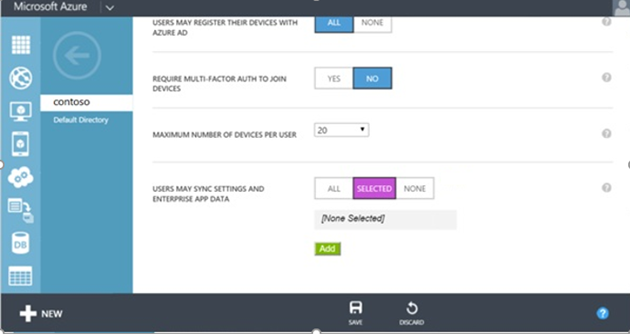

<properties
    pageTitle="Activer l’état entreprise d’itinérance dans Azure Active Directory | Microsoft Azure"
    description="Forum aux questions sur les paramètres d’itinérance état entreprise dans appareils Windows. Entreprise état itinérance fournit aux utilisateurs une expérience unifiée sur tous leurs appareils Windows et permet de réduire le temps nécessaire pour configurer un nouvel appareil."
    services="active-directory"
    keywords="État entreprise d’itinérance, cloud windows, l’activation d’entreprise état itinérance"
    documentationCenter=""
    authors="femila"
    manager="swadhwa"
    editor="curtand"/>

<tags
    ms.service="active-directory"  
    ms.workload="identity"
    ms.tgt_pltfrm="na"
    ms.devlang="na"
    ms.topic="article"
    ms.date="09/27/2016"
    ms.author="femila"/>

# Activer l’état entreprise d’itinérance dans Azure Active Directory

Entreprise état itinérance est disponible pour n’importe quelle organisation avec un abonnement Premium Azure Active Directory (AD Azure). Pour plus d’informations sur l’obtention d’un abonnement Azure Active Directory, consultez la [page du produit Azure AD](https://azure.microsoft.com/services/active-directory).

Lorsque vous activez l’état d’entreprise itinérance, votre organisation est automatiquement accordée des licences pour un abonnement gratuit, usage limité à Azure Rights Management. Abonnement gratuit est limité à chiffrer et déchiffrer des paramètres d’entreprise et les données d’application synchronisées par le service d’itinérance état entreprise ; Vous devez posséder un abonnement payant d’utiliser toutes les fonctionnalités de gestion des droits Azure.

Après avoir recueilli un abonnement Premium Azure AD, procédez comme suit pour activer l’état d’entreprise itinérance :

1. Connectez-vous au portail classique Azure.
2. Sur la gauche, sélectionnez **ACTIVE DIRECTORY**, puis le répertoire pour lequel vous souhaitez activer entreprise état itinérance.

3. Accédez à l’onglet **configurer** dans la partie supérieure.

4.  Faites défiler la page vers le bas et sélectionnez **les utilisateurs peuvent synchroniser les paramètres et données d’application entreprise**puis cliquez sur **Enregistrer**.

Pour un appareil Windows 10 afin de se déplacent paramètres avec le service d’itinérance des États d’entreprise, le périphérique doit s’authentifier à l’aide d’une identité Azure AD. Pour les périphériques qui sont jointes à Azure Active Directory, connexion principal de l’utilisateur est l’identité Azure AD, aucune configuration supplémentaire n’est requise. Pour les périphériques qui utilisent un traditionnel Active Directory local, l’administrateur informatique doit [se connecter les périphériques à un domaine à Azure Active Directory pour Windows 10 expériences](active-directory-azureadjoin-devices-group-policy.md).

## Stockage des données de synchronisation
Données entreprise état itinérance sont hébergées dans une ou plusieurs [régions Azure](https://azure.microsoft.com/regions/ ) mieux adaptée à la valeur de pays/région définie dans l’instance Azure Active Directory. Entreprise état itinérance les données sont regroupées par régions géographiques principales trois : Amérique du Nord, EMEA et APAC. Entreprise d’itinérance état des données pour le client sont trouve en local avec la région géographique et ne sont pas répliquées au sein de régions.  Par exemple, les clients qui ont leur valeur pays/région à un des pays EMEA comme « France » ou « Zambie » auront leurs données hébergées dans une ou des régions d’Europe Azure.  Utilisateurs de configurer leur valeur pays/région dans Azure Active Directory à un des pays d’Amérique du Nord comme « États-Unis » ou « Canada » auront leurs données hébergées dans un ou plusieurs des régions Azure aux États-Unis.  Utilisateurs de configurer leur valeur pays/région dans Azure Active Directory à un des pays d’Asie-Pacifique telles que « Australie » ou « Nouvelle-Zélande » auront leurs données hébergées dans une ou plusieurs des régions Azure au sein de l’Asie.  Pays d’Amérique du Sud et données Antarctique seront hébergées dans une ou plusieurs zones Azure aux États-Unis.  La valeur de pays/région est définie dans le cadre du processus de création de répertoire Azure AD et ne peut pas être modifiée par la suite. 

Si vous avez besoin de plus d’informations sur l’emplacement de stockage de données, veuillez soumettre un tickets avec [Azure prend en charge](https://azure.microsoft.com/support/options/).

## Gérer l’état de l’entreprise d’itinérance
Les administrateurs globaux Azure AD peuvent activer et désactiver entreprise état itinérance dans le portail classique Azure.

Les administrateurs globaux peuvent limiter synchronisation des paramètres pour les groupes de sécurité spécifiques.

Les administrateurs généraux peuvent également afficher un rapport d’état par utilisateur appareil synchronisation en sélectionnant un utilisateur particulier dans la liste des **utilisateurs** instance Active Directory et en cliquant sur l’onglet **périphériques** puis afficher **la synchronisation des paramètres et données d’application entreprise appareils**.

##Conservation des données
Données synchronisées avec Azure via entreprise état itinérance sont conservées indéfiniment, sauf si une opération de suppression manuelle est effectuée ou les données en question sont déterminées comme étant obsolètes. 

**Suppression explicite :** Les données sont supprimées lorsqu’un administrateur Azure supprime un utilisateur ou un répertoire ou un administrateur demande explicitement que donnée ne doit être supprimé.

- **Suppression d’un utilisateur**: lorsqu’un utilisateur est supprimé dans Azure AD, le compte d’utilisateur d’itinérance données seront marqué pour suppression et seront supprimé entre 90 à 180 derniers jours. 
- **Suppression de l’annuaire**: la suppression d’un répertoire entier dans Azure Active Directory est une opération immédiatement. Toutes les données de paramètres associées aux qui répertoire est marqué pour suppression et est supprimé entre 90 à 180 derniers jours. 
- **Sur la suppression des demandes**: si l’administrateur Azure AD souhaite supprimer manuellement des données ou les données des paramètres d’un utilisateur spécifique, l’administrateur peut fichier un tickets avec [Azure prend en charge](https://azure.microsoft.com/support/). 

**Suppression de données obsolètes**: données qui n’ont pas été utilisées pour un an (« la période de rétention ») sera traité comme obsolète et peut être supprimé à partir d’Azure. La période de rétention peuvent être modifiées, mais ne sera pas inférieure à 90 jours. Les données obsolètes peuvent être un ensemble spécifique de paramètres de Windows/application ou tous les paramètres d’un utilisateur. Par exemple :
 
- Si aucun périphérique n’accéder à une collection de paramètres particulier (par exemple, une application est supprimée de l’appareil, ou un groupe de paramètres tels que « Thème » est désactivé pour tous les périphériques d’un utilisateur), puis cette collection devient obsolète après la période de rétention et peut être supprimée. 
- Si un utilisateur a désactivé synchronisation paramètres sur tous les périphériques de son, puis aucune donnée paramètres seront accessibles et toutes les données de paramètres pour cet utilisateur deviennent obsolètes et peuvent être supprimées après la période de rétention. 
- Si l’administrateur annuaire Azure AD désactive les entreprise état itinérance pour l’ensemble du répertoire, puis tous les utilisateurs dans la mesure où répertoire n’est plus synchronisés paramètres, et toutes les données de paramètres pour tous les utilisateurs deviendront obsolètes et peuvent être supprimées après la période de rétention. 

**Récupération des données supprimées**: la stratégie de rétention des données n’est pas configurable. Une fois que les données ont été supprimées définitivement, il ne peut pas être récupéré. Toutefois, il est important de noter que les données des paramètres uniquement seront supprimées à partir d’Azure, pas le périphérique pour l’utilisateur final. Si n’importe quel appareil se reconnecte ultérieurement pour le service d’itinérance des États d’entreprise, les paramètres à nouveau sont synchronisées et stockées dans Azure.

## Rubriques connexes
- [Vue d’ensemble d’itinérance état entreprise](active-directory-windows-enterprise-state-roaming-overview.md)
- [Paramètres et les données d’itinérance Forum aux questions](active-directory-windows-enterprise-state-roaming-faqs.md)
- [Paramètres de stratégie et la gestion des périphériques pour la synchronisation des paramètres de groupe](active-directory-windows-enterprise-state-roaming-group-policy-settings.md)
- [Référence des paramètres itinérance Windows 10](active-directory-windows-enterprise-state-roaming-windows-settings-reference.md)
