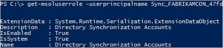

<properties
   pageTitle="Azure AD Connect : Comptes et autorisations | Microsoft Azure"
   description="Cette rubrique décrit les comptes utilisé et créé et les autorisations requises."
   services="active-directory"
   documentationCenter=""
   authors="billmath"
   manager="femila"
   editor=""/>

<tags
   ms.service="active-directory"  
   ms.workload="identity"
   ms.tgt_pltfrm="na"
   ms.devlang="na"
   ms.topic="article"
   ms.date="10/04/2016"
   ms.author="billmath"/>

# Azure AD Connect : Comptes et autorisations
L’Assistant installation Azure AD Connect propose deux différents chemins d’accès :

- Dans les paramètres Express, l’Assistant nécessite davantage de privilèges afin qu’il peut configurer votre configuration facilement, sans avoir à créer des utilisateurs ou configurez des autorisations séparément.

- Dans les paramètres personnalisés, l’Assistant vous offre davantage de choix et d’options, mais il existe certaines situations dans lesquelles vous devez vous assurer que vous disposez des autorisations appropriées vous-même.

## Documentation connexe
Si vous ne pas lire la documentation sur [l’intégration de vos identités locales avec Azure Active Directory](../active-directory-aadconnect.md), le tableau suivant fournit des liens vers des rubriques connexes.

Rubrique |  
--------- | ---------
Installer l’aide des paramètres Express | [Installation rapide de Azure AD Connect](active-directory-aadconnect-get-started-express.md)
Installer l’aide des paramètres personnalisés | [Installation personnalisée de Azure AD Connect](active-directory-aadconnect-get-started-custom.md)
Mise à niveau à partir de la synchronisation d’annuaire | [Mettre à niveau à partir de l’outil de synchronisation Azure Active Directory (DirSync)](active-directory-aadconnect-dirsync-upgrade-get-started.md)

## Paramètres installation rapide
Dans les paramètres Express, l’Assistant installation vous demande des informations d’identification d’administrateur d’entreprise AD DS afin que votre locale d’Active Directory peut être configuré avec des autorisations requises pour Azure AD Connect. Si vous mettez à niveau à partir de la synchronisation d’annuaire, les informations d’identification Administrateurs d’entreprise AD DS sont utilisées pour réinitialiser le mot de passe pour le compte utilisé par la synchronisation d’annuaire. Vous devez également des informations d’identification d’administrateur Global AD Azure.

Page de l’Assistant  | Informations d’identification collectées | Autorisations requises| Utilisé pour
------------- | ------------- |------------- |-------------
N/A|Utilisateur exécutant l’Assistant installation| Administrateur du serveur local| <li>Crée du compte local qui est utilisé comme [compte de service de moteur de synchronisation](#azure-ad-connect-sync-service-account).
Se connecter à Active Directory Azure| Informations d’identification du répertoire AD Azure | Rôle d’administrateur global dans Azure Active Directory | <li>Activation de la synchronisation dans le répertoire Azure AD.</li>  <li>Création du [compte Azure Active Directory](#azure-ad-service-account) qui est utilisé pour les opérations de synchronisation par la suite dans Azure Active Directory.</li>
Se connecter aux services AD DS | Informations d’identification Active Directory local | Membre du groupe Administrateurs d’entreprise (EA) dans Active Directory| <li>Crée un [compte](#active-directory-account) dans Active Directory et qui lui sont accordées. Ce compte est utilisé pour lire et écrire des informations pendant la synchronisation d’annuaire.</li>

### Informations d’identification de l’administrateur de l’entreprise
Ces informations d’identification sont uniquement utilisées pendant l’installation et sont utilisées une fois l’installation terminée. Il est administrateur de l’entreprise et non domaine Admin, pour vous assurer que les autorisations dans Active Directory peuvent être définies dans tous les domaines.

### Informations d’identification d’administrateur globales
Ces informations d’identification sont uniquement utilisées pendant l’installation et ne sont pas utilisées une fois l’installation terminée. Il est utilisé pour créer le [compte Azure AD](#azure-ad-service-account) utilisé pour la synchronisation des modifications à Azure Active Directory. Le compte permet également de synchronisation en tant que fonctionnalité dans Azure Active Directory.

### Autorisations pour les services AD DS créé du compte pour les paramètres express
Le [compte](#active-directory-account) créé pour lire et écrire dans les services AD DS disposer des autorisations suivantes lorsque créés par les paramètres express :

Autorisation | Utilisé pour
---- | ----
<li>Répliquer les modifications de l’annuaire</li><li>Répertoire répliquer toutes les modifications | Synchronisation de mot de passe
En lecture/écriture toutes les propriétés utilisateur | Importer et Exchange hybride
En lecture/écriture toutes les propriétés iNetOrgPerson | Importer et Exchange hybride
En lecture/écriture que toutes les propriétés de groupe | Importer et Exchange hybride
En lecture/écriture que toutes les propriétés des contacts | Importer et Exchange hybride
Réinitialiser votre mot de passe | Préparation de l’activation d’écriture différée de mot de passe

## Installation des paramètres personnalisés
Lorsque vous utilisez des paramètres personnalisés, le compte utilisé pour vous connecter à Active Directory doit être créé avant l’installation. Vous trouverez les autorisations que vous devez accorder à ce compte dans [créer le compte de domaine Active Directory](#create-the-ad-ds-account).

Page de l’Assistant  | Informations d’identification collectées | Autorisations requises| Utilisé pour
------------- | ------------- |------------- |-------------
N/A | Utilisateur exécutant l’Assistant installation|<li>Administrateur du serveur local</li><li>Si vous utilisez un serveur SQL complet, l’utilisateur doit être administrateur système (SA) dans SQL</li>| Par défaut, crée du compte local qui est utilisé comme [compte de service de moteur de synchronisation](#azure-ad-connect-sync-service-account). Le compte est créé uniquement lorsque l’administrateur n’indique pas un compte particulier.
Installez les services de synchronisation, option compte de Service | AD ou informations d’identification du compte utilisateur local | Utilisateur, les autorisations sont accordées par l’Assistant installation | Si l’administrateur spécifie un compte, ce compte est utilisé comme compte de service pour le service de synchronisation.
Se connecter à Active Directory Azure | Informations d’identification du répertoire AD Azure| Rôle d’administrateur global dans Azure Active Directory| <li>Activation de la synchronisation dans le répertoire Azure AD.</li>  <li>Création du [compte Azure Active Directory](#azure-ad-service-account) qui est utilisé pour les opérations de synchronisation par la suite dans Azure Active Directory.</li>
Se connecter vos répertoires | Informations d’identification Active Directory pour chaque forêt qui est connecté à Azure Active Directory local | Les autorisations dépendent quelles fonctionnalités vous activez et vous pouvez trouver dans [un compte créer la AD DS](#create-the-ad-ds-account) |Ce compte est utilisé pour lire et écrire des informations pendant la synchronisation d’annuaire.
AD FS serveurs | Pour chaque serveur dans la liste, l’Assistant recueille des informations d’identification lorsque les informations d’identification d’ouverture de session de l’utilisateur qui exécute l’Assistant ne suffisent pas à vous connecter | Administrateur de domaine | Installation et configuration du rôle de serveur AD FS.
Serveurs proxy d’application Web |Pour chaque serveur dans la liste, l’Assistant recueille des informations d’identification lorsque les informations d’identification d’ouverture de session de l’utilisateur qui exécute l’Assistant ne suffisent pas à vous connecter | Administrateur local sur l’ordinateur cible | Installation et configuration du rôle de serveur WAP.
Informations d’identification de la gestion de la confidentialité proxy |Service de fédération approuver des informations d’identification (les informations d’identification du proxy utilise pour inscrire pour un certificat de gestion de la confidentialité dans le système de fichiers |Compte de domaine qui est un administrateur local du serveur AD FS | Inscription initiale du certificat de gestion de la confidentialité FS WAP.
Page de compte de Service FS AD, « Utiliser une option de compte d’utilisateur domaine » | Informations d’identification du compte AD utilisateur | Utilisateur de domaine | Le compte d’utilisateur AD dont les informations d’identification sont fournies est utilisé comme compte de connexion du service AD FS.

### Créer le compte de domaine Active Directory
Lorsque vous installez Azure AD Connect, le compte que vous spécifiez dans la page **se connecter vos répertoires** doivent être présent dans Active Directory et disposer d’autorisations accordées. L’Assistant installation ne vérifie pas les autorisations et les éventuels problèmes sont disponibles uniquement lors de la synchronisation.

Les autorisations que vous avez besoin dépend des fonctionnalités facultatives activer. Si vous avez plusieurs domaines, les autorisations doivent être accordées pour tous les domaines de la forêt. Si vous n’activez pas une de ces fonctionnalités, les autorisations **Utilisateur du domaine** par défaut sont suffisantes.

Fonctionnalité | Autorisations
------ | ------
Synchronisation de mot de passe | <li>Répliquer les modifications de l’annuaire</li>  <li>Répertoire répliquer toutes les modifications
Déploiement Exchange hybride | Autorisations d’écriture pour les attributs présentées dans [Exchange hybride écriture différée](../active-directory-aadconnectsync-attributes-synchronized.md#exchange-hybrid-writeback) pour les utilisateurs, les groupes et les contacts.
Mot de passe en écriture différée | Autorisations d’écriture pour les attributs présentées dans [prise en main de gestion de mot de passe](../active-directory-passwords-getting-started.md#step-4-set-up-the-appropriate-active-directory-permissions) pour les utilisateurs.
Écriture différée appareil | Autorisations accordées à l’aide d’un script PowerShell comme décrit dans [l’écriture différée appareil](../active-directory-aadconnect-feature-device-writeback.md).
Groupe écriture différée non validée | Lire, créer, mettre à jour et supprimer des objets de groupe dans l’unité d’organisation où les groupes de distribution doivent se trouver.

## Mise à niveau
Lorsque vous mettez à niveau à partir d’une version de Azure AD Connect vers une nouvelle version, vous devez disposer des autorisations suivantes :

Principal | Autorisations requises | Utilisé pour
---- | ---- | ----
Utilisateur exécutant l’Assistant installation | Administrateur du serveur local | Mettre à jour des fichiers binaires.
Utilisateur exécutant l’Assistant installation | Membre de ADSyncAdmins | Apporter des modifications aux règles de synchronisation et autres champs de configuration.
Utilisateur exécutant l’Assistant installation | Si vous utilisez un serveur SQL complè : DBO (ou similaires) de la base de données de moteur de synchronisation | Apporter des modifications au niveau de base de données, telles que la mise à jour de tables avec les nouvelles colonnes.

## En savoir plus sur les comptes créés

### Compte Active Directory
Si vous utilisez les paramètres express, un compte est créé dans Active Directory est utilisé pour la synchronisation. Le compte créé se trouve dans le domaine racine dans le conteneur utilisateurs et a son nom préfixe **MSOL_**. Le compte est créé avec un mot de passe longs et complexe qui n’expire pas. Si vous avez une stratégie de mot de passe de votre domaine, vérifiez que long et mots de passe complexes serait autorisés pour ce compte.

### Comptes de service synchronisation Azure AD Connect
Un compte de service local est créé par l’Assistant installation (sauf si vous spécifiez le compte à utiliser dans les paramètres personnalisés). Le compte est le préfixe **AAD_** et utilisé pour le service de synchronisation réel à exécuter en tant que. Si vous installez Azure AD Connect sur un contrôleur de domaine, le compte est créé dans le domaine. Si vous utilisez un serveur distant exécutant SQL server ou si vous utilisez un serveur proxy qui requiert une authentification, le compte de service **AAD_** doit se trouver dans le domaine.

Le compte est créé avec un mot de passe longs et complexe qui n’expire pas.

Ce compte est utilisé pour stocker les mots de passe pour les autres comptes de façon sécurisée. Ces autres comptes les mots de passe sont stockés chiffrées dans la base de données. Les clés privées pour les clés de chiffrement sont protégés par le chiffrement de clé secrète de services de chiffrement à l’aide de l’API de Protection des données Windows (DPAPI). Vous ne devez pas réinitialiser le mot de passe du compte de service depuis Windows sera destroy puis les clés de chiffrement pour des raisons de sécurité.

Si vous utilisez un serveur SQL complet, le compte de service est le propriétaire de la base de données pour le moteur de synchronisation. Le service ne fonctionnera pas comme prévu avec toutes les autorisations. Une connexion SQL est également créée.

Le compte est également l’autorisation aux fichiers, clés de Registre et autres objets liés au moteur de synchronisation.

### Compte de service Azure Active Directory
Un compte dans Azure Active Directory est créé pour utiliser du service synchronisation. Ce compte peut être identifié par son nom complet.

Le nom du serveur utilisé sur le compte peut être identifié dans la deuxième partie du nom d’utilisateur. Dans l’image, le nom du serveur est FABRIKAMCON. Si vous avez serveurs intermédiaires, chaque serveur possède son propre compte. Il existe une limite de 10 comptes de service de synchronisation dans Azure Active Directory.

Le compte de service est créé avec un mot de passe longs et complexe qui n’expire pas. Il est accordé un rôle spécial **Comptes de synchronisation d’annuaire** qui contient uniquement les autorisations pour effectuer des tâches de synchronisation d’annuaire. Ce rôle intégré spécial ne peuvent pas être accordé en dehors de l’Assistant Azure AD Connect et le portail Azure affiche ce compte avec le rôle **d’utilisateur**.

## Étapes suivantes

En savoir plus sur [l’intégration de vos identités locales avec Azure Active Directory](../active-directory-aadconnect.md).
