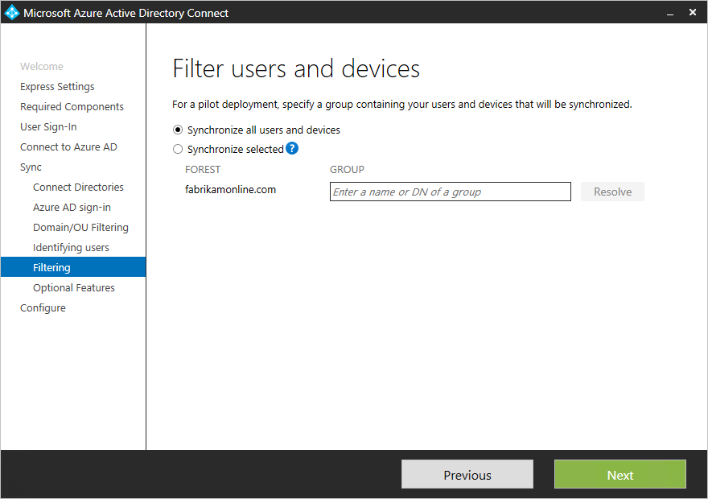
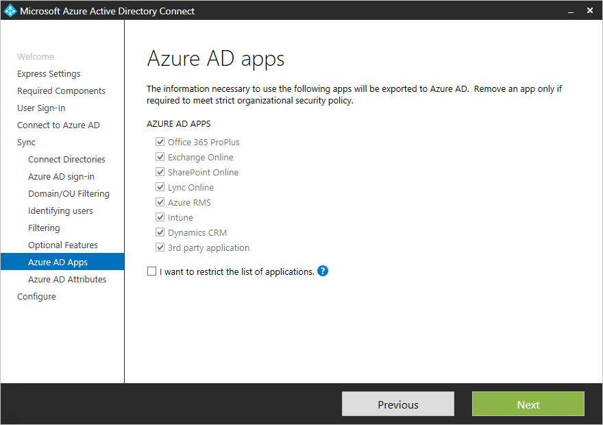
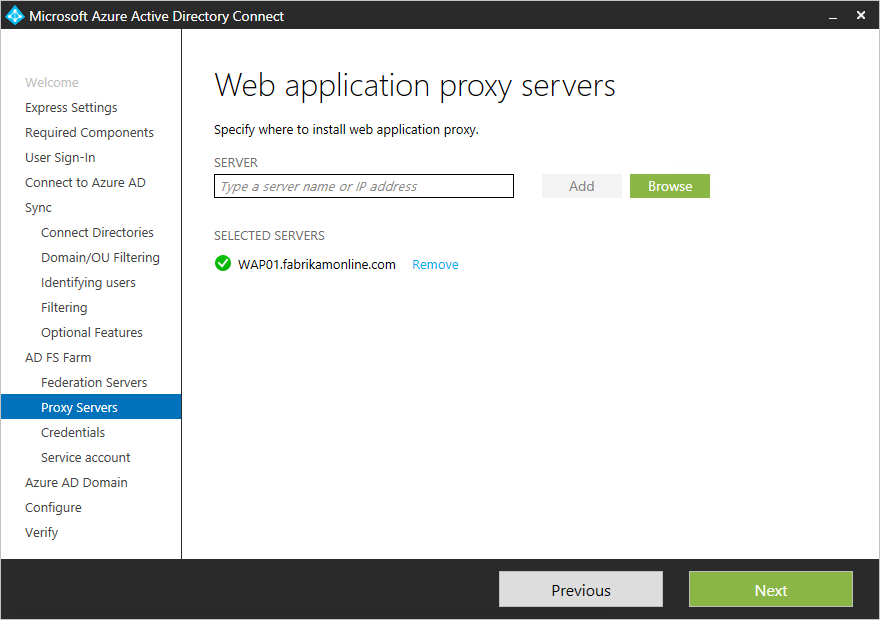
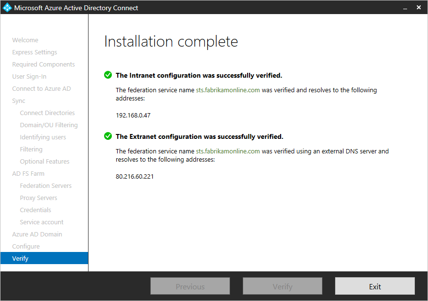

<properties
    pageTitle="Azure AD Connect : Installation personnalisée | Microsoft Azure"
    description="Ce document décrit les options d’installation personnalisée pour Azure AD Connect. Utilisez ces instructions pour installer Active Directory via Azure AD Connect."
    services="active-directory"
    keywords="qu’est Azure AD Connect, installez Active Directory, composants requis pour Azure AD"
    documentationCenter=""
    authors="andkjell"
    manager="femila"
    editor="curtand"/>

<tags
    ms.service="active-directory"  
    ms.workload="identity"
    ms.tgt_pltfrm="na"
    ms.devlang="na"
    ms.topic="get-started-article"
    ms.date="09/13/2016"
    ms.author="billmath"/>

# Installation personnalisée de Azure AD Connect
Azure AD Connect **paramètres personnalisés** est utilisé lorsque vous souhaitez davantage d’options pour l’installation. Il est utilisé si vous avez plusieurs forêts ou si vous voulez configurer les fonctionnalités facultatives ne pas traitées dans l’installation rapide. Il est utilisé dans tous les cas où l’option [**d’installation expresse**](active-directory-aadconnect-get-started-express.md) ne satisfait pas votre déploiement ou la topologie.

Avant de commencer l’installation d’Azure AD Connect, veillez à [Télécharger Azure AD Connect](http://go.microsoft.com/fwlink/?LinkId=615771) et procédure préalable complète dans [Azure AD Connect : matériel et les conditions préalables](../active-directory-aadconnect-prerequisites.md). Assurez-vous également que vous avez des comptes disponibles, comme décrit dans les [autorisations et comptes Azure AD Connect](active-directory-aadconnect-accounts-permissions.md)obligatoires.

Si des paramètres personnalisés ne correspond pas à votre topologie, par exemple, pour mettre à niveau de la synchronisation d’annuaire, consultez la [documentation associée](#related-documentation) pour d’autres scénarios.

## Installation des paramètres personnalisés d’Azure AD Connect

### Paramètres Express
Dans cette page, cliquez sur **Personnaliser** pour démarrer une installation des paramètres personnalisés.

### Installer les composants requis
Lorsque vous installez les services de synchronisation, vous pouvez laisser la section configuration facultatif désactivée et Azure AD Connect configure de tous les éléments automatiquement. Il configure une instance de SQL Server 2012 Express LocalDB, créer des groupes appropriés et attribuer des autorisations. Si vous souhaitez modifier les paramètres par défaut, vous pouvez utiliser le tableau suivant pour mieux comprendre les options de configuration facultatif qui sont disponibles.

Configuration facultative  | Description
------------- | -------------
Utiliser un serveur SQL existant | Permet de spécifier le nom du serveur SQL et le nom de l’instance. Choisissez cette option si vous disposez déjà d’un serveur de base de données que vous voulez utiliser. Entrez le nom de l’instance suivi d’un virgule et numéro de port dans la zone **Nom de l’Instance** si votre serveur SQL Server n’a pas de navigation activée.
Utiliser un compte de service existant | Par défaut Azure AD Connect crée un compte de service local pour les services de synchronisation à utiliser. Le mot de passe est généré automatiquement et inconnu à la personne qui installe Azure AD Connect. Si vous utilisez un serveur SQL distant ou un serveur proxy qui requiert une authentification, vous avez besoin d’un service de compte dans le domaine et connaître le mot de passe. Dans ce cas, entrez le compte de service à utiliser. Vérifiez que l’utilisateur qui exécute l’installation est une association de sécurité dans SQL pour une connexion pour le compte de service peut être créée. Voir les [autorisations et comptes Azure AD Connect](active-directory-aadconnect-accounts-permissions.md#custom-settings-installation)
Spécifiez les groupes de synchronisation personnalisé | Par défaut Azure AD Connect crée quatre groupes local sur le serveur lorsque les services de synchronisation sont installés. Ces groupes sont : groupe Administrateurs, groupe Opérateurs, groupe de parcourir et le groupe de réinitialiser votre mot de passe. Vous pouvez spécifier vos propres groupes ici. Les groupes doivent être locales sur le serveur et ne peut pas être situés dans le domaine.

### Connexion utilisateur
Après avoir installé les composants requis, vous êtes invité à sélectionner vos utilisateurs unique méthode d’authentification. Le tableau suivant fournit une brève description des options disponibles. Pour une description complète des méthodes de connexion, voir [connexion utilisateur](../active-directory-aadconnect-user-signin.md).

Option d’authentification unique | Description
------------- | -------------
Synchronisation de mot de passe | Les utilisateurs peuvent se connecter aux services cloud Microsoft, tels que Office 365, avec le même mot de passe qu’ils utilisent dans leur réseau local. Les mots de passe des utilisateurs sont synchronisés avec Azure AD sous forme de hachage mot de passe et l’authentification s’effectue dans le cloud. Pour plus d’informations, voir [synchronisation de mot de passe](../active-directory-aadconnectsync-implement-password-synchronization.md) .
Fédération avec AD FS | Les utilisateurs peuvent se connecter aux services cloud Microsoft, tels que Office 365, avec le même mot de passe qu’ils utilisent dans leur réseau local.  Les utilisateurs sont redirigés vers leur local AD FS instance pour vous connecter et l’authentification a lieu en local.
N’est pas configuré | Ni fonctionnalité est installée et configurée. Choisissez cette option si vous disposez déjà d’un serveur de fédération 3e partie ou une autre solution existante en place.

### Se connecter à Active Directory Azure
Sur la connexion à l’écran Azure AD, entrez un compte d’administrateur général et un mot de passe. Si vous avez sélectionné **la fédération avec AD FS** de la page précédente, ne vous connectez pas à l’aide d’un compte dans un domaine que vous prévoyez d’activer pour la fédération. Recommandation consiste à utiliser un compte dans le domaine **onmicrosoft.com** par défaut, qui est fourni avec votre annuaire Azure AD.

Ce compte est utilisé uniquement pour créer un compte de service dans Azure Active Directory et n’est pas utilisé une fois l’Assistant terminé.  

Si votre compte d’administrateur général a l’authentification Multifacteur activé, vous devez fournir le mot de passe à nouveau dans la fenêtre contextuelle se connecter et compléter le défi l’authentification Multifacteur. Le défi peut être une fournir un code de vérification ou un appel téléphonique.  

Le compte d’administrateur général peut également comporter de [Gestion des identités dotés de privilèges](../active-directory-privileged-identity-management-getting-started.md) activé.

Si vous recevez un message d’erreur et que vous avez des problèmes de connectivité, consultez [résoudre les problèmes de connectivité](../active-directory-aadconnect-troubleshoot-connectivity.md).

## Pages sous la section synchronisation

### Se connecter vos répertoires
Pour vous connecter à votre Service de domaine Active Directory, Azure AD Connect nécessite les informations d’identification d’un compte disposant des autorisations suffisantes. Vous pouvez entrer la partie domaine au format NetBios ou nom de domaine complet, c'est-à-dire, FABRIKAM\syncuser ou fabrikam.com\syncuser. Ce compte peut être un compte d’utilisateur normal, car il doit uniquement les autorisations de lecture par défaut. Toutefois, en fonction de votre scénario, vous devrez peut-être plus d’autorisations. Pour plus d’informations, voir [les comptes Azure Active Directory se connecter et autorisations](../active-directory-aadconnect-accounts-permissions.md#create-the-ad-ds-account)

### Azure AD connexion configuration
Cette page vous permet de passer en revue les domaines UPN présents dans locaux AD DS et qui ont été vérifié dans Azure Active Directory. Cette page vous permet également de vous permettent de configurer l’attribut à utiliser pour userPrincipalName.

  
Passez en revue chaque domaine signalé **Pas ajouté** et **Non vérifié**. Vérifiez que ces domaines que vous utilisez ont été vérifiées dans Azure Active Directory. Lorsque vous avez vérifié vos domaines, cliquez sur le symbole d’actualisation. Pour plus d’informations, voir [Ajouter et vérifier le domaine](../active-directory-add-domain.md)

**UserPrincipalName** - attribut userPrincipalName est l’attribut personnes utilisent leur système lorsqu’ils se connecter à Active Directory Azure et Office 365. Les domaines utilisés, également connu sous le-suffixe UPN, doivent être vérifiées dans Azure AD avant que les utilisateurs sont synchronisés. Microsoft recommande à garder à l’attribut userPrincipalName par défaut. Si cet attribut est non prenant et ne peut pas être vérifié, il est possible de sélectionner un autre attribut. Vous pouvez par exemple sélectionner messagerie comme l’attribut stockant l’ID de connexion. À l’aide d’un autre attribut à userPrincipalName est appelé **ID secondaire**. La valeur de l’attribut autre ID doit suivre la norme RFC822. Un autre ID peut être utilisé avec la synchronisation de mot de passe et fédération.

>[AZURE.WARNING]
À l’aide d’un autre ID n’est pas compatible avec toutes les charges de travail Office 365. Pour plus d’informations, reportez-vous à [Configuration d’un autre ID de connexion](https://technet.microsoft.com/library/dn659436.aspx).

### Domaine et le filtrage de l’unité d’organisation
Par défaut, tous les domaines et unités d’organisation sont synchronisées. S’il existe certains domaines ou les unités d’organisation que vous ne souhaitez pas synchroniser à Azure Active Directory, vous pouvez annuler la sélection de ces domaines et unités d’organisation.  
 cette page de l’Assistant consiste à configurer filtrage basé sur le domaine. Pour plus d’informations, voir [filtrage basé sur le domaine](../active-directory-aadconnectsync-configure-filtering.md#domain-based-filtering).

Il est également possible que certains domaines ne sont pas accessibles en raison des restrictions de pare-feu. Ces domaines désélectionnés par défaut et ont un avertissement.  
  
Si vous voyez ce message d’avertissement, vérifiez que ces domaines sont bien inaccessibles et l’avertissement est prévu.

### Identifiant de vos utilisateurs
La mise en correspondance entre fonctionnalité forêts permet de définir comment les utilisateurs de votre forêts AD DS sont représentées dans Azure AD. Un utilisateur peut soit représenté qu’une seule fois dans toutes les forêts ou avoir une combinaison de comptes activés et désactivés. L’utilisateur peut également être représenté en tant que contact dans certaines forêts.

Paramètre | Description
------------- | -------------
[Les utilisateurs sont représentés uniquement une fois dans toutes les forêts](../active-directory-aadconnect-topologies.md#multiple-forests-separate-topologies) | Tous les utilisateurs sont créés en tant qu’objets individuels dans Azure Active Directory. Les objets ne sont pas jointes dans le méta-verse.
[Attribut de messagerie](../active-directory-aadconnect-topologies.md#multiple-forests-full-mesh-with-optional-galsync) | Cette option joint utilisateurs et des contacts si l’attribut mail a la même valeur dans différentes forêts. Utilisez cette option lorsque vos contacts ont été créés à l’aide de GALSync.
[ObjectSID et msExchangeMasterAccountSID / msRTCSIP-OriginatorSid](../active-directory-aadconnect-topologies.md#multiple-forests-account-resource-forest) | Cette option permet de joindre un utilisateur activé dans une forêt compte avec un utilisateur désactivé dans une forêt de ressources. Dans Exchange, cette configuration est appelée une boîte aux lettres liée. Cette option peut également être utilisée si vous utilisez uniquement Lync et Exchange ne figure pas dans la forêt de ressources.
sAMAccountName et MailNickName | Cette option joint sous attributs où il est prévu que peut trouver l’ID de connexion pour l’utilisateur.
Un attribut spécifique | Cette option vous permet de sélectionner votre propre attribut. **Limitation :** Veillez à sélectionner un attribut déjà se trouvant dans le méta-verse. Si vous sélectionnez un attribut personnalisé (et non dans le métaverse), il est impossible de terminer l’Assistant.

**Point d’ancrage source** - l’attribut sourceAnchor est un attribut qui est immuable pendant la durée de vie d’un objet utilisateur. Il est la clé primaire liaison de l’utilisateur en local avec l’utilisateur dans Active Directory Azure. Dans la mesure où l’attribut ne peut pas être modifiée, vous devez planifier un attribut bonne à utiliser. Un bon candidat est GUID d’objet. Cet attribut ne change pas, à moins que le compte d’utilisateur est déplacé entre forêts/domaines. Dans un environnement multi-forêt où vous déplacez des comptes entre forêts, un autre attribut doit être utilisé, par exemple un attribut avec employeeID. Évitez les attributs qui seraient changement en cas d’une personne phares ou modifier les affectations. Vous ne pouvez pas utiliser les attributs avec un @-sign, afin de la messagerie électronique et userPrincipalName ne peuvent pas être utilisés. L’attribut respecte la casse lorsque vous déplacez un objet entre forêts, vérifiez que préserver la casse supérieur/inférieur. Attributs binaires sont codé en base 64, mais d’autres types d’attribut restent dans son état non codée. Dans les scénarios de fédération et certaines interfaces Azure AD, cet attribut est également connue sous immutableID. Vous trouverez plus d’informations sur le point d’ancrage source dans les [concepts de conception](../active-directory-aadconnect-design-concepts.md#sourceAnchor).

### Synchronisation filtrage en fonction des groupes
Le filtrage fonctionnalité groupes vous permet de synchroniser uniquement un sous-ensemble d’objets pour un pilote. Pour utiliser cette fonctionnalité, créez un groupe à cet effet dans Active Directory local. Ajoutez les utilisateurs et groupes qui doivent être synchronisés à Azure AD en tant que membres directs. Vous pouvez ultérieurement ajouter et supprimer des utilisateurs à ce groupe pour mettre à jour la liste des objets qui doivent être présents dans Azure Active Directory. Tous les objets que vous voulez synchroniser doivent être un membre du groupe direct. Les utilisateurs, des groupes, des contacts et des ordinateurs/appareils doivent être tous membres directs. Membres de groupes imbriqués n’est pas résolu. Lorsque vous ajoutez un groupe comme un membre, seul le groupe lui-même est ajouté et pas ses membres.

>[AZURE.WARNING]
Cette fonctionnalité est uniquement destinée à prendre en charge un déploiement pilote. N’utilisez pas dans un déploiement de production complet.

Dans un déploiement de production complet, il va difficiles à mettre à jour un seul groupe avec tous les objets à synchroniser. À la place vous devez utiliser une des méthodes de [filtrage de configurer](../active-directory-aadconnectsync-configure-filtering.md).

### Fonctionnalités facultatives
Cet écran vous permet de sélectionner les fonctionnalités facultatives pour votre des scénarios spécifiques.

>[AZURE.WARNING]
Si vous avez actuellement DirSync ou Azure active la synchronisation Active Directory, n’activez pas les fonctionnalités d’écriture différée dans Azure AD Connect.

Fonctionnalités facultatives | Description
------------------- | -------------
Déploiement Exchange hybride | La fonctionnalité de déploiement Exchange hybride permet l’existence de co-création de boîtes aux lettres Exchange à la fois en local et dans Office 365. Azure AD Connect synchronise un ensemble spécifique d' [attributs](../active-directory-aadconnectsync-attributes-synchronized.md#exchange-hybrid-writeback) à partir d’Azure AD dans votre annuaire local.
Azure AD application et le filtrage de l’attribut | En activant application Azure AD et le filtrage de l’attribut, l’ensemble des attributs synchronisés peut être adapté. Cette option ajoute des deux autres pages de configuration pour l’Assistant. Pour plus d’informations, voir [application Azure AD et le filtrage de l’attribut](#azure-ad-app-and-attribute-filtering).
Synchronisation de mot de passe | Si vous avez sélectionné la fédération comme la solution de connexion, vous pouvez activer cette option. Synchronisation de mot de passe, peut être utilisée comme option de sauvegarde. Pour plus d’informations, voir [synchronisation de mot de passe](../active-directory-aadconnectsync-implement-password-synchronization.md).
Mot de passe en écriture différée | En activant le mot de passe d’écriture différée, les modifications de mot de passe qui proviennent Azure AD écrit revenir à votre annuaire local. Pour plus d’informations, voir [prise en main de gestion de mot de passe](../active-directory-passwords-getting-started.md).
Groupe écriture différée non validée | Si vous utilisez la fonctionnalité **Groupes Office 365** , vous pouvez avoir ces groupes représentés dans Active Directory local. Cette option est uniquement disponible si vous avez Exchange présents dans vos locaux Active Directory. Pour plus d’informations, consultez [écriture différée du groupe](../active-directory-aadconnect-feature-preview.md#group-writeback).
Écriture différée appareil | Permet aux objets de périphérique d’écriture différée dans Azure AD à votre locale d’Active Directory pour les scénarios d’accès conditionnel. Pour plus d’informations, voir [activation de l’écriture différée de périphérique dans Azure AD Connect](../active-directory-aadconnect-feature-device-writeback.md).
Synchronisation d’annuaires extension attribut | En activant la synchronisation d’annuaires extensions attribut, attributs spécifiés sont synchronisés avec Azure AD. Pour plus d’informations, voir [extensions Directory](../active-directory-aadconnectsync-feature-directory-extensions.md).

### Azure AD application et le filtrage de l’attribut
Si vous voulez limiter les attributs à synchroniser avec Azure AD, puis commencez par sélectionner les services que vous utilisez. Si vous apportez des modifications à la configuration de cette page, un nouveau service doit être activée explicitement en relançant l’Assistant installation.

Basé sur les services sélectionnés à l’étape précédente, cette page affiche tous les attributs qui sont synchronisés. Cette liste est une combinaison de tous les types d’objets en cours de synchronisation. S’il existe certains attributs particuliers, que vous avez besoin de ne pas synchroniser, vous pouvez annuler la sélection de ces attributs.

>[AZURE.WARNING]
Suppression d’attributs peut avoir un impact sur fonctionnalité. Pour les meilleures pratiques et recommandations, voir [les attributs synchronisés](../active-directory-aadconnectsync-attributes-synchronized.md#attributes-to-synchronize).

### Synchronisation d’annuaires Extension attribut
Vous pouvez étendre le schéma dans Azure Active Directory avec des attributs personnalisés ajoutés par votre organisation ou d’autres attributs dans Active Directory. Pour utiliser cette fonctionnalité, sélectionnez **Extension Directory attribut synchroniser** dans la page **Fonctionnalités facultatives** . Vous pouvez sélectionner plusieurs attributs à synchroniser dans cette page.

Pour plus d’informations, voir [extensions Directory](../active-directory-aadconnectsync-feature-directory-extensions.md).

## Configuration de la fédération avec AD FS
Configuration d’AD FS avec Azure AD Connect est simple en quelques clics. Les éléments suivants sont requise avant la configuration.

- Un serveur Windows Server 2012 R2 pour le serveur de fédération avec gestion à distance activé
- Un serveur Windows Server 2012 R2 pour le serveur Proxy de l’Application Web avec gestion à distance activé
- Un certificat SSL pour le nom de service de fédération vous envisagez d’utiliser (par exemple sts.contoso.com)

### AD FS configuration conditions préalables
Pour configurer votre batterie de serveurs AD FS à l’aide d’Azure AD Connect, vérifiez que WinRM est activé sur les serveurs à distance. En outre, passez en revue la configuration minimale requise de ports répertoriée dans le [tableau 3 - Azure AD Connect et les serveurs de fédération/WAP](../active-directory-aadconnect-ports.md#table-3---azure-ad-connect-and-federation-serverswap).

### Créer une batterie AD FS ou utiliser une batterie AD FS existante
Vous pouvez utiliser une batterie AD FS existante ou vous pouvez choisir de créer une batterie AD FS. Si vous choisissez de créer un autre, vous devez indiquer le certificat SSL. Si le certificat SSL est protégé par un mot de passe, vous êtes invité au mot de passe.

Si vous choisissez d’utiliser une batterie AD FS existante, vous accédez directement à la configuration de la relation d’approbation entre écran AD FS et Azure AD.

### Spécifier les serveurs AD FS
Entrez les serveurs que vous voulez installer AD FS sur. Vous pouvez ajouter un ou plusieurs serveurs en fonction des besoins de planification de la capacité. Participer à tous les serveurs à Active Directory avant d’effectuer cette configuration. Microsoft recommande l’installation d’un serveur AD FS unique pour les déploiements de test et pilote. Ajoutez ensuite et déployer des serveurs plus pour répondre à vos besoins de mise à l’échelle en exécutant Azure AD Connect après la configuration initiale.

>[AZURE.NOTE]
Assurez-vous que tous vos serveurs font parties d’un domaine AD avant d’effectuer cette configuration.

### Spécifier les serveurs Proxy de l’Application Web
Entrez les serveurs de votre choix sous forme de vos serveurs proxy d’Application Web. Le serveur proxy d’application web est déployé dans votre DMZ (public extranet) et prend en charge les demandes d’authentification de l’extranet. Vous pouvez ajouter un ou plusieurs serveurs en fonction des besoins de planification de la capacité. Microsoft recommande l’installation d’un serveur proxy d’applications Web unique pour les déploiements de test et pilote. Ajoutez ensuite et déployer des serveurs plus pour répondre à vos besoins de mise à l’échelle en exécutant Azure AD Connect après la configuration initiale. Nous vous recommandons d’avoir un nombre équivalent de serveurs proxy pour répondre à l’authentification à partir de l’intranet.

>[AZURE.NOTE]
<li> Si le compte que vous utilisez n’est pas un administrateur local sur les serveurs AD FS, vous êtes invité aux informations d’identification d’administration.</li>
<li> Assurez-vous qu’il existe une connectivité HTTP/HTTPS entre le serveur Azure AD Connect et le serveur Proxy de l’Application Web avant d’exécuter cette étape.</li>
<li> Vérifiez que la connectivité HTTP/HTTPS entre le serveur d’applications Web et le serveur AD FS pour permettre les demandes d’authentification circuler est.</li>

Vous êtes invité à entrer les informations d’identification afin que le serveur d’applications web peut établir une connexion sécurisée avec le serveur AD FS. Ces informations d’identification doivent être un administrateur local sur le serveur AD FS.

### Spécifier le compte de service pour le service AD FS
Le service AD FS requiert un compte de service de domaine pour l’authentification des utilisateurs et des informations utilisateur de recherche dans Active Directory. Il peut prendre en charge les deux types de comptes de service :

- **Groupe géré compte de Service** , ainsi que dans les Services de domaine Active Directory avec Windows Server 2012. Ce type de compte fournit des services, tels que AD FS, un seul compte sans avoir besoin de mettre à jour régulièrement le mot de passe du compte. Utilisez cette option si vous avez déjà Windows Server 2012 superflus dans le domaine appartenant à vos serveurs AD FS.
- **Compte d’utilisateur de domaine** - ce type de compte, vous devez fournir un mot de passe et mettre à jour régulièrement le mot de passe lorsque le mot de passe change ou arrive à expiration. Utilisez cette option uniquement lorsque vous n’avez pas de domaine Windows Server 2012 dans le domaine appartenant à vos serveurs AD FS.

Si vous avez sélectionné groupe géré un compte de Service et que cette fonctionnalité n’a jamais été utilisée dans Active Directory, vous êtes invité à des informations d’identification de l’administrateur de l’entreprise. Ces informations sont utilisées pour lancer le magasin de clés et activer la fonctionnalité dans Active Directory.

### Sélectionnez le domaine AD Azure que vous souhaitez établir une fédération
Cette configuration est utilisée pour installer la relation de fédération entre AD FS et Azure AD. Il configure AD FS à problème des jetons de sécurité à Azure AD ainsi Azure AD pour faire confiance les jetons à partir de cette instance spécifique AD FS. Cette page vous permet uniquement configurer un domaine unique dans l’installation initiale. Vous pouvez configurer des domaines ultérieurement en relançant Azure AD Connect.

### Vérifier le domaine AD Azure sélectionné pour la fédération
Lorsque vous sélectionnez le domaine à être fédéré, Azure AD Connect vous fournit les informations nécessaires pour vérifier un domaine non vérifié. Voir [Ajouter et vérifier le domaine](../active-directory-add-domain.md) pour savoir comment utiliser ces informations.

>[AZURE.NOTE]
AD Connect tente de vérifier le domaine lors de l’étape de configuration. Si vous continuez à configurer sans l’ajouter les enregistrements DNS nécessaires, l’Assistant n’est pas en mesure de terminer la configuration.

## Configurer et vérifier les pages
La configuration se produit sur cette page.

>[AZURE.NOTE]
Avant de poursuivre l’installation et si vous avez configuré la fédération, assurez-vous que vous avez configuré la [résolution de noms pour les serveurs de fédération](../active-directory-aadconnect-prerequisites.md#name-resolution-for-federation-servers).

### Mode de mise en attente
Il est possible de configurer un nouveau serveur de synchronisation en parallèle avec le mode de mise en attente. Il est uniquement prise en charge pour disposer d’un serveur de synchronisation de l’exportation vers un répertoire dans le cloud. Mais si vous souhaitez déplacer d’un autre serveur, par exemple une synchronisation d’annuaire en cours d’exécution, vous pouvez activer Azure AD Connect dans le mode de mise en attente. Lorsque activé, le moteur de synchronisation importer et synchroniser des données comme d’habitude, mais il n’est pas rien exporte vers Azure AD ou AD. Le fonctionnalités mot de passe synchronisation et mot de passe en écriture différée sont désactivés lorsque vous êtes en mode de mise en attente.

En mode mise en attente, il est possible d’apporter les modifications nécessaires au moteur de synchronisation et passez en revue ce qui doit être exporté. Lorsque la configuration de test vous convient, réexécutez l’Assistant installation et désactiver le mode de mise en attente. Données sont maintenant exportées vers Azure Active Directory de ce serveur. Veillez à désactiver l’autre serveur en même temps ainsi qu’un seul serveur activement consiste à exporter.

Pour plus d’informations, voir [mode de mise en attente](../active-directory-aadconnectsync-operations.md#staging-mode).

### Vérifier la configuration de la fédération
Azure AD Connect vérifie les paramètres DNS pour vous lorsque vous cliquez sur le bouton vérifier.

En outre, effectuez les vérifications suivantes :

- Valider que vous pouvez vous connecter à partir d’un navigateur à partir d’un ordinateur joints de domaine sur l’intranet : se connecter à https://myapps.microsoft.com et vérifiez que la connexion avec votre compte connecté. Le compte d’administrateur AD DS n’est pas synchronisé et ne peuvent pas être utilisé pour la vérification.
- Valider que vous pouvez vous connecter à partir d’un appareil à partir de l’extranet. Sur un ordinateur personnel ou un appareil mobile, vous connecter à https://myapps.microsoft.com et fournir vos informations d’identification.
- Valider connexion client étendu. Se connecter à https://testconnectivity.microsoft.com, choisissez l’onglet **Office 365** , puis sélectionnez le **Office 365 authentification Test unique**.

## Étapes suivantes
Une fois l’installation terminée, déconnectez et vous reconnecter à Windows avant d’utiliser le Gestionnaire de Service de synchronisation ou de l’éditeur de règle de synchronisation.

Maintenant que vous avez Azure AD Connect installé, vous pouvez [vérifier l’installation et attribuer des licences](../active-directory-aadconnect-whats-next.md).

En savoir plus sur ces fonctionnalités, qui ont été activées avec l’installation : [pas accidentelle de suppression](../active-directory-aadconnectsync-feature-prevent-accidental-deletes.md) et [La santé Azure AD se connecter](../active-directory-aadconnect-health-sync.md).

En savoir plus sur ces sujets courants : [Planificateur et comment déclencher synchronisation](../active-directory-aadconnectsync-feature-scheduler.md).

En savoir plus sur [l’intégration de vos identités locales avec Azure Active Directory](../active-directory-aadconnect.md).

## Documentation connexe

Rubrique |  
--------- | ---------
Vue d’ensemble de Azure AD Connect | [Intégration de vos identités locales avec Azure Active Directory](../active-directory-aadconnect.md)
Installer l’aide des paramètres Express | [Installation rapide de Azure AD Connect](active-directory-aadconnect-get-started-express.md)
Mise à niveau à partir de la synchronisation d’annuaire | [Mettre à niveau à partir de l’outil de synchronisation Azure Active Directory (DirSync)](active-directory-aadconnect-dirsync-upgrade-get-started.md)
Comptes utilisés pour l’installation | [En savoir plus sur les autorisations et comptes Azure AD Connect](active-directory-aadconnect-accounts-permissions.md)
