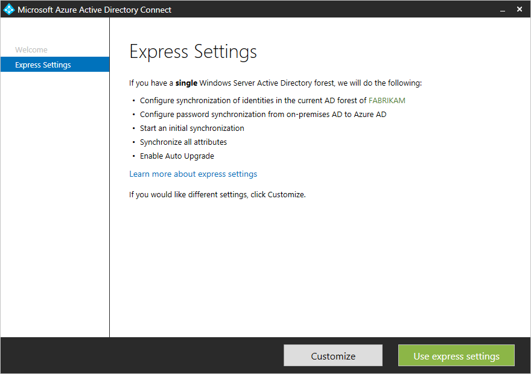
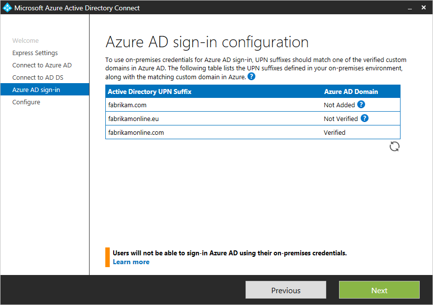

<properties
    pageTitle="Azure AD Connect : Premiers pas à l’aide de paramètres express | Microsoft Azure"
    description="Découvrez comment télécharger, installer et exécuter l’Assistant de configuration pour Azure AD Connect."
    services="active-directory"
    documentationCenter=""
    authors="andkjell"
    manager="femila"
    editor="curtand"/>

<tags
    ms.service="active-directory"
    ms.workload="identity"
    ms.tgt_pltfrm="na"
    ms.devlang="na"
    ms.topic="get-started-article"
    ms.date="09/13/2016"
    ms.author="billmath"/>

# Prise en main Azure AD Connect à l’aide de paramètres express
Azure AD Connect **Configuration rapide** est utilisé lorsque vous avez une topologie de forêt unique et la [synchronisation de mot de passe](../active-directory-aadconnectsync-implement-password-synchronization.md) pour l’authentification. **Configuration rapide** est l’option par défaut et est utilisé pour le scénario plus couramment déployé. Vous êtes uniquement quelques clics courte absent (e) pour étendre votre annuaire local dans le cloud.

Avant de commencer l’installation d’Azure AD Connect, veillez à [Télécharger Azure AD Connect](http://go.microsoft.com/fwlink/?LinkId=615771) et procédure préalable complète dans [Azure AD Connect : matériel et les conditions préalables](../active-directory-aadconnect-prerequisites.md).

Si les paramètres express ne correspond pas à votre topologie, voir la [documentation connexe](#related-documentation) pour d’autres scénarios.

## Installation rapide de Azure AD Connect
Vous pouvez voir ces étapes en action dans la section de [vidéos](#videos) .

1. Se connecter en tant qu’un administrateur local sur le serveur que vous souhaitez installer Azure AD Connect sur. Vous devez faire ceci sur le serveur que vous souhaitez être le serveur de synchronisation.
2. Accédez à et double-cliquez sur **AzureADConnect.msi**.
3. Sur l’écran d’accueil, activez la case J’accepte les termes de licence, puis cliquez sur **Continuer**.  
4. Dans l’écran Paramètres Express, cliquez sur **utiliser les paramètres express**.  

5. Sur la connexion à l’écran Azure AD, entrez le nom d’utilisateur et mot de passe d’un administrateur global pour votre annonce Azure. Cliquez sur **suivant**.  
 si vous recevez un message d’erreur et que vous avez des problèmes de connectivité, consultez [résoudre les problèmes de connectivité](../active-directory-aadconnect-troubleshoot-connectivity.md).
6. Sur la connexion à l’écran AD DS, entrez le nom d’utilisateur et mot de passe pour un compte d’administrateur entreprise. Vous pouvez entrer la partie domaine au format NetBios ou FQDN, c'est-à-dire FABRIKAM\administrator ou fabrikam.com\administrator. Cliquez sur **suivant**.  

7. La page [**configuration de connexion Azure AD**](../active-directory-aadconnect-user-signin.md#azure-ad-sign-in-configuration) affiche uniquement si vous n’avez pas terminé de [vérifier vos domaines](../active-directory-add-domain.md) dans les [conditions préalables](../active-directory-aadconnect-prerequisites.md).
  
Si vous voyez cette page, puis passez en revue chaque domaine signalé **Pas ajouté** et **Non vérifié**. Vérifiez que ces domaines que vous utilisez ont été vérifiées dans Azure Active Directory. Lorsque vous avez vérifié vos domaines, cliquez sur le symbole d’actualisation.
8. Dans l’êtes-vous prêt à configurer l’écran, cliquez sur **installer**.
    - Vous pouvez également sur prêt pour configurer la page, vous pouvez désélectionner la case à cocher **Démarrer le processus de synchronisation dès la configuration est terminée** . Vous devez désélectionner cette case à cocher si vous souhaitez effectuer une configuration supplémentaire, telles que le [filtrage](../active-directory-aadconnectsync-configure-filtering.md). Si vous désactivez cette option, l’Assistant configure synchronisation mais laisse le planificateur désactivé. Il ne s’exécute pas jusqu'à ce que vous l’activer manuellement en [relançant l’Assistant installation](../active-directory-aadconnectsync-installation-wizard.md).
    - Si vous avez Exchange dans Active Directory local, vous avez également une option pour activer [**le déploiement Exchange hybride**](https://technet.microsoft.com/library/jj200581.aspx). Activez cette option si vous voulez que les boîtes aux lettres Exchange à la fois dans le cloud et local en même temps.

9. Une fois l’installation terminée, cliquez sur **Quitter**.
10. Une fois l’installation terminée, vous déconnecter et vous reconnecter avant d’utiliser le Gestionnaire de Service de synchronisation ou de l’éditeur de règle de synchronisation.

## Vidéos

Pour une vidéo sur l’utilisation de l’installation rapide, voir :

>[AZURE.VIDEO azure-active-directory-connect-express-settings]

## Étapes suivantes
Maintenant que vous avez Azure AD Connect installé, vous pouvez [vérifier l’installation et attribuer des licences](../active-directory-aadconnect-whats-next.md).

En savoir plus sur ces fonctionnalités, qui ont été activées avec l’installation : [mise à niveau automatique](../active-directory-aadconnect-feature-automatic-upgrade.md), [empêcher accidentel supprime](../active-directory-aadconnectsync-feature-prevent-accidental-deletes.md)et [La santé Azure AD se connecter](../active-directory-aadconnect-health-sync.md).

En savoir plus sur ces sujets courants : [Planificateur et comment déclencher synchronisation](../active-directory-aadconnectsync-feature-scheduler.md).

En savoir plus sur [l’intégration de vos identités locales avec Azure Active Directory](../active-directory-aadconnect.md).

## Documentation connexe

Rubrique |  
--------- | ---------
Vue d’ensemble de Azure AD Connect | [Intégration de vos identités locales avec Azure Active Directory](../active-directory-aadconnect.md)
Installer à l’aide des paramètres personnalisés | [Installation personnalisée de Azure AD Connect](active-directory-aadconnect-get-started-custom.md)
Mise à niveau à partir de la synchronisation d’annuaire | [Mettre à niveau à partir de l’outil de synchronisation Azure Active Directory (DirSync)](active-directory-aadconnect-dirsync-upgrade-get-started.md)
Comptes utilisés pour l’installation | [En savoir plus sur les autorisations et comptes Azure AD Connect](active-directory-aadconnect-accounts-permissions.md)
