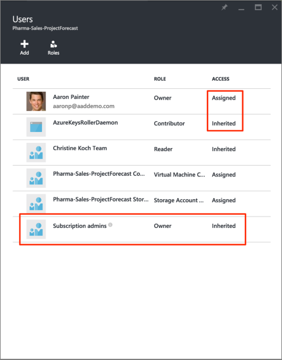
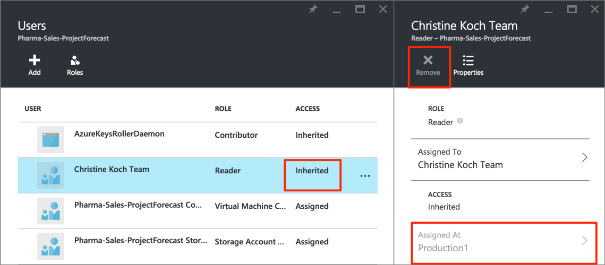

<properties
    pageTitle="Utiliser le contrôle d’accès basé sur un rôle dans le portail Azure | Microsoft Azure"
    description="Prise en main de gestion de l’accès contrôle d’accès basé sur un rôle dans le portail Azure. Attributions de rôle permet d’affecter des autorisations à vos ressources."
    services="active-directory"
    documentationCenter=""
    authors="kgremban"
    manager="femila"
    editor=""/>

<tags
    ms.service="active-directory"
    ms.devlang="na"
    ms.topic="get-started-article"
    ms.tgt_pltfrm="na"
    ms.workload="identity"
    ms.date="10/10/2016"
    ms.author="kgremban"/>

# Utiliser les affectations de rôle pour gérer l’accès à vos ressources abonnement Azure

> [AZURE.SELECTOR]
- [Gérer l’accès par utilisateur ou groupe](role-based-access-control-manage-assignments.md)
- [Gérer l’accès par ressource](role-based-access-control-configure.md)

Azure contrôle d’accès basé sur un rôle (RBAC) permet de gestion des permissions d’accès pour Azure. L’utilisation de RBAC, vous pouvez accorder uniquement la quantité d’accès que les utilisateurs ont besoin pour effectuer leur travail. Cet article vous aide à être opérationnel avec RBAC dans le portail Azure. Si vous souhaitez obtenir plus d’informations sur la façon dont RBAC vous permet de gérer l’accès, voir [qu’est le contrôle d’accès basé sur un rôle](role-based-access-control-what-is.md).

## Accès à l’affichage
Vous pouvez voir qui a accès à une ressource, un groupe de ressources ou un abonnement à partir de sa carte principale dans le [portail Azure](https://portal.azure.com). Par exemple, nous voulons voir qui a accès à un de nos groupes ressource :

1. Sélectionnez les **groupes de ressources** dans la barre de navigation gauche.  
    
2. Sélectionnez le nom du groupe de ressources à partir de la carte de **groupes de ressources** .
3. Sélectionnez **le contrôle d’accès (IAM)** dans le menu de gauche.  
4. La carte de contrôle d’accès répertorie tous les utilisateurs, les groupes et les applications qui ont accès au groupe de ressources.  

    

Notez que certains utilisateurs ont été **attribuées** accédez-y tandis que d’autres **hérité** . Access est affecté spécifiquement au groupe de ressources ou héritées d’une affectation à l’abonnement parent.

> [AZURE.NOTE] Les administrateurs abonnement classique et coadministrateurs sont considérés comme propriétaires de l’abonnement dans le nouveau modèle RBAC.

## Ajout de l’accès
Vous accordez un accès d’au sein de la ressource, le groupe de ressources ou l’abonnement est la portée de l’attribution de rôle.

1. Sur la carte de contrôle d’accès, sélectionnez **Ajouter** .  
2. Sélectionnez le rôle que vous souhaitez attribuer à partir de la carte de **Sélectionner un rôle** .
3. Sélectionnez l’utilisateur, un groupe ou une application dans votre annuaire que vous souhaitez accorder l’accès à. Vous pouvez rechercher le répertoire avec les noms d’affichage, les adresses de messagerie et les identificateurs d’objet.  

    

4. Sélectionnez **OK** pour créer le devoir. La fenêtre contextuelle **Ajout utilisateur** effectue le suivi de l’avancement.  
    

Après avoir ajouté avec succès une attribution de rôle, il apparaît sur la carte **d’utilisateurs** .

## Supprimer l’accès

1. Sélectionnez l’attribution de rôle sur la carte de contrôle d’accès.
2. Dans la carte de détails d’affectation, sélectionnez **Supprimer** .  
3. Sélectionnez **Oui** pour confirmer la suppression.  
    

Affectations héritées ne peuvent pas être supprimées. Dans l’image ci-dessous, notez que le bouton Supprimer est grisé. Au lieu de cela, observez les détails **Affectées à** . Accédez à la ressource répertoriée pour supprimer l’attribution de rôle.

## Autres outils pour gérer l’accès
Vous pouvez attribuer des rôles et gérer l’accès avec des commandes dans les outils autre que le portail Azure Azure RBAC.  Suivez les liens pour en savoir plus sur les conditions préalables et commencer à utiliser les commandes RBAC Azure.

- [PowerShell Azure](role-based-access-control-manage-access-powershell.md)
- [Interface de ligne de commande Azure](role-based-access-control-manage-access-azure-cli.md)
- [API REST](role-based-access-control-manage-access-rest.md)

## Étapes suivantes
- [Créer un rapport de l’historique des modifications access](role-based-access-control-access-change-history-report.md)
- Voir les [rôles intégrés RBAC](role-based-access-built-in-roles.md)
- Définir vos propres [rôles personnalisés dans Azure RBAC](role-based-access-control-custom-roles.md)
