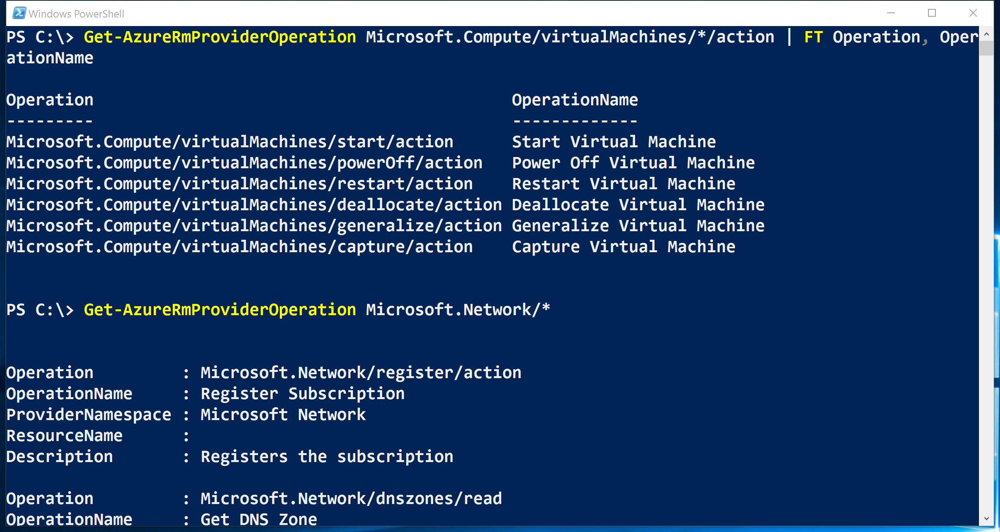

<properties
    pageTitle="Rôles personnalisés dans Azure RBAC | Microsoft Azure"
    description="Découvrez comment définir des rôles personnalisés avec un contrôle d’accès Azure Role-Based pour la gestion des identités plus précise dans votre abonnement Azure."
    services="active-directory"
    documentationCenter=""
    authors="kgremban"
    manager="kgremban"
    editor=""/>

<tags
    ms.service="active-directory"
    ms.devlang="na"
    ms.topic="article"
    ms.tgt_pltfrm="na"
    ms.workload="identity"
    ms.date="07/25/2016"
    ms.author="kgremban"/>


# <a name="custom-roles-in-azure-rbac"></a>Rôles personnalisés dans RBAC Azure


Créer un rôle personnalisé dans le contrôle d’accès d’Azure Role-Based (RBAC) si aucun des rôles intégrés à vos besoins d’accès spécifique. Rôles personnalisés peuvent être créés à l’aide de [PowerShell Azure](role-based-access-control-manage-access-powershell.md)et de [Azure de ligne de commande Interface](role-based-access-control-manage-access-azure-cli.md) de l' [API REST](role-based-access-control-manage-access-rest.md). Tout comme les rôles intégrés, rôles personnalisés peuvent être affectées à des utilisateurs, groupes et applications en abonnement, groupe de ressources et portées de ressource. Rôles personnalisés sont stockées dans un client Azure AD et peuvent être partagées entre tous les abonnements qui utilisent ce client que le répertoire Azure AD pour l’abonnement.

Voici un exemple d’un rôle personnalisé pour la surveillance et le redémarrage machines virtuelles :

```
{
  "Name": "Virtual Machine Operator",
  "Id": "cadb4a5a-4e7a-47be-84db-05cad13b6769",
  "IsCustom": true,
  "Description": "Can monitor and restart virtual machines.",
  "Actions": [
    "Microsoft.Storage/*/read",
    "Microsoft.Network/*/read",
    "Microsoft.Compute/*/read",
    "Microsoft.Compute/virtualMachines/start/action",
    "Microsoft.Compute/virtualMachines/restart/action",
    "Microsoft.Authorization/*/read",
    "Microsoft.Resources/subscriptions/resourceGroups/read",
    "Microsoft.Insights/alertRules/*",
    "Microsoft.Insights/diagnosticSettings/*",
    "Microsoft.Support/*"
  ],
  "NotActions": [

  ],
  "AssignableScopes": [
    "/subscriptions/c276fc76-9cd4-44c9-99a7-4fd71546436e",
    "/subscriptions/e91d47c4-76f3-4271-a796-21b4ecfe3624",
    "/subscriptions/34370e90-ac4a-4bf9-821f-85eeedeae1a2"
  ]
}
```
## <a name="actions"></a>Actions
La propriété **Actions** d’un rôle personnalisé spécifie les opérations Azure auquel le rôle accorde l’accès. Il s’agit d’un ensemble de chaînes opération qui identifient les opérations sécurisables de fournisseurs de ressources Azure. Chaînes opération qui contiennent des caractères génériques (\*) accorder l’accès à toutes les opérations qui correspondent à la chaîne d’opération. Par exemple :

-   `*/read`accorde l’accès aux opérations de lecture pour tous les types de ressources de tous les fournisseurs de ressources Azure.
-   `Microsoft.Network/*/read`accorde l’accès aux opérations de lecture pour tous les types de ressources dans le fournisseur de ressources Microsoft.Network d’Azure.
-   `Microsoft.Compute/virtualMachines/*`accorde l’accès à toutes les opérations de machines virtuelles et ses enfants types de ressources.
-   `Microsoft.Web/sites/restart/Action`accorde l’accès à redémarrer des sites Web.

Utiliser `Get-AzureRmProviderOperation` (dans PowerShell) ou `azure provider operations show` (dans Azure infrastructure du langage commun) à des opérations de liste de fournisseurs de ressources Azure. Vous pouvez également utiliser ces commandes pour vérifier qu’une chaîne opération est valide et pour développer des chaînes opération génériques.

```
Get-AzureRMProviderOperation Microsoft.Compute/virtualMachines/*/action | FT Operation, OperationName

Get-AzureRMProviderOperation Microsoft.Network/*
```



```
azure provider operations show "Microsoft.Compute/virtualMachines/*/action" --js on | jq '.[] | .operation'

azure provider operations show "Microsoft.Network/*"
```


## <a name="notactions"></a>NotActions
Utilisez la propriété **NotActions** si l’ensemble des opérations que vous souhaitez autoriser n’est plus facilement définie en excluant des opérations restreintes. L’accès accordé par un rôle personnalisé est calculée en soustrayant les opérations **NotActions** parmi les opérations **d’Actions** .

> [AZURE.NOTE] Si un utilisateur est affecté un rôle qui exclut une opération de **NotActions**et est attribué un second rôle qui autorise l’accès à la même opération, l’utilisateur pourra pour effectuer cette opération. **NotActions** n’est pas une règle de refus : il s’agit simplement un moyen pratique pour créer un jeu d’opérations autorisées lorsque des opérations spécifiques devront être exclues.

## <a name="assignablescopes"></a>AssignableScopes
La propriété **AssignableScopes** du rôle personnalisé spécifie les portées (abonnements, groupes de ressources ou ressources) au sein duquel le rôle personnalisé est disponible pour l’affectation. Vous pouvez apporter le rôle personnalisé disponibles pour l’affectation dans uniquement les abonnements ou les groupes de ressources qui en ont besoin et pas de courrier basse priorité expérience utilisateur pour le reste des abonnements ou des groupes de ressources.

Voici quelques exemples des étendues être assignés valides :

-   « / abonnements/c276fc76-9cd4-44c9-99a7-4fd71546436e », « / abonnements/e91d47c4-76f3-4271-a796-21b4ecfe3624 » - rend le rôle disponibles pour une affectation de dans les deux abonnements.
-   « / abonnements/c276fc76-9cd4-44c9-99a7-4fd71546436e » - rend le rôle disponibles pour une affectation de dans un seul abonnement.
-  « / abonnements/c276fc76-9cd4-44c9-99a7-4fd71546436e/resourceGroups/réseau » - rend le rôle disponibles pour une affectation d’uniquement dans le groupe de ressources réseau.

> [AZURE.NOTE] Vous devez utiliser au moins un abonnement, groupe de ressources ou ID de ressource.

## <a name="custom-roles-access-control"></a>Contrôle d’accès des rôles personnalisés
La propriété **AssignableScopes** du rôle personnalisé contrôle également qui peut afficher, modifier et supprimer le rôle.

- Qui peut créer un rôle personnalisé ?
    Propriétaires (et administrateurs de l’accès utilisateur) des abonnements, groupes de ressources et des ressources peuvent créer des rôles personnalisés pour une utilisation dans ces zones.
    L’utilisateur qui crée le rôle doit être en mesure d’effectuer `Microsoft.Authorization/roleDefinition/write` opération sur tous les **AssignableScopes** du rôle.

- Personnes autorisées à modifier un rôle personnalisé ?
    Propriétaires (et administrateurs de l’accès utilisateur) des abonnements, groupes de ressources et des ressources peuvent modifier les rôles personnalisés dans ces zones. Les utilisateurs doivent être en mesure d’effectuer la `Microsoft.Authorization/roleDefinition/write` opération sur tous les **AssignableScopes** d’un rôle personnalisé.

- Qui peut afficher les rôles personnalisés ?
    Tous les rôles intégrés dans Azure RBAC autoriser l’affichage des rôles disponibles pour l’affectation. Les utilisateurs qui peuvent effectuer la `Microsoft.Authorization/roleDefinition/read` opération en une étendue peut afficher les rôles RBAC qui sont disponibles pour l’affectation à cette portée.

## <a name="see-also"></a>Voir aussi
- [Contrôle d’accès en fonction de rôle](role-based-access-control-configure.md): prise en main RBAC dans le portail Azure.
- Découvrez comment gérer l’accès avec :
    - [PowerShell](role-based-access-control-manage-access-powershell.md)
    - [Azure infrastructure du langage commun](role-based-access-control-manage-access-azure-cli.md)
    - [API REST](role-based-access-control-manage-access-rest.md)
- [Rôles intégrés](role-based-access-built-in-roles.md): obtenir des informations sur les rôles sont fournis par défaut dans la section RBAC.
