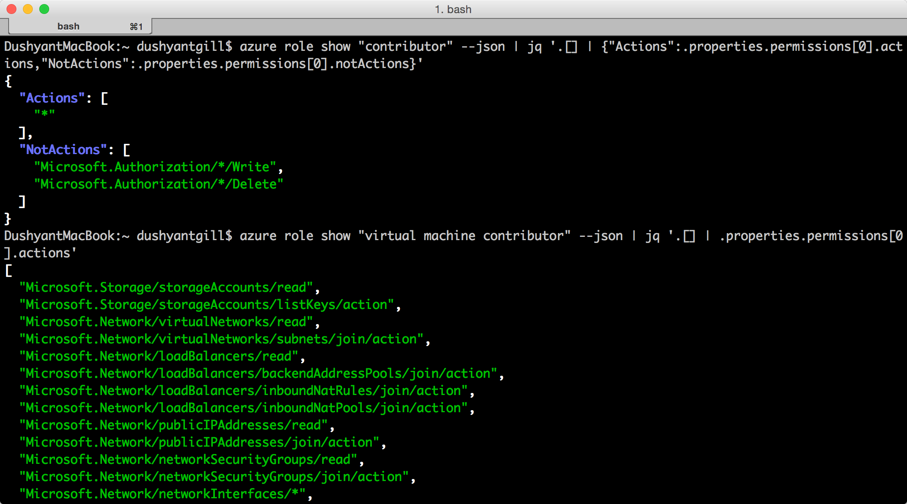
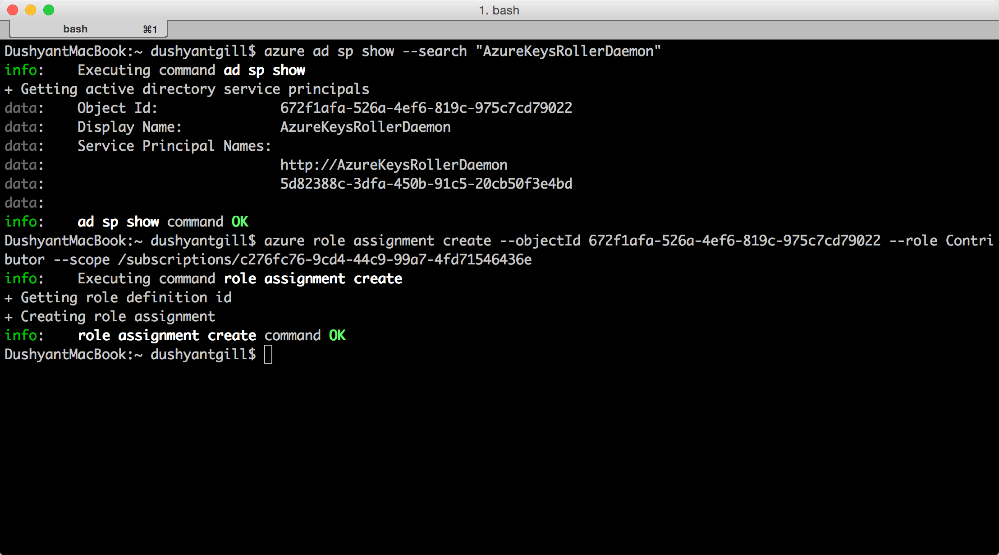
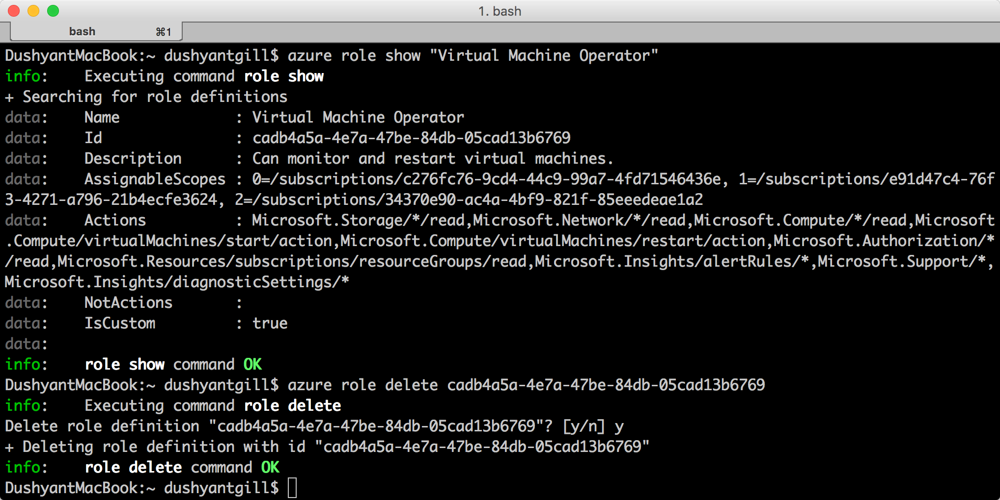

<properties
    pageTitle="Gérer le contrôle d’accès basé sur un rôle (RBAC) avec Azure infrastructure du langage commun | Microsoft Azure"
    description="Découvrez comment gérer basé sur un rôle accès contrôle avec une interface de ligne de commande Azure par répertorier les rôles et les actions de rôle et en attribuant des rôles aux étendues abonnement et d’application."
    services="active-directory"
    documentationCenter=""
    authors="kgremban"
    manager="femila"
    editor=""/>

<tags
    ms.service="active-directory"
    ms.devlang="na"
    ms.topic="article"
    ms.tgt_pltfrm="na"
    ms.workload="identity"
    ms.date="07/22/2016"
    ms.author="kgremban"/>

# <a name="manage-role-based-access-control-with-the-azure-command-line-interface"></a>Gérer le contrôle d’accès basé sur un rôle avec l’interface de ligne de commande Azure

> [AZURE.SELECTOR]
- [PowerShell](role-based-access-control-manage-access-powershell.md)
- [Azure infrastructure du langage commun](role-based-access-control-manage-access-azure-cli.md)
- [API REST](role-based-access-control-manage-access-rest.md)

Vous pouvez utiliser le contrôle d’accès basé sur un rôle (RBAC) dans le portail Azure et Azure Gestionnaire de ressources API pour gérer l’accès à votre abonnement et des ressources à un niveau Permissions. Grâce à cette fonctionnalité, vous pouvez accorder l’accès des utilisateurs, des groupes ou des identités de service Active Directory en leur attribuant certains rôles à une zone en particulier.

Avant de pouvoir utiliser l’interface de ligne Azure (commande) pour gérer RBAC, vous devez disposer des éléments suivants :

- Azure infrastructure du langage commun version 0.8.8 ou version ultérieure. Pour installer la dernière version et l’associer à votre abonnement Azure, voir [installer et configurer l’infrastructure du langage commun Azure](../xplat-cli-install.md).
- Gestionnaire de ressources Azure dans Azure infrastructure du langage commun. Pour plus d’informations, accédez à [l’aide de l’infrastructure du langage commun Azure avec le Gestionnaire de ressources](../xplat-cli-azure-resource-manager.md) .

## <a name="list-roles"></a>Liste des rôles

### <a name="list-all-available-roles"></a>Lister tous les rôles disponibles
Pour répertorier tous les rôles disponibles, utilisez :

        azure role list

L’exemple suivant affiche la liste de *tous les rôles disponibles*.

```
azure role list --json | jq '.[] | {"roleName":.properties.roleName, "description":.properties.description}'
```


### <a name="list-actions-of-a-role"></a>Actions de liste d’un rôle
Pour répertorier les actions d’un rôle, utilisez :

    azure role show "<role name>"

L’exemple suivant montre les actions des rôles *collaborateur* et *Machine virtuelle collaborateur* .

```
azure role show "contributor" --json | jq '.[] | {"Actions":.properties.permissions[0].actions,"NotActions":properties.permissions[0].notActions}'

azure role show "virtual machine contributor" --json | jq '.[] | .properties.permissions[0].actions'
```



##  <a name="list-access"></a>Accès à la liste
### <a name="list-role-assignments-effective-on-a-resource-group"></a>Liste des attributions de rôle efficace sur un groupe de ressources
Pour répertorier les attributions de rôle qui existent dans un groupe de ressources, utilisez :

    azure role assignment list --resource-group <resource group name>

L’exemple suivant illustre les attributions de rôle dans le groupe *pharma-ventes-projecforcast* .

```
azure role assignment list --resource-group pharma-sales-projecforcast --json | jq '.[] | {"DisplayName":.properties.aADObject.displayName,"RoleDefinitionName":.properties.roleName,"Scope":.properties.scope}'
```


### <a name="list-role-assignments-for-a-user"></a>Liste des attributions de rôle pour un utilisateur
Pour répertorier les attributions de rôle pour un utilisateur spécifique et les affectations affectés à des groupes d’un utilisateur, utilisez :

    azure role assignment list --signInName <user email>

Vous pouvez également consulter les attributions de rôle sont héritées de groupes en modifiant la commande :

    azure role assignment list --expandPrincipalGroups --signInName <user email>

L’exemple suivant illustre les attributions de rôle accordées à la *sameert@aaddemo.com* utilisateur. Cela inclut les rôles attribués directement à l’utilisateur et les rôles qui sont héritées de groupes.

```
azure role assignment list --signInName sameert@aaddemo.com --json | jq '.[] | {"DisplayName":.properties.aADObject.DisplayName,"RoleDefinitionName":.properties.roleName,"Scope":.properties.scope}'

azure role assignment list --expandPrincipalGroups --signInName sameert@aaddemo.com --json | jq '.[] | {"DisplayName":.properties.aADObject.DisplayName,"RoleDefinitionName":.properties.roleName,"Scope":.properties.scope}'
```


##  <a name="grant-access"></a>Accorder l’accès
Pour accorder l’accès après avoir identifié le rôle que vous voulez affecter, utilisez :

    azure role assignment create

### <a name="assign-a-role-to-group-at-the-subscription-scope"></a>Attribuer un rôle à un groupe à la portée d’abonnement
Pour attribuer un rôle à un groupe à la portée d’abonnement, utilisez :

    azure role assignment create --objectId  <group object id> --roleName <name of role> --subscription <subscription> --scope <subscription/subscription id>

L’exemple suivant attribue le rôle de *lecteur* à l' *équipe de Christine Koch* au niveau de la portée *d’abonnement* .


### <a name="assign-a-role-to-an-application-at-the-subscription-scope"></a>Attribuer un rôle à une application au niveau de la portée d’abonnement
Pour attribuer un rôle à une application au niveau de la portée d’abonnement, utilisez :

    azure role assignment create --objectId  <applications object id> --roleName <name of role> --subscription <subscription> --scope <subscription/subscription id>

L’exemple suivant accorde le rôle de *collaborateur* à une application *Azure AD* sur l’abonnement sélectionné.

 

### <a name="assign-a-role-to-a-user-at-the-resource-group-scope"></a>Attribuer un rôle à un utilisateur à l’étendue de groupe de ressources
Pour attribuer un rôle à un utilisateur à l’étendue de groupe de ressources, utilisez :

    azure role assignment create --signInName  <user email address> --roleName "<name of role>" --resourceGroup <resource group name>

L’exemple suivant accorde le rôle de *Collaborateur Machine virtuelle* à *samert@aaddemo.com* utilisateur à l’étendue du groupe *Pharma-ventes-ProjectForcast* ressource.


### <a name="assign-a-role-to-a-group-at-the-resource-scope"></a>Attribuer un rôle à un groupe à la portée de ressource
Pour attribuer un rôle à un groupe à la portée de ressource, utilisez :

    azure role assignment create --objectId <group id> --role "<name of role>" --resource-name <resource group name> --resource-type <resource group type> --parent <resource group parent> --resource-group <resource group>

L’exemple suivant accorde le rôle de *Collaborateur Machine virtuelle* à un groupe *Azure AD* sur un *sous-réseau*.


##  <a name="remove-access"></a>Supprimer l’accès
Pour supprimer une attribution de rôle, utilisez :

    azure role assignment delete --objectId <object id to from which to remove role> --roleName "<role name>"

L’exemple suivant supprime l’attribution de rôle de *Collaborateur Machine virtuelle* à partir de la *sammert@aaddemo.com* utilisateur dans le groupe de ressources *Pharma-ventes-ProjectForcast* .
L’exemple supprime puis l’attribution de rôle d’un groupe de l’abonnement.


## <a name="create-a-custom-role"></a>Créer un rôle personnalisé
Pour créer un rôle personnalisé, utilisez :

    azure role create --inputfile <file path>

L’exemple suivant crée un rôle personnalisé appelé *Opérateur Machine virtuelle*. Le rôle personnalisé accorde l’accès à toutes les opérations de lecture de fournisseurs de ressources *Microsoft.Compute*, *Microsoft.Storage*et *Microsoft.Network* et accorde l’accès commence, redémarrez et surveillez machines virtuelles. Le rôle personnalisé peut être utilisé dans les deux abonnements. Cet exemple utilise un fichier JSON comme entrée.


## <a name="modify-a-custom-role"></a>Modifier un rôle personnalisé

Pour modifier un rôle personnalisé, utilisez d’abord la `azure role show` commande pour récupérer la définition de rôle. Ensuite, apportez les modifications souhaitées au fichier de définition de rôle. Enfin, utilisez `azure role set` pour enregistrer la définition de rôle modifiée.

    azure role set --inputfile <file path>

L’exemple suivant ajoute l’opération *Microsoft.Insights/diagnosticSettings/* pour les **Actions**et d’un abonnement Azure à **AssignableScopes** du rôle personnalisé opérateur Machine virtuelle.


## <a name="delete-a-custom-role"></a>Supprimer un rôle personnalisé

Pour supprimer un rôle personnalisé, utilisez d’abord la `azure role show` commande pour déterminer l' **ID** du rôle. Utilisez ensuite la `azure role delete` commande permettant de supprimer le rôle en spécifiant l' **ID**.

L’exemple suivant supprime le rôle personnalisé *Opérateur Machine virtuelle* .



## <a name="list-custom-roles"></a>Liste des rôles personnalisés

Pour répertorier les rôles disponibles pour une affectation à une étendue, utilisez le `azure role list` commande.

L’exemple suivant répertorie tous les rôles disponibles pour les affectations dans l’abonnement sélectionné.

```
azure role list --json | jq '.[] | {"name":.properties.roleName, type:.properties.type}'
```


Dans l’exemple suivant, le rôle personnalisé *Opérateur Machine virtuelle* n’est pas disponible dans l’abonnement *Production4* car cet abonnement n’est pas dans **AssignableScopes** du rôle.

```
azure role list --json | jq '.[] | if .properties.type == "CustomRole" then .properties.roleName else empty end'
```


## <a name="rbac-topics"></a>Rubriques RBAC
[AZURE.INCLUDE [role-based-access-control-toc.md](../../includes/role-based-access-control-toc.md)]
