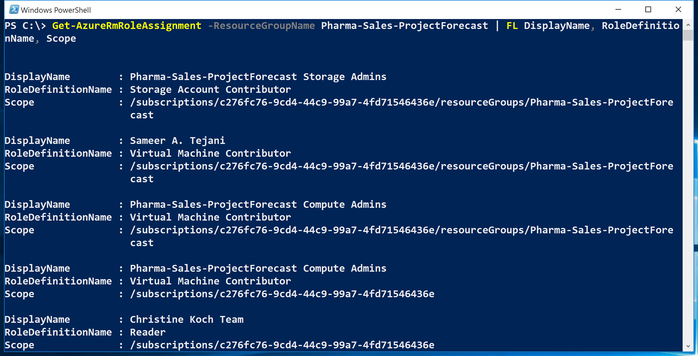
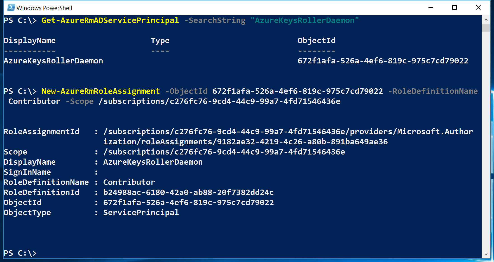
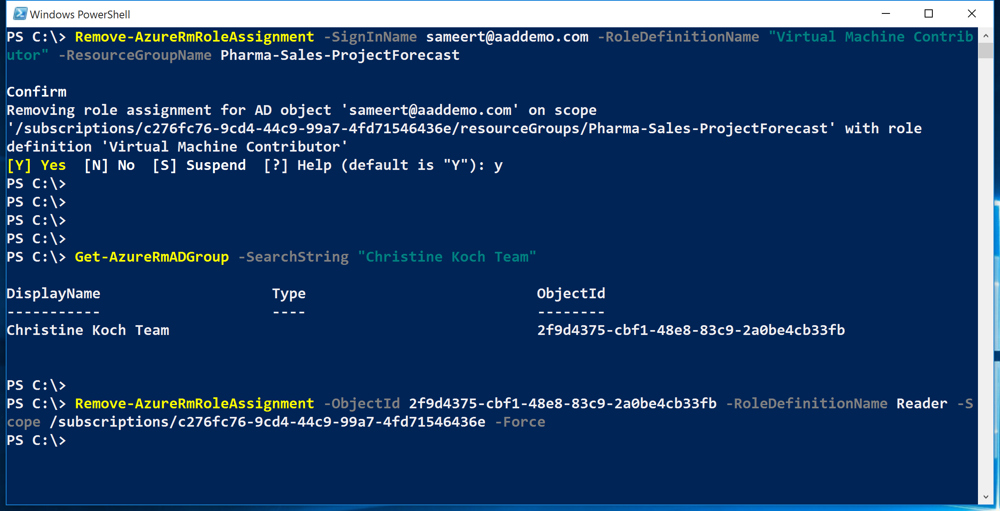
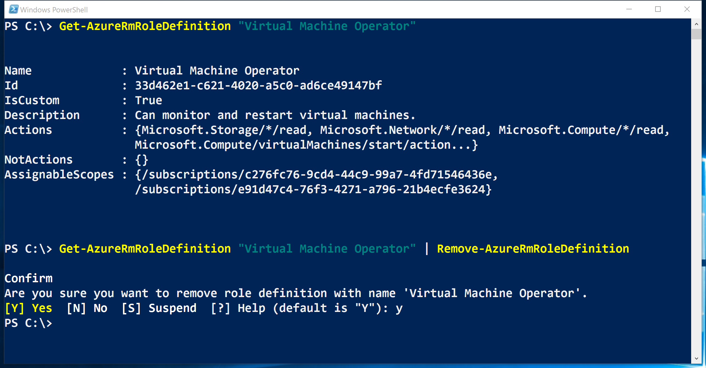
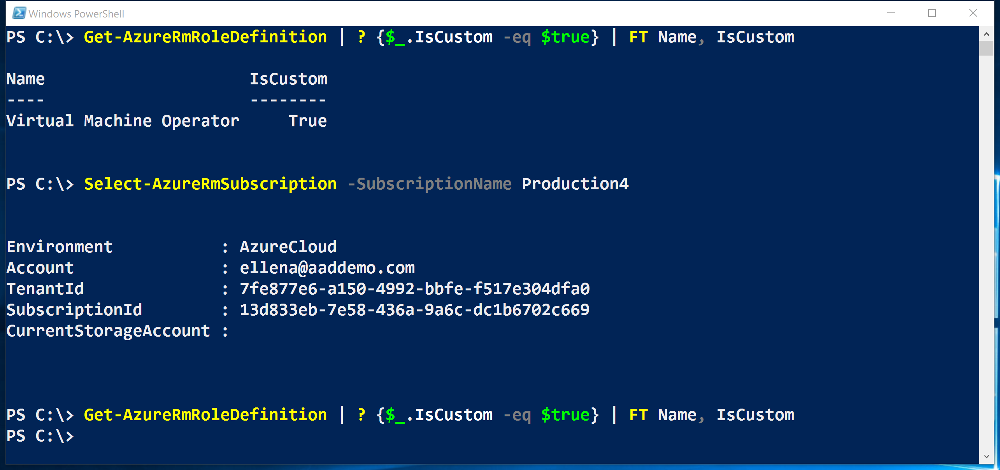

<properties
    pageTitle="Gérer le contrôle d’accès basé sur un rôle (RBAC) avec PowerShell Azure | Microsoft Azure"
    description="Comment gérer les RBAC avec PowerShell Azure, notamment la liste des rôles, attribution de rôles et la suppression des attributions de rôle."
    services="active-directory"
    documentationCenter=""
    authors="kgremban"
    manager="femila"
    editor=""/>

<tags
    ms.service="active-directory"
    ms.devlang="na"
    ms.topic="article"
    ms.tgt_pltfrm="na"
    ms.workload="identity"
    ms.date="07/22/2016"
    ms.author="kgremban"/>

# <a name="manage-role-based-access-control-with-azure-powershell"></a>Gérer le contrôle d’accès basé sur un rôle avec PowerShell Azure

> [AZURE.SELECTOR]
- [PowerShell](role-based-access-control-manage-access-powershell.md)
- [Azure infrastructure du langage commun](role-based-access-control-manage-access-azure-cli.md)
- [API REST](role-based-access-control-manage-access-rest.md)


Vous pouvez utiliser le contrôle d’accès basé sur un rôle (RBAC) dans le portail Azure et Azure API de gestion des ressources pour gérer l’accès à votre abonnement à un niveau Permissions. Grâce à cette fonctionnalité, vous pouvez accorder l’accès des utilisateurs, des groupes ou des identités de service Active Directory en leur attribuant certains rôles à une zone en particulier.

Avant de pouvoir utiliser PowerShell pour gérer RBAC, vous devez disposer des éléments suivants :

- Azure PowerShell version 0.8.8 ou version ultérieure. Pour installer la dernière version et l’associer à votre abonnement Azure, Découvrez [comment installer et configurer Azure PowerShell](../powershell-install-configure.md).

- Applets de commande Gestionnaire de ressources Azure. Installer les [applets de commande Gestionnaire de ressources Azure](https://msdn.microsoft.com/library/mt125356.aspx) dans PowerShell.

## <a name="list-roles"></a>Liste des rôles

### <a name="list-all-available-roles"></a>Lister tous les rôles disponibles
Pour les rôles RBAC liste qui sont disponibles pour une affectation d’et à inspecter les opérations auquel ils accorder l’accès, utilisent `Get-AzureRmRoleDefinition`.

```
Get-AzureRmRoleDefinition | FT Name, Description
```


### <a name="list-actions-of-a-role"></a>Actions de liste d’un rôle
Pour répertorier les actions pour un rôle spécifique, utilisez `Get-AzureRmRoleDefinition <role name>`.

```
Get-AzureRmRoleDefinition Contributor | FL Actions, NotActions

(Get-AzureRmRoleDefinition "Virtual Machine Contributor").Actions
```


## <a name="see-who-has-access"></a>Voir qui a accès
Liste d’affectations d’accès RBAC, utilisez `Get-AzureRmRoleAssignment`.

### <a name="list-role-assignments-at-a-specific-scope"></a>Liste des attributions de rôle à une étendue spécifique
Vous pouvez voir toutes les affectations d’accès pour un abonnement spécifié, le groupe de ressources ou la ressource. Par exemple, pour afficher les toutes les actives affectations pour un groupe de ressources, utilisez `Get-AzureRmRoleAssignment -ResourceGroupName <resource group name>`.

```
Get-AzureRmRoleAssignment -ResourceGroupName Pharma-Sales-ProjectForcast | FL DisplayName, RoleDefinitionName, Scope
```



### <a name="list-roles-assigned-to-a-user"></a>Liste des rôles attribués à un utilisateur
Pour répertorier tous les rôles affectés à un utilisateur spécifique et les rôles affectés aux groupes auquel appartient l’utilisateur, utilisez `Get-AzureRmRoleAssignment -SignInName <User email> -ExpandPrincipalGroups`.

```
Get-AzureRmRoleAssignment -SignInName sameert@aaddemo.com | FL DisplayName, RoleDefinitionName, Scope

Get-AzureRmRoleAssignment -SignInName sameert@aaddemo.com -ExpandPrincipalGroups | FL DisplayName, RoleDefinitionName, Scope
```


### <a name="list-classic-service-administrator-and-coadmin-role-assignments"></a>Administrateur de service classique de liste et les attributions de rôle coadmin
Aux affectations d’accès de liste pour l’administrateur d’abonnement classique et coadministrators, utilisez :

    Get-AzureRmRoleAssignment -IncludeClassicAdministrators

## <a name="grant-access"></a>Accorder l’accès
### <a name="search-for-object-ids"></a>Rechercher des ID d’objet
Pour attribuer un rôle, vous devez identifier l’objet (utilisateur, groupe ou application) et l’étendue.

Si vous ne connaissez pas l’ID de l’abonnement, vous pouvez trouver dans la carte **d’abonnements** dans le portail Azure. Pour savoir comment rechercher l’ID de l’abonnement, voir [Get-AzureSubscription](https://msdn.microsoft.com/library/dn495302.aspx) sur MSDN.

Pour obtenir l’ID d’objet pour un groupe d’annonces Azure, utilisez :

    Get-AzureRmADGroup -SearchString <group name in quotes>

Pour obtenir l’ID d’objet pour une application ou principal du service Azure AD, utilisez :

    Get-AzureRmADServicePrincipal -SearchString <service name in quotes>

### <a name="assign-a-role-to-an-application-at-the-subscription-scope"></a>Attribuer un rôle à une application au niveau de la portée d’abonnement
Pour accorder l’accès à une application au niveau de la portée d’abonnement, utilisez :

    New-AzureRmRoleAssignment -ObjectId <application id> -RoleDefinitionName <role name> -Scope <subscription id>



### <a name="assign-a-role-to-a-user-at-the-resource-group-scope"></a>Attribuer un rôle à un utilisateur à l’étendue de groupe de ressources
Pour accorder l’accès à un utilisateur à l’étendue de groupe de ressources, utilisez :

    New-AzureRmRoleAssignment -SignInName <email of user> -RoleDefinitionName <role name in quotes> -ResourceGroupName <resource group name>


### <a name="assign-a-role-to-a-group-at-the-resource-scope"></a>Attribuer un rôle à un groupe à la portée de ressource
Pour accorder l’accès à un groupe à la portée de ressource, utilisez :

    New-AzureRmRoleAssignment -ObjectId <object id> -RoleDefinitionName <role name in quotes> -ResourceName <resource name> -ResourceType <resource type> -ParentResource <parent resource> -ResourceGroupName <resource group name>


## <a name="remove-access"></a>Supprimer l’accès
Pour supprimer l’accès des utilisateurs, les groupes et les applications, utilisez :

    Remove-AzureRmRoleAssignment -ObjectId <object id> -RoleDefinitionName <role name> -Scope <scope such as subscription id>



## <a name="create-a-custom-role"></a>Créer un rôle personnalisé
Pour créer un rôle personnalisé, utilisez la `New-AzureRmRoleDefinition` commande.

Lorsque vous créez un rôle personnalisé à l’aide de PowerShell, vous devez commencer avec un des [rôles intégrés](role-based-access-built-in-roles.md). Modifier les attributs pour ajouter les *Actions*, *notActions*ou les *étendues* de votre choix, puis enregistrez les modifications en tant que nouveau rôle.

L’exemple suivant commence par le rôle de *Collaborateur Machine virtuelle* et qui utilise pour créer un rôle personnalisé appelé *Opérateur Machine virtuelle*. Le nouveau rôle accorde l’accès à toutes les opérations de lecture de fournisseurs de ressources *Microsoft.Compute*, *Microsoft.Storage*et *Microsoft.Network* et accorde l’accès commence, redémarrez et surveillez machines virtuelles. Le rôle personnalisé peut être utilisé dans les deux abonnements.

```
$role = Get-AzureRmRoleDefinition "Virtual Machine Contributor"
$role.Id = $null
$role.Name = "Virtual Machine Operator"
$role.Description = "Can monitor and restart virtual machines."
$role.Actions.Clear()
$role.Actions.Add("Microsoft.Storage/*/read")
$role.Actions.Add("Microsoft.Network/*/read")
$role.Actions.Add("Microsoft.Compute/*/read")
$role.Actions.Add("Microsoft.Compute/virtualMachines/start/action")
$role.Actions.Add("Microsoft.Compute/virtualMachines/restart/action")
$role.Actions.Add("Microsoft.Authorization/*/read")
$role.Actions.Add("Microsoft.Resources/subscriptions/resourceGroups/read")
$role.Actions.Add("Microsoft.Insights/alertRules/*")
$role.Actions.Add("Microsoft.Support/*")
$role.AssignableScopes.Clear()
$role.AssignableScopes.Add("/subscriptions/c276fc76-9cd4-44c9-99a7-4fd71546436e")
$role.AssignableScopes.Add("/subscriptions/e91d47c4-76f3-4271-a796-21b4ecfe3624")
New-AzureRmRoleDefinition -Role $role
```


## <a name="modify-a-custom-role"></a>Modifier un rôle personnalisé
Pour modifier un rôle personnalisé, tout d’abord, utilisez la `Get-AzureRmRoleDefinition` commande pour récupérer la définition de rôle. Ensuite, apportez les modifications souhaitées à la définition de rôle. Enfin, utilisez la `Set-AzureRmRoleDefinition` commande pour enregistrer la définition de rôle modifiée.

L’exemple suivant ajoute le `Microsoft.Insights/diagnosticSettings/*` opération au rôle *Opérateur Machine virtuelle* personnalisé.

```
$role = Get-AzureRmRoleDefinition "Virtual Machine Operator"
$role.Actions.Add("Microsoft.Insights/diagnosticSettings/*")
Set-AzureRmRoleDefinition -Role $role
```


L’exemple suivant ajoute un abonnement Azure aux étendues être assignés du rôle personnalisé *Opérateur Machine virtuelle* .

```
Get-AzureRmSubscription - SubscriptionName Production3

$role = Get-AzureRmRoleDefinition "Virtual Machine Operator"
$role.AssignableScopes.Add("/subscriptions/34370e90-ac4a-4bf9-821f-85eeedead1a2"
Set-AzureRmRoleDefinition -Role $role)
```


## <a name="delete-a-custom-role"></a>Supprimer un rôle personnalisé

Pour supprimer un rôle personnalisé, utilisez la `Remove-AzureRmRoleDefinition` commande.

L’exemple suivant supprime le rôle personnalisé *Opérateur Machine virtuelle* .

```
Get-AzureRmRoleDefinition "Virtual Machine Operator"

Get-AzureRmRoleDefinition "Virtual Machine Operator" | Remove-AzureRmRoleDefinition
```



## <a name="list-custom-roles"></a>Liste des rôles personnalisés
Pour répertorier les rôles disponibles pour une affectation à une étendue, utilisez le `Get-AzureRmRoleDefinition` commande.

L’exemple suivant répertorie tous les rôles disponibles pour les affectations dans l’abonnement sélectionné.

```
Get-AzureRmRoleDefinition | FT Name, IsCustom
```


Dans l’exemple suivant, le rôle personnalisé *Opérateur Machine virtuelle* n’est pas disponible dans l’abonnement *Production4* car cet abonnement n’est pas dans **AssignableScopes** du rôle.



## <a name="see-also"></a>Voir aussi
- [À l’aide de PowerShell Azure avec le Gestionnaire de ressources Azure](../powershell-azure-resource-manager.md)
[AZURE.INCLUDE [role-based-access-control-toc.md](../../includes/role-based-access-control-toc.md)]
