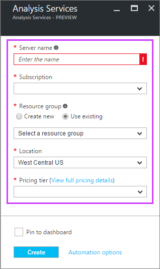

<properties
   pageTitle="Créer un serveur Analysis Services dans Azure | Microsoft Azure"
   description="Apprenez à créer une instance du serveur Analysis Services dans Azure."
   services="analysis-services"
   documentationCenter=""
   authors="minewiskan"
   manager="erikre"
   editor=""
   tags=""/>
<tags
   ms.service="analysis-services"
   ms.devlang="NA"
   ms.topic="article"
   ms.tgt_pltfrm="NA"
   ms.workload="na"
   ms.date="10/24/2016"
   ms.author="owend"/>

# Créer un serveur Analysis Services
Cet article vous guide dans la création d’une ressource serveur Analysis Services dans votre abonnement Azure.

## Avant de commencer
Pour commencer, vous devez :

- **Abonnement Azure**: visite [Essai gratuit Azure](https://azure.microsoft.com/offers/ms-azr-0044p/) pour créer un compte.
- **Groupe de ressources**: utiliser un groupe de ressources que vous avez déjà ou [créez-en une](../azure-resource-manager/resource-group-overview.md).

> [AZURE.NOTE] Création d’un serveur Analysis Services peut entraîner un nouveau service facturable. Pour plus d’informations, voir tarifs Analysis Services.

## Créer un serveur Analysis Services

1. Connectez-vous au [portail Azure](https://portal.azure.com).

2. Cliquez sur **+ Nouveau** > **Intelligence + analytique** > **Analysis Services**.

3. Dans la carte **Analysis Services** , renseignez les champs requis et appuyez sur **créer**.

    

    - **Nom du serveur**: tapez un nom unique utilisé pour référencer le serveur.

    - **Abonnement**: sélectionnez l’abonnement ce serveur échéances à.

    - **Groupe de ressources**: il s’agit des conteneurs conçus pour vous aider à gérer une collection de ressources Azure. Pour plus d’informations, voir [groupes de ressources](../resource-group-overview.md).

    - **Emplacement**: emplacement du centre de données Azure ce héberge le serveur. Choisissez un emplacement le plus proche de votre base d’utilisateurs plus grande.

    - **Niveau de tarification**: sélectionnez un niveau de tarification. Jusqu'à 100 Go modèles tabulaires sont prises en charge. Vous pouvez toujours modifier votre niveau de tarification ultérieurement.

4. Cliquez sur **créer**.

Créer dure moins d’une minute ; souvent que quelques secondes. Si vous avez sélectionné **Ajouter au portail**, accédez à votre portail pour afficher votre nouveau serveur. Ou, accédez à **d’autres services** > **Analysis Services** pour déterminer si votre serveur est prêt. Si elle n’apparaît pas actualiser la liste.

 

## Étapes suivantes
Une fois que vous avez créé votre serveur, vous pouvez [déployer un modèle](analysis-services-deploy.md) vers celle-ci à l’aide de SSDT ou avec SSMS.

Si un modèle que vous déployez votre serveur se connecte aux sources de données locale, vous devez installer une [passerelle de données en local](analysis-services-gateway.md) sur un ordinateur de votre réseau.
