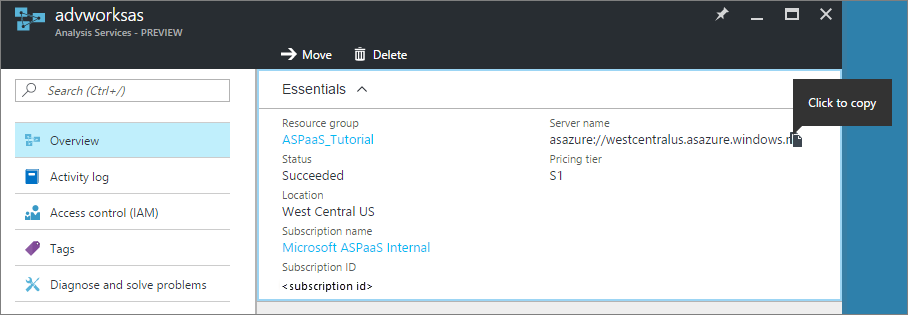

<properties
   pageTitle="Gérer les Services d’analyse Azure | Microsoft Azure"
   description="Apprenez à gérer un serveur Analysis Services dans Azure."
   services="analysis-services"
   documentationCenter=""
   authors="minewiskan"
   manager="erikre"
   editor=""
   tags=""/>
<tags
   ms.service="analysis-services"
   ms.devlang="NA"
   ms.topic="article"
   ms.tgt_pltfrm="NA"
   ms.workload="na"
   ms.date="10/24/2016"
   ms.author="owend"/>

# <a name="manage-analysis-services"></a>Gérer les Services d’analyse

Une fois que vous avez créé un serveur Analysis Services dans Azure, il peut y avoir certaines tâches d’administration et que vous devez effectuer un certain temps ou immédiatement vers le bas de la route. Par exemple, activer le traitement pour actualiser les données, contrôler qui peut accéder aux modèles de votre serveur ou surveiller l’intégrité de votre serveur. Certaines tâches de gestion peuvent uniquement être effectuées dans le portail Azure, d’autres personnes dans SQL Server Management Studio (SSMS), et certaines tâches peuvent être exécutées de des options.

## <a name="azure-portal"></a>Portail Azure
Le [portail Azure](http://portal.azure.com/) est l’endroit où vous pouvez créer et supprimer des serveurs, surveiller les ressources du serveur, modifier la taille et gérer qui a accès à vos serveurs.  Si vous rencontrez des problèmes, vous pouvez également envoyer une demande de support.


## <a name="sql-server-management-studio"></a>SQL Server Management Studio
Connexion à votre serveur dans Azure est identique à se connecter à une instance du serveur dans votre organisation. À partir de SSMS, vous pouvez effectuent les tâches telles que les données de processus ou créer un script de traitement, gérer les rôles et utiliser PowerShell.


 Un des différences entre les plus grands est l’authentification que vous utilisez pour vous connecter à votre serveur. Pour vous connecter à votre serveur Azure Analysis Services, vous devez sélectionner **Authentification de mot de passe Active Directory**.

### <a name="to-connect-with-ssms"></a>Pour vous connecter avec SSMS
1. Avant de vous connecter, vous devez obtenir le nom du serveur. Dans le **portail Azure** > serveur > **vue d’ensemble** > **nom du serveur**, copiez le nom du serveur.

    

2. Dans SSMS > **Explorateur d’objets**, cliquez sur **se connecter** > **Analysis Services**.

3. Dans la boîte de dialogue **se connecter au serveur** coller dans le nom du serveur, puis en **l’authentification**, choisissez une des opérations suivantes :

    **Authentification intégrée à active Directory** à utiliser de l’authentification unique avec Active Directory de fédération Azure Active Directory.

    **Authentification de mot de passe active Directory** à utiliser un compte professionnel. Par exemple, quand se connectant à partir d’un domaine non-jointes ordinateur.

    Remarque : Si vous ne voyez pas l’authentification Active Directory, vous devrez peut-être [Activer l’authentification Azure Active Directory](#enable-azure-active-directory-authentication) dans SSMS.

    

Étant donné que la gestion de votre serveur dans Azure à l’aide de SSMS est très similaire à la gestion d’un serveur local, nous allons pas pour accéder aux détails ici. Toute l’aide que vous devez sont accessibles dans la [Gestion des instances Analysis Services](https://msdn.microsoft.com/library/hh230806.aspx) sur MSDN.

## <a name="server-administrators"></a>Administrateurs de serveurs
Vous pouvez utiliser **Les administrateurs Analysis Services** dans la carte de contrôle de votre serveur dans le portail Azure ou SSMS pour gérer les administrateurs de serveur. Les administrateurs Analysis Services sont les administrateurs de serveur de base de données avec des droits pour des tâches d’administration de base de données courantes telles que l’ajout et la suppression des bases de données et la gestion des utilisateurs. Par défaut, l’utilisateur qui crée le serveur Azure portail est automatiquement ajouté comme administrateur Analysis Services.

Vous devez également savoir :

-   Windows Live ID n’est pas un type d’identité pris en charge pour Azure Analysis Services.  
-   Les administrateurs Analysis Services doivent être des utilisateurs de Azure Active Directory valides.
-   Si la création d’un serveur Azure Analysis Services via le Gestionnaire de ressources Azure des modèles, les administrateurs Analysis Services prend un tableau JSON d’utilisateurs qui doivent être ajoutés en tant que les administrateurs.

Les administrateurs Analysis Services peuvent différer administrateurs Azure ressources, ce qui peuvent gérer les ressources pour les abonnements Azure. Cette option conserve la compatibilité avec existant XMLA et TSML gérer les comportements dans Analysis Services et pour vous permettent de séparer les droits entre la gestion des ressources Azure et analyse de la gestion de la base de données des Services.

Pour afficher tous les rôles et accéder aux types pour votre ressource Azure Analysis Services, utilisez le contrôle d’accès (IAM) sur la carte de contrôle.

## <a name="database-users"></a>Utilisateurs de base de données
Utilisateurs de base de données Azure Analysis Services modèle doivent être placé dans votre Azure Active Directory. Les noms d’utilisateur spécifiées pour la base de données model doivent être par adresse de messagerie professionnel ou UPN. Ceci est différent de bases de données locale modèle qui prennent en charge des utilisateurs en noms d’utilisateur de domaine Windows.

Vous pouvez ajouter des utilisateurs à l’aide [d’attributions de rôle dans Azure Active Directory](../active-directory/role-based-access-control-configure.md) ou en utilisant [Le langage de script modèle tabulaire](https://msdn.microsoft.com/library/mt614797.aspx) (TMSL) dans SQL Server Management Studio.

**Exemple de script TMSL**

```
{
  "createOrReplace": {
    "object": {
      "database": "SalesBI",
      "role": "Users"
    },
    "role": {
      "name": "Users",
      "description": "All allowed users to query the model",
      "modelPermission": "read",
      "members": [
        {
          "memberName": "user1@contoso.com",
          "identityProvider": "AzureAD"
        },
        {
          "memberName": "group1@contoso.com",
          "identityProvider": "AzureAD"
        }
      ]
    }
  }
}
```

## <a name="enable-azure-active-directory-authentication"></a>Activer l’authentification Azure Active Directory
Pour activer la fonctionnalité d’authentification Azure Active Directory pour SSMS dans le Registre, créez un fichier texte nommé EnableAAD.reg, puis copiez et collez les éléments suivants :


```
Windows Registry Editor Version 5.00
[HKEY_CURRENT_USER\Software\Microsoft\Microsoft SQL Server\Microsoft Analysis Services\Settings]
"AS AAD Enabled"="True"
```

Enregistrez et exécutez le fichier.


## <a name="next-steps"></a>Étapes suivantes
Si vous n’avez pas déjà déployé un modèle tabulaire vers votre nouveau serveur, c’est le moment idéal. Pour plus d’informations, voir [déploiement d’Azure Analysis Services](analysis-services-deploy.md).

Si vous avez déployé un modèle à votre serveur, vous êtes prêt à vous connecter à l’aide d’un client ou un navigateur. Pour plus d’informations, consultez [obtenir des données à partir d’Azure Analysis Services](analysis-services-connect.md).
