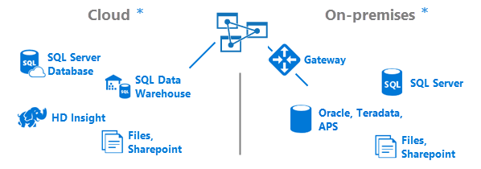
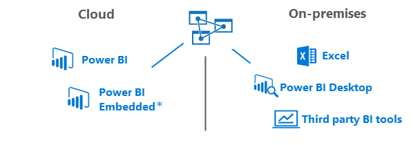

<properties
   pageTitle="Qu’est Azure Analysis Services | Microsoft Azure"
   description="Obtenir la vue d’ensemble d’Analysis Services dans Azure."
   services="analysis-services"
   documentationCenter=""
   authors="minewiskan"
   manager="erikre"
   editor=""
   tags=""/>
<tags
   ms.service="analysis-services"
   ms.devlang="NA"
   ms.topic="article"
   ms.tgt_pltfrm="NA"
   ms.workload="na"
   ms.date="10/25/2016"
   ms.author="owend"/>

# Qu’est Azure Analysis Services ?

Basée sur le moteur analytique éprouvées dans Microsoft SQL Server Analysis Services, Azure Analysis Services offre à l’échelle de l’entreprise modélisation de données dans le cloud.

> [AZURE.IMPORTANT] Azure Analysis Services est en **mode Aperçu**. Il existe quelques éléments qui ne fonctionnent pas encore. Veillez à extraire [attentes aperçu](#preview-expectations) plus loin dans cet article. Et, n’oubliez pas de garder un œil sur notre [blog Azure Analysis Services](https://go.microsoft.com/fwlink/?linkid=830920) pour obtenir les dernières informations.

## Intégré dans SQL Server Analysis Services
Azure Analysis Services est compatible avec la même SQL Server 2016 Analysis Services Enterprise Edition vous connaissez déjà. Azure Analysis Services prend en charge les modèles tabulaires au niveau de compatibilité 1200. DirectQuery, partitions, sécurité au niveau de la ligne, bidirectionnelle relations et les traductions sont toutes prises en charge.

## Utiliser des outils que vous connaissez déjà

Lorsque vous créez des modèles de données pour Azure Analysis Services, vous utilisez les mêmes outils que pour SQL Server Analysis Services. Créer et déployer des modèles tabulaires à l’aide de la dernière version de [SQL Server Data Tools (SSDT)](https://msdn.microsoft.com/library/mt204009.aspx) ou à l’aide de modèles [Azure Powershell](../powershell-install-configure.md) et [Le Gestionnaire de ressources Azure](../azure-resource-manager/resource-group-overview.md) dans [SQL Server Management Studio (SSMS)](https://msdn.microsoft.com/library/mt238290.aspx).

## Se connecter aux sources de données
Modèles de données déploiement sur serveurs dans Azure prise en charge la connexion aux données sources en local dans votre organisation ou dans le cloud. Combiner les données de deux en local et sources de données pour un déploiement de solution BI en nuage.

Étant donné que votre serveur se trouve dans le cloud, connexion aux sources de données cloud est transparente. Lors de la connexion aux sources de données locale, la [passerelle de données locale](analysis-services-gateway.md) assure rapide, une connexion sécurisée avec votre serveur Analysis Services dans le nuage.  

 \*Certaines sources de données ne sont pas encore pris en charge dans l’aperçu. Pour plus d’informations, voir [attentes aperçu](#preview-expectations) plus loin dans cet article.

## Explorer vos données en tout lieu
Se connecter et [obtenir des données](analysis-services-connect.md) à partir de vos serveurs de sur n’importe quel emplacement. Azure Analysis Services prend en charge la connexion à partir de Power BI Desktop, Excel, des applications personnalisées et outils basés sur le navigateur.

 \*Power BI incorporé n'est pas encore pris en charge dans l’aperçu.

## Banque d’informations sécurisé

#### Authentification des utilisateurs
L’authentification des utilisateurs pour Azure Analysis services est gérée par [Azure Active Directory (DAS)](../active-directory/active-directory-whatis.md). Lorsque vous tentez de se connecter à une base de données Azure Analysis Services, les utilisateurs utiliser une identité de compte d’organisation avec accès à la base de données qu’ils tentent d’accéder à. Ces utilisateurs doivent être membres du Azure Active Directory par défaut pour l’abonnement où réside le serveur Azure Analysis Services. [Intégration d’annuaire](https://technet.microsoft.com/library/jj573653.aspx) entre AAD et un locale d’Active Directory est un excellent moyen pour obtenir vos localement aux utilisateurs d’accéder à une base de données Azure Analysis Services, mais n’est pas obligatoire pour tous les scénarios.

Les utilisateurs se connecter avec le nom utilisateur principal (UPN) de leur propre compte et leur mot de passe. Lors de la synchronisation avec Active Directory local, UPN de l’utilisateur est souvent leur adresse de messagerie d’organisation.

Autorisations pour la gestion de la ressource serveur Azure Analysis Services sont gérées en affectant des utilisateurs aux rôles au sein de votre abonnement Azure. Par défaut, les administrateurs d’abonnement ont des autorisations de propriétaire pour la ressource serveur dans Azure. Autres utilisateurs peuvent être ajoutés à l’aide du Gestionnaire de ressources Azure.

#### Sécurité des données
Azure Analysis Services utilise le stockage d’objets Blob Azure pour conserver le stockage et les métadonnées des bases de données Analysis Services. Fichiers de données au sein d’objets Blob sont chiffrés à l’aide de chiffrement côté Azure Blob Server (SSE). Lorsque vous utilisez le mode de requête directe, seules les métadonnées sont stockées ; les données réelles sont accessible à partir de la source de données au moment de la requête.

#### Sources de données locales
Sécuriser l’accès aux données résidant en local dans votre organisation, il est possible en installant et en configurant une [passerelle de données locale](analysis-services-gateway.md). Passerelles fournissent un accès aux données pour requête directe et modes en mémoire. Lorsqu’un modèle d’Azure Analysis Services se connecte à une source de données locale, une requête est créée en même temps que les informations d’identification chiffrées pour la source de données locale. Le service en nuage passerelle analyse la requête et envoie la demande à un Bus des services Azure. La passerelle locale consulte le Bus des services Azure pour les demandes en attente. La passerelle puis récupère la requête, déchiffre les informations d’identification et se connecte à la source de données pour l’exécution. Les résultats sont ensuite envoyés à partir de la source de données, à la passerelle, puis à la base de données Azure Analysis Services.

Azure Analysis Services est régie par les [Termes du contrat Microsoft Online Services](http://www.microsoftvolumelicensing.com/DocumentSearch.aspx?Mode=3&DocumentTypeId=31) et la [Déclaration de confidentialité Microsoft Online Services](https://www.microsoft.com/privacystatement/OnlineServices/Default.aspx).
Pour en savoir plus sur la sécurité Azure, consultez le [Centre de gestion de la confidentialité de Microsoft](https://www.microsoft.com/trustcenter/Security/AzureSecurity).

## Obtenir de l’aide
Azure Analysis Services est simple pour configurer et gérer. Vous pouvez trouver toutes les informations que vous avez besoin pour créer et gérer un serveur ici. Lorsque vous créez un modèle de données pour déployer sur votre serveur, il est très similaire comme c’est pour la création d’un modèle de données que vous déployez sur un serveur local. Il est une bibliothèque étendue de conceptuelles, à la procédures, didacticiels et articles de la référence à [Analysis Services sur MSDN](https://msdn.microsoft.com/library/bb522607.aspx).

Nous avons également un certain nombre de vidéos utiles en [Azure Analysis Services sur Channel 9](https://channel9.msdn.com/series/Azure-Analysis-Services).

Éléments évoluent rapidement. Vous pouvez toujours obtenir les dernières informations sur le [blog Azure Analysis Services](https://go.microsoft.com/fwlink/?linkid=830920).

## Communauté
Analysis Services possède une communauté active des utilisateurs. Participer à la conversation sur [forum Azure Analysis Services](https://aka.ms/azureanalysisservicesforum).

## Commentaires
Avez des suggestions ou des demandes de fonctionnalités ? Veillez à laisser vos commentaires sur [Azure Analysis Services commentaires](https://aka.ms/azureanalysisservicesfeedback).

Vous avez suggestions sur la documentation ? Vous pouvez ajouter des commentaires à l’aide de Disqus en bas de chaque article.

## Attentes Preview
Azure Analysis Services est en cours d’aperçu. Il existe plusieurs choses que vous devez tenir compte des.

##### Modes de serveur
Azure Analysis Services prend actuellement en charge en mode tabulaire pour les modèles tabulaires au niveau de compatibilité 1200. Mode multidimensionnel et exploration de données et Power Pivot en mode SharePoint ne sont pas pris en charge.

##### Sources de données
Pour l’aperçu, les sources de données suivants sont pris en charge dans les 1200 modèles tabulaires déployés sur un serveur Azure Analysis Services.

| **Cloud** | **En local** |
|--------------|------------|
| Base de données SQL | SQL Server |
| Data Warehouse SQL | POINTS D’ACCÈS |
|      | Oracle |
|       | Teradata |

### Fournisseurs de sources de données
Modèles de données dans Azure Analysis Services peuvent nécessiter des fournisseurs de données différents pour vous connecter aux sources de données que les modèles de données dans SQL Server Analysis Services. Configuration requise de fournisseur de données dépendre de la source de données en cours dans le cloud ou en local et le type de modèle de données ; Requête en mémoire ou Direct. Pour plus d’informations, voir [connexions de source de données](analysis-services-datasource.md).

### Connexions client
Power BI incorporé n'est pas encore pris en charge dans l’aperçu.

Classeurs Excel avec des connexions à un serveur Azure Analysis Services et enregistré sur OneDrive ou SharePoint Online ne sont pas pris en charge.

## Étapes suivantes
Maintenant que vous connaissez plus Azure Analysis Services, il est temps de mise en route. Découvrez comment [créer un serveur](analysis-services-create-server.md) dans Azure et [déployer un modèle tabulaire](analysis-services-deploy.md) à celui-ci.
