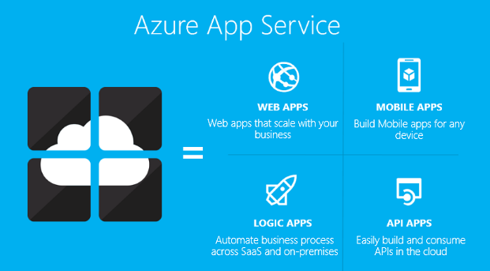

<properties 
    pageTitle="Présentation des applications API | Microsoft Azure" 
    description="Découvrez comment Azure Application Service vous permet de développer, hôte et consommer API RESTful." 
    services="app-service\api" 
    documentationCenter=".net" 
    authors="tdykstra" 
    manager="wpickett" 
    editor=""/>

<tags 
    ms.service="app-service-api" 
    ms.workload="web" 
    ms.tgt_pltfrm="na" 
    ms.devlang="na" 
    ms.topic="get-started-article" 
    ms.date="08/23/2016" 
    ms.author="rachelap"/>

# Vue d’ensemble des applications de l’API

Applications de l’API dans le Service d’application Azure proposent des fonctionnalités qui facilitent la développer, hôte, et l’utilisation des API dans le nuage et en local. Avec l’API applications pouvez-vous sécurité enterprise, le contrôle d’accès simple, connectivité hybride, génération SDK automatique et intégration transparente avec les [Applications logique](../app-service-logic/app-service-logic-what-are-logic-apps.md).

[Service d’application Azure](../app-service/app-service-value-prop-what-is.md) est une plateforme entièrement gérée pour le web, mobile et scénarios d’intégration. Applications API est un des quatre types d’application offerts par le [Service d’application Azure](../app-service/app-service-value-prop-what-is.md).

## Pourquoi utiliser des applications API ?

Voici certaines fonctionnalités clés d’API applications :

- **Mettre votre API existant en tant que-est** -vous n’êtes pas obligé de modifier le code dans votre API existantes pour tirer parti des applications API - déployer simplement votre code pour une application API. Votre API peut utiliser n’importe quel langue ou framework pris en charge par le Service d’application, notamment ASP.NET et c#, Java, PHP, Node.js et Python.

- **Consommation facile** - prise en charge intégrée pour [les métadonnées de l’API Swagger](http://swagger.io/) rend votre API facilement utilisable par une variété de clients.  Générer automatiquement le code client pour votre API dans plusieurs langues, y compris c#, Java et Javascript. Configurer facilement [CORS](app-service-api-cors-consume-javascript.md) sans modifier votre code. Pour plus d’informations, voir [métadonnées Lanceur d’applications API de Service de génération de découverte et le code de l’API](app-service-api-metadata.md) et [consommer une application API JavaScript à l’aide de CORS](app-service-api-cors-consume-javascript.md). 

- **Contrôle d’accès simple** - protéger une application API de tout accès non authentifiés avec aucune modification à votre code. Services d’authentification intégré sécurisé API pour l’accès par d’autres services ou par les clients représentant des utilisateurs. Fournisseurs d’identité pris en charge comprennent Azure Active Directory, Facebook, Twitter, Google et Account Microsoft. Clients peuvent utiliser bibliothèque terme (Active Directory authentification ADAL) ou le Kit de développement des applications mobiles. Pour plus d’informations, voir [authentification et autorisation pour les applications de l’API dans le Service d’application Azure](app-service-api-authentication.md).

- **Intégration de visual Studio** - outils dédiés dans Visual Studio rationalisent le travail de création, le déploiement, par d’autres programmes, débogage et gestion des applications de l’API. Pour plus d’informations, voir [annonce le Kit de développement Azure 2.8.1 pour .NET](/blog/announcing-azure-sdk-2-8-1-for-net/).

- **Intégration avec les applications logique** - API applications que vous créez peut être utilisée par [Application Service logique d’applications](../app-service-logic/app-service-logic-what-are-logic-apps.md).  Pour plus d’informations, voir [utilisation votre API personnalisé hébergé sur application Service avec logique applications](../app-service-logic/app-service-logic-custom-hosted-api.md) et [nouveau schéma version 2015-08-01-preview](../app-service-logic/app-service-logic-schema-2015-08-01.md).

En outre, une application API pouvez tirer parti des fonctionnalités proposées par les [Applications Web](../app-service-web/app-service-web-overview.md) et [Applications Mobile](../app-service-mobile/app-service-mobile-value-prop.md). L’inverse est également vrai : Si vous utilisez une application web ou une application mobile pour héberger une API, peut prendre parti des fonctionnalités de l’API applications telles que les métadonnées Swagger client génération de code et CORS pour l’accès navigateur de domaines. La seule différence entre les types de trois application (API, web, mobile) est le nom et l’icône utilisée pour eux dans le portail Azure.

## Quelle est la différence entre les applications API et gestion de l’API Azure ?

Applications API et la [Gestion de l’API Azure](../api-management/api-management-key-concepts.md) sont services complémentaires :

* Gestion des API est sur la gestion des API. Vous définissez un serveur frontal de gestion de l’API à une API de moniteur et limitation de l’utilisation, manipuler d’entrée et sortie, consolidez plusieurs API dans un point de terminaison et ainsi de suite. API géré peut être hébergé en tout lieu.
* Applications API est API d’hébergement. Le service inclut des fonctionnalités qui facilitent l’API de développement et rapide, mais il ne fait pas les types de surveillance, la limitation, manipulation ou signifie que la direction API la consolidation. Si vous n’avez pas besoin des fonctionnalités de gestion de l’API, vous pouvez héberger API dans les applications de l’API sans l’aide de gestion de l’API.

Voici un diagramme qui montre la gestion de l’API pour les API hébergé dans les applications de l’API et ailleurs.

Certaines fonctionnalités de gestion des API et API applications ont des fonctions similaires.  Par exemple, les deux automatiser CORS prise en charge. Lorsque vous utilisez les deux services ensemble, vous utiliseriez gestion des API pour CORS dans la mesure où elle fonctionne comme le serveur frontal à vos applications API. 

## Prise en main

Pour vous familiariser avec l’API applications en déployant des exemples de code à un, consultez le didacticiel pour n’importe quel framework vous préférez :

* [ASP.NET](app-service-api-dotnet-get-started.md) 
* [Node.js](app-service-api-nodejs-api-app.md) 
* [Java](app-service-api-java-api-app.md) 

Pour poser des questions sur les applications de l’API, démarrez un thread dans le [forum de l’API applications](https://social.msdn.microsoft.com/Forums/en-US/home?forum=AzureAPIApps). 
