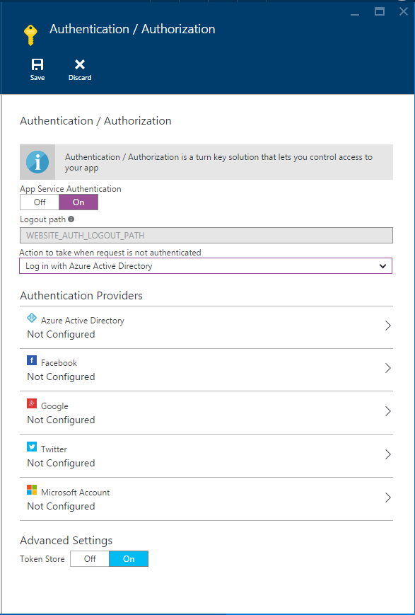

<properties
    pageTitle="Authentification et autorisation pour les applications de l’API dans le Service d’application Azure | Microsoft Azure"
    description="En savoir plus sur les services d’authentification et Azure Application Service fournit pour les applications de l’API."
    services="app-service\api"
    documentationCenter=".net"
    authors="tdykstra"
    manager="wpickett"
    editor=""/>

<tags
    ms.service="app-service-api"
    ms.workload="na"
    ms.tgt_pltfrm="na"
    ms.devlang="na"
    ms.topic="article"
    ms.date="05/23/2016"
    ms.author="rachelap"/>

# Authentification et autorisation pour les applications de l’API dans le Service d’application Azure

## Vue d’ensemble 

> [AZURE.NOTE] Cette rubrique vont être migrée à consolidés [application Service authentification / autorisation](../app-service/app-service-authentication-overview.md) rubrique, qui aborde les applications API Web et Mobile.

Azure Application Service propose des services d’authentification et d’autorisation intégrés mettant en œuvre [OAuth 2.0](#oauth) et [OpenID se connecter](#oauth). Cet article décrit les services et les options disponibles pour les applications de l’API dans le Service d’application Azure.

Le diagramme suivant illustre quelques caractéristiques clés d’authentification du Service d’application :

* Il prétraite les demandes entrantes API, ce qui signifie qu’il fonctionne avec n’importe quel langue ou framework pris en charge par le Service d’application.
* Il vous offre plusieurs options pour la quantité d’authentification de travail que vous voulez faire dans votre propre code.
* Fonctionnement de l’authentification de compte de service et aux utilisateurs finaux. 
* Prise en charge des fournisseurs d’identité cinq : Azure Active Directory, Facebook, Google, Twitter et Account Microsoft.
* Il fonctionne de la même pour les applications de l’API, les applications Web et les applications Mobile.

## Indépendant du langage

Traitement de l’authentification de Service d’application se produit avant que les demandes atteignent votre application API, ce qui signifie que les fonctionnalités d’authentification fonctionnent pour les applications API écrites dans une langue ou un cadre.  Votre API peut être basée sur ASP.NET, Java, Node.js ou n’importe quelle infrastructure qui prend en charge de l’application de Service.

Service d’application passe du jeton de web JSON (JWT) dans l’en-tête d’autorisation d’une requête HTTP, puis code rédigé dans une langue ou framework peut obtenir les informations que nécessaires à partir du jeton. En outre, application Service vous propose faciliter l’accès aux créances plus couramment utilisés en définissant certaines en-têtes spéciaux, tels que les éléments suivants :

* NOM DU PRINCIPAL CLIENT X MS
* ID DU PRINCIPAL CLIENT X MS
* X-MS-TOKEN-FACEBOOK-ACCESS-TOKEN
* X-MS-TOKEN-FACEBOOK-EXPIRES-ON
 
Dans une API .NET, vous pouvez utiliser la `Authorize` attribut et pour une autorisation, vous pouvez facilement écrire du code en fonction de revendications, car les informations sur les revendications sont remplies pour vous dans les classes .NET.

## Plusieurs options de protection

Application Service peut empêcher les requêtes HTTP anonymes d’atteindre votre application API, pouvoir passer sur toutes les demandes et valider les jetons pour les requêtes qui incluent les ou il peut permettre à toutes les demandes sans aucune action sur les :

1. Autoriser uniquement les demandes d’atteindre votre application API authentifiés.

    Si une requête anonyme est reçue depuis un navigateur, application Service vous redirige vers une page de connexion pour le fournisseur d’authentification (Azure AD, Google, Twitter, etc.) que vous choisissez. 

    Avec cette option, vous n’avez pas besoin d’écrire du code d’authentification tout dans votre application et code d’autorisation est simplifiée, car les déclarations les plus importantes sont fournies dans les en-têtes HTTP.

2. Autoriser toutes les demandes pour atteindre votre application API, mais valider les demandes authentifiés et transmettre les informations d’authentification dans les en-têtes HTTP.

    Cette option offre davantage de souplesse dans la gestion des demandes anonymes, mais vous devez écrire du code si vous souhaitez empêcher les utilisateurs anonymes à partir de l’utilisation de votre API. Dans la mesure où les revendications les plus populaires sont passées dans les en-têtes de requêtes HTTP, code d’autorisation est relativement simple.
    
3. Autoriser toutes les demandes atteindre votre API, sans agir sur les informations d’authentification dans les requêtes.

    Cette option laisse les tâches d’authentification et d’autorisation entièrement jusqu'à votre code de l’application.

Dans le [portail Azure](https://portal.azure.com/), vous sélectionnez l’option souhaitée dans la **authentification / autorisation** carte.

Pour les options 1 et 2, activez l’authentification de **Service**d’application, puis dans la liste déroulante **Action à effectuer lors de la requête n’est pas authentifié** , sélectionnez **se connecter** ou **Autoriser les requêtes (aucune action)**.  Si vous choisissez de **se connecter**, vous devez choisir un fournisseur d’authentification et configurer ce fournisseur.

Pour plus d’informations sur la façon de configurer l’authentification, Découvrez [comment configurer votre application de Service d’application pour utiliser la connexion Azure Active Directory](../app-service-mobile/app-service-mobile-how-to-configure-active-directory-authentication.md). L’article s’applique aux applications API ainsi que les applications mobiles et des liens vers d’autres articles pour les autres fournisseurs d’authentification.
 
## Authentification de compte de service

L’authentification du Service d’application fonctionne pour les scénarios internes tels que pour l’appel à partir d’une application API à une autre application API. Dans ce scénario, vous obtenez un jeton à l’aide des informations d’identification pour un compte de service au lieu des informations d’identification de l’utilisateur final. Un compte de service est également connue sous un *service principal* dans Azure Active Directory et l’authentification à l’aide d’un tel compte est également connue sous un scénario de service à service. 

Scénarios de service à service et par l’application de l’API appelée à l’aide de Azure Active Directory, fournir un jeton d’autorisation principal service DAS lorsque vous appelez l’application de l’API. Vous obtenez un jeton en fournissant au client ID et client secrète à partir de l’application DAS. Aucun code Azure seule spécifique n’est requise, comme utilisée pour avoir la valeur true pour gérer le jeton Mobile Services Zumo. Exemple de ce scénario à l’aide de l’API ASP.NET applications est traité par le didacticiel [authentification principale du Service pour les applications de l’API](app-service-api-dotnet-service-principal-auth.md).

Si vous souhaitez gérer un scénario de service à service sans utiliser l’authentification de Service d’application, vous pouvez utiliser les certificats clients ou l’authentification de base. Pour plus d’informations sur les certificats client dans Azure, voir [Procédure pour configurer TLS commun l’authentification pour les applications Web](../app-service-web/app-service-web-configure-tls-mutual-auth.md). Pour plus d’informations sur l’authentification de base dans ASP.NET, voir [Filtres d’authentification 2 de l’API Web ASP.NET](http://www.asp.net/web-api/overview/security/authentication-filters).

Authentification de compte de service d’une application de logique de Service d’application pour une application API est un cas spécial qui est expliqué dans [à l’aide de votre API personnalisé hébergé sur Service d’application avec les applications logique](../app-service-logic/app-service-logic-custom-hosted-api.md).

## Authentification de client mobile

Pour plus d’informations sur la façon de gérer l’authentification par les clients mobiles, voir la [documentation sur l’authentification pour les applications mobiles](../app-service-mobile/app-service-mobile-ios-get-started-users.md). L’authentification application Service fonctionne de la même façon pour les applications mobiles et les applications de l’API.
  
## Plus d’informations

Pour plus d’informations sur l’authentification et l’autorisation dans le Service d’application Azure, consultez les ressources suivantes :

* [Authentification application Service expansion / autorisation](/blog/announcing-app-service-authentication-authorization/)
* [Comment configurer votre application de Service d’application pour utiliser la connexion Azure Active Directory](../app-service-mobile/app-service-mobile-how-to-configure-active-directory-authentication.md) (Inclut des liens vers d’autres fournisseurs d’authentification en haut de la page). 

Pour plus d’informations sur 2.0 OAuth, OpenID vous connecter et JSON Web jetons (JWT), consultez les ressources suivantes.

* [Prise en main OAuth 2.0] (http://shop.oreilly.com/product/0636920021810.do "Prise en main OAuth 2.0") 
* [Présentation des oauth2 ne, OpenID se connecter et Web JSON jetons (JWT) - cours PluralSight](http://www.pluralsight.com/courses/oauth2-json-web-tokens-openid-connect-introduction) 
* [Création et la sécurisation une API RESTful pour plusieurs Clients dans ASP.NET - cours PluralSight](http://www.pluralsight.com/courses/building-securing-restful-api-aspdotnet)

Pour plus d’informations sur Azure Active Directory, consultez les ressources suivantes.

* [Scénarios AD Azure](http://aka.ms/aadscenarios)
* [Guide des développeurs d’Azure AD](http://aka.ms/aaddev)
* [Exemples d’annonces Azure](http://aka.ms/aadsamples)

## Étapes suivantes

Cet article a décrit les fonctionnalités d’authentification et d’autorisation du Service d’application que vous pouvez utiliser pour les applications de l’API. Le didacticiel suivant dans la série de mise en route mise en route montre comment implémenter [l’authentification des utilisateurs dans les applications de l’API de Service application](app-service-api-dotnet-user-principal-auth.md).
