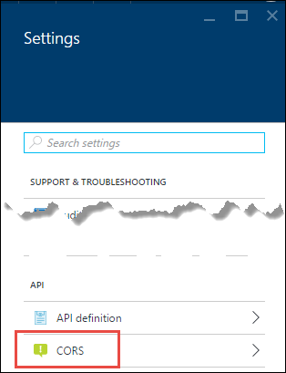

<properties
    pageTitle="CORS prend en charge dans le Service d’application | Microsoft Azure"
    description="Découvrez comment utiliser CORS prise en charge dans le Service d’application Azure Azure."
    services="app-service\api"
    documentationCenter=".net"
    authors="tdykstra"
    manager="wpickett"
    editor=""/>

<tags
    ms.service="app-service-api"
    ms.workload="na"
    ms.tgt_pltfrm="dotnet"
    ms.devlang="na"
    ms.topic="get-started-article"
    ms.date="08/27/2016"
    ms.author="rachelap"/>

# Utiliser une application API JavaScript à l’aide de CORS

Application Service offre une prise en charge intégrée pour [Le partage de ressources Origin croisées (CORS)](https://en.wikipedia.org/wiki/Cross-origin_resource_sharing), qui permet aux clients de JavaScript émettre des appels de domaines à des API qui est hébergés dans les applications de l’API. Service d’application vous permet de configurer l’accès CORS à votre API sans écrire du code dans votre API.

Cet article contient deux sections :

* La section [comment configurer CORS](#corsconfig) explique en général comment configurer CORS pour toute application API, une application web ou une application mobile. S’applique également à tous les cadres sont pris en charge par le Service d’application, y compris .NET, Node.js et Java. 

* À partir de la section [poursuivre les didacticiels .NET mise en route](#tutorialstart) , l’article est un didacticiel qui montre que Cors prend en charge en s’appuyant sur ce que vous avez effectuées dans [les applications API première prise en main didacticiel](app-service-api-dotnet-get-started.md). 

## Comment configurer CORS dans le Service d’application Azure

Vous pouvez configurer CORS dans le portail Azure ou à l’aide des outils du [Gestionnaire de ressources Azure](../azure-resource-manager/resource-group-overview.md) .

#### Configurer CORS dans le portail Azure

8. Dans un navigateur, accédez au [portail Azure](https://portal.azure.com/).

2. Cliquez sur **Services d’application**, puis cliquez sur le nom de votre application API.

    

10. Dans la carte de **paramètres** qui s’ouvre à droite de la cuillère **API application** , recherchez la section **API** , puis cliquez sur **CORS**.

    

11. Dans le texte, saisissez l’URL ou l’URL que vous souhaitez autoriser les appels JavaScript à venir à partir de.

    Par exemple, si vous avez déployé votre application de JavaScript pour une application web nommée todolistangular, entrez « https://todolistangular.azurewebsites.net ». Comme alternative, vous pouvez entrer un astérisque (*) pour spécifier que tous les domaines d’origine sont acceptées.

13. Cliquez sur **Enregistrer**.

    

    Une fois que vous cliquez sur **Enregistrer**, l’application API acceptera appels JavaScript à partir de l’URL spécifiées.

#### Configurer CORS à l’aide des outils du Gestionnaire de ressources Azure

Vous pouvez également configurer CORS pour une application API à l’aide de [modèles Azure le Gestionnaire de ressources](../resource-group-authoring-templates.md) dans les outils de ligne de commande tels que [PowerShell Azure](../powershell-install-configure.md) et [Azure infrastructure du langage commun](../xplat-cli-install.md). 

Pour obtenir un exemple d’un modèle de gestionnaire de ressources Azure qui définit la propriété CORS, ouvrez le [fichier azuredeploy.json dans le référentiel pour exemple d’application de ce didacticiel](https://github.com/azure-samples/app-service-api-dotnet-todo-list/blob/master/azuredeploy.json). Recherchez la section du modèle qui ressemble à l’exemple suivant :

        "cors": {
            "allowedOrigins": [
                "todolistangular.azurewebsites.net"
            ]
        }

## Poursuivre le didacticiel mise en route de .NET

Si vous suivez le Node.js ou Java mise en route la série pour les applications de l’API, vous avez terminé la série de mise en route mise en route. Passez à la section [étapes suivantes](#next-steps) pour rechercher des suggestions pour apprendre davantage sur les applications de l’API.

Le reste de cet article est la suite de la série de mise en route de .NET et suppose que vous bien été effectuée [le premier didacticiel](app-service-api-dotnet-get-started.md).

## Déployer le projet ToDoListAngular dans une nouvelle application web

Dans [le premier didacticiel](app-service-api-dotnet-get-started.md), vous avez créé une application API intermédiaire et une application de l’API de niveau de données. Dans ce didacticiel vous créez une application web application d’une page simple (SPA) cette application appels l’API intermédiaire. Pour le SPA pour l’utiliser vous devez activer le CORS sur l’application intermédiaire API. 

Dans [liste des tâches exemple d’application](https://github.com/Azure-Samples/app-service-api-dotnet-todo-list), le projet ToDoListAngular est un client AngularJS simple qui appelle le projet de l’API Web ToDoListAPI intermédiaire. Le code JavaScript dans le fichier *app/scripts/todoListSvc.js* appelle l’API en utilisant le fournisseur AngularJS HTTP. 

        angular.module('todoApp')
        .factory('todoListSvc', ['$http', function ($http) {

            $http.defaults.useXDomain = true;
            delete $http.defaults.headers.common['X-Requested-With']; 
        
            return {
                getItems : function(){
                    return $http.get(apiEndpoint + '/api/TodoList');
                },

                /* Get by ID, Put, and Delete methods not shown */

                postItem : function(item){
                    return $http.post(apiEndpoint + '/api/TodoList', item);
                }
            };
        }]);

### Créer une nouvelle application web pour le projet ToDoListAngular

La procédure pour créer une nouvelle application web application Service et déployer un projet qui lui est semblable à ce que vous avez vu pour [créer et déployer une application API dans le premier didacticiel dans cette série](app-service-api-dotnet-get-started.md#createapiapp). La seule différence est que l’application est de type **Web App** plutôt que **L’API application**.  Pour les captures d’écran des boîtes de dialogue, voir 

1. Dans l' **Explorateur de solutions**, cliquez sur le projet ToDoListAngular, puis cliquez sur **Publier**.

3.  Dans l’onglet **profil** de l’Assistant **Publier le site Web** , cliquez sur **Microsoft Azure Application Service**.

5. Dans la boîte de dialogue **Service d’application** , cliquez sur **Nouveau**.

3. Dans l’onglet **hébergement prend en charge** de la boîte de dialogue **Créer application Service** , entrez un **Nom de l’application Web** qui est unique dans le domaine *azurewebsites.net* . 

5. Choisissez l' Azure **abonnement** que vous souhaitez utiliser.

6. Dans la liste déroulante **Groupe de ressources** , cliquez sur le même groupe de ressources que vous avez créée.

4. Dans la liste déroulante **Plan de services d’application** , sélectionnez la même offre que vous avez créée. 

7. Cliquez sur **créer**.

    Visual Studio crée l’application web crée un profil de publication pour qu’elle et affiche l’étape de **connexion** de l’Assistant **Publier le site Web** .

    Ne cliquez pas encore sur **Publier** . Dans la section suivante, vous configurez la nouvelle application web pour appeler l’application de l’API intermédiaire qui est en cours d’exécution dans le Service d’application. 

### Définir l’URL de niveau intermédiaire dans les paramètres de l’application web

1. Accédez au [portail Azure](https://portal.azure.com/)et accédez à la carte **Web App** pour l’application web que vous avez créé pour héberger le projet TodoListAngular (frontal).

2. Cliquez sur **Paramètres > Paramètres de l’Application**.

3. Dans la section **paramètres de l’application** , ajoutez la clé et la valeur suivantes :

  	|Clé|Valeur|Exemple
  	|---|---|---|
  	|toDoListAPIURL|nom de l’application intermédiaire API https://{Your} .azurewebsites .net|https://todolistapi0121.azurewebsites.NET|

4. Cliquez sur **Enregistrer**.

    Lorsqu’il s’exécute dans Azure, cette valeur remplace l’URL hôte local qui se trouve dans le fichier *Web.config* . 

    Le code qui obtient la valeur du paramètre est *index.cshtml*:

        
        

    Le code de *todoListSvc.js* utilise le paramètre :

        return {
            getItems : function(){
                return $http.get(apiEndpoint + '/api/TodoList');
            },
            getItem : function(id){
                return $http.get(apiEndpoint + '/api/TodoList/' + id);
            },
            postItem : function(item){
                return $http.post(apiEndpoint + '/api/TodoList', item);
            },
            putItem : function(item){
                return $http.put(apiEndpoint + '/api/TodoList/', item);
            },
            deleteItem : function(id){
                return $http({
                    method: 'DELETE',
                    url: apiEndpoint + '/api/TodoList/' + id
                });
            }
        };

### Déployer le projet web ToDoListAngular sur la nouvelle application web

*  Dans Visual Studio, dans l’étape de **connexion** de l’Assistant **Publier le site Web** , cliquez sur **Publier**.

    Visual Studio déploie le projet ToDoListAngular pour la nouvelle application web et ouvre un navigateur à l’URL de l’application web. 

### Tester l’application sans CORS activé 

2. Dans votre navigateur, outils de développement, ouvrez la fenêtre de la Console.

3. Dans la fenêtre de navigateur qui affiche le AngularJS UI, cliquez sur le lien de la **Liste des tâches** .

    Le code JavaScript essaie d’appeler l’application intermédiaire API, mais l’appel échoue, car le serveur frontal est en cours d’exécution dans un domaine autre que le serveur principal. La fenêtre du navigateur pour les développeurs outils Console affiche un message d’erreur d’origine croisée.

    

## Configurer CORS pour l’application de l’API intermédiaire

Dans cette section, vous configurez le paramètre CORS dans Azure pour la couche intermédiaire API ToDoListAPI application. Ce paramètre permet la couche intermédiaire application API à recevoir des appels JavaScript à partir de l’application web que vous avez créé pour le projet ToDoListAngular.

8. Dans un navigateur, accédez au [portail Azure](https://portal.azure.com/).

2. Cliquez sur **Services d’application**, puis cliquez sur l’application de l’API ToDoListAPI (intermédiaire).

    

10. Dans la carte de **paramètres** qui s’ouvre à droite de la cuillère **API application** , recherchez la section **API** , puis cliquez sur **CORS**.

    

12. Dans la zone de texte, entrez l’URL de l’application web ToDoListAngular (frontal). Par exemple, si vous avez déployé le projet ToDoListAngular sur une application web nommée todolistangular0121, autoriser les appels à partir de l’URL `https://todolistangular0121.azurewebsites.net`.

    Comme alternative, vous pouvez entrer un astérisque (*) pour spécifier que tous les domaines d’origine sont acceptées.

13. Cliquez sur **Enregistrer**.

    

    Une fois que vous cliquez sur **Enregistrer**, l’application API acceptera appels JavaScript à partir de l’URL spécifiée. Dans cette capture d’écran, l’application de l’API ToDoListAPI0223 acceptera appels de client JavaScript à partir de l’application web ToDoListAngular.

### Tester l’application avec CORS activé

* Ouvrez un navigateur à l’URL HTTPS de l’application web. 

    Cette fois l’application vous permet d’afficher, ajouter, modifier et supprimer des listes des tâches. 

    

## Application Service CORS et CORS d’API Web

Dans un projet d’API Web, vous pouvez installer le package NuGet [Microsoft.AspNet.WebApi.Cors](https://www.nuget.org/packages/Microsoft.AspNet.WebApi.Cors/) afin de spécifier dans le code quels domaines acceptera votre API JavaScript appelle à partir de.
 
Prise en charge de l’API CORS Web est plus flexible que la prise en charge de l’application Service CORS. Par exemple, dans le code, vous pouvez spécifier différentes origines acceptées différentes méthodes d’action, tandis que pour application Service CORS vous spécifiez un ensemble d’acceptée origines pour toutes les méthodes d’une application API.

> [AZURE.NOTE] N’essayez d’utiliser CORS d’API Web et application Service CORS dans une application API. Application Service CORS est prioritaire et Web API CORS n’a aucun effet. Par exemple, si vous activez un domaine d’origine dans le Service d’application et activez tous les domaines d’origine dans votre code API Web, votre application Azure API n’accepte les appels à partir du domaine que vous avez spécifié dans Azure.

### Comment activer le CORS dans le code de l’API Web

Les étapes suivantes résument le processus d’activation Web API CORS prise en charge. Pour plus d’informations, voir [Activation des demandes origine croisée 2 de l’API Web ASP.NET](http://www.asp.net/web-api/overview/security/enabling-cross-origin-requests-in-web-api).

1. Dans un projet d’API Web, installez le package NuGet [Microsoft.AspNet.WebApi.Cors](https://www.nuget.org/packages/Microsoft.AspNet.WebApi.Cors/) .

1. Inclure un `config.EnableCors()` ligne de code dans la méthode **Register** de la classe **WebApiConfig** , comme dans l’exemple suivant. 

        public static class WebApiConfig
        {
            public static void Register(HttpConfiguration config)
            {
                // Web API configuration and services
                
                // The following line enables you to control CORS by using Web API code
                config.EnableCors();
    
                // Web API routes
                config.MapHttpAttributeRoutes();
    
                config.Routes.MapHttpRoute(
                    name: "DefaultApi",
                    routeTemplate: "api/{controller}/{id}",
                    defaults: new { id = RouteParameter.Optional }
                );
            }
        }

1. Dans votre manette API Web, ajoutez un `using` déclaration la `System.Web.Http.Cors` espace de noms et ajouter la `EnableCors` attribut à la classe contrôleur ou aux méthodes d’action individuelles. Dans l’exemple suivant, CORS prise en charge s’applique au contrôleur entière.

        namespace ToDoListAPI.Controllers 
        {
            [HttpOperationExceptionFilterAttribute]
            [EnableCors(origins:"https://todolistangular0121.azurewebsites.net", headers:"accept,content-type,origin,x-my-header", methods: "get,post")]
            public class ToDoListController : ApiController
 
## Utilisation de gestion de l’API Azure avec applications API

Si vous utilisez Gestion des API Azure avec une application API, configurer la CORS gestion des API plutôt que dans l’application de l’API. Pour plus d’informations, consultez les ressources suivantes :

* [Vue d’ensemble de gestion des API Azure (vidéo : CORS commence à 12:10)](https://azure.microsoft.com/documentation/videos/azure-api-management-overview/)
* [Gestion des API croisée stratégies de domaine](https://msdn.microsoft.com/library/azure/dn894084.aspx#CORS)
 
## Résolution des problèmes

Si vous rencontrez un problème tout en parcourant ce didacticiel, voici quelques suggestions de résolution des problèmes.

* Vérifiez que vous utilisez la dernière version du [Kit de développement logiciel Azure pour .NET Visual Studio 2015](http://go.microsoft.com/fwlink/?linkid=518003).

* Vérifiez que vous avez entré `https` dans le paramètre CORS et vérifiez que vous utilisez `https` pour exécuter l’application web frontaux.

* Vérifiez que vous avez entré le paramètre CORS dans l’application de l’API intermédiaire, et non dans l’application web frontaux.

* Si vous configurez CORS dans le code de l’application et Service d’application Azure, notez que le paramètre d’application Service CORS remplaceront toutes vos tâches dans le code de l’application. 

Pour en savoir plus sur les fonctionnalités de Visual Studio qui simplifient la résolution des problèmes, voir [dépannage Azure Application Service des applications dans Visual Studio](../app-service-web/web-sites-dotnet-troubleshoot-visual-studio.md).

## Étapes suivantes 

Dans cet article, vous avez appris à activer la prise en charge de l’application Service CORS afin que le code JavaScript client puisse appeler une API dans un autre domaine. Pour en savoir plus sur les applications de l’API, lisez [présentation à l’authentification dans le Service d’application](../app-service/app-service-authentication-overview.md), puis accédez vers le didacticiel [l’authentification des utilisateurs pour les applications de l’API](app-service-api-dotnet-user-principal-auth.md) .
