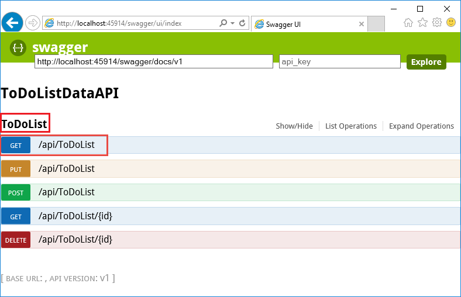
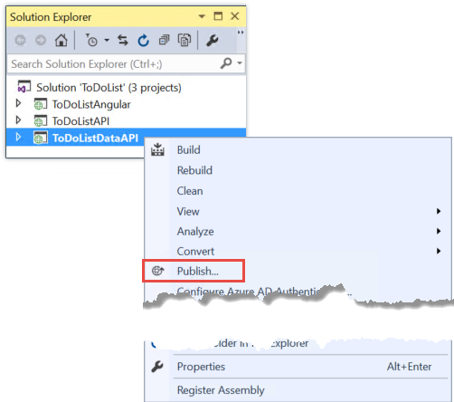
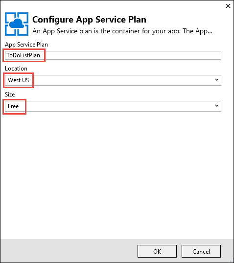
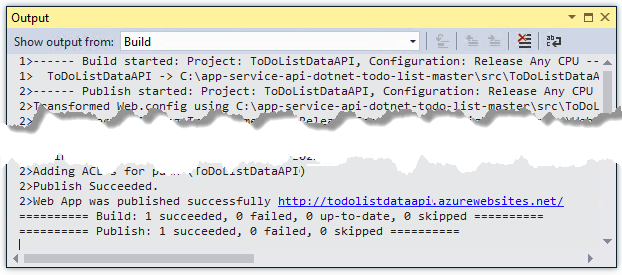
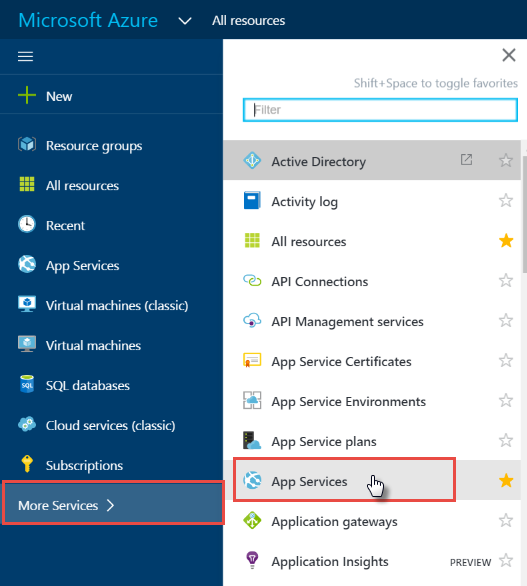

<properties
    pageTitle="Prise en main des applications de l’API et ASP.NET dans le Service d’application | Microsoft Azure"
    description="Découvrez comment créer, déployer et utiliser une application API ASP.NET dans le Service d’application Azure, à l’aide de Visual Studio 2015."
    services="app-service\api"
    documentationCenter=".net"
    authors="tdykstra"
    manager="wpickett"
    editor=""/>

<tags
    ms.service="app-service-api"
    ms.workload="na"
    ms.tgt_pltfrm="dotnet"
    ms.devlang="na"
    ms.topic="hero-article"
    ms.date="09/20/2016"
    ms.author="rachelap"/>

# Prise en main applications API ASP.NET et Swagger dans le Service d’application Azure

[AZURE.INCLUDE [selector](../../includes/app-service-api-get-started-selector.md)]

Il s’agit de la première d’une série de didacticiels qui montrent comment utiliser les fonctionnalités de Service d’application Azure qui sont utiles pour développer et héberger API RESTful.  Ce didacticiel décrit la prise en charge pour les métadonnées de l’API au format Swagger.

Vous allez découvrir :

* Découvrez comment créer et déployer des [applications de l’API](app-service-api-apps-why-best-platform.md) dans le Service d’application Azure à l’aide des outils intégrés dans Visual Studio 2015.
* Découvrez comment automatiser la découverte de l’API en utilisant le package Swashbuckle NuGet pour générer dynamiquement des métadonnées de l’API Swagger.
* Comment utiliser les métadonnées de l’API Swagger pour générer automatiquement le code de client pour une application API.

## Vue d’ensemble des applications exemple

Dans ce didacticiel, vous travaillez avec une application d’exemple de liste des tâches simples. L’application a un frontal de l’application d’une page simple (SPA), un niveau intermédiaire API Web ASP.NET et un niveau de données API Web ASP.NET.

Voici une capture d’écran de la partie frontale [AngularJS](https://angularjs.org/) .

La solution Visual Studio comprend trois projets :

* **ToDoListAngular** - le serveur frontal : un SPA AngularJS par l’intermédiaire des appels.

* **ToDoListAPI** - le niveau intermédiaire : un projet d’API Web ASP.NET appelle la couche de données pour effectuer les opérations sur les listes des tâches.

* **ToDoListDataAPI** - la couche de données : un projet d’API Web ASP.NET qui effectue les opérations sur les listes des tâches.

L’architecture à trois niveaux est un des nombreux architectures que vous pouvez mettre en œuvre à l’aide de l’API applications et êtes utilisé ici uniquement à des fins de démonstration. Le code de chaque niveau est aussi simple que possible montrer les fonctionnalités de l’API applications ; par exemple, la couche données utilise mémoire serveur plutôt que sur une base de données comme mécanisme de persistance.

Sur la fin de ce didacticiel, vous disposerez les deux projets d’API Web vers le haut et en cours d’exécution dans le cloud dans les applications API de Service d’application.

Le didacticiel suivant dans la série déploie le frontal SPA dans le cloud.

## Conditions préalables

* API Web ASP.NET - les instructions didacticiels part du principe que vous avez une connaissance de base de l’utilisation des ASP.NET [Web API 2](http://www.asp.net/web-api/overview/getting-started-with-aspnet-web-api/tutorial-your-first-web-api) dans Visual Studio.

* Compte Azure - vous pouvez [Ouvrir un compte Azure gratuitement](/pricing/free-trial/?WT.mc_id=A261C142F) ou [avantages d’abonné activer Visual Studio](/pricing/member-offers/msdn-benefits-details/?WT.mc_id=A261C142F).

    Si vous voulez commencer avec le Service d’application Azure avant de vous inscrivez à un compte Azure, accédez à [Essayer le Service application](http://go.microsoft.com/fwlink/?LinkId=523751). Vous pouvez créer une application starter courte immédiatement dans le Service d’application : **Aucune carte de crédit requis**et aucun engagements.

* Visual Studio 2015 avec le [Kit de développement logiciel Azure pour .NET](https://azure.microsoft.com/downloads/archive-net-downloads/) - le Kit de développement installe Visual Studio 2015 automatiquement si vous n’avez pas dessus.

    * Dans Visual Studio, cliquez sur Aide -> à propos de Microsoft Visual Studio et vérifiez que « Outils Azure Application Service v2.9.1 » ou une version ultérieure est installé.

    

    >[AZURE.NOTE] En fonction du nombre des dépendances SDK vous disposez déjà sur votre ordinateur, l’installation du Kit de développement peut prendre beaucoup de temps, de quelques minutes au moins d’une demi-heure.

## Télécharger l’exemple d’application

1. Télécharger le référentiel [Azure-Samples/app-service-api-dotnet-to-do-list](https://github.com/Azure-Samples/app-service-api-dotnet-todo-list) .

    Vous pouvez cliquer sur le bouton **Télécharger ZIP** ou cloner le référentiel sur votre ordinateur local.

2. Ouvrez la solution de la liste des tâches dans Visual Studio 2015 ou 2013.
   1. Vous avez besoin d’approuver chaque solution.
        

3. Générez la solution (CTRL + MAJ + B) pour restaurer les packages NuGet.

    Si vous souhaitez voir l’application en opération avant le déploiement, vous pouvez l’exécuter localement. Assurez-vous que ToDoListDataAPI se trouve votre projet de démarrage et exécuter la solution. Vous devriez voir une erreur 403 HTTP dans votre navigateur.

## Utiliser l’interface utilisateur et les métadonnées de l’API Swagger

Prise en charge pour les métadonnées de l’API [Swagger](http://swagger.io/) 2.0 intégré à Azure Application Service. Chaque application API pouvez spécifier un point de terminaison URL qui renvoie les métadonnées de l’API au format JSON Swagger. Les métadonnées retournée à partir de ce point de terminaison peuvent être utilisées pour générer le code de client.

Un projet d’API Web ASP.NET peut générer dynamiquement métadonnées Swagger en utilisant le package NuGet [Swashbuckle](https://www.nuget.org/packages/Swashbuckle) . Le package Swashbuckle NuGet est déjà installé dans les projets ToDoListDataAPI et ToDoListAPI que vous avez téléchargé.

Dans cette section du didacticiel, vous examinez les métadonnées 2.0 Swagger générée, et puis que vous essayez un essai à l’interface utilisateur qui est basé sur les métadonnées Swagger.

1. Définir le projet ToDoListDataAPI (**pas** le projet ToDoListAPI) en tant que le projet de démarrage.

    

2. Appuyez sur F5 ou cliquez sur **Déboguer > Démarrer le débogage** pour exécuter le projet en mode débogage.

    Le navigateur s’ouvre et affiche la page d’erreur HTTP 403.

3. Dans la barre d’adresse de votre navigateur, ajoutez `swagger/docs/v1` à la fin de la ligne, puis appuyez sur retour. (L’URL est `http://localhost:45914/swagger/docs/v1`.)

    Il s’agit de l’URL par défaut utilisée par Swashbuckle retourner les métadonnées de Swagger 2.0 JSON pour l’API.

    Si vous utilisez Internet Explorer, le navigateur vous invite à télécharger un fichier *v1.json* .

    

    Si vous utilisez Chrome, Firefox ou bord, le navigateur affiche la JSON dans la fenêtre du navigateur. Différents navigateurs gèrent JSON différemment, et la fenêtre du navigateur peut ressembler pas exactement à l’exemple.

    

    L’exemple suivant illustre la première section des métadonnées Swagger pour l’API, la définition de la méthode Get. Ces métadonnées sont que lecteurs de l’interface utilisateur Swagger que vous utilisez dans les étapes suivantes et que vous utilisez dans une section ultérieure de ce didacticiel pour générer automatiquement le code de client.

        {
          "swagger": "2.0",
          "info": {
            "version": "v1",
            "title": "ToDoListDataAPI"
          },
          "host": "localhost:45914",
          "schemes": [ "http" ],
          "paths": {
            "/api/ToDoList": {
              "get": {
                "tags": [ "ToDoList" ],
                "operationId": "ToDoList_GetByOwner",
                "consumes": [ ],
                "produces": [ "application/json", "text/json", "application/xml", "text/xml" ],
                "parameters": [
                  {
                    "name": "owner",
                    "in": "query",
                    "required": true,
                    "type": "string"
                  }
                ],
                "responses": {
                  "200": {
                    "description": "OK",
                    "schema": {
                      "type": "array",
                      "items": { "$ref": "#/definitions/ToDoItem" }
                    }
                  }
                },
                "deprecated": false
              },

4. Fermez le navigateur et arrêter le débogage Visual Studio.

5. Dans le projet ToDoListDataAPI dans **L’Explorateur de solutions**, ouvrez le fichier *App_Start\SwaggerConfig.cs* , puis faites défiler jusqu'à la ligne 174 et ne commentez pas le code suivant.

        /*
            })
        .EnableSwaggerUi(c =>
            {
        */

    Le fichier *SwaggerConfig.cs* est créé lorsque vous installez le package Swashbuckle dans un projet. Le fichier fournit plusieurs façons de configurer Swashbuckle.

    Le code que vous avez supprimées permet à l’interface utilisateur Swagger que vous utilisez dans les étapes suivantes. Lorsque vous créez un projet d’API Web à l’aide du modèle de projet application API, ce code est commenté par défaut par mesure de sécurité.

6. Exécutez à nouveau le projet.

7. Dans la barre d’adresse de votre navigateur, ajoutez `swagger` à la fin de la ligne, puis appuyez sur retour. (L’URL est `http://localhost:45914/swagger`.)

8. Lorsque la page de l’interface utilisateur Swagger s’affiche, cliquez sur **liste des tâches** pour afficher les méthodes disponibles.

    

9. Cliquez sur le premier bouton **obtenir** dans la liste.

10. Dans la section **paramètres** , entrez un astérisque en tant que la valeur de la `owner` paramètre, puis cliquez sur **essayer**.

    Lorsque vous ajoutez l’authentification dans les didacticiels suivants, la couche intermédiaire constituent l’ID utilisateur réel à la couche de données. Pour l’instant, toutes les tâches ont astérisque en tant que leur ID propriétaire pendant l’exécution de l’application sans l’authentification est activée.

    

    L’interface utilisateur Swagger appelle la liste des tâches obtenir méthode et affiche le code de réponse et JSON des résultats.

    

11. Cliquez sur **Publier**, puis cliquez sur la zone sous **Schéma de modèle**.

    En cliquant sur le schéma de modèle indique automatiquement la zone d’entrée dans laquelle vous pouvez spécifier la valeur du paramètre de la méthode de publication. (Si cela ne fonctionne pas dans Internet Explorer, utilisez un autre navigateur ou entrez la valeur du paramètre manuellement dans l’étape suivante.)  

    

12. Modifier le JSON dans le `todo` paramètre d’entrée zone afin qu’il ressemble à l’exemple suivant, ou remplacer par votre propre texte description :

        {
          "ID": 2,
          "Description": "buy the dog a toy",
          "Owner": "*"
        }

13. Cliquez sur **essayer**.

    L’API de la liste des tâches renvoie un code de réponse HTTP 204 qui indique le succès.

14. Cliquez sur le bouton **obtenir** en premier, puis cliquez sur le bouton **essayer** dans cette section de la page.

    La réponse de la méthode Get inclut désormais la nouvelle tâche.

15. Facultatif : Essayez également la place, supprimer et accéder à l’aide de méthodes ID.

16. Fermez le navigateur et arrêter le débogage Visual Studio.

Swashbuckle fonctionne avec n’importe quel projet API Web ASP.NET. Si vous souhaitez ajouter la génération de métadonnées Swagger à un projet existant, installez simplement le package Swashbuckle.

>[AZURE.NOTE] Métadonnées swagger incluent un ID unique pour chaque opération API. Par défaut, Swashbuckle peut générer opération Swagger en double ID pour vos méthodes de contrôleur d’API Web. Cela se produit si votre manette a surchargé méthodes HTTP, tel que `Get()` et `Get(id)`. Pour plus d’informations sur la façon de traiter les surcharges, voir [définitions API généré Swashbuckle personnaliser](app-service-api-dotnet-swashbuckle-customize.md). Si vous créez un projet d’API Web dans Visual Studio à l’aide du modèle d’application de l’API Azure, code qui génère opération unique ID est automatiquement ajouté dans le fichier *SwaggerConfig.cs* .  

## Créer une application API dans Azure et déployer le code à celui-ci

Dans cette section, vous utilisez des outils Azure qui sont intégrés dans l’Assistant Visual Studio **Publier le site Web** pour créer une nouvelle application API dans Azure. Puis vous déployez le projet ToDoListDataAPI sur la nouvelle application API et appelez l’API en exécutant l’interface utilisateur Swagger.

1. Dans l' **Explorateur de solutions**, cliquez sur le projet ToDoListDataAPI, puis cliquez sur **Publier**.

    

2.  Dans l’étape de **profil** de l’Assistant **Publier le site Web** , cliquez sur **Microsoft Azure Application Service**.

    

3. Connectez-vous à votre compte Azure si vous ne le n'avez pas déjà fait, ou actualiser vos informations d’identification si elles vous expiré.

4. Dans la boîte de dialogue Service d’application, choisissez l' Azure **abonnement** que vous voulez utiliser, puis cliquez sur **Nouveau**.

    

    L’onglet **hébergement prend en charge** de la boîte de dialogue **Créer application Service** apparaît.

    Étant donné que vous déployez un projet d’API Web ayant Swashbuckle installé, Visual Studio suppose que vous voulez créer une application API. Ceci est indiqué par le **Nom de l’application API** titre et par le fait que la liste déroulante **Type de modification** est définie à **L’API application**.

    

5. Entrez un **Nom de l’application API** qui est unique dans le domaine *azurewebsites.net* . Vous pouvez accepter le nom par défaut Visual Studio proposé.

    Si vous entrez un nom de quelqu'un d’autre a déjà utilisé, vous voyez un point d’exclamation rouge vers la droite.

    L’URL de l’application API sera `{API app name}.azurewebsites.net`.

6. Dans le menu déroulant **Groupe de ressources** , cliquez sur **Nouveau**et entrez « ToDoListGroup » ou un autre nom si vous préférez.

    Un groupe de ressources est un ensemble de ressources Azure tels que l’API applications bases de données, machines virtuelles et ainsi de suite. Pour ce didacticiel, il est conseillé de créer un nouveau groupe de ressources, car cela facilite la supprimer en une seule étape toutes les ressources Azure que vous créez pour le didacticiel.

    Cette case vous permet de sélectionner un [groupe de ressources](../azure-resource-manager/resource-group-overview.md) existant ou créez-en une en tapant un nom qui est différent de n’importe quel groupe de ressources existant dans votre abonnement.

7. Cliquez sur le bouton **Nouveau** en regard de **l’Application Service planifier** liste déroulante.

    La capture d’écran montre des exemples de valeurs pour **Nom de l’application API**, **abonnement**et **Groupe de ressources** : vos valeurs seront différents.

    

    Dans la procédure suivante vous créez un plan de services d’application pour le nouveau groupe de ressources. Un plan de services d’application spécifie les ressources de calcul qui s’exécute à votre application API sur. Par exemple, si vous choisissez la couche gratuite, votre application API s’exécute sur machines virtuelles partagés, tandis que pour certains niveaux payant il s’exécute sur machines virtuelles dédiés. Pour plus d’informations sur les offres de Service d’application, voir [vue d’ensemble des offres de Service d’application](../app-service/azure-web-sites-web-hosting-plans-in-depth-overview.md).

8. Dans la boîte de dialogue **Configurer un Plan de Service application** , entrez « ToDoListPlan » ou un autre nom si vous préférez.

9. Dans la liste déroulante **emplacement** , choisissez l’emplacement le plus proche de vous.

    Ce paramètre spécifie le centre de données Azure votre application est exécuté en. Choisissez un emplacement près de vous pour réduire la [latence](http://www.bing.com/search?q=web%20latency%20introduction&qs=n&form=QBRE&pq=web%20latency%20introduction&sc=1-24&sp=-1&sk=&cvid=eefff99dfc864d25a75a83740f1e0090).

10. Dans le menu déroulant **taille** , cliquez sur **libre**.

    Pour ce didacticiel, le niveau de tarification gratuit offre des performances suffisantes.

11. Dans la boîte de dialogue **Configurer un Plan de Service application** , cliquez sur **OK**.

    

12. Dans la boîte de dialogue **Créer un Service de l’application** , cliquez sur **créer**.

    

    Visual Studio crée l’application API et un profil de publication qui comporte tous les paramètres requis pour l’application de l’API. Il s’ouvre l’Assistant **Publier le site Web** que vous utiliserez pour déployer le projet.

    L’Assistant **Publier le site Web** s’ouvre sur l’onglet **connexion** (illustré ci-dessous).

    Sous l’onglet **connexion** , les **nom du Site** paramètres du **serveur** et pointez sur votre application API. Le **nom d’utilisateur** et **mot de passe** sont les informations d’identification de déploiement Azure crée pour vous. Après le déploiement, Visual Studio ouvre un navigateur à l' **URL de Destination** (c’est le seul objectif de **l’URL de Destination**).  

13. Cliquez sur **suivant**.

    

    L’onglet suivant est l’onglet **paramètres** (voir ci-dessous). Ici, vous pouvez modifier l’onglet configuration de build pour déployer une version de débogage pour le [débogage distant](../app-service-web/web-sites-dotnet-troubleshoot-visual-studio.md#remotedebug). L’onglet propose également plusieurs **Options de publication de fichier**:

    * Supprimer des fichiers supplémentaires à la destination
    * Précompiler lors de la publication
    * Exclure des fichiers à partir du dossier App_Data

    Pour ce didacticiel vous n’avez pas besoin suivantes. Pour obtenir une description détaillée de leurs activités, voir [Comment : déployer un Web Project à l’aide de publication en un clic dans Visual Studio](https://msdn.microsoft.com/library/dd465337.aspx).

14. Cliquez sur **suivant**.

    

    L’option suivant est l’onglet **Aperçu** (illustré ci-dessous), afin d’obtenir une opportunité pour voir quels fichiers vous souhaitez être copié à partir de votre projet à l’application de l’API. Lorsque vous déployez un projet pour une application API que vous avez déjà déployé sur précédemment, seuls les fichiers modifiés sont copiées. Si vous souhaitez afficher une liste de ce que seront copié, vous pouvez cliquez sur le bouton **Démarrer Preview** .

15. Cliquez sur **Publier**.

    

    Visual Studio déploie le projet ToDoListDataAPI sur la nouvelle application API. La fenêtre de **sortie** connecte déploiement réussi, et une page « créée avec succès » s’affiche dans une fenêtre de navigateur ouverte à l’URL de l’application API.

    

    

16. Ajouter « swagger » à l’URL dans la barre d’adresses du navigateur et appuyez sur ENTRÉE. (L’URL est `http://{apiappname}.azurewebsites.net/swagger`.)

    Le navigateur affiche la même Swagger l’interface utilisateur que vous avez vu plus haut, mais il est en cours d’exécution dans le cloud. Essayez la méthode Get, et que vous pouvez revenir à la valeur par défaut 2 des listes des tâches. Les modifications que vous avez apportées précédemment ont été enregistrées en mémoire dans l’ordinateur local.

17. Ouvrez le [portail Azure](https://portal.azure.com/).

    Le portail Azure est une interface web pour la gestion des ressources Azure tels que des applications de l’API.

18. Cliquez sur **plusieurs Services > application Services**.

    

19. Dans la carte de **Services d’application** , recherchez et cliquez sur votre nouvelle application API. (Dans le portail Azure, fenêtres qui s’ouvrent à droite sont appelées *cartes*).

    

    Deux cartes ouvrir. Une carte a une vue d’ensemble de l’application API, et a une longue liste de paramètres que vous pouvez afficher et modifier.

20. Dans la carte de **paramètres** , recherchez la section **API** et cliquez sur **La définition de l’API**.

    

    La carte de **Définition de l’API** vous permet de spécifier l’URL qui renvoie les métadonnées Swagger 2.0 au format JSON. Lorsque Visual Studio crée l’application API, il définit l’URL de la définition de l’API à la valeur par défaut pour Swashbuckle métadonnées générées que vous avez vu plus haut, ce qui correspond à l’application de l’API de base d’un signe plu URL `/swagger/docs/v1`.

    

    Lorsque vous sélectionnez une application API pour générer le code client pour qu’elle, Visual Studio récupère les métadonnées de cette URL.

## Générer le code client pour le niveau de données

Un des avantages de l’intégration Swagger dans applications Azure API est génération de code automatique. Les classes client générée facilement l’écrire du code qui appelle une application API.

Le projet ToDoListAPI a déjà le code client généré, mais dans la procédure suivante vous supprimez-le et régénérer pour voir comment effectuer la génération de code.

1. Dans Visual Studio **L’Explorateur de solutions**, dans le projet ToDoListAPI, supprimez le dossier *ToDoListDataAPI* . **Attention : Supprimer uniquement le dossier, et non sur le projet ToDoListDataAPI.**

    

    Ce dossier a été créé en utilisant le processus de génération de code que vous êtes sur le point de traitée.

2. Cliquez sur le projet ToDoListAPI, puis cliquez sur **Ajouter > Client de l’API REST**.

    

3. Dans la boîte de dialogue **Ajouter un Client de l’API REST** , cliquez sur **URL Swagger**, puis cliquez sur **Sélectionner Azure actifs**.

    

4. Dans la boîte de dialogue **Service d’application** , développez le groupe de ressources que vous utilisez pour ce didacticiel, puis sélectionnez votre application API, puis cliquez sur **OK**.

    

    Remarquez que lorsque vous revenez à la boîte de dialogue **Ajouter un Client de l’API REST** , la zone de texte a été indiquée à l’aide de la définition de l’API valeur de l’URL que vous avez vu plus haut dans le portail.

    

    >[AZURE.TIP] Un autre moyen d’obtenir des métadonnées de génération du code consiste à entrer l’URL directement, plutôt que d’utiliser la boîte de dialogue Parcourir. Ou, si vous souhaitez générer le code client avant de déployer sur Azure, vous peut exécuter le projet API Web localement, accédez à l’URL qui fournit le fichier JSON Swagger, enregistrez le fichier et utilisez l’option **Sélectionner un fichier de métadonnées Swagger existant** .

5. Dans la boîte de dialogue **Ajouter un Client de l’API REST** , cliquez sur **OK**.

    Visual Studio crée un dossier nommé après l’application de l’API et génère des classes client.

    

6. Dans le projet ToDoListAPI, ouvrez *Controllers\ToDoListController.cs* pour visualiser le code en ligne 40 qui appelle l’API en utilisant le client généré.

    L’extrait suivant montre comment le code instancie l’objet client et appelle la méthode Get.

        private static ToDoListDataAPI NewDataAPIClient()
        {
            var client = new ToDoListDataAPI(new Uri(ConfigurationManager.AppSettings["toDoListDataAPIURL"]));
            return client;
        }

        public async Task<IEnumerable<ToDoItem>> Get()
        {
            using (var client = NewDataAPIClient())
            {
                var results = await client.ToDoList.GetByOwnerAsync(owner);
                return results.Select(m => new ToDoItem
                {
                    Description = m.Description,
                    ID = (int)m.ID,
                    Owner = m.Owner
                });
            }
        }

    Le paramètre de constructeur obtient l’URL du point de terminaison de la `toDoListDataAPIURL` paramètre d’application. Dans le fichier Web.config, cette valeur est définie à l’URL Express IIS local du projet API afin que vous pouvez exécuter l’application localement. Si vous omettez le paramètre de constructeur, le point de terminaison par défaut est l’URL que vous avez créé le code à partir de.

7. Votre classe de client est généré avec un nom différent en fonction de votre nom de l’application API ; modifier le code dans *Controllers\ToDoListController.cs* afin que le nom du type correspond à ce qui a été généré dans votre projet. Par exemple, si vous avez nommé votre ToDoListDataAPI071316 application API, vous devez modifier ce code :

        private static ToDoListDataAPI NewDataAPIClient()
        {
            var client = new ToDoListDataAPI(new Uri(ConfigurationManager.AppSettings["toDoListDataAPIURL"]));

à cet effet :

        private static ToDoListDataAPI071316 NewDataAPIClient()
        {
            var client = new ToDoListDataAPI071316(new Uri(ConfigurationManager.AppSettings["toDoListDataAPIURL"]));

## Créer une application API pour héberger la couche intermédiaire

Plus tôt vous [créé à l’application de l’API de niveau de données et déployé code à celui-ci](#createapiapp).  Maintenant que vous suivez la procédure pour l’application de l’API intermédiaire.

1. Dans l' **Explorateur de solutions**, cliquez sur la couche intermédiaire ToDoListAPI project (pas la couche données ToDoListDataAPI), puis cliquez sur **Publier**.

    

2.  Dans l’onglet **profil** de l’Assistant **Publier le site Web** , cliquez sur **Microsoft Azure Application Service**.

3. Dans la boîte de dialogue **Service d’application** , cliquez sur **Nouveau**.

4. Dans l’onglet **hébergement prend en charge** de la boîte de dialogue **Créer application Service** , acceptez le **Nom de l’application API** par défaut ou entrez un nom qui est unique dans le domaine *azurewebsites.net* .

5. Choisissez l' Azure **abonnement** que vous avez utilisé.

6. Dans le menu déroulant **Groupe de ressources** , choisissez le même groupe de ressources que vous avez créée.

7. Dans le menu déroulant **Plan de services d’application** , sélectionnez la même offre que vous avez créée. Il utilise par défaut cette valeur.

8. Cliquez sur **créer**.

    Visual Studio crée l’application API, crée un profil de publication pour qu’elle et affiche l’étape de **connexion** de l’Assistant **Publier le site Web** .

9.  Dans l’étape de **connexion** de l’Assistant **Publier le site Web** , cliquez sur **Publier**.

    Visual Studio déploie le projet ToDoListAPI pour la nouvelle application API et ouvre un navigateur à l’URL de l’application API. La page « créée avec succès » s’affiche.

## Configurer la couche du milieu pour appeler la couche de données

Si vous avez appelé l’application intermédiaire API maintenant, il serait essayez d’appeler la couche de données à l’aide de l’URL hôte local qui est toujours dans le fichier Web.config. Dans cette section vous entrez l’URL de l’application de données couche API dans un paramètre d’environnement dans l’application de l’API intermédiaire. Lorsque le code dans l’application intermédiaire API récupère le paramètre de URL de niveau de données, le paramètre d’environnement remplace Nouveautés dans le fichier Web.config.

1. Accédez au [portail Azure](https://portal.azure.com/)et accédez à la carte de **L’API application** pour l’application de l’API que vous avez créé pour héberger le projet TodoListAPI (intermédiaire).

2. Dans la carte de **paramètres** de l’application API, cliquez sur **paramètres de l’Application**.

3. Dans la carte de **Paramètres de l’Application** de l’application API, faites défiler jusqu'à la section **paramètres de l’application** et ajoutez la clé et la valeur suivante. La valeur sera l’URL de l’application API première que vous avez publié dans ce didacticiel.

  	| **Clé** | toDoListDataAPIURL |
  	|---|---|
  	| **Valeur** | https://{Your le nom de l’application couche API données} .azurewebsites .net |
  	| **Exemple** | https://todolistdataapi.azurewebsites.NET |

4. Cliquez sur **Enregistrer**.

    

    Lorsqu’il s’exécute dans Azure, cette valeur remplace désormais le URL d’hôte local qui se trouve dans le fichier Web.config.

## Test

1. Dans une fenêtre de navigateur, accédez à l’URL de la nouvelle API application intermédiaire que vous venez de créer pour ToDoListAPI. Vous pouvez y accéder en cliquant sur l’URL dans la carte principale de l’application de l’API dans le portail.

2. Ajouter « swagger » à l’URL dans la barre d’adresses du navigateur et appuyez sur ENTRÉE. (L’URL est `http://{apiappname}.azurewebsites.net/swagger`.)

    Le navigateur affiche la même Swagger l’interface utilisateur que vous avez vu plus haut pour ToDoListDataAPI, mais désormais `owner` n’est pas un champ obligatoire pour l’opération, car l’application intermédiaire API envoie cette valeur à l’application de l’API de niveau de données pour vous. (Lorsque vous effectuez les didacticiels de l’authentification, la couche intermédiaire vous envoie un ID utilisateur réel le `owner` paramètre ; pour maintenant il est irréversible un astérisque.)

3. Essayer la méthode Get et les autres méthodes pour valider que l’application de l’API intermédiaire appelle avec succès l’application de l’API de niveau de données.

    

## Résolution des problèmes

Si vous rencontrez un problème tout au long de ce didacticiel ici sont quelques suggestions de résolution des problèmes :

* Vérifiez que vous utilisez la dernière version du [Kit de développement logiciel Azure pour .NET](http://go.microsoft.com/fwlink/?linkid=518003).

* Deux des noms de projet sont similaire (ToDoListAPI, ToDoListDataAPI). Si les éléments ne s’affichent comme décrit dans les instructions lorsqu’il s’agit d’un projet, vérifiez que vous avez ouvert le projet approprié.

* Si vous êtes sur un réseau d’entreprise et essayez à déployer Azure Application Service via un pare-feu, vérifiez que les ports 443 et 8172 sont ouverts pour déployer Web. Si vous ne pouvez pas ouvrir les ports, vous pouvez utiliser d’autres méthodes de déploiement.  Voir [déployer votre application Azure Application Service](../app-service-web/web-sites-deploy.md).

* Erreurs « noms d’itinéraire doivent être uniques » : vous pouvez obtenir ces si vous accidentellement déployez le projet incorrect dans une application API et puis déployez ultérieurement celui qui convient à celui-ci. Pour corriger ce problème, redéploiement le projet approprié à l’application de l’API, puis sur l’onglet **paramètres** de l’Assistant **Publier le site Web** sélectionnez **Supprimer les fichiers supplémentaires à la destination**.

Une fois que vous avez votre application API ASP.NET en cours d’exécution dans le Service d’application Azure, vous souhaiterez en savoir plus sur les fonctionnalités de Visual Studio qui simplifient la résolution des problèmes. Pour plus d’informations sur la journalisation, débogage distant et plus d’informations, voir [dépannage Azure Application Service applications dans Visual Studio](../app-service-web/web-sites-dotnet-troubleshoot-visual-studio.md).

## Étapes suivantes

Vous avez appris à déployer des projets d’API Web existantes aux applications API, générer le code de client pour les applications de l’API et utiliser les applications de l’API à partir de clients .NET. Le didacticiel suivant de cette série indique comment [utiliser CORS consommer API applications à partir de clients JavaScript](app-service-api-cors-consume-javascript.md).

Pour plus d’informations sur la génération de code client, voir le référentiel [Azure/AutoRest](https://github.com/azure/autorest) sur GitHub.com. Pour obtenir de l’aide des problèmes en utilisant le client généré, ouvrez un [problème dans le référentiel AutoRest](https://github.com/azure/autorest/issues).

Si vous souhaitez créer des projets d’application de l’API à partir de zéro, utilisez le modèle **d’Application de l’API Azure** .

Le modèle de projet **Azure API application** équivaut à choisir la **vide** ASP.NET 4.5.2 modèle, en cliquant sur la case à cocher pour ajouter la prise en charge API Web et l’installation du package Swashbuckle NuGet. En outre, le modèle ajoute du code de configuration Swashbuckle conçu pour empêcher la création de doublons Swagger opération ID. Une fois que vous avez créé un projet d’API application, vous pouvez le déployez dans une application API la même façon que vous l’avez vu dans ce didacticiel.
