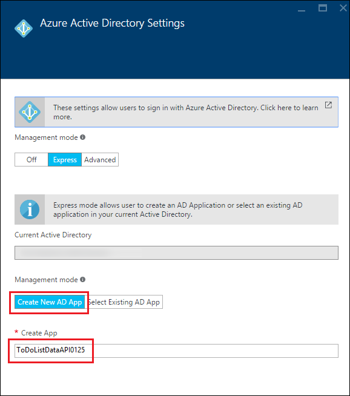
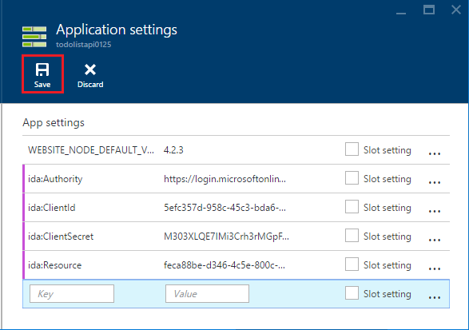

<properties
    pageTitle="Authentification principale du service pour les applications de l’API dans le Service d’application Azure | Microsoft Azure"
    description="Découvrez comment protéger une application API dans le Service d’application Azure pour les scénarios de service à service."
    services="app-service\api"
    documentationCenter=".net"
    authors="tdykstra"
    manager="wpickett"
    editor=""/>

<tags
    ms.service="app-service-api"
    ms.workload="na"
    ms.tgt_pltfrm="dotnet"
    ms.devlang="na"
    ms.topic="article"
    ms.date="06/30/2016" 
    ms.author="rachelap"/>

# Authentification principale du service pour les applications de l’API dans le Service d’application Azure

## Vue d’ensemble

Cet article explique comment utiliser l’authentification du Service d’application pour l’accès *interne* aux applications API. Un scénario interne est l’endroit où vous avez une application API que vous souhaitez être consommable uniquement par votre propre code de l’application. Les procédures recommandées pour implémenter ce scénario dans le Service d’application consiste à utiliser Azure AD pour protéger l’application de l’API appelée. Vous appelez l’application API protégée avec un jeton PORTEUR que vous obtenez à partir d’Azure AD en fournissant des informations d’identification (service principal) identité de l’application. Pour des alternatives à l’aide de Azure AD, consultez la section **authentification de Service au service** de [vue d’ensemble de l’authentification Azure Application Service](../app-service/app-service-authentication-overview.md#service-to-service-authentication).

Dans cet article, vous allez découvrir :

* Comment utiliser Azure Active Directory (AD Azure) pour protéger une application API des accès non authentifiés.
* Découvrez comment utiliser une application API protégée à partir d’une application API, une application web ou une application mobile à l’aide des informations d’identification Azure AD service principal (identité de l’application). Pour plus d’informations sur l’utilisation d’une application logique, voir [utilisation votre API personnalisé hébergé sur Service d’application avec les applications logique](../app-service-logic/app-service-logic-custom-hosted-api.md).
* Comment s’assurer que l’application API protégée ne peut pas être appelée depuis un navigateur par les utilisateurs connectés.
* Comment faire pour vous assurer que l’application API protégée ne peut être appelée par un spécifique Azure AD service principal.

L’article comporte deux sections :

* La section [comment configurer l’authentification principal du service dans le Service d’application Azure](#authconfig) explique en général comment configurer l’authentification pour une application API et comment utiliser l’application API protégée. Cette section s’applique également à tous les cadres pris en charge par le Service d’application, y compris .NET, Node.js et Java.

* À partir de la section [poursuivre les didacticiels .NET mise en route](#tutorialstart) , le didacticiel vous guide dans la configuration d’un scénario « accès interne » pour un exemple d’application .NET en cours d’exécution dans le Service d’application. 

## Comment configurer l’authentification principal du service dans le Service d’application Azure

Cette section fournit des instructions générales qui s’appliquent à n’importe quelle application API. Pour obtenir la procédure spécifique à l’application d’exemple à faire liste .NET, accédez à [poursuivre la série de didacticiels .NET API applications](#tutorialstart).

1. Dans le [portail Azure](https://portal.azure.com/), accédez à la carte de **paramètres** de l’application de l’API que vous voulez protéger, puis recherchez la section de **fonctionnalités** et cliquez sur **authentification / autorisation**.

    

3. Dans la **authentification / autorisation** carte, cliquez **sur**.

4. Dans la liste déroulante **Action à effectuer lors de la requête n’est pas authentifié** , sélectionnez **se connecter avec Azure Active Directory** .

5. Sous **Fournisseurs d’authentification**, sélectionnez **Azure Active Directory**.

    

6. Configurer la carte de **Paramètres Azure Active Directory** pour créer une nouvelle application Azure AD, ou utilisez une application Azure AD existante si vous disposez déjà d’un que vous souhaitez utiliser.

    Scénarios internes impliquent généralement une application API une application API l’appel. Vous pouvez utiliser distincte Azure applications AD pour chaque application API ou une application Azure AD.

    Pour obtenir des instructions détaillées sur cette carte, Découvrez [comment configurer votre application de Service d’application pour utiliser la connexion Azure Active Directory](../app-service-mobile/app-service-mobile-how-to-configure-active-directory-authentication.md).

7. Lorsque vous avez terminé avec la carte de configuration du fournisseur d’authentification, cliquez sur **OK**.

7. Dans la **authentification / autorisation** carte, cliquez sur **Enregistrer**.

    

Dans ce cas, l’application Service autorise uniquement les demandes des appelants dans la configuration client Azure AD. Aucun code d’authentification ou d’autorisation n’est requise dans l’application de l’API protégée. Le jeton porteur est passé à l’application de l’API ainsi que fréquemment utilisées sur les revendications dans les en-têtes HTTP, et vous pouvez lire les informations dans le code permet de contrôler les demandes provenant d’un appelant particulier, par exemple un principal de service.

Cette fonctionnalité d’authentification fonctionne de la même façon pour toutes les langues prises en charge du service de l’application, y compris .NET, Node.js et Java. 

#### Comment utiliser l’application API protégée

L’appelant doit fournir un support OAuth Azure AD des appels API. Pour obtenir un support OAuth à l’aide des informations d’identification principal de service, l’appelant utilise la bibliothèque d’authentification Active Directory (terme ADAL pour [.NET](https://www.nuget.org/packages/Microsoft.IdentityModel.Clients.ActiveDirectory), [Node.js](https://github.com/AzureAD/azure-activedirectory-library-for-nodejs)ou [Java](https://github.com/AzureAD/azure-activedirectory-library-for-java)). Pour obtenir un jeton, le code qui appelle terme ADAL fournit à terme ADAL les informations suivantes :

* Le nom de votre client Azure AD.
* L’ID de client et le client secret (touche application) de l’application Azure AD associée à l’appelant.
* L’ID de client de l’application Azure AD associée à l’application de l’API protégée. (Si une application Azure AD est utilisée, il est l’ID de client même que celui de l’appelant.)

Les valeurs suivantes sont disponibles dans les pages Azure AD du [portail classique Azure](https://manage.windowsazure.com/).

Une fois que le jeton a été acquis, l’appelant inclut les requêtes HTTP dans l’en-tête d’autorisation.  Application Service valide le jeton et permet des demandes d’atteindre l’application API protégée.

#### La protection de l’application API à partir d’access par les utilisateurs dans un seul client

Jetons porteur pour les utilisateurs dans un seul client sont considérés comme valides pour l’application de l’API protégée.  Si vous voulez vous assurer qu’uniquement un principal de service peut appeler l’application API protégée, ajoutez le code dans l’application API protégée pour valider les affirmations suivantes à partir du jeton :

* `appid`doit être l’ID de client de l’application Azure AD associé à l’appelant. 
* `oid`(`objectidentifier`) doit être le numéro principal de service de l’appelant. 

Application Service fournit également la `objectidentifier` réclamer dans l’en-tête X-MS-CLIENT-PRINCIPAL-ID.

### La protection de l’application API d’accès d’un navigateur

Si vous ne validez revendications dans le code dans l’application de l’API protégée et si vous utilisez une nouvelle application Azure AD pour l’application de l’API protégée, vérifiez que réponse URL l’application Azure AD n’est pas identique à l’URL de base de l’application API. Si l’URL de réponse pointe directement à l’application de l’API protégée, un utilisateur dans un seul client Azure AD peut parcourir à l’application de l’API, ouvrez une session et appeler avec succès l’API.

## Poursuivre la série de didacticiels .NET API applications

Si vous suivez la série de didacticiels Node.js ou Java pour les applications de l’API, passez à la section [étapes suivantes](#next-steps) . 

Le reste de cet article continue de la série de didacticiels .NET API applications et suppose que vous avez terminé le [didacticiel d’authentification utilisateur](app-service-api-dotnet-user-principal-auth.md) et que vous disposez de l’application exemple en cours d’exécution dans Azure avec l’authentification des utilisateurs activée.

## Configurer l’authentification dans Azure

Dans cette section vous configurez une application Service afin que les demandes HTTP uniquement elle permet d’atteindre l’application de l’API de niveau de données sont ceux qui ont Azure valide les jetons PORTEUR AD. 

Dans la section suivante, vous configurez l’application de l’API intermédiaire pour envoyer les informations d’identification de l’application à Azure AD, revenir un jeton porteur et envoyer le jeton porteur à l’application de l’API de niveau de données. Ce processus est illustré dans le diagramme.

Si vous rencontrez des problèmes en suivant les instructions didacticiels, consultez la section [dépannage](#troubleshooting) à la fin du didacticiel. 

1. Dans le [portail Azure](https://portal.azure.com/), accédez à la carte de **paramètres** de l’application de l’API que vous avez créée pour l’application de l’API ToDoListDataAPI (couche de données), puis cliquez sur **paramètres**.

2. Dans la carte de **paramètres** , recherchez la section **fonctionnalités** , puis cliquez sur **authentification / autorisation**.

    

3. Dans la **authentification / autorisation** carte, cliquez **sur**.

4. Dans la liste déroulante **Action à effectuer lors de la requête n’est pas authentifié** , sélectionnez **se connecter avec Azure Active Directory**.

    Il s’agit du paramètre qui provoque application du Service pour vous assurer que les authentifiés demandes portée l’application API. Pour les requêtes qui ont des jetons PORTEUR valide, application Service transmettre les jetons le long de l’application API et remplit les en-têtes HTTP avec revendications fréquemment utilisées pour le rendre plus facilement ces informations à votre code.

5. Sous **Fournisseurs d’authentification**, cliquez sur **Azure Active Directory**.

    

6. Dans la carte **Paramètres Azure Active Directory** , cliquez sur **Express**.

    Avec **Express** option Azure peut créer automatiquement une application AAD dans votre Azure AD [client](https://msdn.microsoft.com/en-us/library/azure/jj573650.aspx#BKMK_WhatIsAnAzureADTenant). 

    Vous n’êtes pas obligé de créer un client, car chaque compte Azure a automatiquement une.

7. Sous **mode d’administration**, cliquez sur **Créer une nouvelle application de AD** si ce n’est pas déjà fait.

    Le portail s’intègre à la zone de saisie de **Créer une application** avec une valeur par défaut. Par défaut, l’application Azure AD est nommée identique à l’application de l’API. Si vous préférez, vous pouvez entrer un autre nom.
    
    

    **Remarque**: comme alternative, vous pouvez aussi utiliser une annonce Azure application pour l’application de l’API appelante et l’application de l’API protégée. Si vous avez choisi cette à la place, vous devront pas l’option **Créer une nouvelle application de AD** ici parce que vous avez déjà créé une application Azure AD précédemment dans le didacticiel d’authentification utilisateur. Pour ce didacticiel, vous allez utiliser des applications Azure AD pour l’application de l’API appelante et l’application de l’API protégée distinctes.

8. Prenez note de la valeur qui se trouve dans la zone d’entrée de **Créer une application** ; vous allez rechercher cette application AAD dans le portail classique Azure ultérieurement.

7. Cliquez sur **OK**.

10. Dans la **authentification / autorisation** carte, cliquez sur **Enregistrer**.

    

    Service d’application crée une application Azure Active Directory avec **authentification URL** et **Réponse URL** définir automatiquement à l’URL de votre application API. Cette valeur permet aux utilisateurs de votre client AAD pour vous connecter et accéder à l’application de l’API.

### Vérifiez que l’application API est protégée

1. Dans un navigateur, accédez à l’URL de l’application API : dans la carte **API application** dans le portail Azure, cliquez sur le lien sous **URL**. 

    Vous êtes redirigé vers un écran de connexion, car les requêtes non authentifiés ne sont pas autorisées pour atteindre l’application API. 

    Si votre navigateur sont acheminés vers l’interface utilisateur Swagger, votre navigateur peut déjà être connecté--dans ce cas, ouvrez une fenêtre InPrivate ou fenêtre et accédez à l’URL de l’interface utilisateur Swagger.

18. Ouvrez une session avec les informations d’identification d’un utilisateur dans votre client AAD.

    Lorsque vous êtes connecté, la page « créée avec succès » s’affiche dans le navigateur.

## Configurer le projet ToDoListAPI pour acquérir et envoyer le jeton Azure AD

Dans cette section vous effectuez les tâches suivantes :

* Ajoutez du code dans l’application de l’API intermédiaire qui utilise les informations d’identification des applications Azure AD pour acquérir un jeton et envoyer les requêtes HTTP à l’application de l’API de niveau de données.
* Obtenir les informations d’identification que vous avez besoin d’Azure Active Directory.
* Entrez les informations d’identification dans les paramètres d’environnement Azure Application Service pour l’exécution de la couche intermédiaire API application. 

### Configurer le projet ToDoListAPI pour acquérir et envoyer le jeton Azure AD

Apportez les modifications suivantes dans le projet ToDoListAPI dans Visual Studio.

1. Supprimez les commentaires tout le code dans le fichier *ServicePrincipal.cs* .

    Il s’agit du code qui utilise le terme ADAL pour .NET acquérir le jeton PORTEUR Azure AD.  Il utilise plusieurs valeurs de configuration vous planifiez dans l’environnement d’exécution Azure ultérieurement. Voici le code : 

        public static class ServicePrincipal
        {
            static string authority = ConfigurationManager.AppSettings["ida:Authority"];
            static string clientId = ConfigurationManager.AppSettings["ida:ClientId"];
            static string clientSecret = ConfigurationManager.AppSettings["ida:ClientSecret"];
            static string resource = ConfigurationManager.AppSettings["ida:Resource"];
        
            public static AuthenticationResult GetS2SAccessTokenForProdMSA()
            {
                return GetS2SAccessToken(authority, resource, clientId, clientSecret);
            }
        
            static AuthenticationResult GetS2SAccessToken(string authority, string resource, string clientId, string clientSecret)
            {
                var clientCredential = new ClientCredential(clientId, clientSecret);
                AuthenticationContext context = new AuthenticationContext(authority, false);
                AuthenticationResult authenticationResult = context.AcquireToken(
                    resource,
                    clientCredential);
                return authenticationResult;
            }
        }

    **Remarque :** Ce code nécessite le terme ADAL package NuGet .NET (Microsoft.IdentityModel.Clients.ActiveDirectory), qui est déjà installée dans le projet. Si vous avez créé ce projet à partir de zéro, vous devez installer ce package. Ce package n’est pas installé automatiquement par le modèle API application nouveau projet.

2. Dans *Contrôleurs/ToDoListController*, les commentaires du code dans la `NewDataAPIClient` méthode qui ajoute le jeton à HTTP demande dans l’en-tête d’autorisation.

        client.HttpClient.DefaultRequestHeaders.Authorization =
            new AuthenticationHeaderValue("Bearer", ServicePrincipal.GetS2SAccessTokenForProdMSA().AccessToken);

3. Déployez le projet ToDoListAPI. (Droit sur le projet, puis cliquez sur **Publier > publier**.)

    Visual Studio déploie le projet et ouvre un navigateur pour l’URL de base de l’application web. Vous verrez une page 403 erreur, qui est normale pour une tentative d’accéder à une URL de base de l’API Web depuis un navigateur.

4. Fermez le navigateur.

### Obtenir les valeurs de configuration Azure AD

11. Dans le [portail classique Azure](https://manage.windowsazure.com/), accédez à **Azure Active Directory**.

12. Sous l’onglet **répertoire** , cliquez sur votre client AAD.

14. Cliquez sur **Applications > Applications propriétaire de mon entreprise**, puis cliquez sur la coche.

15. Dans la liste des applications, cliquez sur le nom de l’objet qui Azure créé lorsque vous avez activé l’authentification pour l’application de l’API ToDoListDataAPI (couche données).

16. Cliquez sur l’onglet **configurer** .

5. Copier la valeur **d’ID de Client** et enregistrer un endroit où que vous pouvez télécharger à l’adresse ultérieurement. 

8. Dans le portail classique Azure revenir à la liste des **Applications propriétaire de mon entreprise**, puis cliquez sur l’application AAD que vous avez créée pour l’application de l’API ToDoListAPI intermédiaire (celui que vous avez créé dans le didacticiel précédent, pas celui que vous avez créé dans ce didacticiel).

16. Cliquez sur l’onglet **configurer** .

5. Copier la valeur **d’ID de Client** et enregistrer un endroit où que vous pouvez télécharger à l’adresse ultérieurement.

6. Sous **touches**, sélectionnez **1 an** dans la liste déroulante **Sélectionner durée** .

6. Cliquez sur **Enregistrer**.

    

7. Copiez la valeur de clé et enregistrer un endroit où que vous pouvez télécharger à l’adresse ultérieurement.

    

### Configurer les paramètres de Azure Active Directory dans l’environnement d’exécution de l’application intermédiaire API

1. Accédez au [portail Azure](https://portal.azure.com/)et accédez à la carte de **L’API application** pour l’application de l’API qui héberge le projet TodoListAPI (intermédiaire).

2. Cliquez sur **Paramètres > Paramètres de l’Application**.

3. Dans la section **paramètres de l’application** , ajoutez les clés et les valeurs suivantes :

  	| **Clé** | IDA : autorité |
  	|---|---|
  	| **Valeur** | https://login.microsoftonline.com/ {votre nom de client Azure AD} |
  	| **Exemple** | https://login.microsoftonline.com/contoso.onmicrosoft.com |

  	| **Clé** | IDA : identifiant du client |
  	|---|---|
  	| **Valeur** | ID de client de l’application appelante (intermédiaire - ToDoListAPI) |
  	| **Exemple** | 960adec2-b74a-484a-960adec2-b74a-484a |

  	| **Clé** | IDA : ClientSecret |
  	|---|---|
  	| **Valeur** | Clé de l’application de l’application appelante (intermédiaire - ToDoListAPI) |
  	| **Exemple** | e65e8fc9-5f6b-48e8-e65e8fc9-5f6b-48e8 |

  	| **Clé** | IDA : ressources |
  	|---|---|
  	| **Valeur** | ID de client de l’application appelée (couche données - ToDoListDataAPI) |
  	| **Exemple** | e65e8fc9-5f6b-48e8-e65e8fc9-5f6b-48e8 |

    **Remarque**: pour `ida:Resource`, vérifiez que vous utilisez l’application appelée **ID client** et non son **Application ID URI**.

    `ida:ClientId`et `ida:Resource` sont différentes valeurs pour ce didacticiel, car vous utilisez séparer applicaations Azure AD pour la couche intermédiaire et la couche de données. Si vous utilisiez une seule application Azure AD pour l’application de l’API appelante et l’application de l’API protégée, vous utiliseriez la même valeur dans les deux `ida:ClientId` et `ida:Resource`.

    Le code utilise ConfigurationManager pour obtenir ces valeurs, afin qu’elles peuvent être stockées dans le fichier Web.config du projet ou dans l’environnement d’exécution Azure. Pendant l’exécution d’une application ASP.NET dans le Service d’application Azure, les paramètres d’environnement remplacent automatiquement les paramètres à partir de Web.config. Paramètres d’environnement sont généralement un [moyen plus sûr de stocker des informations sensibles par rapport à un fichier Web.config](http://www.asp.net/identity/overview/features-api/best-practices-for-deploying-passwords-and-other-sensitive-data-to-aspnet-and-azure).

6. Cliquez sur **Enregistrer**.

    

### Tester l’application

1. Dans un navigateur, accédez à l’URL HTTPS de l’application AngularJS frontal web.

2. Cliquez sur l’onglet **Liste des tâches** et connectez-vous à l’aide des informations d’identification d’un utilisateur de votre client Azure AD. 

4. Ajouter des listes des tâches pour vérifier que l’application fonctionne.

    

    Si l’application ne fonctionne pas comme prévu, vérifiez tous les paramètres que vous avez entré dans le portail Azure. Si tous les paramètres semblent correctes, consultez la section [résolution des problèmes](#troubleshooting) plus loin dans ce didacticiel.

## Empêcher l’application de l’API l’accès d’un navigateur

Pour ce didacticiel, vous avez créé une nouvelle application Azure AD pour l’application de l’API ToDoListDataAPI (couche données). Comme vous l’avez vu, lorsque le Service d’application crée une application AAD, il configure l’application AAD d’une manière qui permet à un utilisateur atteindre l’URL de l’application l’API dans un navigateur et connectez-vous. Cela signifie qu’il est possible pour un utilisateur final dans votre client Azure AD, pas seulement un service principal, pour accéder à l’API. 

Si vous souhaitez empêcher tout accès navigateur sans écrire du code dans l’application de l’API protégée, vous pouvez modifier l' **URL de la réponse** dans l’application AAD afin qu’il soit différente de l’URL de base de l’application API. 

### Désactiver l’accès d’un navigateur

1. Dans l’onglet de **configurer** du portail classique de l’application AAD qui a été créée pour le TodoListService, modifiez la valeur dans le champ **URL de réponse** afin qu’il soit une URL valide, mais pas l’URL de l’application API.
 
2. Cliquez sur **Enregistrer**.

### Vérifier l’accès d’un navigateur ne fonctionne plus

Version antérieure vous vérifié que vous pouvez accéder à l’URL de l’application API depuis un navigateur en vous connectant avec les informations d’identification d’un utilisateur individuel. Dans cette section, vous vérifiez qu’il s’agit n’est plus possible. 

1. Dans une nouvelle fenêtre de navigateur, accédez à l’URL de l’application API à nouveau.

2. Se connecter lorsque vous êtes invité à le faire.

3. Connexion a réussi, mais permet d’accéder à une page d’erreur.

    Vous avez configuré l’application AAD afin que les utilisateurs dans le client DAS ne peut pas se connecter et accéder à l’API depuis un navigateur. Vous pouvez toujours accéder à l’application de l’API en utilisant un jeton principal service, ce que vous pouvez vérifier en accédant à l’URL de l’application web et en ajoutant davantage d’éléments des tâches.

## Limiter l’accès à une entité de service particulier  

Pour l’instant, tout appelant qui peut obtenir un jeton pour un utilisateur ou principal du service dans votre client Azure AD peut appeler l’application API TodoListDataAPI (couche données). Vous souhaiterez peut-être vous assurer que l’application de l’API de niveau de données accepte uniquement les appels à partir de l’application de l’API TodoListAPI (intermédiaire) et uniquement à partir d’une identité de service particulier. 

Vous pouvez ajouter ces restrictions en ajoutant du code pour valider la `appid` et `objectidentifier` revendications pour les appels entrants.

Pour ce didacticiel, vous placer le code qui valide application ID et service principal directement dans vos actions contrôleur.  Alternatives, vous pouvez utiliser un personnalisé `Authorize` attribut ou pour effectuer cette validation votre démarrage séquences (par exemple, OWIN logiciels intermédiaires). Pour obtenir un exemple de ce dernier, voir [Cet exemple d’application](https://github.com/mohitsriv/EasyAuthMultiTierSample/blob/master/MyDashDataAPI/Startup.cs). 

Apportez les modifications suivantes au projet TodoListDataAPI.

2. Ouvrez le fichier *Controllers/TodoListController.cs* .

3. Commentaire définies `trustedCallerClientId` et `trustedCallerServicePrincipalId`.

        private static string trustedCallerClientId = ConfigurationManager.AppSettings["todo:TrustedCallerClientId"];
        private static string trustedCallerServicePrincipalId = ConfigurationManager.AppSettings["todo:TrustedCallerServicePrincipalId"];

4. Les commentaires du code dans la méthode CheckCallerId. Cette méthode est appelée au début de chaque méthode d’action dans le contrôleur. 

        private static void CheckCallerId()
        {
            string currentCallerClientId = ClaimsPrincipal.Current.FindFirst("appid").Value;
            string currentCallerServicePrincipalId = ClaimsPrincipal.Current.FindFirst("http://schemas.microsoft.com/identity/claims/objectidentifier").Value;
            if (currentCallerClientId != trustedCallerClientId || currentCallerServicePrincipalId != trustedCallerServicePrincipalId)
            {
                throw new HttpResponseException(new HttpResponseMessage { StatusCode = HttpStatusCode.Unauthorized, ReasonPhrase = "The appID or service principal ID is not the expected value." });
            }
        }

5. Redéployez le projet ToDoListDataAPI au Service d’application Azure.

6. Dans votre navigateur, accédez à HTTPS URL de l’AngularJS frontal web application et dans la page d’accueil, cliquez sur l’onglet **Liste des tâches** .

    L’application ne fonctionne pas, car les appels au serveur principal échouent. Le nouveau code est la vérification identificateur réel et objectidentifier mais elle ne dispose pas encore les valeurs correctes les par rapport à vérifier. Le navigateur développeur outils Console signale que le serveur retourne une erreur HTTP 401.

    

    Dans la procédure suivante vous configurez les valeurs prévues.

8. Avec Azure AD PowerShell, obtenez la valeur de l’entité de service pour l’application Azure AD que vous avez créé pour le projet TodoListWebApp.

    un. Pour savoir comment installer Azure PowerShell et se connecter à votre abonnement, voir [Utilisation de PowerShell Azure avec le Gestionnaire de ressources Azure](../powershell-azure-resource-manager.md).

    b. Pour obtenir une liste d’identités de service, exécutez la `Login-AzureRmAccount` commande, puis le `Get-AzureRmADServicePrincipal` commande.

    c. Recherchez objectid de l’entité de service de l’application TodoListAPI, puis enregistrez-le dans un emplacement, vous pouvez copier ultérieurement.

7. Dans le portail Azure, accédez à la carte d’application API pour l’application de l’API que vous avez déployée le projet ToDoListDataAPI.

9. Cliquez sur **Paramètres > Paramètres de l’Application**.

3. Dans la section **paramètres de l’application** , ajoutez les clés et les valeurs suivantes :

  	| **Clé** | TODO:TrustedCallerServicePrincipalId |
  	|---|---|
  	| **Valeur** | Id de l’appel d’application principal du service |
  	| **Exemple** | 4f4a94a4-6f0d-4072-4f4a94a4-6f0d-4072 |

  	| **Clé** | TODO:TrustedCallerClientId |
  	|---|---|
  	| **Valeur** | ID de client de l’appel d’application - copiée à partir de l’application TodoListAPI Azure AD |
  	| **Exemple** | 960adec2-b74a-484a-960adec2-b74a-484a |

6. Cliquez sur **Enregistrer**.

    

6. Dans votre navigateur, revenir à l’URL de l’application web et dans la page d’accueil, cliquez sur l’onglet **Liste des tâches** .

    Cette fois l’application fonctionne comme prévu, car l’application de l’appelant approuvé ID et service principal sont les valeurs prévues.

    

## Génération des projets à partir de zéro

Les deux projets d’API Web créées à l’aide du modèle de projet **Azure API application** et le remplacement du contrôleur de valeurs par défaut avec un contrôleur de la liste des tâches. Pour acquérir des jetons principales de service Azure AD dans le projet ToDoListAPI, le package NuGet [Active Directory authentification bibliothèque (terme ADAL) pour .NET](https://www.nuget.org/packages/Microsoft.IdentityModel.Clients.ActiveDirectory/) a été installé.
 
Pour plus d’informations sur la création d’une application d’une page simple AngularJS avec un serveur principal de l’API Web comme ToDoListAngular, consultez [mains sur Atelier : créer une Application de Page unique (SPA) avec l’API Web ASP.NET et Angular.js](http://www.asp.net/web-api/overview/getting-started-with-aspnet-web-api/build-a-single-page-application-spa-with-aspnet-web-api-and-angularjs). Pour plus d’informations sur la façon d’ajouter le code d’authentification Azure AD, voir [Sécurisation AngularJS unique des applications Page avec Azure AD](../active-directory/active-directory-devquickstarts-angular.md).

## Résolution des problèmes

[AZURE.INCLUDE [troubleshooting](../../includes/app-service-api-auth-troubleshooting.md)]

* Assurez-vous que vous ne confondez pas ToDoListAPI (intermédiaire) et ToDoListDataAPI (couche données). Par exemple, dans ce didacticiel vous ajoutez l’authentification à l’application de l’API de niveau de données, **mais la touche application doit provenir de l’application Azure AD que vous avez créée pour l’application intermédiaire API**.

## Étapes suivantes

Il s’agit de la dernière didacticiel dans la série API applications. 

Pour plus d’informations sur Azure Active Directory, consultez les ressources suivantes.

* [Guide des développeurs d’Azure AD](http://aka.ms/aaddev)
* [Scénarios AD Azure](http://aka.ms/aadscenarios)
* [Exemples d’annonces Azure](http://aka.ms/aadsamples)

    L’exemple [DotNet du AppIdentity oauth2 ne WebApp WebAPI](http://github.com/AzureADSamples/WebApp-WebAPI-OAuth2-AppIdentity-DotNet) est similaire à celui présenté dans ce didacticiel, mais sans utiliser l’authentification de Service d’application.

Pour plus d’informations sur les autres méthodes pour déployer des projets Visual Studio aux applications API, à l’aide de Visual Studio ou en [automatisation du déploiement](http://www.asp.net/aspnet/overview/developing-apps-with-windows-azure/building-real-world-cloud-apps-with-windows-azure/continuous-integration-and-continuous-delivery) d’un [système de contrôle source](http://www.asp.net/aspnet/overview/developing-apps-with-windows-azure/building-real-world-cloud-apps-with-windows-azure/source-control), voir [comment déployer une application de Service d’application Azure](../app-service-web/web-sites-deploy.md).
