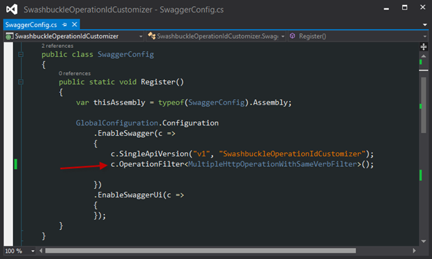

<properties 
    pageTitle="Personnaliser les définitions de l’API généré Swashbuckle" 
    description="Apprenez à personnaliser des définitions de l’API Swagger qui sont générées par Swashbuckle pour une application API dans le Service d’application Azure." 
    services="app-service\api" 
    documentationCenter=".net" 
    authors="bradygaster" 
    manager="wpickett" 
    editor="jimbe"/>

<tags 
    ms.service="app-service-api" 
    ms.workload="web" 
    ms.tgt_pltfrm="dotnet" 
    ms.devlang="na" 
    ms.topic="article" 
    ms.date="08/29/2016" 
    ms.author="rachelap"/>

# Personnaliser les définitions de l’API généré Swashbuckle 

## Vue d’ensemble

Cet article explique comment personnaliser Swashbuckle pour gérer des scénarios courants dans lequel vous souhaitez modifier le comportement par défaut :

* Swashbuckle génère des identificateurs d’opération en double pour les surcharges des méthodes de contrôleur
* Swashbuckle part du principe que la réponse ne s’applique qu’à partir d’une méthode est HTTP 200 (OK) 
 
## Personnaliser l’opération identificateur génération

Swashbuckle génère Swagger opération identificateurs en concaténant le nom du contrôleur et le nom de la méthode. Ce modèle crée un problème lorsque vous avez plusieurs surcharges d’une méthode : Swashbuckle génère des ID en double opération, qui est JSON Swagger non valides.

Par exemple, le code suivant contrôleur entraîne Swashbuckle générer des trois Contact_Get opération ID.

Vous pouvez résoudre le problème manuellement en donnant les méthodes des noms uniques, tels que les informations suivantes pour cet exemple :

* Télécharger
* GetById
* GetPage

La solution consiste à étendre Swashbuckle afin de pouvoir générer automatiquement des ID opération unique.

Les étapes suivantes montrent comment personnaliser Swashbuckle en utilisant le fichier *SwaggerConfig.cs* qui est inclus dans le projet par le modèle de projet Visual Studio API applications Preview.  Vous pouvez également personnaliser Swashbuckle dans un projet d’API Web que vous configurez pour le déploiement sous forme d’une application API.

1. Créer un fichier personnalisé `IOperationFilter` implémentation 

    La `IOperationFilter` interface fournit un point d’extensibilité pour les utilisateurs Swashbuckle qui veulent personnaliser de nombreux aspects du processus de métadonnées Swagger. Le code suivant illustre une méthode de modifier le comportement de génération de l’id opération. Le code ajoute les noms de paramètres pour le nom d’id opération.  

        using Swashbuckle.Swagger;
        using System.Web.Http.Description;
        
        namespace ContactsList
        {
            public class MultipleOperationsWithSameVerbFilter : IOperationFilter
            {
                public void Apply(
                    Operation operation,
                    SchemaRegistry schemaRegistry,
                    ApiDescription apiDescription)
                {
                    if (operation.parameters != null)
                    {
                        operation.operationId += "By";
                        foreach (var parm in operation.parameters)
                        {
                            operation.operationId += string.Format("{0}",parm.name);
                        }
                    }
                }
            }
        }

2. Dans un fichier *App_Start\SwaggerConfig.cs* , appelez le `OperationFilter` Swashbuckle à utiliser la nouvelle méthode `IOperationFilter` mise en œuvre.

        c.OperationFilter<MultipleOperationsWithSameVerbFilter>();

    

    Le fichier *SwaggerConfig.cs* qui est déplacé le package Swashbuckle NuGet contient de nombreux exemples commentées de points d’extension. Les commentaires supplémentaires ne sont pas indiqués ici. 

    Après avoir apporté cette modification, votre `IOperationFilter` implémentation est utilisée et entraîne ID opération unique à générer.
 
    

    
## Autoriser les codes de réponse différent de 200

Par défaut, Swashbuckle suppose qu’une réponse HTTP 200 (OK) est la réponse légitimes *uniquement* à partir d’une méthode de l’API Web. Dans certains cas, vous souhaiterez retourner des codes de réponse sans à l’origine du client déclencher une exception.  Par exemple, le code de l’API Web suivant illustre un scénario dans lequel vous pouvez le client pour accepter un 200 ou une erreur 404 en guise de réponse valide.

    [ResponseType(typeof(Contact))]
    public HttpResponseMessage Get(int id)
    {
        var contacts = GetContacts();

        var requestedContact = contacts.FirstOrDefault(x => x.Id == id);

        if (requestedContact == null)
        {
            return Request.CreateResponse(HttpStatusCode.NotFound);
        }
        else
        {
            return Request.CreateResponse<Contact>(HttpStatusCode.OK, requestedContact);
        }
    }

Dans ce scénario, le Swagger Swashbuckle génère par défaut ne spécifie qu’un seul légitime code d’état HTTP, HTTP 200.

Étant donné que Visual Studio utilise la définition de l’API Swagger pour générer le code pour le client, qu’il crée le code client qui déclenche une exception pour toutes les réponses qu’un HTTP 200. Le code ci-dessous correspond à partir d’un client c# généré pour cette méthode de l’API Web exemple.

    if (statusCode != HttpStatusCode.OK)
    {
        HttpOperationException<object> ex = new HttpOperationException<object>();
        ex.Request = httpRequest;
        ex.Response = httpResponse;
        ex.Body = null;
        if (shouldTrace)
        {
            ServiceClientTracing.Error(invocationId, ex);
        }
        throw ex;
    } 

Swashbuckle fournit deux méthodes de personnalisation de la liste des codes de réponse HTTP attendus qu’il génère, à l’aide de commentaires XML ou la `SwaggerResponse` attribut. L’attribut est plus facile, mais il est uniquement disponible dans Swashbuckle 5.1.5 ou version ultérieure. Le modèle de nouveau projet applications API preview dans Visual Studio 2013 inclut Swashbuckle version 5.0.0, afin que si vous utilisé le modèle et que vous ne voulez pas mettre à jour Swashbuckle, la seule option consiste à utiliser des commentaires XML. 

### Personnaliser les codes de réponse attendue à l’aide de commentaires XML

Utilisez cette méthode pour spécifier les codes de réponse si votre version Swashbuckle est antérieure à 5.1.5.

1. Tout d’abord, ajoutez les commentaires de documentation XML sur les méthodes que vous souhaitez spécifier des codes de réponse HTTP pour. L’échantillon API Web action ci-dessus et lui appliquer la documentation XML entraînerait code à l’exemple suivant. 

        /// 

        /// Returns the specified contact.
        /// 

        /// <param name="id">The ID of the contact.</param>
        /// <returns>A contact record with an HTTP 200, or null with an HTTP 404.</returns>
        /// <response code="200">OK</response>
        /// <response code="404">Not Found</response>
        [ResponseType(typeof(Contact))]
        public HttpResponseMessage Get(int id)
        {
            var contacts = GetContacts();
        
            var requestedContact = contacts.FirstOrDefault(x => x.Id == id);
        
            if (requestedContact == null)
            {
                return Request.CreateResponse(HttpStatusCode.NotFound);
            }
            else
            {
                return Request.CreateResponse<Contact>(HttpStatusCode.OK, requestedContact);
            }
        }

1. Ajoutez des instructions dans le fichier *SwaggerConfig.cs* pour diriger Swashbuckle afin de tirer parti du contenu XML fichier de documentation.

    * Ouvrez *SwaggerConfig.cs* et créer une méthode sur la classe *SwaggerConfig* pour spécifier le chemin d’accès au fichier XML documentation. 

            private static string GetXmlCommentsPath()
            {
                return string.Format(@"{0}\XmlComments.xml", 
                    System.AppDomain.CurrentDomain.BaseDirectory);
            }

    * Faites défiler vers le bas dans le fichier *SwaggerConfig.cs* jusqu'à ce que vous voyiez la ligne commentées de code ressemblant à la capture d’écran ci-dessous. 

        
    
    * Ne commentez pas la ligne pour activer les traitement pendant la génération de Swagger des commentaires XML. 
    
        
    
1. Pour générer le fichier de documentation XML, dans les propriétés du projet, activez le fichier de documentation XML comme le montre la capture d’écran ci-dessous. 

     

Après avoir suivi ces étapes, le JSON Swagger générés par Swashbuckle refléteront les codes de réponse HTTP que vous avez spécifié dans les commentaires XML. La capture d’écran ci-dessous montre ce nouveau charge utile JSON. 

Lorsque vous utilisez Visual Studio pour générer le code client pour votre API REST, le code c# accepte les codes d’état à la fois HTTP OK et introuvable sans lever une exception, ce qui permet de votre code utilisateur prendre des décisions sur la façon de traiter le retour d’un enregistrement Contact null. 

        if (statusCode != HttpStatusCode.OK && statusCode != HttpStatusCode.NotFound)
        {
            HttpOperationException<object> ex = new HttpOperationException<object>();
            ex.Request = httpRequest;
            ex.Response = httpResponse;
            ex.Body = null;
            if (shouldTrace)
            {
                ServiceClientTracing.Error(invocationId, ex);
            }
                throw ex;
        }

Vous trouverez le code pour cette démonstration dans [ce référentiel GitHub](https://github.com/Azure-Samples/app-service-api-dotnet-swashbuckle-swaggerresponse). Avec l’API Web projet marqué avec les commentaires de documentation XML est un projet d’Application Console qui contient un client généré pour cette API. 

### Personnaliser les codes de réponse attendue à l’aide de l’attribut SwaggerResponse

L’attribut [SwaggerResponse](https://github.com/domaindrivendev/Swashbuckle/blob/master/Swashbuckle.Core/Swagger/Annotations/SwaggerResponseAttribute.cs) est disponible dans Swashbuckle 5.1.5 et versions ultérieures. Au cas où vous avez une version antérieure de votre projet, cette section commence par expliquant comment mettre à jour le package Swashbuckle NuGet afin que vous puissiez utiliser cet attribut.

1. Dans l' **Explorateur de solutions**, avec le bouton droit de votre projet API Web et cliquez sur **Gérer les Packages NuGet**. 

    

1. Cliquez sur le bouton de *mise à jour* en regard du package NuGet *Swashbuckle* . 

    

1. Ajoutez les attributs *SwaggerResponse* pour les méthodes d’action API Web pour lequel vous souhaitez spécifier des codes de réponse HTTP valides. 

        [SwaggerResponse(HttpStatusCode.OK)]
        [SwaggerResponse(HttpStatusCode.NotFound)]
        [ResponseType(typeof(Contact))]
        public HttpResponseMessage Get(int id)
        {
            var contacts = GetContacts();

            var requestedContact = contacts.FirstOrDefault(x => x.Id == id);
            if (requestedContact == null)
            {
                return Request.CreateResponse(HttpStatusCode.NotFound);
            }
            else
            {
                return Request.CreateResponse<Contact>(HttpStatusCode.OK, requestedContact);
            }
        }

2. Ajouter un `using` déclaration d’espace de noms de l’attribut :

        using Swashbuckle.Swagger.Annotations;
        
1. Accédez à l’URL */swagger/docs/v1* de votre projet et les codes de réponse HTTP différents sera visibles dans la JSON Swagger. 

    

Vous trouverez le code pour cette démonstration dans [ce référentiel GitHub](https://github.com/Azure-Samples/API-Apps-DotNet-Swashbuckle-Customization-MultipleResponseCodes-With-Attributes). Avec l’API Web projet décorée avec l’attribut *SwaggerResponse* est un projet d’Application Console qui contient un client généré pour cette API. 

## Étapes suivantes

Cet article a montré comment personnaliser la façon dont Swashbuckle génère opération ID et les codes de réponse valide. Pour plus d’informations, voir [Swashbuckle sur GitHub](https://github.com/domaindrivendev/Swashbuckle).
 
