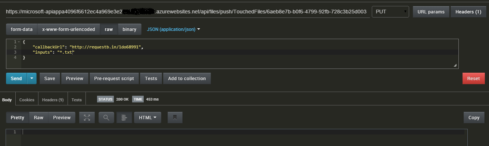

<properties 
    pageTitle="Application Service API application déclencheurs | Microsoft Azure" 
    description="Comment mettre en œuvre des déclencheurs dans une application de l’API dans le Service d’application Azure" 
    services="logic-apps" 
    documentationCenter=".net" 
    authors="guangyang"
    manager="wpickett" 
    editor="jimbe"/>

<tags 
    ms.service="logic-apps" 
    ms.workload="na" 
    ms.tgt_pltfrm="dotnet" 
    ms.devlang="na" 
    ms.topic="article" 
    ms.date="08/25/2016" 
    ms.author="rachelap"/>

# Azure déclencheurs d’application API de Service d’application

>[AZURE.NOTE] Cette version de l’article s’applique à la version du schéma API applications 2014-12-01-aperçu.

## Vue d’ensemble

Cet article explique comment faire pour implémenter l’API application déclencheurs et les utiliser à partir d’une application logique.

Tous les extraits de code dans cette rubrique sont copiés à partir de l' [exemple de code FileWatcher API application](http://go.microsoft.com/fwlink/?LinkId=534802). 

Notez que vous devez télécharger le package nuget suivants pour le code dans cet article pour créer et exécuter : [http://www.nuget.org/packages/Microsoft.Azure.AppService.ApiApps.Service/](http://www.nuget.org/packages/Microsoft.Azure.AppService.ApiApps.Service/).

## Que sont les API application déclencheurs ?

Il s’agit d’un scénario courantes pour une application API déclencher un événement afin que les clients de l’application API peuvent utiliser l’action appropriée en réponse à l’événement. Le mécanisme API REST en fonction de qui prend en charge ce scénario s’appelle un déclencheur d’application API. 

Par exemple, supposons que votre code client à l’aide de l' [application Twitter connecteur API](../app-service-logic/app-service-logic-connector-twitter.md) et votre code doit exécuter une action basée sur les nouvelles tweets qui contiennent des mots spécifiques. Dans ce cas, vous pouvez configurer un sondage ou push déclencheur afin de faciliter ce qu’il soit nécessaire.

## Déclenchement de sondage et déclencheur d’émission

Pour l’instant, les deux types de déclencheurs sont prises en charge :

- Déclencheur sondage - Client consulte l’application API pour la notification d’un événement ayant été déclenché 
- Déclencheur d’émission - Client est informé par l’application API déclenchement d’un événement 

### Déclenchement de sondage

Un déclencheur sondage est implémenté comme une API REST normal et attend de ses clients (par exemple, une application logique) pour interroger afin d’obtenir les notifications. Tandis que le client peut conserver l’état, le déclencheur sondage elle-même est sans état. 

Les informations suivantes concernant les paquets demande et réponse illustrent certains aspects essentiels du contrat déclencheur sondage :

- Demande
    - Méthode HTTP : GET
    - Paramètres
        - triggerState - ce paramètre facultatif permet aux clients de spécifier leur état afin que le déclencheur sondage correctement puissiez décider s’il faut retourner notification ou non en fonction de l’état spécifié.
        - Paramètres spécifiques à l’API
- Réponse
    - État code **200** - demande est valide et il est une notification à partir du déclencheur. Le contenu de la notification sera le corps de réponse. Un en-tête « Réessayer après » dans la réponse indique que les données de notification supplémentaires doivent être récupérées avec un appel de la requête suivante.
    - État code **202** - demande est valide, mais aucune notification n’est nouveau à partir du déclencheur.
    - État code **4xx** - demande n’est pas valide. Le client ne doit pas réessayer la demande.
    - État code **5xx** - demande a une erreur interne du serveur et/ou un problème temporaire. Le client doit réessayer la demande.

L’extrait de code suivant est un exemple de l’implémentation d’un déclencheur d’un sondage.

    // Implement a poll trigger.
    [HttpGet]
    [Route("api/files/poll/TouchedFiles")]
    public HttpResponseMessage TouchedFilesPollTrigger(
        // triggerState is a UTC timestamp
        string triggerState,
        // Additional parameters
        string searchPattern = "*")
    {
        // Check to see whether there is any file touched after the timestamp.
        var lastTriggerTimeUtc = DateTime.Parse(triggerState).ToUniversalTime();
        var touchedFiles = Directory.EnumerateFiles(rootPath, searchPattern, SearchOption.AllDirectories)
            .Select(f => FileInfoWrapper.FromFileInfo(new FileInfo(f)))
            .Where(fi => fi.LastAccessTimeUtc > lastTriggerTimeUtc);

        // If there are files touched after the timestamp, return their information.
        if (touchedFiles != null && touchedFiles.Count() != 0)
        {
            // Extension method provided by the AppService service SDK.
            return this.Request.EventTriggered(new { files = touchedFiles });
        }
        // If there are no files touched after the timestamp, tell the caller to poll again after 1 mintue.
        else
        {
            // Extension method provided by the AppService service SDK.
            return this.Request.EventWaitPoll(new TimeSpan(0, 1, 0));
        }
    }

Pour tester cette déclencheur sondage, procédez comme suit :

1. Déploiement de l’application API avec un paramètre d’authentification **anonyme**public.
2. Appeler l’opération **tactile** pour tactile un fichier. L’image suivante montre un exemple de demande via Postman.
   
3. Appelez le déclencheur sondage avec le paramètre **triggerState** défini sur un horodatage avant l’étape 2. L’image suivante montre l’exemple de demande via Postman.
   

### Déclencheur d’émission

Un déclencheur d’émission est implémenté comme une API REST régulières qui envoie des notifications aux clients qui ont demandé à être informé lorsque des événements spécifiques surviennent.

Les informations suivantes concernant les paquets demande et réponse illustrent certains aspects essentiels du contrat déclencheur push.

- Demande
    - Méthode HTTP : placer
    - Paramètres
        - triggerId : obligatoire - chaîne Opaque (par exemple, un GUID) qui représente l’enregistrement d’un déclencheur d’émission.
        - callbackUrl : obligatoire - URL du rappel à appeler lorsque l’événement se déclenche. L’appel est un appel HTTP POST simple.
        - Paramètres spécifiques à l’API
- Réponse
    - État code **200** - demande d’enregistrement client réussie.
    - État code **4xx** - demande n’est pas valide. Le client ne doit pas réessayer la demande.
    - État code **5xx** - demande a une erreur interne du serveur et/ou un problème temporaire. Le client doit réessayer la demande.
- Rappel
    - Méthode HTTP : billet
    - Corps de requête : contenu de Notification.

L’extrait de code suivant est un exemple de l’implémentation d’un déclencheur d’émission :

    // Implement a push trigger.
    [HttpPut]
    [Route("api/files/push/TouchedFiles/{triggerId}")]
    public HttpResponseMessage TouchedFilesPushTrigger(
        // triggerId is an opaque string.
        string triggerId,
        // A helper class provided by the AppService service SDK.
        // Here it defines the input of the push trigger is a string and the output to the callback is a FileInfoWrapper object.
        [FromBody]TriggerInput<string, FileInfoWrapper> triggerInput)
    {
        // Register the trigger to some trigger store.
        triggerStore.RegisterTrigger(triggerId, rootPath, triggerInput);

        // Extension method provided by the AppService service SDK indicating the registration is completed.
        return this.Request.PushTriggerRegistered(triggerInput.GetCallback());
    }

    // A simple in-memory trigger store.
    public class InMemoryTriggerStore
    {
        private static InMemoryTriggerStore instance;

        private IDictionary<string, FileSystemWatcher> _store;

        private InMemoryTriggerStore()
        {
            _store = new Dictionary<string, FileSystemWatcher>();
        }

        public static InMemoryTriggerStore Instance
        {
            get
            {
                if (instance == null)
                {
                    instance = new InMemoryTriggerStore();
                }
                return instance;
            }
        }

        // Register a push trigger.
        public void RegisterTrigger(string triggerId, string rootPath,
            TriggerInput<string, FileInfoWrapper> triggerInput)
        {
            // Use FileSystemWatcher to listen to file change event.
            var filter = string.IsNullOrEmpty(triggerInput.inputs) ? "*" : triggerInput.inputs;
            var watcher = new FileSystemWatcher(rootPath, filter);
            watcher.IncludeSubdirectories = true;
            watcher.EnableRaisingEvents = true;
            watcher.NotifyFilter = NotifyFilters.LastAccess;

            // When some file is changed, fire the push trigger.
            watcher.Changed +=
                (sender, e) => watcher_Changed(sender, e,
                    Runtime.FromAppSettings(),
                    triggerInput.GetCallback());

            // Assoicate the FileSystemWatcher object with the triggerId.
            _store[triggerId] = watcher;

        }

        // Fire the assoicated push trigger when some file is changed.
        void watcher_Changed(object sender, FileSystemEventArgs e,
            // AppService runtime object needed to invoke the callback.
            Runtime runtime,
            // The callback to invoke.
            ClientTriggerCallback<FileInfoWrapper> callback)
        {
            // Helper method provided by AppService service SDK to invoke a push trigger callback.
            callback.InvokeAsync(runtime, FileInfoWrapper.FromFileInfo(new FileInfo(e.FullPath)));
        }
    }

Pour tester cette déclencheur sondage, procédez comme suit :

1. Déploiement de l’application API avec un paramètre d’authentification **anonyme**public.
2. Accédez à [http://requestb.in/](http://requestb.in/) pour créer un RequestBin qui sert de votre URL de rappel.
3. Appeler le déclencheur d’émission avec un GUID comme **triggerId** et l’URL RequestBin comme **callbackUrl**.
   
4. Appeler l’opération **tactile** pour tactile un fichier. L’image suivante montre un exemple de demande via Postman.
   
5. Vérifier la RequestBin pour confirmer que le rappel de déclencheur push est appelé avec le résultat de la propriété.
   

### Décrire déclencheurs dans la définition de l’API

Après l’implémentation des déclencheurs et déploiement de votre application API vers Azure, accédez à la carte de **Définition de l’API** dans le portail Azure preview et vous verrez que déclencheurs sont automatiquement reconnus dans l’interface utilisateur, qui est piloté par la définition Swagger 2.0 API de l’application API.

Si vous cliquez sur le bouton **Télécharger Swagger** et ouvrez le fichier JSON, vous verrez des résultats similaires à ce qui suit :

    "/api/files/poll/TouchedFiles": {
      "get": {
        "operationId": "Files_TouchedFilesPollTrigger",
        ...
        "x-ms-scheduler-trigger": "poll"
      }
    },
    "/api/files/push/TouchedFiles/{triggerId}": {
      "put": {
        "operationId": "Files_TouchedFilesPushTrigger",
        ...
        "x-ms-scheduler-trigger": "push"
      }
    }

Propriété extension **x-ms-programmation-déclencheur** est comment déclencheurs sont décrites dans la définition de l’API et est automatiquement ajouté par la passerelle application API lorsque vous demandez la définition de l’API via la passerelle si la demande à un des critères suivants. (Vous pouvez également ajouter cette propriété manuellement.)

- Déclenchement de sondage
    - Si la méthode HTTP est **GET**.
    - Si la propriété **operationId** contient la chaîne **déclencheur**.
    - Si la propriété **parameters** comprend un paramètre avec une propriété **nom** avec **triggerState**.
- Déclencheur d’émission
    - Si la méthode HTTP est **Mettez**.
    - Si la propriété **operationId** contient la chaîne **déclencheur**.
    - Si la propriété **parameters** comprend un paramètre avec une propriété **nom** avec **triggerId**.

## Utiliser des déclencheurs d’application API dans les applications de logique

### Lister et configurer les déclencheurs d’application API dans le Concepteur d’applications logique

Si vous créez une application logique dans le même groupe de ressources que l’application de l’API, il se peut que vous ne pourrez pas pour l’ajouter à la zone de dessin du concepteur simplement en cliquant dessus. Les images suivantes illustrent ceci :

## Optimiser déclencheurs d’application API pour les applications de logique

Une fois que vous ajoutez des déclencheurs pour une application API, il existe plusieurs choses que vous pouvez faire pour améliorer l’expérience lors de l’utilisation de l’application de l’API dans une application logique.

Par exemple, le paramètre **triggerState** pour déclencheurs sondage doit être défini à l’expression suivante dans l’application logique. Cette expression doit évaluer le dernier appel du déclencheur à partir de l’application logique et cette valeur de retour.  

    @coalesce(triggers()?.outputs?.body?['triggerState'], '')

Remarque : Pour obtenir une explication sur les fonctions utilisées dans l’expression ci-dessus, reportez-vous à la documentation sur [Une logique de l’application du flux de travail Definition Language](https://msdn.microsoft.com/library/azure/dn948512.aspx).

Utilisateurs de l’application logique devront fournir l’expression ci-dessus pour le paramètre **triggerState** lors de l’utilisation du déclencheur. Il est possible que cette valeur prédéfinis par le Concepteur d’application logique via la propriété d’extension **x-ms-scheduler-recommandations**.  La propriété d’extension **x-ms-visibilité** peut être définie à une valeur de *interne* afin que le paramètre lui-même n’est pas visible dans le concepteur.  L’extrait suivant illustre.

    "/api/Messages/poll": {
      "get": {
        "operationId": "Messages_NewMessageTrigger",
        "parameters": [
          {
            "name": "triggerState",
            "in": "query",
            "required": true,
            "x-ms-visibility": "internal",
            "x-ms-scheduler-recommendation": "@coalesce(triggers()?.outputs?.body?['triggerState'], '')",
            "type": "string"
          }
        ]
        ...
        "x-ms-scheduler-trigger": "poll"
      }
    }

Pour les déclencheurs push, le paramètre **triggerId** doit identifier l’application logique. Une meilleure pratique recommandée consiste à définir cette propriété sur le nom du flux de travail à l’aide de l’expression suivante :

    @workflow().name

Utilisez les propriétés d’extension **x-ms-scheduler-recommandations** et **x-ms-visibilité** dans sa définition de l’API, l’application API peut transmettre vers le Concepteur de l’application logique pour définir automatiquement cette expression pour l’utilisateur.

        "parameters":[  
          {  
            "name":"triggerId",
            "in":"path",
            "required":true,
            "x-ms-visibility":"internal",
            "x-ms-scheduler-recommendation":"@workflow().name",
            "type":"string"
          },

### Ajouter des propriétés de l’extension dans la définition de l’API

Informations de métadonnées supplémentaires - telles que l’extension propriétés **x-ms-scheduler-recommandations** et **x-ms-visibilité** - peuvent être ajoutées dans la définition de l’API dans une des deux façons : statique ou dynamique.

Pour les métadonnées statiques, vous pouvez directement modifier le fichier */metadata/apiDefinition.swagger.json* dans votre projet et ajouter les propriétés manuellement.

Pour les applications de l’API à l’aide de métadonnées dynamique, vous pouvez modifier le fichier SwaggerConfig.cs pour ajouter un filtre d’opération qui peut ajouter ces extensions.

    GlobalConfiguration.Configuration 
        .EnableSwagger(c =>
            {
                ...
                c.OperationFilter<TriggerStateFilter>();
                ...
            }

Voici un exemple de comment ce cours peut être implémentée pour faciliter le scénario de métadonnées dynamique.

    // Add extension properties on the triggerState parameter
    public class TriggerStateFilter : IOperationFilter
    {

        public void Apply(Operation operation, SchemaRegistry schemaRegistry, System.Web.Http.Description.ApiDescription apiDescription)
        {
            if (operation.operationId.IndexOf("Trigger", StringComparison.InvariantCultureIgnoreCase) >= 0)
            {
                // this is a possible trigger
                var triggerStateParam = operation.parameters.FirstOrDefault(x => x.name.Equals("triggerState"));
                if (triggerStateParam != null)
                {
                    if (triggerStateParam.vendorExtensions == null)
                    {
                        triggerStateParam.vendorExtensions = new Dictionary<string, object>();
                    }

                    // add 2 vendor extensions
                    // x-ms-visibility: set to 'internal' to signify this is an internal field
                    // x-ms-scheduler-recommendation: set to a value that logic app can use
                    triggerStateParam.vendorExtensions.Add("x-ms-visibility", "internal");
                    triggerStateParam.vendorExtensions.Add("x-ms-scheduler-recommendation",
                                                           "@coalesce(triggers()?.outputs?.body?['triggerState'], '')");
                }
            }
        }
    }
 
