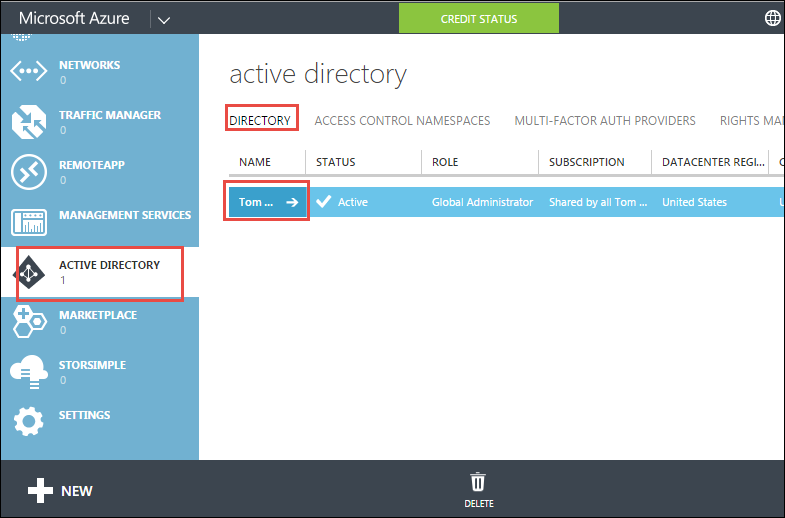

<properties
    pageTitle="L’authentification des utilisateurs pour les applications de l’API dans le Service d’application Azure | Microsoft Azure"
    description="Découvrez comment protéger une application API dans le Service d’application Azure en autorisant l’accès uniquement aux utilisateurs authentifiés."
    services="app-service\api"
    documentationCenter=".net"
    authors="tdykstra"
    manager="wpickett"
    editor=""/>

<tags
    ms.service="app-service-api"
    ms.workload="na"
    ms.tgt_pltfrm="dotnet"
    ms.devlang="na"
    ms.topic="article"
    ms.date="06/30/2016"
    ms.author="rachelap"/>

# Authentification des utilisateurs pour les applications de l’API dans le Service d’application Azure

## Vue d’ensemble

Cet article vous explique comment protéger une application Azure API afin que seuls les utilisateurs authentifiés peuvent l’appeler. Cet article suppose que vous avez pris connaissance de [vue d’ensemble de l’authentification Azure Application Service](../app-service/app-service-authentication-overview.md).

Vous allez découvrir :

* Comment configurer un fournisseur d’authentification, avec les détails Azure Active Directory (AD Azure).
* Découvrez comment utiliser une application API protégée à l’aide de [Active Directory authentification bibliothèque (terme ADAL) pour JavaScript](https://github.com/AzureAD/azure-activedirectory-library-for-js).

L’article comporte deux sections :

* La section [comment configurer l’authentification des utilisateurs dans le Service d’application Azure](#authconfig) explique la procédure configurer l’authentification des utilisateurs pour n’importe quelle application API en général et s’applique également à tous les structures pris en charge par le Service d’application, y compris .NET, Node.js et Java.

* En commençant par la section [poursuivre les didacticiels .NET API applications](#tutorialstart) , les repères de l’article vous aide à la configuration d’un exemple d’application avec un .NET back-end et une caméra AngularJS avant la fin afin qu’il utilise Azure Active Directory pour l’authentification des utilisateurs. 

## Comment configurer l’authentification des utilisateurs dans le Service d’application Azure

Cette section fournit des instructions générales qui s’appliquent à n’importe quelle application API. Pour obtenir la procédure spécifique à l’application d’exemple à faire liste .NET, accédez à [poursuivre les didacticiels .NET mise en route](#tutorialstart).

1. Dans le [portail Azure](https://portal.azure.com/), accédez à la carte de **paramètres** de l’application de l’API que vous voulez protéger, recherchez la section **fonctionnalités** , puis sur **authentification / autorisation**.

    

3. Dans la **authentification / autorisation** carte, cliquez **sur**.

4. Sélectionnez une des options dans la liste déroulante **Action à effectuer lors de la requête n’est pas authentifié** .

    * Si vous ne voulez que les appels authentifiés pour accéder à votre application API, choisissez une des options **d’ouverture de session...** . Cette option vous permet de protéger l’application API sans écrire du code qui s’exécute qu’il contient.

    * Si vous souhaitez que tous les appels à atteindre votre application API, sélectionnez **Autoriser les requêtes (aucune action)**. Vous pouvez utiliser cette option pour diriger les appelants non authentifiés vers un choix des fournisseurs d’authentification. Avec cette option, vous devez écrire du code pour gérer l’autorisation.

    Pour plus d’informations, voir [authentification et autorisation pour les applications de l’API dans le Service d’application Azure](app-service-api-authentication.md#multiple-protection-options).

5. Sélectionnez une ou plusieurs des **Fournisseurs d’authentification**.

    L’illustration choix qui nécessite de tous les appelants doivent être authentifiés par Azure AD.
 
    

    Lorsque vous choisissez un fournisseur d’authentification, le portail affiche une carte de configuration pour ce fournisseur. 

    Pour obtenir des instructions détaillées expliquant comment configurer les cartes de configuration du fournisseur d’authentification, Découvrez [comment configurer votre application de Service d’application pour utiliser la connexion Azure Active Directory](../app-service-mobile/app-service-mobile-how-to-configure-active-directory-authentication.md). (Le lien va à un article sur Azure AD, mais l’article lui-même contient des onglets qui fournissent des liens vers des articles pour les autres fournisseurs d’authentification).

7. Lorsque vous avez terminé avec la carte de configuration du fournisseur d’authentification, cliquez sur **OK**.

7. Dans la **authentification / autorisation** carte, cliquez sur **Enregistrer**.

Dans ce cas, l’application Service authentifie tous les appels API avant d’atteindre l’application API. Les services d’authentification fonctionnent de la même pour toutes les langues prises en charge du service de l’application, y compris .NET, Node.js et Java. 

Pour passer des appels API authentifiés, l’appelant inclut OAuth du fournisseur authentification OAuth 2.0 dans l’en-tête d’autorisation de requêtes HTTP. Le jeton peut être posé à l’aide SDK du fournisseur d’authentification.

## Poursuivre les didacticiels .NET API applications

Si vous suivez les didacticiels Node.js ou Java pour les applications de l’API, passez à l’article suivant, [l’authentification principal du service pour les applications de l’API](app-service-api-dotnet-service-principal-auth.md). 

Si vous suivez la série de didacticiels pour les applications de l’API .NET et que vous avez déjà déployé l’exemple d’application comme indiqué dans les didacticiels [première](app-service-api-dotnet-get-started.md) et la [deuxième](app-service-api-cors-consume-javascript.md) , passez à la section [configurer l’authentification dans l’application de Service et Azure AD](#azureauth) .

Si vous voulez suivre ce didacticiel sans passer par les premières et deuxième les didacticiels, effectuez les étapes suivantes qui expliquent comment commencer à l’aide d’un processus automatisé pour déployer l’exemple d’application.

>[AZURE.NOTE] Les étapes suivantes vous accéder au même point de départ que si vous avez effectué les deux premières didacticiels, avec une exception : Visual Studio ne savez quel web app ou une application API que chaque projet est déployé sur. Cela signifie que vous n’aurez instructions exactes dans ce didacticiel qui expliquent comment déployer vers les droite cibles. Si vous n’êtes pas à l’aise avec de savoir comment procéder sur votre propre déploiement, il est préférable de suivre la série de didacticiels à partir de la [première didacticiel](app-service-api-dotnet-get-started.md) que de commencer avec ce processus de déploiement automatisé.

1. Vérifiez que vous avez toutes les conditions préalables répertoriées dans le [premier didacticiel](app-service-api-dotnet-get-started.md). Outre les conditions préalables répertoriés, ces didacticiels authentification part du principe que vous avez travaillé avec application Service web apps et des applications de l’API dans Visual Studio et le portail Azure.

2. Cliquez sur le bouton **déployer vers Azure** dans la [liste des tâches exemple référentiel Lisezmoi de fichier](https://github.com/azure-samples/app-service-api-dotnet-todo-list/blob/master/readme.md) à déployer les applications API et l’application web. Notez le groupe de ressources Azure obtient créées, que vous pouvez utiliser cette version ultérieur pour rechercher dans le navigateur et les noms d’application API.
 
3. Téléchargez ou cloner le [référentiel d’exemple de liste des tâches](https://github.com/Azure-Samples/app-service-api-dotnet-todo-list) pour obtenir le code que vous allez utiliser localement dans Visual Studio.

## Configurer l’authentification dans l’application de Service et Azure AD

Vous disposez désormais de l’application en cours d’exécution dans le Service d’application Azure sans exiger que les utilisateurs authentifiés. Dans cette section, vous ajoutez l’authentification en effectuant les tâches suivantes :

* Configurer le Service d’application afin d’exiger l’authentification Azure Active Directory (AD Azure) pour l’application intermédiaire API l’appel.
* Créer une application Azure AD.
* Configurer l’application Azure AD pour envoyer le jeton PORTEUR après la connexion à la partie frontale AngularJS. 

Si vous rencontrez des problèmes en suivant les instructions didacticiels, consultez la section [dépannage](#troubleshooting) à la fin du didacticiel. 
 
### Configurer l’authentification pour l’application de l’API intermédiaire

1. Dans le [portail Azure](https://portal.azure.com/), accédez à la carte de **paramètres** de l’application de l’API que vous avez créé pour le projet ToDoListAPI, recherchez la section **fonctionnalités** , puis sur **authentification / autorisation**.

    

3. Dans la **authentification / autorisation** carte, cliquez **sur**.

4. Dans la liste déroulante **Action à effectuer lors de la requête n’est pas authentifié** , sélectionnez **se connecter avec Azure Active Directory**.

    Cette option garantit qu’aucune demande unauathenticated n’allez atteindre l’application API. 

5. Sous **Fournisseurs d’authentification**, cliquez sur **Azure Active Directory**.

    

6. Dans la carte **Paramètres Azure Active Directory** , cliquez sur **Express**

    

    Avec l’option **Express** , application Service peut créer automatiquement une application Azure AD dans votre Azure AD [client](https://msdn.microsoft.com/en-us/library/azure/jj573650.aspx#BKMK_WhatIsAnAzureADTenant). 

    Vous n’êtes pas obligé de créer un client, car chaque compte Azure a automatiquement une.

7. Sous **mode d’administration**, cliquez sur **Créer une nouvelle application de AD** si ce n’est pas déjà fait et notez la valeur qui se trouve dans la zone de texte **Créer application** ; vous allez rechercher cette application AAD dans le portail classique Azure ultérieurement.

    

    Azure crée automatiquement une application Azure AD avec le nom de votre client Azure AD indiqué. Par défaut, l’application Azure AD est nommée identique à l’application de l’API. Si vous préférez, vous pouvez entrer un autre nom.
 
7. Cliquez sur **OK**.

7. Dans la **authentification / autorisation** carte, cliquez sur **Enregistrer**.

    

Maintenant seulement les utilisateurs dans votre client Azure AD peuvent appeler l’application API.

### Facultatif : Tester l’application de l’API

1. Dans un navigateur, accédez à l’URL de l’application API : dans la carte **API application** dans le portail Azure, cliquez sur le lien sous **URL**.  

    Vous êtes redirigé vers un écran de connexion, car les requêtes non authentifiés ne sont pas autorisées pour atteindre l’application API.

    Si votre navigateur accède à la page « créée », le navigateur peut déjà être connecté--dans ce cas, ouvrez une fenêtre InPrivate ou fenêtre et atteindre l’URL de l’application API.

2. Ouvrez une session sur l’utilisation des informations d’identification d’un utilisateur de votre client Azure AD.

    Lorsque vous êtes connecté, la page « créée avec succès » s’affiche dans le navigateur.

9. Fermez le navigateur.

### Configurer l’application Azure AD

Lorsque vous avez configuré l’authentification Azure Active Directory, application Service créé une application Azure AD pour vous. Par défaut la nouvelle annonce Azure application a été configurée pour fournir le jeton PORTEUR aux URL de l’application API. Dans cette section vous configurez l’application Azure AD pour fournir le jeton porteur au AngularJS frontal plutôt que directement à l’application intermédiaire API. Le serveur frontal de AngularJS vous envoie le jeton à l’application API lorsqu’il appelle l’application API.

>[AZURE.NOTE] Conserver le processus en tant que simple que possible, ce didacticiel utilise un seul AD Azure application API couche application pour le serveur frontal et du milieu. Une autre option consiste à utiliser les deux applications Azure AD. Dans ce cas, vous devez autoriser du serveur frontal Azure AD application pour appeler Azure AD application de la couche intermédiaire. Cette approche application multiples permet d’obtenir un contrôle plus précis sur les autorisations pour chaque niveau.

11. Dans le [portail classique Azure](https://manage.windowsazure.com/), accédez à **Azure Active Directory**.

    Vous devez utiliser le portail classique parce que certains paramètres Azure Active Directory que vous devez accéder à ne sont pas encore disponibles dans le portail Azure actuel.

12. Sous l’onglet **répertoire** , cliquez sur votre client AAD.

    

14. Cliquez sur **Applications > Applications propriétaire de mon entreprise**, puis cliquez sur la coche.

    Vous devrez peut-être également actualiser la page pour afficher la nouvelle application.

15. Dans la liste des applications, cliquez sur le nom de l’objet qui Azure créé lorsque vous avez activé l’authentification pour votre application API.

    

16. Cliquez sur **configurer**.

    

17. Définir **l’authentification URL** à l’URL de votre application web AngularJS, sans barre oblique.

    Par exemple : https://todolistangular.azurewebsites.net

    

17. Définir **l’URL de réponse** à l’URL de votre application web, sans barre oblique.

    Par exemple : https://todolistsangular.azurewebsites.net

16. Cliquez sur **Enregistrer**.

    

15. Dans la partie inférieure de la page, cliquez sur **manifeste gérer > Télécharger manifeste**.

    

17. Téléchargez le fichier vers un emplacement où vous pouvez les modifier.

16. Dans le fichier manifest téléchargé, recherchez la `oauth2AllowImplicitFlow` propriété. Définissez la valeur de cette propriété à partir de `false` à `true`, puis enregistrez le fichier.

    Ce paramètre est nécessaire pour accéder à partir d’une application d’une page simple JavaScript. Il permet le jeton PORTEUR Oauth 2.0 à retourner dans le fragment d’URL.

16. Cliquez sur **manifeste gérer > téléchargement manifeste**et téléchargez le fichier mis à jour à l’étape précédente.

    

17. Copier la valeur **d’ID de Client** et enregistrer un emplacement qu'accessible à partir ultérieurement.

## Configurer le projet ToDoListAngular pour utiliser l’authentification

Dans cette section vous modifiez le frontal AngularJS afin qu’il utilise Active Directory authentification bibliothèque (terme ADAL) pour JS acquérir un jeton porteur pour l’utilisateur connecté à partir d’Azure AD. Le code inclura le jeton dans les requêtes HTTP envoyés au niveau intermédiaire, comme le montre l’illustration suivante. 

Apportez les modifications suivantes à des fichiers dans le projet ToDoListAngular.

1. Ouvrez le fichier *index.html* .

2. Ne commentez pas les lignes qui font référence à la Active Directory authentification bibliothèque (terme ADAL) pour les scripts JS.

        
        

1. Ouvrez le fichier *app/scripts/app.js* .

2. Commentez le bloc de code sont marqué pour « sans authentification » et supprimez le bloc de code sont marqué pour « avec authentification ».

    Cette modification fait référence le fournisseur d’authentification JS ADAL et fournit les paramètres de configuration. Dans la procédure suivante vous définissez les valeurs de configuration pour votre application de l’API et application Azure AD.

8. Dans le code qui définit la `endpoints` variable, définir l’URL de l’API à l’URL de l’application API que vous avez créé pour le projet ToDoListAPI et définissez l’ID de l’application Azure AD pour l’ID de client que vous avez copiée à partir du portail classique Azure.

    Le code est maintenant similaire à l’exemple suivant.

        var endpoints = {
            "https://todolistapi0121.azurewebsites.net/": "1cf55bc9-9ed8-4df31cf55bc9-9ed8-4df3"
        };

9. Dans l’appel à `adalProvider.init`, définissez `tenant` votre nom de client et `clientId` même valeur que vous avez utilisé à l’étape précédente.

    Le code est maintenant similaire à l’exemple suivant.

        adalProvider.init(
            {
                instance: 'https://login.microsoftonline.com/', 
                tenant: 'contoso.onmicrosoft.com',
                clientId: '1cf55bc9-9ed8-4df31cf55bc9-9ed8-4df3',
                extraQueryParameter: 'nux=1',
                endpoints: endpoints
            },
            $httpProvider
            );

    Ces modifications à `app.js` spécifier que le code d’appel et de l’API appelée dans la même application Azure AD.

1. Ouvrez le fichier *app/scripts/homeCtrl.js* .

2. Commentez le bloc de code sont marqué pour « sans authentification » et supprimez le bloc de code sont marqué pour « avec authentification ».

1. Ouvrez le fichier *app/scripts/indexCtrl.js* .

2. Commentez le bloc de code sont marqué pour « sans authentification » et supprimez le bloc de code sont marqué pour « avec authentification ».

### Déployer le projet ToDoListAngular dans Azure

8. Dans l' **Explorateur de solutions**, cliquez sur le projet ToDoListAngular, puis cliquez sur **Publier**.

9. Cliquez sur **Publier**.

    Visual Studio déploie le projet et ouvre un navigateur pour l’URL de base de l’application web. Vous verrez une page 403 erreur, qui est normale pour une tentative d’accéder à une URL de base de l’API Web depuis un navigateur.

    Vous devez toujours effectuer un changement à l’application de l’API intermédiaire avant que vous pouvez tester l’application.

10. Fermez le navigateur.

## Configurer le projet ToDoListAPI pour utiliser l’authentification

Actuellement le projet ToDoListAPI envoie « * » en tant que la `owner` valeur à ToDoListDataAPI. Dans cette section, vous modifiez le code pour envoyer l’ID de l’utilisateur connecté.

Apportez les modifications suivantes dans le projet ToDoListAPI.

1. Ouvrez le fichier *Controllers/ToDoListController.cs* , et ne commentez pas la ligne dans chaque méthode d’action qui définit `owner` à l’annuaire Active Directory Azure `NameIdentifier` valeur de la demande. Par exemple :

        owner = ((ClaimsIdentity)User.Identity).FindFirst(ClaimTypes.NameIdentifier).Value;

    **Important**: ne supprimez les commentaires de code dans la `ToDoListDataAPI` méthode ; vous allez recevons pour le didacticiel sur service d’authentification principal.

### Déployer le projet ToDoListAPI dans Azure

8. Dans l' **Explorateur de solutions**, cliquez sur le projet ToDoListAPI, puis cliquez sur **Publier**.

9. Cliquez sur **Publier**.

    Visual Studio déploie le projet et ouvre un navigateur pour l’URL de base de l’application API.

10. Fermez le navigateur.

### Tester l’application

9. Accédez à l’URL de l’application web, **à l’aide de HTTPS, non HTTP**.

8. Cliquez sur l’onglet **Liste des tâches** .

    Vous êtes invité à se connecter.

9. Ouvrez une session avec les informations d’identification d’un utilisateur dans votre client AAD.

10. La page de **Liste des tâches** s’affiche.

    

    Aucun élément des tâches est affiché, car jusqu'à présent qu’ils ont tous été propriétaire « * ». Maintenant le niveau intermédiaire demande des éléments de l’utilisateur connecté, et aucun ont été créés encore.

11. Ajouter de nouveaux éléments des tâches pour vérifier que l’application fonctionne.

12. Dans une autre fenêtre de navigateur, accédez à l’URL de l’interface utilisateur Swagger pour l’application de l’API ToDoListDataAPI et cliquez sur **liste des tâches > obtenir**. Entrer un astérisque pour le `owner` paramètre, puis cliquez sur **essayer**.

    La réponse indique que les nouveaux éléments des tâches ont réel Azure AD ID d’utilisateur dans la propriété propriétaire.

    

## Génération des projets à partir de zéro

Les deux projets d’API Web créées à l’aide du modèle de projet **Azure API application** et le remplacement du contrôleur de valeurs par défaut avec un contrôleur de la liste des tâches. 

Pour plus d’informations sur la création d’une application d’une page simple AngularJS avec 2 de l’API Web principale, voir [mains sur Atelier : créer une Application de Page unique (SPA) avec l’API Web ASP.NET et Angular.js](http://www.asp.net/web-api/overview/getting-started-with-aspnet-web-api/build-a-single-page-application-spa-with-aspnet-web-api-and-angularjs). Pour plus d’informations sur la façon d’ajouter le code d’authentification Azure Active Directory, consultez les ressources suivantes :

* [Sécuriser les applications de Page unique AngularJS avec Azure AD](../active-directory/active-directory-devquickstarts-angular.md).
* [Présentation de v1 ADAL JS](http://www.cloudidentity.com/blog/2015/02/19/introducing-adal-js-v1/)

## Résolution des problèmes

[AZURE.INCLUDE [troubleshooting](../../includes/app-service-api-auth-troubleshooting.md)]

* Assurez-vous que vous ne confondez pas ToDoListAPI (intermédiaire) et ToDoListDataAPI (couche données). Par exemple, vérifiez que vous avez ajouté l’authentification à l’application intermédiaire API, pas la couche de données. 
* Assurez-vous que le code source AngularJS fait référence à l’URL de l’application intermédiaire API (ToDoListAPI, pas ToDoListDataAPI) et la Azure correcte AD ID client. 

## Étapes suivantes

Dans ce didacticiel, vous avez appris à utiliser l’authentification du Service d’application pour une application API et l’appel de l’application API à l’aide de la bibliothèque ADAL JS. Dans le didacticiel suivant, vous allez découvrir comment [un accès sécurisé à votre application API pour les scénarios de service à service](app-service-api-dotnet-service-principal-auth.md).

