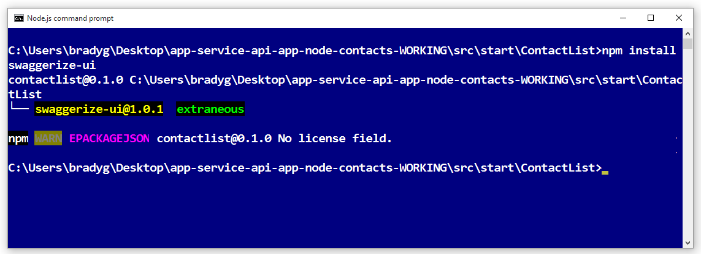
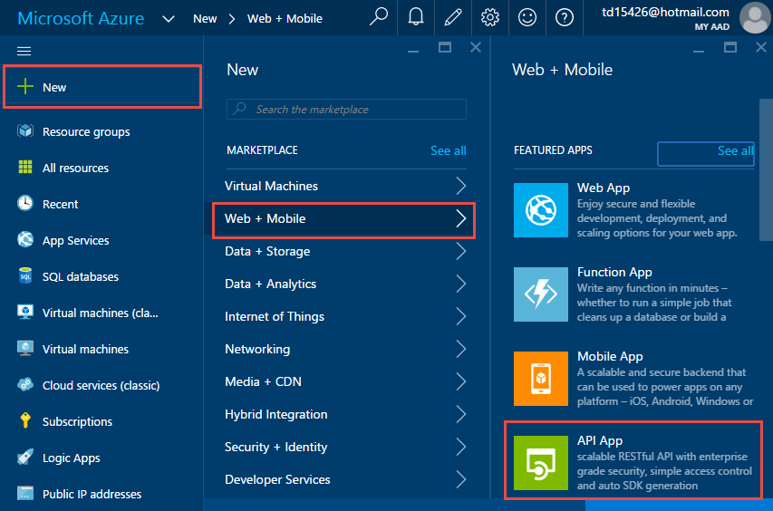
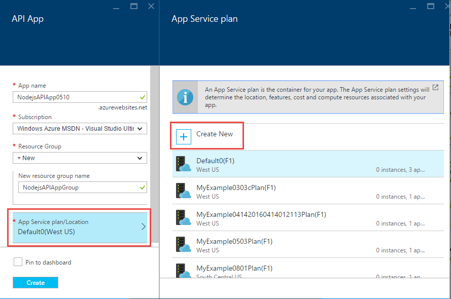
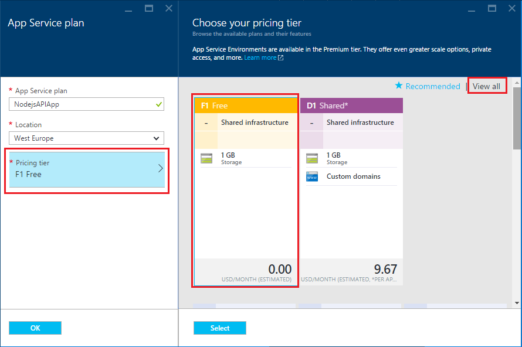

<properties
    pageTitle="Application Node.js API dans le Service d’application Azure | Microsoft Azure"
    description="Apprenez à créer une API RESTful Node.js et le déployez dans une application de l’API dans le Service d’application Azure."
    services="app-service\api"
    documentationCenter="node"
    authors="bradygaster"
    manager="wpickett"
    editor=""/>

<tags
    ms.service="app-service-api"
    ms.workload="web"
    ms.tgt_pltfrm="na"
    ms.devlang="node"
    ms.topic="get-started-article"
    ms.date="05/26/2016"
    ms.author="rachelap"/>

# Créer une API RESTful Node.js et le déployez dans une application de l’API dans Azure

[AZURE.INCLUDE [app-service-api-get-started-selector](../../includes/app-service-api-get-started-selector.md)]

Ce didacticiel montre comment créer un simple [Node.js](http://nodejs.org) API et le déployez dans une [application de l’API](app-service-api-apps-why-best-platform.md) dans le [Service d’application Azure](../app-service/app-service-value-prop-what-is.md) à l’aide de [Git](http://git-scm.com). Vous pouvez utiliser n’importe quel système d’exploitation qui peuvent être exécutées Node.js, et vous devez faire tout votre travail à l’aide des outils de ligne de commande tels que cmd.exe ou bash.

## Conditions préalables

1. Compte Microsoft Azure ([Ouvrir un compte gratuit ici](https://azure.microsoft.com/pricing/free-trial/))
1. [Node.js](http://nodejs.org) installé (cet exemple suppose que vous avez Node.js version 4.2.2)
2. [Git](https://git-scm.com/) installé
1. Compte [GitHub](https://github.com/)

Service d’application prend en charge les nombreuses façons de déployer votre code pour une application API, ce didacticiel montre la méthode Git et suppose que vous avez connaissance de base de l’utilisation des Git. Pour plus d’informations sur les autres méthodes de déploiement, voir [déployer votre application de Service d’application Azure](../app-service-web/web-sites-deploy.md).

## Obtenir de l’exemple de code

1. Ouvrez une interface de ligne de commande pouvant exécuter Node.js et Git commandes.

1. Accéder à un dossier que vous pouvez utiliser pour un référentiel Git local et cloner le [référentiel GitHub contenant l’exemple de code](https://github.com/Azure-Samples/app-service-api-node-contact-list).

        git clone https://github.com/Azure-Samples/app-service-api-node-contact-list.git

    L’API exemple fournit deux points de terminaison : une demande Get pour `/contacts` renvoie une liste de noms et adresses de messagerie au format JSON, tandis que `/contacts/{id}` renvoie uniquement le contact sélectionné.

## Structure (générer automatiquement) Node.js code en fonction des métadonnées Swagger

[Swagger](http://swagger.io/) est un format de fichier pour les métadonnées décrivant un API RESTful. Azure Application Service prend [en charge pour les métadonnées Swagger](app-service-api-metadata.md). Cette section du didacticiel modèles un flux de travail du développement d’API dans lequel vous créez Swagger métadonnées d’abord et qui permet de structure (générer automatiquement) code du serveur pour l’API. 

>[AZURE.NOTE] Vous pouvez ignorer cette section si vous ne voulez pas obtenir des informations sur la structure Node.js code à partir d’un fichier de métadonnées Swagger. Si vous voulez simplement déployer des exemples de code pour une nouvelle application API, passez directement à la section [Création d’une application API dans Azure](#createapiapp) .

### Installer et exécuter des Swaggerize

1. Exécutez la commande suivante pour installer les modules NPM **yo** et **swaggerize générateur** globalement.

        npm install -g yo
        npm install -g generator-swaggerize

    Swaggerize est un outil qui génère le code de serveur pour une API décrite par un fichier de métadonnées Swagger. Le fichier Swagger que vous allez utiliser est nommé *api.json* et se trouve dans le dossier *démarrage* du référentiel que vous cloner.

2. Accédez au dossier *démarrage* , puis exécutez la `yo swaggerize` commande. Swaggerize se poser une série de questions.  Pour **nom de ce projet**, entrez « ContactList » pour le **chemin d’accès au document de swagger**, « api.json » et pour **Express, Joyeux, ou Restify**, entrez « rapide ».

        yo swaggerize

    
    
    **Remarque**: Si vous rencontrez une erreur dans cette étape, l’étape suivante explique comment y remédier.

    Swaggerize crée un dossier d’application, gestionnaires d’échafaudages et fichiers de configuration et génère un fichier **package.json** . Le moteur d’affichage express est utilisé pour générer la page d’aide Swagger.  

3. Si la `swaggerize` commande échoue avec une erreur de « séquence d’échappement non valide » ou « jeton inattendu », corrigez la cause de l’erreur en modifiant le fichier généré *package.json* . Dans la `regenerate` sous `scripts`, modifier la barre oblique inverse qui précède *api.json* à une barre oblique, afin que la ligne ressemble à l’exemple suivant :

        "regenerate": "yo swaggerize --only=handlers,models,tests --framework express --apiPath config/api.json"

1. Accédez au dossier qui contient le code avec génération de modèles (dans ce cas, le sous-dossier */start/ContactList* ).

1. Exécuter `npm install`.
    
        npm install
        
2. Installez le module NPM **jsonpath** . 

        npm install --save jsonpath
        
    

1. Installez le module NPM **swaggerize l’interface utilisateur** . 

        npm install --save swaggerize-ui
        
    

### Personnaliser le code avec génération de modèles

1. Copiez le dossier de **bibliothèque** à partir du dossier de **démarrage** dans le dossier **ContactList** créé par le scaffolder. 

1. Remplacez le code dans le fichier **handlers/contacts.js** par le code suivant. 

    Ce code utilise les données JSON stockées dans le fichier **lib/contacts.json** pris en charge par **lib/contactRepository.js**. Le nouveau code contacts.js répond aux requêtes HTTP pour intégrer l’ensemble des contacts et renvoyer sous la forme d’une charge utile JSON. 

        'use strict';
        
        var repository = require('../lib/contactRepository');
        
        module.exports = {
            get: function contacts_get(req, res) {
                res.json(repository.all())
            }
        };

1. Remplacez le code dans le fichier **handlers/contacts/{id}.js** par le code fofllowing. 

        'use strict';

        var repository = require('../../lib/contactRepository');
        
        module.exports = {
            get: function contacts_get(req, res) {
                res.json(repository.get(req.params['id']));
            }    
        };

1. Remplacez le code dans **server.js** par le code suivant. 

    Les modifications apportées au fichier server.js sont entourées à l’aide de commentaires afin que vous puissiez voir les modifications. 

        'use strict';

        var port = process.env.PORT || 8000; // first change

        var http = require('http');
        var express = require('express');
        var bodyParser = require('body-parser');
        var swaggerize = require('swaggerize-express');
        var swaggerUi = require('swaggerize-ui'); // second change
        var path = require('path');

        var app = express();

        var server = http.createServer(app);

        app.use(bodyParser.json());

        app.use(swaggerize({
            api: path.resolve('./config/api.json'), // third change
            handlers: path.resolve('./handlers'),
            docspath: '/swagger' // fourth change
        }));

        // change four
        app.use('/docs', swaggerUi({
          docs: '/swagger'  
        }));

        server.listen(port, function () { // fifth and final change
        });

### Testez avec l’API en cours d’exécution localement

1. Activer le serveur à l’aide de l’exécutable de ligne de commande Node.js. 

        node server.js

1. Lorsque vous naviguez vers **http://localhost:8000/contacts**, vous voyez la sortie JSON de la liste de contacts (ou que vous êtes invité à télécharger, en fonction de votre navigateur). 

    

1. Lorsque vous accédez à **contacts/http://localhost:8000/2**, vous verrez le contact représenté par cette valeur id.

    

1. Les données JSON Swagger sont pris en charge par le biais du point de **terminaison/swagger** :

    

1. L’interface utilisateur Swagger est pris en charge par le biais du point de terminaison **/docs** . Dans l’interface utilisateur Swagger, vous pouvez utiliser les fonctionnalités de client HTML pour tester votre API.

    

## Créer une nouvelle API application

Dans cette section vous utilisez le portail Azure pour créer une nouvelle API application dans Azure. Cette application API représente les ressources cluster fournissant des Azure pour exécuter votre code. Dans les sections suivantes vous allez déployer votre code à la nouvelle application API.

1. Accédez au [portail Azure](https://portal.azure.com/). 

1. Cliquez sur **Nouveau > Web + Mobile > application API**. 

    

4. Entrez un **nom de l’application** qui est unique dans le domaine *azurewebsites.net* , telles que NodejsAPIApp ainsi qu’un nombre pour le rendre unique. 

    Par exemple, si le nom est `NodejsAPIApp`, l’URL sera `nodejsapiapp.azurewebsites.net`.

    Si vous entrez un nom de quelqu'un d’autre a déjà utilisé, vous voyez un point d’exclamation rouge vers la droite.

6. Dans le menu déroulant **Groupe de ressources** , cliquez sur **Nouveau**et dans le **nom du nouveau groupe de ressources** Entrez « NodejsAPIAppGroup » ou un autre nom si vous préférez. 

    Un [groupe de ressources](../azure-resource-manager/resource-group-overview.md) est un ensemble de ressources Azure tels que des applications, les bases de données et les machines virtuelles API. Pour ce didacticiel, il est conseillé de créer un nouveau groupe de ressources, car cela facilite la supprimer en une seule étape toutes les ressources Azure que vous créez pour le didacticiel.

4. Cliquez sur **Plan/emplacement du Service d’application**, puis cliquez sur **Créer un nouveau**.

    

    Dans la procédure suivante, vous créez un plan de services d’application pour le nouveau groupe de ressources. Un plan de services d’application spécifie les ressources de calcul qui s’exécute à votre application API sur. Par exemple, si vous choisissez la couche gratuite, votre application API s’exécute sur machines virtuelles partagés, tandis que pour certains niveaux payant il s’exécute sur machines virtuelles dédiés. Pour plus d’informations sur les offres de Service d’application, voir [vue d’ensemble des offres de Service d’application](../app-service/azure-web-sites-web-hosting-plans-in-depth-overview.md).

5. Dans la carte de **Plan de Service d’application** , entrez « NodejsAPIAppPlan » ou un autre nom si vous préférez.

5. Dans la liste déroulante **emplacement** , choisissez l’emplacement le plus proche de vous.

    Ce paramètre spécifie le centre de données Azure votre application est exécuté en. Pour ce didacticiel, vous pouvez sélectionner n’importe quelle région et qu’il ne faire la différence visible. Mais, pour une application de production, vous voulez que votre serveur pour être aussi proche que possible pour les clients qui sont accèdent pour réduire le [temps de latence](http://www.bing.com/search?q=web%20latency%20introduction&qs=n&form=QBRE&pq=web%20latency%20introduction&sc=1-24&sp=-1&sk=&cvid=eefff99dfc864d25a75a83740f1e0090).

5. Cliquez sur **couche tarification > Afficher tout > F1 gratuit**.

    Pour ce didacticiel, le niveau de tarification gratuit offre des performances suffisantes.

    

6. Dans la carte de **Plan de Service d’application** , cliquez sur **OK**.

7. Dans la carte **API application** , cliquez sur **créer**.

## Configurer votre nouvelle application API pour le déploiement Git

Vous pouvez déployer votre code à l’application de l’API en appuyant validations vers un référentiel Git dans le Service d’application Azure. Dans cette section du didacticiel, vous créez les informations d’identification et le Git référentiel dans Azure que vous utiliserez pour le déploiement.  

1. Une fois que votre application API a été créée, cliquez sur **application Services > {votre application API}** à partir de la page d’accueil du portail. 

    Le portail affiche les cartes de **L’API application** et les **paramètres** .

    

1. Dans la carte de **paramètres** , faites défiler jusqu'à la section **publication** , puis cliquez sur **informations d’identification de déploiement**.
 
3. Dans la carte de **définir les informations d’identification de déploiement** , entrez un nom d’utilisateur et mot de passe, puis cliquez sur **Enregistrer**.

    Vous allez utiliser ces informations d’identification pour la publication de votre code Node.js dans votre application API. 

    

1. Dans la carte de **paramètres** , cliquez sur **source du déploiement > choisir une Source > référentiel Git Local**, puis cliquez sur **OK**.

    

1. Une fois que votre référentiel Git a été créé les modifications de carte pour vous montrer vos déploiements actives. Dans la mesure où le référentiel est nouvelle, vous n’avez aucun déploiement active dans la liste. 

    

1. Copiez l’URL de référentiel Git. Pour ce faire, accédez à la carte pour votre nouvelle application API et consultez la section **Essentials** de la cuillère. Notez l' **URL de cloner Git** dans la section **Essentials** . Lorsque vous pointez sur cette URL, vous voyez une icône à droite que va copier l’URL dans le Presse-papiers. Cliquez sur cette icône pour copier l’URL.

    

    **Remarque**: vous avez besoin du cloner Git URL dans la section suivante Vérifiez qu’Enregistrer quelque part pour le moment.

Maintenant que vous avez une application API grâce à un référentiel Git sauvegarde des, vous pouvez distribuer le code dans le référentiel à déployer le code de l’application API. 

## Déployez votre code API Azure

Dans cette section, vous créez un référentiel Git local qui contient votre code serveur pour l’API, et puis vous pousser votre code à partir de ce référentiel dans le référentiel dans Azure que vous avez créé précédemment.

1. Copier la `ContactList` dossier vers un emplacement que vous pouvez utiliser pour un nouveau référentiel Git local. Si vous avez effectué la première partie de ce didacticiel, copiez `ContactList` à partir de la `start` dossier ; Sinon, copiez `ContactList` à partir de la `end` dossier.

1. Dans votre outil de ligne de commande, naviguez vers le nouveau dossier, puis exécutez la commande suivante pour créer un nouveau référentiel Git local. 

        git init

     

1. Exécutez la commande suivante pour ajouter un Git remote pour référentiel de votre application API. 

        git remote add azure YOUR_GIT_CLONE_URL_HERE

    **Remarque**: Remplacez la chaîne « YOUR_GIT_CLONE_URL_HERE » par votre propre URL cloner Git que vous avez copiée précédemment. 

1. Exécutez la commande suivante pour créer une validation qui contient l’ensemble de votre code. 

        git add .
        git commit -m "initial revision"

    

1. Exécuter la commande distribuer votre code sur Azure. Lorsque vous êtes invité pour un mot de passe, entrez celui que vous avez créée précédemment dans le portail Azure.

        git push azure master

    Cela déclenche un déploiement dans votre application API.  

1. Dans votre navigateur, accédez à la carte **déploiements** pour votre application API, puis voir que le déploiement est en cours. 

    

    Simultanément, l’interface de ligne de commande reflète l’état de votre déploiement est pendant. 

    

    Une fois le déploiement terminé, la carte **déploiements** reflète le déploiement de vos modifications du code dans votre application API. 

## Testez avec l’API en cours d’exécution dans Azure
 
3. Copiez l' **URL** dans la section **Essentials** de votre carte API application. 

    

1. À l’aide d’un client de l’API REST tel que Postman ou Fiddler (ou votre navigateur web), indiquez l’URL de vos contacts appel API, qui est la `/contacts` point de terminaison de votre application API. L’URL sera`https://{your API app name}.azurewebsites.net/contacts`

    Lorsque vous exécutez une requête GET à ce point de terminaison, vous obtenez la sortie JSON de votre application API.

    

2. Dans un navigateur, accédez à la `/docs` point de terminaison pour essayer de l’interface utilisateur Swagger en cours d’exécution dans Azure.

Maintenant que vous avez remise continue wired vers le haut, vous pouvez apporter des modifications de code et les déployer sur Azure simplement en appuyant validations à votre référentiel Git Azure.

## Étapes suivantes

À ce stade, vous avez correctement créé une application API et déployée code Node.js API sur celui-ci. Le didacticiel suivant montre comment [utiliser des applications API JavaScript clients, à l’aide de CORS](app-service-api-cors-consume-javascript.md).
