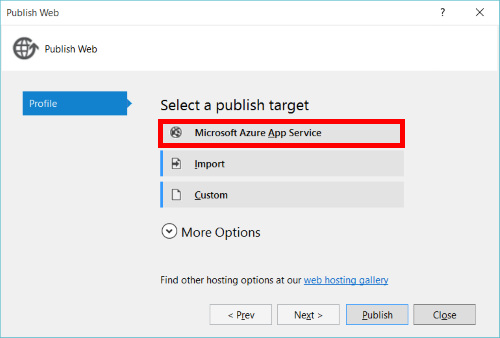

<properties
    pageTitle="Application Service API applications - ce qui a changé | Microsoft Azure"
    description="Découvrez quelles sont les nouveautés pour les applications de l’API dans le Service d’application Azure."
    services="app-service\api"
    documentationCenter=".net"
    authors="mohitsriv"
    manager="wpickett"
    editor="tdykstra"/>

<tags
    ms.service="app-service-api"
    ms.workload="na"
    ms.tgt_pltfrm="na"
    ms.devlang="na"
    ms.topic="article"
    ms.date="06/29/2016"
    ms.author="rachelap"/>

# Application Service API applications - ce qui a changé

À l’événement Connect() de novembre 2015, un certain nombre des améliorations apportées au Service d’application Azure étaient [annoncé](https://azure.microsoft.com/blog/azure-app-service-updates-november-2015/). Ces améliorations incluent des modifications sous-jacentes aux applications API pour mieux aligner avec Mobile et applications Web, réduire Nb concept et améliorer le déploiement et les performances d’exécution. Démarrage 30 novembre 2015, nouvelle API applications que vous créez à l’aide du portail de gestion Azure ou les outils dernière refléteront ces modifications. Cet article décrit ces modifications, ainsi que comment redéployez applications existantes pour tirer parti des fonctionnalités.

## Modifications de fonctionnalité
Les principales fonctionnalités de l’API applications – authentification, métadonnées CORS et API – ont été déplacées directement dans l’application de Service. Avec cette modification, les fonctionnalités sont disponibles sur le Web, Mobile et applications API. En fait, ces trois partagent le même type de ressource **Microsoft.Web/sites** dans le Gestionnaire de ressources. La passerelle API applications n’est plus nécessaire ni proposée avec l’API applications. Cela facilite également l’utiliser la gestion des API Azure dans la mesure où il y ait simplement la passerelle de gestion des API unique.

Un principe de conception important avec la mise à jour des applications API consiste à vous permettent de mettre votre API comme, dans la langue de votre choix.  Si votre API est déjà déployé comme une application Web ou application Mobile, vous n’êtes pas obligé de redéployez votre application pour tirer parti des nouvelles fonctionnalités. Si vous êtes sur Aperçu des applications API, Guide de migration est décrite ci-dessous.

### Authentification
Les fonctionnalités de l’authentification applications API, les Services/applications Mobile et les applications Web main existantes ont été unifiées et ne sont disponibles dans une carte de l’authentification unique Azure Application Service dans le portail de gestion. Pour une introduction aux services d’authentification dans le Service d’application, voir [authentification de développement d’application Service / autorisation](https://azure.microsoft.com/blog/announcing-app-service-authentication-authorization/).

Scénarios de l’API, il existe un certain nombre de nouvelles fonctionnalités pertinents :

- **Prise en charge pour l’utilisation de Azure Active Directory directement**, sans avoir à exchange le jeton AAD pour un jeton de session le code client : votre client peut inclure uniquement les jetons AAD dans l’en-tête d’autorisation, en fonction du contexte jeton porteur. Cela signifie également qu'aucun SDK spécifiques au Service application n’est requis sur le côté client ou serveur. 
- **Service à service ou access « Interne »**: Si vous avez un processus de processus ou un autre client devoir accéder aux API sans une interface, vous pouvez demander un jeton à l’aide d’une identité de service DAS et passer au Service d’application pour l’authentification avec votre application.
- **Différé autorisation**: de nombreuses applications ont des restrictions d’accès pour différentes parties de l’application. Vous pouvez choisir de certaines API soit disponible publiquement, tandis que d’autres personnes exiger une connexion. La fonctionnalité d’authentification / d’autorisation d’origine a été tout ou rien, avec l’ensemble du site nécessitant la connexion. Cette option existe toujours, mais vous pouvez également autoriser le code de votre application pour le rendu des décisions d’accès après que l’application de Service a authentifié l’utilisateur.
 
Pour plus d’informations sur les nouvelles fonctionnalités d’authentification, consultez [authentification et autorisation pour les applications de l’API dans le Service d’application Azure](app-service-api-authentication.md). Pour plus d’informations sur la migration des applications API existantes à partir du modèle d’applications API précédente vers le nouveau, voir [migration existant API applications](#migrating-existing-api-apps) plus loin dans cet article.
 
### CORS
Au lieu d’un paramètre délimitée par des virgules d’application **MS_CrossDomainOrigins** , il existe désormais une carte dans le portail de gestion Azure pour la configuration CORS. Par ailleurs, il peut être configuré à l’aide d’outils tels que PowerShell Azure, infrastructure du langage commun ou [Ressource Explorer](https://resources.azure.com/)le Gestionnaire de ressources. Définissez la propriété **cors** du type de ressource **Microsoft.Web/sites/config** pour votre ** &lt;nom du site&gt;/web** ressource. Par exemple :

    {
        "cors": {
            "allowedOrigins": [
                "https://localhost:44300"
            ]
        }
    } 

### API métadonnées
La carte de définition de l’API est désormais disponible sur le Web, Mobile et applications API. Dans le portail de gestion, vous pouvez spécifier une url relative ou une url absolue pointant sur un point de terminaison cette représentation hôtes un 2.0 Swagger de votre API. Par ailleurs, il peut être configuré à l’aide des outils du Gestionnaire de ressources. Définissez la propriété **apiDefinition** sur le type de ressource **Microsoft.Web/sites/config** pour votre ** &lt;nom du site&gt;/web** ressource. Par exemple :

    {
        "apiDefinition":
        {
            "url": "https://myStorageAccount.blob.core.windows.net/swagger/apiDefinition.json"
        }
    }

Pour le moment, le point de terminaison de métadonnées doit être accessibles au public sans authentification pour de nombreux clients en aval (par exemple, Visual Studio API REST client génération et flux « Ajouter API » PowerApps) pour l’utiliser. Cela signifie que si vous utilisez l’authentification de l’application Service et que vous voulez exposer la définition de l’API au sein de votre application elle-même, vous devez utiliser l’option d’authentification différé décrite plus haut afin que le chemin vers les métadonnées de votre Swagger est public.

## Portail de gestion
Sélection **Nouveau > Web + Mobile > API application** dans le portail créera applications API qui reflètent les nouvelles fonctionnalités décrites dans l’article. **Parcourir > applications API** n’affichera que ces nouvelles applications API. Une fois que vous recherchez dans une application API, la carte partage la même mise en page et des fonctions que celles des applications Mobile et de site Web. Les seules différences sont du contenu de démarrage rapide et classement des paramètres.

Applications API existantes (ou applications API Marketplace créées à partir d’applications logique) avec l’aperçu précédente fonctionnalités sont toujours visibles dans le Concepteur d’applications logique et lorsque vous naviguez sur toutes les ressources dans un groupe de ressources.

## Visual Studio

La plupart des applications Web outils fonctionnent avec les nouvelles applications API, car ils partagent le même type de ressource **Microsoft.Web/sites** sous-jacent. Azure Visual Studio outils, cependant, doit être mis à niveau vers la version 2.8.1 ou version ultérieure mesure où elle présente un certain nombre de fonctionnalités spécifiques aux API. Téléchargez le Kit de développement à partir de la [page de téléchargements Azure](https://azure.microsoft.com/downloads/).

Avec la rationalisation des types de services d’application, publier est également unifiée sous **Publier > Microsoft Azure Application Service**:

Pour en savoir plus sur le Kit de développement logiciel 2.8.1, lisez l’annonce [le billet de blog](https://azure.microsoft.com/blog/announcing-azure-sdk-2-8-1-for-net/).

Vous pouvez également importer manuellement le profil de publication à partir du portail de gestion pour activer la publication. Toutefois, Cloud Explorer, génération de code et sélection de l’application API/création nécessitent SDK 2.8.1 ou une version ultérieure.

## Migration des applications API existantes
Si votre API personnalisé est déployé à la version précédente d’applications API, nous avons besoin de migrer vers le nouveau modèle pour les applications API le 31 décembre 2015. Dans la mesure où à la fois le modèle ancien et nouveaux est basé sur des API Web hébergé dans le Service d’application, la plupart du code existant peut être réutilisée.

### Hébergement et redéploiement
Les étapes pour redéployez sont les mêmes que le déploiement d’un API Web existante au Service d’application. Étapes suivantes :

1. Créer une application API vide. Pour ce faire dans le portail avec nouveau > application API, dans Visual Studio à partir de publier ou outils de gestionnaire de ressources. Si vous utilisez les outils du Gestionnaire de ressources ou des modèles, définissez la valeur **type** **api** sur le type de ressource **Microsoft.Web/sites** pour que les Démarrages rapides et les paramètres du portail de gestion orienté vers scénarios API.
2. Se connecter et déployer votre projet dans l’application API vide à l’aide des mécanismes de déploiement pris en charge par le Service d’application. Lisez la [documentation de déploiement d’Azure Application Service](../app-service-web/web-sites-deploy.md) pour en savoir plus. 
  
### Authentification
Les services d’authentification de Service d’application prend en charge les mêmes fonctionnalités qui étaient disponibles avec le modèle d’applications API précédent. Si vous utilisez des jetons de session et exiger SDK, utilisez le SDK client et serveur suivants :

- Client : [Client Mobile Azure SDK](http://www.nuget.org/packages/Microsoft.Azure.Mobile.Client/)
- [Extension de Microsoft Azure application Mobile .NET d’authentification](http://www.nuget.org/packages/Microsoft.Azure.Mobile.Server.Authentication/) du serveur : 

Si vous utilisez à la place l’alpha application Service SDK, celles-ci sont désormais déconseillées :

- Client : [Microsoft Azure AppService SDK](http://www.nuget.org/packages/Microsoft.Azure.AppService)
- Serveur : [Microsoft.Azure.AppService.ApiApps.Service](http://www.nuget.org/packages/Microsoft.Azure.AppService.ApiApps.Service)

En particulier avec Azure Active Directory, cependant, aucune application Service spécifique est requis si vous utilisez le jeton AAD directement.

### Accès interne
Le modèle d’applications API précédent inclus un niveau d’accès interne intégrée. Cela requis utilisation du Kit de développement pour les demandes de signature. Comme décrit plus haut, avec le nouveau modèle d’applications API, entités de service AAD utilisable comme alternative pour l’authentification de service à service sans avoir besoin d’un application spécifique au Service SDK. Découvrez plus en du [Service d’authentification principale pour les applications de l’API dans le Service d’application Azure](app-service-api-dotnet-service-principal-auth.md).

### Découverte
Le modèle d’applications API précédent avait API pour découvrir les autres applications API en cours d’exécution dans le même groupe de ressources derrière la même passerelle. Ceci est particulièrement utile dans les architectures de mise en œuvre des motifs microservice. Bien que ce n’est pas directement pris en charge, un certain nombre d’options est disponible :

1. Utiliser l’API Gestionnaire de ressources Azure pour la découverte.
2. Placez la gestion des API de Azure devant votre API hébergées par le Service d’application. Gestion des API Azure sert une façade et peuvent fournir une url d’en vis-à-vis externes stable même si vous topologie interne change.
3. Créer votre propre application API découverte et présentent d’autres applications API avec l’application de découverte au démarrage.
4. Au moment du déploiement, remplissez les paramètres de l’application de toutes les applications de l’API (et clients) avec les points de terminaison d’autres applications API. Ceci est envisageable dans les déploiements de modèle et dans la mesure où l’API applications vous offre maintenant contrôle de l’url.

## Utilisation des applications de l’API avec les applications de logique

Le nouveau modèle d’applications API fonctionne bien avec les [Applications logique version du schéma 2015-08-01](../app-service-logic/app-service-logic-schema-2015-08-01.md).

## Étapes suivantes

Pour en savoir plus, lisez les articles dans la [section API applications Documentation](https://azure.microsoft.com/documentation/services/app-service/api/). Ils ont été mis à jour pour refléter le nouveau modèle pour les applications de l’API. En outre, communiquer sur les forums pour plus d’informations ou des conseils sur la migration :

- [Forum MSDN](https://social.msdn.microsoft.com/Forums/en-US/home?forum=AzureAPIApps)
- [Débordement de la pile](http://stackoverflow.com/questions/tagged/azure-api-apps)
