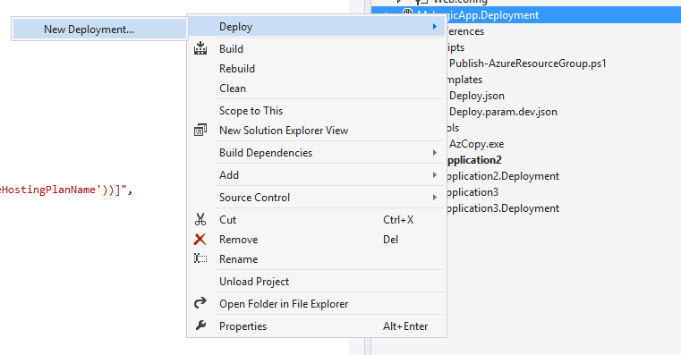
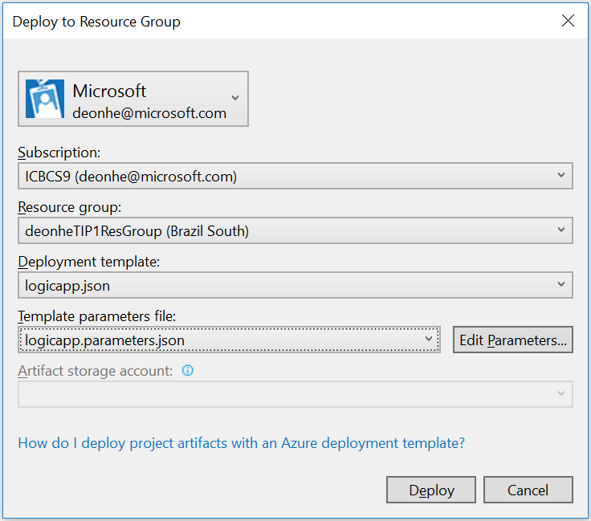

<properties 
    pageTitle="Créer des applications de logique dans Visual Studio | Microsoft Azure" 
    description="Créer un projet dans Visual Studio pour créer et déployer votre application logique." 
    authors="jeffhollan" 
    manager="erikre" 
    editor="" 
    services="logic-apps" 
    documentationCenter=""/>

<tags
    ms.service="logic-apps"
    ms.workload="integration"
    ms.tgt_pltfrm="na"
    ms.devlang="na"
    ms.topic="article"
    ms.date="10/18/2016"
    ms.author="jehollan"/> 
    
# Créer et déployer des applications logique dans Visual Studio

Bien que le [Portail Azure](https://portal.azure.com/) vous donne un excellent moyen de concevoir et gérer vos applications logique, vous pouvez également concevoir et déployer votre application logique de Visual Studio à la place.  Logique applications est fourni avec un ensemble riche Visual Studio d’outils qui vous permet de créer une application logique en utilisant le concepteur, configurer des modèles de déploiement et d’automatisation et déployer dans n’importe quel environnement.  

## Étapes d’installation

Voici les étapes pour installer et configurer les outils Visual Studio pour les applications logique.

### Conditions préalables

- [Visual Studio 2015](https://www.visualstudio.com/downloads/download-visual-studio-vs.aspx)
- [Dernière version du SDK Azure](https://azure.microsoft.com/downloads/) (2.9.1 ou version ultérieure)
- [PowerShell azure] (https://github.com/Azure/azure-powershell#installation)
- Accès au web lorsque vous utilisez le concepteur incorporé

### Installer les outils de Visual Studio pour les applications de logique

Une fois que vous avez les conditions préalables installés, 

1. Ouvrir Visual Studio 2015 dans le menu **Outils** , sélectionnez **Extensions et mises à jour**
1. Sélectionnez la catégorie **en ligne** pour la recherche en ligne
1. Rechercher des **Applications logique** afficher les **Azure logique applications Tools pour Visual Studio**
1. Cliquez sur le bouton **Télécharger** pour télécharger et installer l’extension
1. Redémarrez Visual Studio après l’installation

> [AZURE.NOTE] Vous pouvez également télécharger l’extension directement à partir de [ce lien](https://visualstudiogallery.msdn.microsoft.com/e25ad307-46cf-412e-8ba5-5b555d53d2d9)

Une fois installé, vous ne pourrez pas utiliser le projet de groupe de ressources Azure avec le Concepteur d’application logique.

## Créer un projet

1. Atteindre le menu **fichier** , puis sélectionnez **Nouveau** >  **projet** (ou, vous pouvez accédez à **Ajouter** , puis sélectionner **Nouveau projet** pour l’ajouter à une solution existante) :  

1. Dans la boîte de dialogue Rechercher **Cloud**et sélectionnez **Groupe de ressources Azure**. Tapez un **nom** , puis sur **OK**.
    

1. Sélectionnez le modèle **d’application logique** . Cela créera pour commencer avec un modèle de déploiement d’application logique vide.
    

1. Une fois que vous avez sélectionné votre **modèle**, cliquez sur **OK**.

    Maintenant votre projet Application logique est ajouté à votre solution. Vous devriez voir le fichier de déploiement dans l’Explorateur de solutions :  

    

## Utilisation du Concepteur de l’application logique

Une fois que vous disposez d’un projet de groupe de ressources Azure qui contient une application logique, vous pouvez ouvrir le Concepteur de Visual Studio pour vous aider à créer le flux de travail.  Le concepteur nécessite une connexion internet afin des connecteurs pour les propriétés disponibles et les données de la requête (par exemple, si vous utilisez le connecteur Dynamics CRM Online, le concepteur sera interroger votre instance CRM pour répertorier les propriétés par défaut et personnalisés disponibles).

1. Avec le bouton droit sur le `<template>.json` fichier et sélectionnez **Ouvrir avec logique App Designer** (ou `Ctrl+L`)
1. Sélectionnez l’abonnement, le groupe de ressources et l’emplacement pour le modèle de déploiement
    - Il est important de noter que la conception d’une application logique créera des ressources de **Connexion de l’API** pour rechercher des propriétés pendant la conception.  Le groupe de ressources sélectionné sera le groupe de ressources utilisé pour créer les connexions pendant la conception.  Vous pouvez afficher ou modifier les connexions de l’API en accédant au portail Azure et de navigation pour les **Connexions de l’API**.
    
1. Le concepteur doit restituer basée sur la définition de la `<template>.json` fichier.
1. Vous pouvez désormais créer et concevoir votre application logique et modifications seront mise à jour dans le modèle de déploiement.
    

Vous verrez également `Microsoft.Web/connections` ressources qui sont ajoutées à votre fichier de ressources pour toutes les connexions nécessaires pour l’application de la logique de la fonction.  Ces propriétés de connexion peuvent être définies lorsque vous déployez et gérées après le déploiement des **Connexions de l’API** dans le portail Azure.

### Passer à la vue de codes JSON

Vous pouvez sélectionner l’onglet **Mode Code** dans la partie inférieure du Concepteur de basculer vers la représentation JSON de l’application logique.  Pour revenir à la ressource JSON complète, avec le bouton droit la `<template>.json` de fichiers et sélectionnez **Ouvrir**.

### L’enregistrement de l’application logique

Vous pouvez enregistrer l’application logique à tout moment via le bouton **Enregistrer** ou `Ctrl+S`.  Si des erreurs sont avec votre application logique au moment où que vous enregistrez, ils s’afficheront dans la fenêtre **des sorties** de Visual Studio.

## Déploiement de votre application logique

Enfin, une fois que vous avez configuré votre application, vous pouvez déployer directement à partir de Visual Studio en quelques étapes. 

1. Avec le bouton droit sur le projet dans l’Explorateur de solutions et accédez à **déployer** > **Nouveau déploiement...** 
     

2. Vous êtes invité à se connecter à votre abonnement Azure. 

3. Désormais, vous devez choisir les détails du groupe de ressources que vous voulez déployer l’application logique à. 
    

     > [AZURE.NOTE]    Veillez à sélectionner les fichiers de modèle et les paramètres corrects pour le groupe de ressources (par exemple si vous déployez dans un environnement de production vous souhaiterez choisir le fichier de paramètres de production). 
4. Sélectionnez le bouton déployer
 
    
6. L’état du déploiement apparaît dans la fenêtre de **sortie** (vous devrez peut-être choisir **Azure mise en service**. 
    

À l’avenir, vous pouvez modifier votre application logique de contrôle de code source et utiliser Visual Studio pour déployer de nouvelles versions. 

> [AZURE.NOTE] Si vous modifiez la définition dans le portail Azure directement, la prochaine fois que vous déployez à partir de Visual Studio ces modifications seront remplacée.

## Étapes suivantes

- Pour commencer avec les applications logique, suivez le didacticiel [créer une application logique](app-service-logic-create-a-logic-app.md) .  
- [Afficher des exemples et des scénarios courants](app-service-logic-examples-and-scenarios.md)
- [Vous pouvez automatiser des processus métiers avec les applications de logique](http://channel9.msdn.com/Events/Build/2016/T694) 
- [Découvrez comment intégrer vos systèmes applications logique](http://channel9.msdn.com/Events/Build/2016/P462)