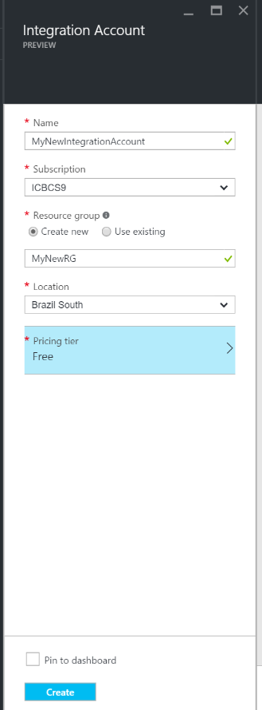
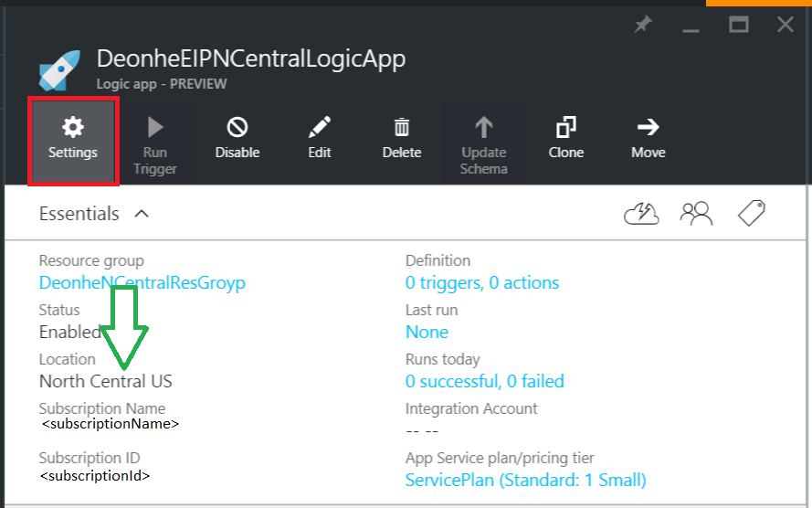
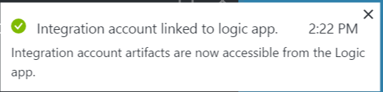
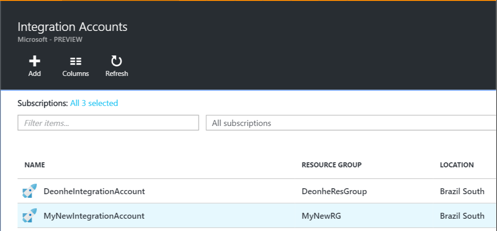

<properties 
    pageTitle="Vue d’ensemble des comptes d’intégration et le module d’intégration entreprise | Service d’application Microsoft Azure | Microsoft Azure" 
    description="Découvrez toutes à propos des comptes d’intégration, le Pack de l’intégration d’entreprise et les applications de logique" 
    services="logic-apps" 
    documentationCenter=".net,nodejs,java"
    authors="msftman" 
    manager="erikre" 
    editor="cgronlun"/>

<tags 
    ms.service="logic-apps" 
    ms.workload="integration" 
    ms.tgt_pltfrm="na" 
    ms.devlang="na" 
    ms.topic="article" 
    ms.date="07/08/2016" 
    ms.author="deonhe"/>

# Vue d’ensemble des comptes d’intégration

## Qu’est un compte de l’intégration ?
Un compte de l’intégration est un compte Azure qui permet aux applications d’intégration d’entreprise Gérer les objets, y compris des schémas, des cartes, des certificats, des partenaires et des accords. N’importe quelle application intégration que vous créez devez utiliser un compte d’intégration afin d’accéder à un schéma, la carte ou le certificat, par exemple.

## Créer un compte de l’intégration 
1. Sélectionnez **Parcourir**   
  
2. Entrez **l’intégration** dans la zone de recherche de filtre et sélectionnez **L’intégration des comptes** dans la liste des résultats     
   
3. Sélectionnez le bouton *Ajouter* dans le menu en haut de la page      
  
4. Entrez le **nom**, sélectionnez l' **abonnement** que vous voulez utiliser, soit créer un **groupe de ressources** ou sélectionnez un groupe de ressources existant, sélectionnez un **emplacement** où votre compte intégration sera hébergée, sélectionnez un **niveau de tarification**, puis cliquez sur le bouton **créer** .   

  À ce stade, le compte d’intégration sera déployé dans l’emplacement sélectionné. Cela doit se terminer dans la minute.    
  
5. Actualisez la page. Vous verrez votre nouveau compte intégration répertorié. Félicitations !  
 

## Comment lier un compte de l’intégration à une application de logique
Dans l’ordre de vos applications logique d’accès aux cartes, des schémas, accords et autres objets qui sont trouvent dans votre compte de l’intégration, vous devez d’abord lier le compte de l’intégration à votre application logique.

### Voici la procédure pour lier un compte de l’intégration à une application de logique 

#### Conditions préalables
- Un compte de l’intégration
- Une application de logique

>[AZURE.NOTE]Assurez-vous que votre compte de l’intégration et application logique sont au **même emplacement Azure** avant de commencer

1. Sélectionnez le lien **paramètres** dans le menu de votre application logique  
   
2. Sélectionnez l’élément **Intégration compte** dans la carte de paramètres  
   
3. Sélectionnez le compte de l’intégration que vous souhaitez créer un lien vers votre logique d’application à partir de la **Sélectionnez le compte de l’intégration** de liste déroulante zone de liste  
   
4. Enregistrer votre travail  
   
5. Vous verrez une notification indiquant que votre compte intégration a été lié à votre application logique et que tous les objets dans votre compte de l’intégration sont désormais disponibles dans votre application logique.  
   

À présent que votre compte de l’intégration est lié à votre application logique, vous pouvez vous accédez à votre application logique et connecteurs B2B tels que la Validation XML, le fichier plat coder/décoder ou la transformation permet de créer des applications avec des fonctionnalités B2B.  
    
## Comment supprimer un compte de l’intégration ?
1. Sélectionnez **Parcourir**  
    
2. Entrez **l’intégration** dans la zone de recherche de filtre et sélectionnez **L’intégration des comptes** dans la liste des résultats     
   
3. Sélectionnez le **compte d’intégration** que vous souhaitez supprimer  
  
4. Sélectionnez le lien **Supprimer** situé dans le menu   
  
5. Confirmer votre choix    

## Comment déplacer un compte d’intégration ?
Vous pouvez facilement déplacer un compte de l’intégration à un nouvel abonnement et un groupe de ressources. Si vous avez besoin déplacer votre compte d’intégration, procédez comme suit :

>[AZURE.IMPORTANT] Vous devez mettre à jour tous les scripts afin d’utiliser la nouvelle ressource ID suite du déplacement d’un compte d’intégration.

1. Sélectionnez **Parcourir**  
    
2. Entrez **l’intégration** dans la zone de recherche de filtre et sélectionnez **L’intégration des comptes** dans la liste des résultats     
   
3. Sélectionnez le **compte d’intégration** que vous souhaitez supprimer  
  
4. Sélectionnez le lien **déplacer** qui se trouve dans le menu   
  
5. Confirmer votre choix    

## Étapes suivantes
- [En savoir plus sur le Pack de l’intégration d’entreprise] (./app-service-logic-enterprise-integration-overview.md "En savoir plus sur le Pack de l’intégration d’entreprise")  
- [En savoir plus sur les accords] (./app-service-logic-enterprise-integration-agreements.md "Découvrez les contrats de l’intégration d’entreprise")  

 