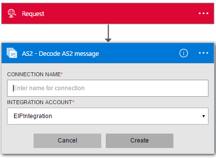

<properties 
    pageTitle="En savoir plus sur Enterprise intégration Pack coder AS2 Message Connctor | Service d’application Microsoft Azure | Microsoft Azure" 
    description="Découvrez comment utiliser les partenaires avec les applications Enterprise Integration Pack et logique" 
    services="logic-apps" 
    documentationCenter=".net,nodejs,java"
    authors="padmavc" 
    manager="erikre" 
    editor=""/>

<tags 
    ms.service="logic-apps" 
    ms.workload="integration" 
    ms.tgt_pltfrm="na" 
    ms.devlang="na" 
    ms.topic="article" 
    ms.date="08/15/2016" 
    ms.author="padmavc"/>

# Prise en main coder AS2 Message

Se connecter à coder AS2 Message pour établir la sécurité et la fiabilité lors de la transmission des messages. Il fournit la signature numérique, le déchiffrement et accusés de réception via Message destruction Notifications (MDN).

## Créer la connexion

### Conditions préalables

* Un compte Azure ; Vous pouvez créer un [compte gratuit](https://azure.microsoft.com/free)

* Un compte de l’intégration est requis pour utiliser AS2 coder message connecteur. Afficher des détails sur la façon de créer un [Compte de l’intégration](./app-service-logic-enterprise-integration-create-integration-account.md), [partenaires](./app-service-logic-enterprise-integration-partners.md) et un [contrat AS2](./app-service-logic-enterprise-integration-as2.md)

### Se connecter à coder AS2 Message comme suit :

1. [Créer une application logique](./app-service-logic-create-a-logic-app.md) fournit un exemple.

2. Ce connecteur n’a pas de déclencheurs. Utiliser d’autres déclencheurs pour démarrer l’application logique, par exemple un déclencheur demande.  Dans le concepteur logique application, ajoutez un déclencheur et ajoutez une action.  Sélectionnez Afficher Microsoft API gérées dans le menu déroulant de la liste, puis entrez « AS2 » dans la zone de recherche.  Sélectionnez AS2 – décoder AS2 Message

    

3. Si vous n’avez pas encore créé toutes les connexions au compte de l’intégration, vous êtes invité aux détails de connexion

    

4. Entrez les détails du compte de l’intégration.  Propriétés d’un astérisque sont requises

  	| Propriété   | Plus d’informations |
  	| --------   | ------- |
  	| Nom de la connexion *    | Entrez un nom pour votre connexion |
  	| Intégration compte * | Entrez le nom du compte de l’intégration. Assurez-vous que votre compte de l’intégration et application logique sont au même emplacement Azure |

    Une fois terminé, vos informations de connexion se présenter comme suit

    

5. Sélectionnez **créer**
    
6. Notez que la connexion a été créée.  À présent, effectuez les autres étapes dans votre application logique

     

7. Sélectionnez des en-têtes et des corps à partir des sorties de demande

     

## La coder AS2 effectue les opérations suivantes

* Traite les en-têtes HTTP/AS2
* Vérifie la signature (le cas échéant)
* Déchiffre les messages (le cas échéant)
* Décompression le message (le cas échéant)
* Résout un MDN reçu avec le message sortant d’origine
* Met à jour et de corrélation des enregistrements dans la base de données non répudiation
* L’écriture des enregistrements pour les rapports d’état AS2
* Le contenu de charge utile de sortie est en base 64 codé
* Détermine si une MDN est requise et si la MDN doit être synchrone ou asynchrone basée sur configuration AS2 contrat
* Génère un MDN asynchrone ou synchrone (basé sur les configurations d’accord)
* Définit les propriétés et les jetons de corrélation sur la MDN

##Essayez-le pour vous-même

Pourquoi ne pas faire un essai. Cliquez [ici](https://azure.microsoft.com/documentation/templates/201-logic-app-as2-send-receive/) pour déployer une application logique opérationnel de votre propre utilisant les fonctionnalités de logique applications AS2 

## Étapes suivantes

[En savoir plus sur le Pack de l’intégration d’entreprise] (./app-service-logic-enterprise-integration-overview.md "En savoir plus sur le Pack de l’intégration d’entreprise") 