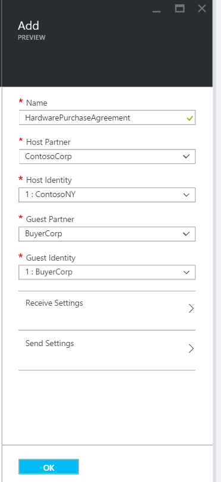
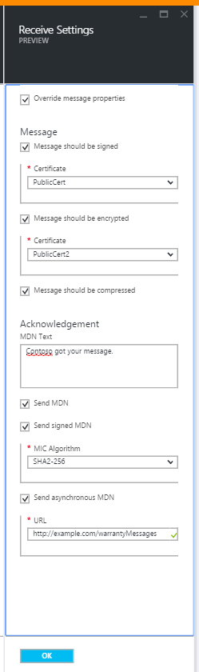
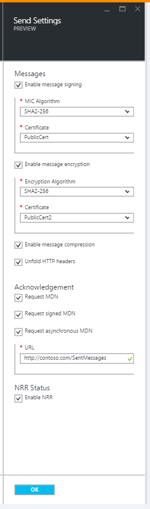

<properties 
    pageTitle="Découvrez comment créer un contrat AS2 pour le Pack de l’intégration d’entreprise" 
    description="Découvrez comment créer un contrat AS2 pour l’entreprise Integration Pack | Service d’application Microsoft Azure" 
    services="logic-apps" 
    documentationCenter=".net,nodejs,java"
    authors="msftman" 
    manager="erikre" 
    editor="cgronlun"/>

<tags 
    ms.service="logic-apps" 
    ms.workload="integration" 
    ms.tgt_pltfrm="na" 
    ms.devlang="na" 
    ms.topic="article" 
    ms.date="06/29/2016" 
    ms.author="deonhe"/>

# Intégration d’entreprise avec AS2

## Créer un contrat AS2
Pour pouvoir utiliser les fonctionnalités d’entreprise dans les applications logique, vous devez d’abord créer accords. 

### Voici ce dont vous avez besoin avant de commencer
- Un [compte de l’intégration](./app-service-logic-enterprise-integration-accounts.md) défini dans votre abonnement Azure  
- Au moins deux [partenaires](./app-service-logic-enterprise-integration-partners.md) déjà défini dans votre compte de l’intégration  

>[AZURE.NOTE]Lorsque vous créez un contrat, le contenu dans le fichier du contrat doit correspondre au type de contrat.    

Une fois que vous avez [créé un compte de l’intégration](./app-service-logic-enterprise-integration-accounts.md) et [ajouté des partenaires](./app-service-logic-enterprise-integration-partners.md), vous pouvez créer un accord en procédant comme suit :  

### Dans la page d’accueil du portail Azure

Après la connexion au [portail Azure](http://portal.azure.com "Azure portail"):  
1. Dans le menu de gauche, sélectionnez **Parcourir** .  

>[AZURE.TIP]Si vous ne voyez pas le lien **Parcourir** , vous devrez peut-être développer tout d’abord le menu. Pour ce faire, cliquez sur le lien **Afficher le menu** situé en haut à gauche du menu réduit.  

    
2. Tapez *intégration* dans la zone de recherche de filtre, puis sélectionnez **L’intégration des comptes** dans la liste des résultats.       
   
3. Dans la carte de **L’intégration des comptes** qui s’ouvre, sélectionnez le compte de l’intégration dans laquelle vous créerez le contrat. Si vous ne voyez pas l’intégration des comptes de listes, [créer un premier](./app-service-logic-enterprise-integration-accounts.md "All about integration accounts").  
  
4.  Sélectionnez la vignette **accords** . Si vous ne voyez pas la vignette accords, tout d’abord l’ajouter.   
   
5. Sélectionnez le bouton **Ajouter** dans la carte accords qui s’ouvre.  
  
6. Entrez un **nom** pour votre contrat, puis cliquez sur le **Partenaire d’accueil**, **Identité de l’hôte**, **Partenaire invité**, **Identité invité**, dans la carte accords qui s’ouvre.  
  

Voici quelques informations que peut s’avérer utile lorsque vous configurez les paramètres de votre contrat : 
  
|Propriété|Description|
|----|----|
|Partenaire d’accueil|Un contrat doit partenaire un hôte et l’invité. Le partenaire d’accueil représente l’organisation qui consiste à configurer le contrat.|
|Identité de l’hôte|Un identificateur pour le partenaire d’accueil. |
|Partenaire invité|Un contrat doit partenaire un hôte et l’invité. Le partenaire invité représente l’organisation qui effectue d’entreprise avec le partenaire d’accueil.|
|Identité invité|Un identificateur pour le partenaire invité.|
|Recevoir des paramètres|Ces propriétés s’appliquent à tous les messages reçus par un contrat|
|Paramètres d’envoi|Ces propriétés s’appliquent à tous les messages envoyés par un contrat|  
Nous allons continuer :  
7. Sélectionnez **Paramètres de réception** pour configurer la façon dont les messages reçus via ce contrat doivent être résolu.  
 
 - Si vous le souhaitez, vous pouvez ignorer les propriétés dans le message entrant. Pour ce faire, activez la case à cocher **Remplacer les propriétés de message** .
  - Sélectionnez la case à cocher **Message doit être signé** si vous souhaitez exiger tous les messages entrants à signer. Si vous sélectionnez cette option, vous devez également sélectionner le **certificat** qui sera utilisé pour valider la signature dans les messages.
  - Si vous le souhaitez, vous pouvez demander à chiffrer ainsi que des messages. Pour ce faire, activez la case à cocher **Message doit être chiffré** . Vous devrez puis sélectionnez le **certificat** qui sera utilisé pour décoder les messages entrants.
  - Vous pouvez également exiger des messages à compresser. Pour ce faire, activez la case à cocher **Message doit être compressé** .  
  

Voir le tableau ci-dessous si vous voulez en savoir plus sur la réception de quels paramètres activent.  

|Propriété|Description|
|----|----|
|Remplacer les propriétés de message|Sélectionnez cette option pour indiquer que les propriétés dans les messages reçus peuvent être remplacées |
|Message doit être signé|Activer cette option pour demander à signer numériquement les messages|
|Message doit être chiffré|Activer cette option pour demander à chiffrer les messages. Messages chiffrés non seront rejetés.|
|Message doit être compressé|Activer cette option pour demander que les messages à compresser. Messages compressé non seront rejetés.|
|Texte MDN|Il s’agit d’une valeur par défaut MDN à envoyer à l’expéditeur du message|
|Envoyer MDN|Activer cette option pour autoriser MDNs soient envoyées.|
|Envoyer MDN signé|Activer cette option pour demander MDNs à signer.|
|Algorithme de micro||
|Envoyer MDN asynchrone|Activer cette option pour demander que les messages à être envoyé de façon asynchrone.|
|URL|Il s’agit de l’URL à laquelle les messages sont envoyés.|
À présent, nous allons continuer :  
8. Sélectionnez **Paramètres d’envoi** pour configurer la façon dont les messages envoyés via ce contrat doivent être résolu.  
  

Voir le tableau ci-dessous si vous voulez en savoir plus sur quels envoyer la paramètres activent.  

|Propriété|Description|
|----|----|
|Activer la signature de message|Sélectionnez cette case à cocher pour activer tous les messages envoyés à partir du contrat à signer.|
|Algorithme de micro|Sélectionnez l’algorithme à utiliser dans la signature de message|
|Certificat|Sélectionnez le certificat à utiliser dans la signature de message|
|Activer le chiffrement de messages|Activez cette case à cocher pour chiffrer tous les messages envoyés à partir de ce contrat.|
|Algorithme de chiffrement|Sélectionnez l’algorithme de chiffrement à utiliser dans le chiffrement de message|
|Déroulement des en-têtes HTTP|Activez cette case à cocher déroulement de l’en-tête de type de contenu HTTP en une seule ligne.|
|Demande MDN|Activer cette case à cocher Demander un MDN pour tous les messages envoyés à partir de ce contrat|
|Demande signée MDN|Activer pour demander que toutes les MDNs envoyés à ce contrat sont signés|
|Demander MDN asynchrone|Activer pour demander asynchrone MDN à être envoyé à ce contrat|
|URL|L’URL qui seront envoyés MDNs|
|Activer NRR|Activez cette case à cocher pour activer la Non répudiation de réception|
Nous avons presque terminé !  
9. Sélectionnez la vignette **accords** sur la carte de compte de l’intégration et vous verrez l’accord nouvellement ajouté répertorié.  

