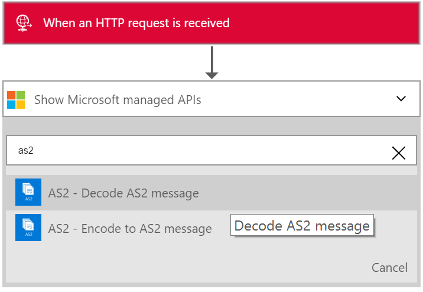
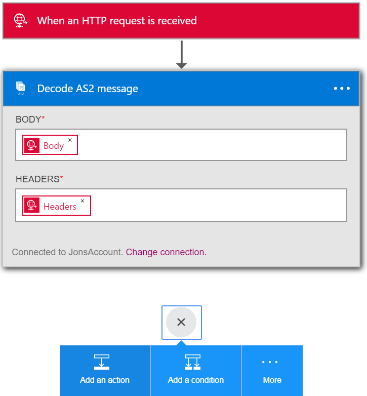
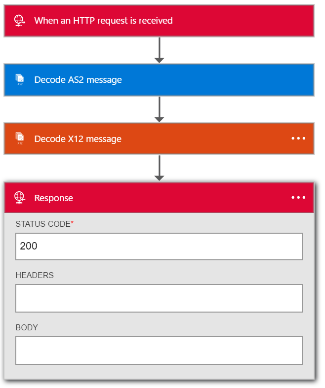

<properties 
    pageTitle="Créer des solutions B2B avec Enterprise Integration Pack | Service d’application Microsoft Azure | Microsoft Azure" 
    description="En savoir plus sur la réception de données en utilisant les fonctionnalités B2B le Pack de l’intégration d’entreprise" 
    services="logic-apps" 
    documentationCenter=".net,nodejs,java"
    authors="msftman" 
    manager="erikre" 
    editor="cgronlun"/>

<tags 
    ms.service="logic-apps" 
    ms.workload="integration" 
    ms.tgt_pltfrm="na" 
    ms.devlang="na" 
    ms.topic="article" 
    ms.date="07/08/2016" 
    ms.author="deonhe"/>

# En savoir plus sur la réception de données en utilisant les fonctionnalités B2B le Pack de l’intégration d’entreprise#

## Vue d’ensemble ##

Ce document fait partie de la logique applications Enterprise Integration Pack. Consultez la présentation pour en savoir plus sur les [fonctionnalités de l’entreprise Integration Pack](./app-service-logic-enterprise-integration-overview.md).

## Conditions préalables ##

Utiliser la AS2 et X12 actions avoir un compte de l’intégration d’entreprise

[Comment créer un compte de l’intégration d’entreprise](./app-service-logic-enterprise-integration-accounts.md)

## Comment utiliser les connecteurs logique applications B2B ##

Une fois que vous avez créé un compte de l’intégration et ajouté des partenaires et accords, vous êtes prêt à créer une application logique qui met en œuvre un flux de travail interentreprises (B2B).

Dans cette walkthru vous allez apprendre à utiliser la AS2 et X12 actions pour créer une application de logique commerciaux qui reçoit des données à partir d’un partenaire.

1. Créer une application logique et [liez-le à votre compte d’intégration](./app-service-logic-enterprise-integration-accounts.md).  
2. Ajouter un déclencheur **- demande HTTP un lors de la demande** dans votre application de logique  
  
3. Ajouter l’action **AS2 décoder** en premier la sélection **Ajouter une action**  
  
4. Entrez mot **as2** dans la zone de recherche pour filtrer toutes les actions à celui que vous souhaitez utiliser  
  
6. Sélectionnez l’action **AS2 - message AS2 coder**  
  
7. Comme indiqué, ajoutez le **corps** qui vous prendra comme entrée. Dans cet exemple, sélectionnez le corps de la requête HTTP qui a déclenché l’application logique. Vous pouvez également entrer une expression pour les en-têtes dans le champ**en-têtes** de saisie :

    @triggerOutputs()['headers']

8. Ajoutez les **en-têtes** requis pour AS2. Il s’agit dans les en-têtes de demande HTTP. Dans cet exemple, sélectionnez les en-têtes de la requête HTTP qui a déclenché l’application logique.
9. Ajoutez maintenant l’action du message décodage X12 en sélectionnant Nouveau **Ajouter une action**  
   
10. Entrez le mot **x12** dans la zone de recherche pour filtrer toutes les actions à celui que vous souhaitez utiliser  
  
11. Sélectionnez le **X12-coder X12 message** action pour l’ajouter à l’application logique  
  
12. Vous devez maintenant spécifier l’entrée à cette action qui correspond à la sortie de l’action AS2 ci-dessus. Le contenu du message réel est dans un objet JSON et est codé en base 64. Vous devez donc spécifier une expression comme l’entrée alors entrez l’expression suivante dans le champ d’entrée **X12 plane fichier MESSAGE à décoder**  

    @base64ToString(body('Decode_AS2_message')?['AS2Message']?['Content'])  

13. Cette étape sera coder la X12 données reçu par le partenaire commercial et génère un nombre d’éléments dans un objet JSON. Afin d’indiquer le partenaire de la réception des données que vous pouvez renvoyer une réponse contenant la Notification de la destruction Message AS2 (MDN) dans une Action de réponse HTTP  
14. Ajouter l’action de **réponse** en sélectionnant **Ajouter une action**   
  
15. Entrez la **réponse** de word dans la zone de recherche pour filtrer toutes les actions à celui que vous souhaitez utiliser  
  
16. Sélectionnez l’action de **réponse** à ajouter  
  
17. Définir le champ **corps** de réponse à l’aide de l’expression suivante pour accéder à la MDN depuis la sortie de l’action du **message de décodage X12**  

    @base64ToString(body('Decode_AS2_message')?['OutgoingMdn']?['Content'])  

  
18. Enregistrer votre travail  
  

À ce stade, vous avez terminé la configuration de votre application B2B logique. Dans une application réels, vous souhaiterez peut-être stocker le X12 décodée des données dans un magasin d’application ou des données métiers. Vous pouvez facilement ajouter d’autres actions pour cela ou écrire des API personnalisés afin de vous connecter à vos propres applications métier et utiliser ces API dans votre application logique.

## Fonctionnalités et des exemples d’utilisation ##

- La AS2 et X12 décoder et encoder actions vous permettent de recevoir des données à partir d’et envoyer des données aux partenaires à l’aide des protocoles standard à l’aide des applications de logique  
- Vous pouvez utiliser AS2 et X12 avec ou sans eux pour échanger des données avec des partenaires commerciaux selon les besoins
- Les actions B2B facilitent la créer des partenaires et des accords dans le compte de l’intégration et les utiliser dans une application de logique  
- En étendant votre application logique avec d’autres actions, vous pouvez envoyer et recevoir des données avec d’autres applications et services tels que SalesForce  

## Pour en savoir plus ##

[En savoir plus sur le Pack de l’intégration d’entreprise](./app-service-logic-enterprise-integration-overview.md)  