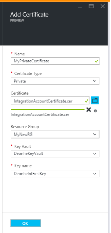
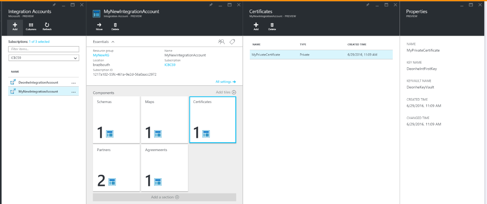

<properties
    pageTitle="L’utilisation de certificats avec Enterprise Integration Pack | Microsoft Azure"
    description="Découvrez comment utiliser des certificats avec le Pack de l’intégration d’entreprise et les applications logique"
    services="logic-apps"
    documentationCenter=".net,nodejs,java"
    authors="msftman"
    manager="erikre"
    editor="cgronlun"/>

<tags
    ms.service="logic-apps"
    ms.workload="integration"
    ms.tgt_pltfrm="na"
    ms.devlang="na"
    ms.topic="article"
    ms.date="09/06/2016"
    ms.author="deonhe"/>

# En savoir plus sur le Pack de l’intégration d’entreprise et des certificats

## Vue d’ensemble
Intégration d’entreprise utilise des certificats pour sécuriser les communications B2B. Vous pouvez utiliser deux types de certificats dans vos applications de l’intégration d’entreprise :

- Certificats publics, qui doivent être achetés auprès d’une autorité de certification (CA).
- Certificats privés, vous pouvez émettre vous-même. Ces certificats sont parfois appelés certificats auto-signé.

## Que sont les certificats ?
Les certificats sont des documents numériques pour vérifier l’identité des participants dans communications électroniques et qui également sécuriser les communications électroniques.

## Pourquoi utiliser des certificats ?
Parfois B2B communications doivent être conservées confidentielles. Intégration d’entreprise utilise des certificats pour sécuriser les communications de deux façons :

- En chiffrant le contenu des messages
- En signer numériquement les messages  

## Comment télécharger des certificats ?

### Certificats publics
Pour utiliser un *certificat public* dans vos applications logique avec fonctionnalités B2B, vous devez tout d’abord télécharger le certificat à votre compte d’intégration. Pour utiliser un *certificat auto-signé*, quant à eux, vous devez tout d’abord Téléchargez-le sur [L’archivage sécurisé de clé Azure](../key-vault/key-vault-get-started.md "en savoir plus sur l’archivage sécurisé clé").

Après avoir téléchargé un certificat, il est disponible pour vous aider à sécuriser vos messages B2B lorsque vous définissez leurs propriétés dans les [accords](./app-service-logic-enterprise-integration-agreements.md) que vous créez.  

Voici les étapes détaillées pour le téléchargement de vos certificats publics dans votre compte de l’intégration lorsque vous êtes connecté au portail Azure :

1. Sélectionnez **Parcourir**.  
      

2. Entrez **l’intégration** dans la zone de recherche de filtre, puis sélectionnez **Comptes l’intégration** de la liste des résultats.     
    

3. Sélectionnez le compte de l’intégration à laquelle vous souhaitez ajouter le certificat.  
      

4.  Sélectionnez la vignette de **certificats** .  
    

5. Dans la carte de **certificats** qui s’ouvre, sélectionnez le bouton **Ajouter** .
    

6. Entrez un **nom** pour votre certificat et sélectionnez le type de certificat. (Dans cet exemple, nous avons utilisé le type de certificat public). Sélectionnez l’icône de dossier sur le côté droit de la zone **certificat** .

7. Lorsque le sélecteur de fichier s’ouvre, recherchez et sélectionnez le fichier de certificat que vous voulez télécharger à votre compte d’intégration.

8. Sélectionnez le certificat, puis **OK** dans le sélecteur de fichier. Cela valide et télécharge le certificat à votre compte d’intégration.

8. Enfin, sur la carte **Ajouter certificat** , sélectionnez le bouton **OK** .  
      

9. Dans environ une minute, vous verrez une notification indiquant que le téléchargement de certificat est terminé.

10. Sélectionnez la vignette de **certificats** . Vous devriez voir le certificat nouvellement ajouté.  
      

### Certificats privés
Vous pouvez télécharger des certificats privés dans votre compte d’intégration en procédant comme suit :  

1. [Télécharger votre clé de l’archivage sécurisé la clé privée] (../key-vault/key-vault-get-started.md "En savoir plus sur l’archivage sécurisé clé").  

    > [AZURE.TIP] Vous devez autoriser la fonctionnalité logique applications de Service d’application Azure pour effectuer les opérations sur une clé de l’archivage sécurisé. Vous pouvez accorder l’accès à l’entité logique applications du service à l’aide de la commande PowerShell suivante :`Set-AzureRmKeyVaultAccessPolicy -VaultName 'TestcertKeyVault' -ServicePrincipalName '7cd684f4-8a78-49b0-91ec-6a35d38739ba' -PermissionsToKeys decrypt, sign, get, list`  

2. Créer un certificat privé.  

3. Téléchargez le certificat privé à votre compte d’intégration.

Une fois que vous avez suivi les étapes précédentes, vous pouvez utiliser le certificat privé pour créer des accords.

Voici les étapes détaillées pour le téléchargement de vos certificats privés dans votre compte de l’intégration lorsque vous êtes connecté au portail Azure :  

1. Sélectionnez **Parcourir**.  
        

2. Entrez **l’intégration** dans la zone de recherche de filtre, puis sélectionnez **Comptes l’intégration** de la liste des résultats.     
      

3. Sélectionnez le compte de l’intégration à laquelle vous souhaitez ajouter le certificat.  
      

4. Sélectionnez la vignette de **certificats** .  
      

5. Dans la carte de **certificats** qui s’ouvre, sélectionnez le bouton **Ajouter** .
    

6. Entrez un **nom** pour votre certificat et sélectionnez le type de certificat. (Dans cet exemple, nous avons utilisé le type de certificat public). Sélectionnez l’icône de dossier sur le côté droit de la zone **certificat** .

7. Lorsque le sélecteur de fichier s’ouvre, recherchez et sélectionnez le fichier de certificat que vous voulez télécharger à votre compte d’intégration.

8. Une fois que vous avez sélectionné le certificat, sélectionnez **OK** dans le sélecteur de fichier. Cette action valide le certificat et des téléchargements à votre compte d’intégration.

9. Enfin, sur la carte **Ajouter certificat** , sélectionnez le bouton **OK** .  
      

10. Dans environ une minute, vous verrez une notification indiquant que le téléchargement de certificat est terminé.

11. Sélectionnez la vignette de **certificats** . Vous devriez voir le certificat nouvellement ajouté.
      

Après avoir téléchargé un certificat, il est disponible pour vous aider à sécuriser vos messages B2B lorsque vous définissez leurs propriétés dans [accords](./app-service-logic-enterprise-integration-agreements.md).  

## Étapes suivantes
- [Créer une application logique qui utilise des fonctionnalités B2B](./app-service-logic-enterprise-integration-b2b.md)  
- [Créez un contrat B2B](./app-service-logic-enterprise-integration-agreements.md)  
- [En savoir plus sur l’archivage sécurisé clé] (../key-vault/key-vault-get-started.md "En savoir plus sur l’archivage sécurisé clé")  
