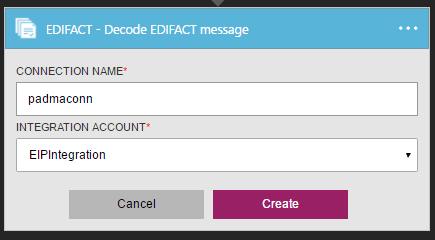
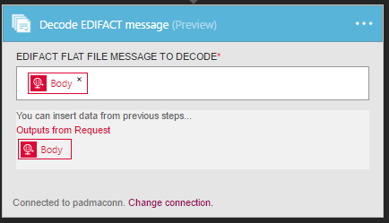

<properties 
    pageTitle="En savoir plus sur Enterprise intégration Pack coder EDIFACT Message connecteur | Service d’application Microsoft Azure | Microsoft Azure" 
    description="Découvrez comment utiliser les partenaires avec les applications Enterprise Integration Pack et logique" 
    services="logic-apps" 
    documentationCenter=".net,nodejs,java"
    authors="padmavc" 
    manager="erikre" 
    editor=""/>

<tags 
    ms.service="logic-apps" 
    ms.workload="integration" 
    ms.tgt_pltfrm="na" 
    ms.devlang="na" 
    ms.topic="article" 
    ms.date="08/15/2016" 
    ms.author="padmavc"/>

# Prise en main de décoder un Message EDIFACT

Valide EDI et des propriétés spécifiques au partenaire, génère un document XML pour chaque ensemble transaction ainsi d’accusé de réception pour transaction traitée.

## Créer la connexion

### Conditions préalables

* Un compte Azure ; Vous pouvez créer un [compte gratuit](https://azure.microsoft.com/free)

* Un compte de l’intégration est nécessaire pour utiliser le connecteur de message EDIFACT décoder. Afficher des détails sur la création d’un [Compte de l’intégration](./app-service-logic-enterprise-integration-create-integration-account.md), des [partenaires](./app-service-logic-enterprise-integration-partners.md) et [contrat EDIFACT](./app-service-logic-enterprise-integration-edifact.md)

### Se connecter à coder EDIFACT Message comme suit :

1. [Créer une application logique](./app-service-logic-create-a-logic-app.md) fournit un exemple.

2. Ce connecteur n’a pas de déclencheurs. Utiliser d’autres déclencheurs pour démarrer l’application logique, par exemple un déclencheur demande.  Dans le concepteur logique application, ajoutez un déclencheur et ajoutez une action.  Sélectionnez Afficher Microsoft API gérées dans le menu déroulant de la liste, puis entrez « EDIFACT » dans la zone de recherche.  Sélectionnez coder Message EDIFACT

    
    
3. Si vous n’avez pas encore créé toutes les connexions au compte de l’intégration, vous êtes invité aux détails de connexion

      

4. Entrez les détails du compte de l’intégration.  Propriétés d’un astérisque sont requises

  	| Propriété | Plus d’informations |
  	| -------- | ------- |
  	| Nom de la connexion * | Entrez un nom pour votre connexion |
  	| Intégration compte * | Entrez le nom du compte de l’intégration. Assurez-vous que votre compte de l’intégration et application logique sont au même emplacement Azure |

    Une fois terminé, vos informations de connexion se présenter comme suit

      

5. Sélectionnez **créer**

6. Notez que la connexion a été créée

      

7. Sélectionnez message de fichier plat EDIFACT décoder

      

## EDIFACT coder signifie suivant

* Résoudre l’accord en correspondance le qualificatif expéditeur & identificateur et qualificatif récepteur & identificateur
* Fractionner plusieurs échanges dans un seul message en distinct.
* Valide l’enveloppe contre cotation accord partenaire
* Que l’ensemble l’échange.
* Valide EDI et des propriétés spécifiques au partenaire inclut
    * Validation de la structure de l’enveloppe échange.
    * Validation du schéma de l’enveloppe par rapport au schéma de contrôle.
    * Validation du schéma des éléments de données de l’ensemble de transactions par rapport au schéma de message.
    * Validation EDI effectuée sur des éléments de données du jeu de transaction
* Vérifie que les numéros de contrôle de jeu échange, les groupes et les transactions ne sont pas les doublons (le cas échéant) 
    * Vérifie le numéro de contrôle d’échange contre les échanges reçus précédemment. 
    * Vérifier le nombre de contrôle de groupe par rapport à d’autres numéros de contrôle de groupe dans l’échange. 
    * Vérifie que la transaction définie le nombre de contrôle par rapport à d’autres numéros de contrôle de jeu de transactions dans ce groupe.
* Génère un document XML pour chaque ensemble de transactions.
* Convertit l’échange entière au format XML 
    * Échange de fractionnement en tant que transaction jeux - suspendre des jeux de transactions erreur : analyse de chaque transaction définie dans un échange dans un document XML distinct. Si un ou plusieurs jeux de transactions dans l’échange échoue à la validation, puis EDIFACT coder n'interrompt que les jeux de transaction. 
    * Échange de fractionnement en tant que transaction jeux - suspendre échange erreur : analyse de chaque transaction définie dans un échange dans un document XML distinct.  Si un ou plusieurs jeux de transactions dans l’échange échoue à la validation, puis EDIFACT coder interrompt l’échange entière.
    * Conserver échange - suspendre les jeux de transactions erreur : crée un document XML pour l’échange par lots entière. EDIFACT coder interrompt uniquement les jeux de transaction qui échouent à la validation, tout en continuant à traiter tous les autres ensembles de transaction
    * Conserver échange - suspendre échange erreur : crée un document XML pour l’échange par lots entière. Si un ou plusieurs jeux de transactions dans l’échange échoue à la validation, puis EDIFACT coder interrompt l’échange entière, 
* Génère une technique (contrôle) et/ou un accusé de réception fonctionnel (le cas échéant).
    * Un accusé de réception technique ou la CONTRL ACK signale les résultats d’une vérification syntaxique de l’échange de reçu complète.
    * Un accusé de réception fonctionnel reconnaît accepter ou refuser un échange reçu ou un groupe

## Étapes suivantes

[En savoir plus sur le Pack de l’intégration d’entreprise] (./app-service-logic-enterprise-integration-overview.md "En savoir plus sur le Pack de l’intégration d’entreprise") 