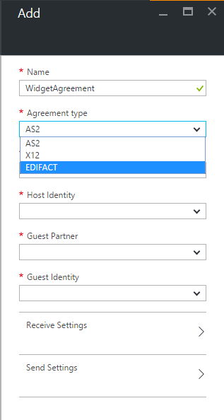
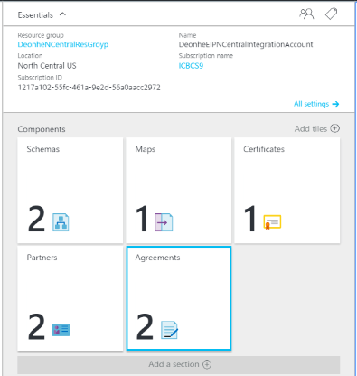

<properties 
    pageTitle="Intégration d’entreprise avec EDIFACT | Microsoft Azure" 
    description="Découvrez comment utiliser accords EDIFACT pour créer des applications de logique" 
    services="logic-apps" 
    documentationCenter=".net,nodejs,java"
    authors="jeffhollan" 
    manager="erikre" 
    editor="cgronlun"/>

<tags 
    ms.service="app-service-logic" 
    ms.workload="integration" 
    ms.tgt_pltfrm="na" 
    ms.devlang="na" 
    ms.topic="article" 
    ms.date="07/26/2016" 
    ms.author="jonfan"/>

# Intégration d’entreprise avec EDIFACT 

> [AZURE.NOTE] Cette page aborde les fonctionnalités EDIFACT des applications logique. Pour plus d’informations sur X12 cliquez [ici](app-service-logic-enterprise-integration-x12.md).

## Créer un contrat EDIFACT 
Avant de pouvoir échanger des messages EDIFACT, vous devez créer un accord EDIFACT et le stocker dans votre compte d’intégration. Les étapes suivantes vous guidera tout au long du processus de création d’un contrat EDIFACT.

### Voici ce dont vous avez besoin avant de commencer
- Un [compte de l’intégration](./app-service-logic-enterprise-integration-accounts.md) défini dans votre abonnement Azure  
- Au moins deux [partenaires](./app-service-logic-enterprise-integration-partners.md) déjà défini dans votre compte de l’intégration  

>[AZURE.NOTE]Lorsque vous créez un contrat, le contenu dans les messages que vous sera que recevoir/envoyer vers et depuis le partenaire doit correspondre au type de contrat.    

Une fois que vous avez [créé un compte de l’intégration](./app-service-logic-enterprise-integration-accounts.md) et [ajouté des partenaires](./app-service-logic-enterprise-integration-partners.md), vous pouvez créer un accord EDIFACT en procédant comme suit :  

### Dans la page d’accueil du portail Azure

Après la connexion au [portail Azure](http://portal.azure.com "Azure portail"):  
1. Dans le menu de gauche, sélectionnez **Parcourir** .  

>[AZURE.TIP]Si vous ne voyez pas le lien **Parcourir** , vous devrez peut-être développer tout d’abord le menu. Pour ce faire, cliquez sur le lien **Afficher le menu** situé en haut à gauche du menu réduit.  

    
2. Tapez *intégration* dans la zone de recherche de filtre, puis sélectionnez **L’intégration des comptes** dans la liste des résultats.       
    
3. Dans la carte de **L’intégration des comptes** qui s’ouvre, sélectionnez le compte de l’intégration dans laquelle vous créerez le contrat. Si vous ne voyez pas l’intégration des comptes de listes, [créer un premier](./app-service-logic-enterprise-integration-accounts.md "All about integration accounts").  
  
4.  Sélectionnez la vignette **accords** . Si vous ne voyez pas la vignette accords, tout d’abord l’ajouter.   
     
5. Sélectionnez le bouton **Ajouter** dans la carte accords qui s’ouvre.  
  
6. Entrez un **nom** pour votre contrat, puis cliquez sur le **type d’accord** pour EDIFACT, **Partenaire d’accueil**, **Identité de l’hôte**, **Partenaire invité**, **Identité invité**, dans la carte accords qui s’ouvre.  
  
7. Une fois que vous avez défini les propriétés de l’accord, sélectionnez **Paramètres de réception** pour configurer la façon dont les messages reçus via ce contrat doivent être résolu.  
8. Le contrôle de paramètres de réception est divisé en sections suivantes, y compris les identificateurs, accusé de réception, schémas, numéros de contrôle, Validation, paramètres internes et traitement par lots. Configurer ces propriétés en fonction de votre contrat avec le partenaire que vous échangez des messages à l’aide. Voici un aperçu de ces contrôles, configurez les modalités de ce contrat pour identifier et gérer les messages entrants en fonction :  
  
9. Sélectionnez le bouton **OK** pour enregistrer vos paramètres.  

### Identificateurs

|Propriété|Description |
|---|---|
|UNB6.1 (mot de passe destinataire référence)|Entrez une valeur alphanumérique comprise entre 1 et 14 caractères.|
|UNB6.2 (référence destinataire délimiteurs)|Entrez une valeur alphanumérique avec au moins un caractère et un maximum de deux caractères.|

### Accusés de réception 

|Propriété|Description |
|----|----|
|Accusé de réception du Message (commande)|Sélectionnez cette case à cocher pour renvoyer un accusé de réception (commande) technique à l’expéditeur d’échange. L’accusé de réception est envoyé à l’expéditeur échange basé sur les paramètres d’envoi pour le contrat.|
|Accusé de réception (commande)|Sélectionnez cette case à cocher pour renvoyer un accusé de réception (commande) fonctionnel à l’expéditeur échange l’accusé de réception est envoyé à l’expéditeur échange basé sur les paramètres d’envoi pour le contrat.|

### Schémas

|Propriété|Description |
|----|----|
|UNH2.1 (TYPE)|Sélectionnez un type de jeu transaction.|
|UNH2.2 (VERSION)|Entrez le numéro de version de message. (Minimum, un caractère ; maximum, trois caractères).|
|UNH2.3 (VERSION FINALE)|Entrez le numéro de version finale du message. (Minimum, un caractère ; maximum, trois caractères).|
|UNH2.5 (CODE ASSOCIÉ AFFECTÉE)|Entrez le code attribué. (Maximum, six caractères. Doit être alphanumérique).|
|UNG2.1 (APPLICATION EXPÉDITEUR ID)|Entrez une valeur alphanumérique avec au moins un caractère et un maximum de 35 caractères.|
|UNG2.2 (APPLICATION EXPÉDITEUR CODE QUALIFICATIF)|Entrez une valeur alphanumérique, avec un maximum de quatre caractères.|
|SCHÉMA|Sélectionnez le schéma précédemment téléchargé que vous souhaitez utiliser à partir de votre compte de l’intégration associé.|

### Numéros de contrôle

|Propriété|Description |
|----|----|
|Ne pas autoriser les doublons Interchange un numéro de contrôle|Cochez cette case pour bloquer les échanges en double. Si sélectionné, l’Action de décoder EDIFACT vérifie que le numéro de contrôle d’échange (UNB5) pour l’échange reçu ne correspond pas à un numéro de contrôle échange précédemment traitées. Si une correspondance est détectée, puis le l’échange n’est pas traité.
|Vérifier la présence de doublons UNB5 tous les (jours)|Si vous choisi pour ne pas autoriser les numéros de contrôle d’échange en double, vous pouvez spécifier le nombre de jours à laquelle la case à cocher est exécutée en donnant la valeur appropriée pour l’option **Check for UNB5 en double tous les (jours)** .|
|Ne pas autoriser les doublons numéros de contrôle de groupe|Cochez cette case pour bloquer les échanges avec des numéros de contrôle de groupe en double (UNG5).|
|Ne pas autoriser les doublons numéros Transaction jeu de contrôle|Cochez cette case pour bloquer les échanges au transaction en double définir les numéros de contrôle (UNH1).|
|Numéro de contrôle EDIFACT accusé de réception|Pour définir les numéros de référence transaction jeu à utiliser dans un accusé de réception, tapez une valeur pour le préfixe et suffixe une plage de numéros de référence.|

### Validations

|Propriété|Description |
|----|----|
|Type de message|Spécifier le type de message. À la fin de chaque ligne de validation, un autre est automatiquement ajouté. Si aucune règle n’est spécifiés, la ligne marquée comme valeur par défaut est utilisée pour la validation.|
|Validation EDI|Activez cette case à cocher pour effectuer une validation EDI sur les types de données, telle que définie par les propriétés EDI du schéma, des restrictions de longueur, des éléments de données vide et des séparateurs à droite.|
|Validation étendue|Activez cette case à cocher pour activer la validation (XSD) étendue d’échanges reçus à partir de l’expéditeur échange. Cela inclut la validation de champ longueur, caractère facultatif et nombre de répétitions en plus de validation de type de données XSD.|
|Autoriser les zéros de début ou de fin|Sélectionnez **Autoriser** pour autoriser l’interligne/zéros ; **Non autorisé** à ne pas autoriser interligne/zéros de fin, ou **découper** pour ajuster l’interligne et de fin zéros.|
|Découper les zéros de début ou de fin|Activez cette case à cocher pour découper les zéros de début ou de fin|
|Stratégie séparateur à droite|Si vous ne souhaitez pas autoriser les délimiteurs et séparateurs dans un échange reçu de l’expéditeur échange, sélectionnez **Non autorisé** . Si l’échange contient les séparateurs et séparateurs, il est déclaré non valides. Sélectionnez **facultatif** pour accepter les échanges avec ou sans les séparateurs et séparateurs. Sélectionnez **obligatoire** si l’échange reçu doit contenir les séparateurs et séparateurs.|

### Paramètres internes

|Propriété|Description |
|----|----|
|Créer des balises XML vides si les séparateurs sont autorisés|Activez cette case à cocher pour que l’expéditeur échange inclut des balises XML vides pour les séparateurs à droite.|
|Processus de traitement par lots entrant|Les options incluent :  **Échange de fractionnement en tant que Transaction jeux - suspendre des jeux de transactions erreur**: analyse de chaque transaction définie dans un échange dans un document XML distinct en appliquant l’enveloppe appropriée pour l’ensemble de transactions. Avec cette option, si un ou plusieurs jeux de transactions dans l’échange échoue à la validation, puis que les jeux de transaction sont suspendus. Échange de fractionnement en tant que Transaction jeux - suspendre échange erreur : analyse de chaque transaction définie dans un échange dans un document XML distinct en appliquant l’enveloppe appropriée. Avec cette option, si un ou plusieurs transaction affecte dans l’échange échouent à la validation, puis l’échange entière sera suspendu.  **Conserver échange - suspendre des jeux de transactions erreur**: laisse l’échange intacts, création d’un document XML pour l’échange groupée entière. Avec cette option, si un ou plusieurs jeux de transactions dans l’échange échoue à la validation, puis que les jeux de transaction sont suspendus, tandis que tous les autres ensembles de transaction sont traités.  **Conserver échange - suspendre échange erreur**: laisse l’échange intacts, création d’un document XML pour l’échange groupée entière. Avec cette option, si un ou plusieurs transaction affecte dans l’échange échouent à la validation, puis l’échange entière est suspendue.|

Votre contrat est prêt à gérer les messages entrants sont conformes aux paramètres que vous avez sélectionné.

Pour configurer les paramètres qui gèrent les messages que vous envoyez pour les partenaires :  
10. Sélectionnez **Paramètres d’envoi** pour configurer la façon dont les messages envoyés par le biais ce contrat doivent être résolu.  

Le contrôle des paramètres d’envoi est divisé en sections suivantes, y compris les identificateurs, accusé de réception, schémas, enveloppes, les jeux de caractères et séparateurs, numéros de contrôle et la Validation. 

Voici un aperçu de ces contrôles. Effectuez les sélections en fonction de la manière dont vous souhaitez gérer les messages que vous envoyez aux partenaires via ce contrat :   
    
11. Sélectionnez le bouton **OK** pour enregistrer vos paramètres.  

### Identificateurs
|Propriété|Description |
|----|----|
|UNB1.2 (version de syntaxe)|Sélectionnez une valeur comprise entre **1** et **4**.|
|UNB2.3 (adresse routage inverse expéditeur)|Entrez une valeur alphanumérique avec au moins un caractère et un maximum de 14 caractères.|
|UNB3.3 (routage inverse destinataire adresse)|Entrez une valeur alphanumérique avec au moins un caractère et un maximum de 14 caractères.|
|UNB6.1 (mot de passe destinataire référence)|Entrez une valeur alphanumérique avec au moins un et un maximum de 14 caractères.|
|UNB6.2 (référence destinataire qualificatif)|Entrez une valeur alphanumérique avec au moins un caractère et un maximum de deux caractères.|
|UNB7 (Application référence ID)|Entrez une valeur avec un minimum d’un caractère et un maximum de 14 caractères alphanumérique|

### Accusé de réception
|Propriété|Description |
|----|----|
|Accusé de réception du Message (commande)|Activez cette case à cocher si le partenaire hébergé attend de recevoir pour recevoir un accusé de réception (commande) technique. Ce paramètre spécifie que le partenaire hébergé, qui envoie le message, demande d’accusé de réception du partenaire invité.|
|Accusé de réception (commande)|Activez cette case à cocher si le partenaire hébergé attend de recevoir un accusé de réception (commande) fonctionnelle. Ce paramètre spécifie que le partenaire hébergé, qui envoie le message, demande d’accusé de réception du partenaire invité.|
|Générer SG1/SG4 boucle pour les jeux de transaction acceptée|Si vous avez choisi demander un accusé de réception fonctionnel, sélectionnez cette case à cocher pour forcer la génération de boucles SG1/SG4 dans opérationnelles de commande pour les jeux de transaction acceptée.|

### Schémas
|Propriété|Description |
|----|----|
|UNH2.1 (TYPE)|Sélectionnez un type de jeu transaction.|
|UNH2.2 (VERSION)|Entrez le numéro de version de message.|
|UNH2.3 (VERSION FINALE)|Entrez le numéro de version finale du message.|
|SCHÉMA|Sélectionnez le schéma à utiliser. Schémas se trouvent dans votre compte d’intégration. Pour accéder à vos schémas, lier tout d’abord votre compte de l’intégration à votre application logique.|

### Enveloppes
|Propriété|Description |
|----|----|
|UNB8 (Code de priorité de traitement)|Entrez une valeur alphabétique qui n’est pas plus d’un caractère.|
|UNB10 (accord de Communication)|Entrez une valeur alphanumérique avec au moins un caractère et un maximum de 40 caractères.|
|UNB11 (Test indicateur)|Cochez cette case pour indiquer que l’échange généré est données de test|
|Appliquer des segments UNA (Service chaîne conseils)|Sélectionnez cette case à cocher pour générer un segment UNA pour l’échange soient envoyées.|
|Appliquer des Segments UNG (en-tête de groupe fonction)|Sélectionnez cette case à cocher pour créer des segments de regroupement dans l’en-tête de groupe fonctionnel dans les messages envoyés au partenaire invité. Les valeurs suivantes sont utilisées pour créer les segments UNG :  Pour **UNG1**, entrez une valeur avec un minimum d’un caractère et un maximum de six caractères alphanumérique.  Pour **UNG2.1**, entrez une valeur alphanumérique avec au moins un caractère et un maximum de 35 caractères.  Pour **UNG2.2**, entrez une valeur alphanumérique, avec un maximum de quatre caractères.  Pour **UNG3.1**, entrez une valeur alphanumérique avec au moins un caractère et un maximum de 35 caractères.  Pour **UNG3.2**, entrez une valeur alphanumérique, avec un maximum de quatre caractères.  Pour **UNG6**, entrez une valeur alphanumérique avec au moins un et trois caractères au maximum.  Pour **UNG7.1**, entrez une valeur alphanumérique avec au moins un caractère et un maximum de trois caractères.  Pour **UNG7.2**, entrez une valeur alphanumérique avec au moins un caractère et un maximum de trois caractères.  Pour **UNG7.3**, entrez une valeur avec un minimum de 1 caractère et un maximum de 6 caractères alphanumérique.  Pour **UNG8**, entrez une valeur alphanumérique avec au moins un caractère et un maximum de 14 caractères.|

### En-têtes et séparateurs de jeux de caractères
Autres que le jeu de caractères, vous pouvez entrer un autre jeu de séparateurs à utiliser pour chaque type de message. Si un jeu de caractères n’est pas définie pour un schéma de message donné, le jeu de caractères par défaut est utilisé.

|Propriété|Description |
|----|----|
|UNB1.1 (identificateur système)|Sélectionnez le caractère EDIFACT valeur soient appliquées sur l’échange sortant.|
|Schéma|Sélectionnez un schéma dans la liste déroulante. Une nouvelle ligne sera ajoutée que chaque ligne est terminée. Pour le schéma sélectionné, sélectionnez les séparateurs définis pour être utilisés :  **Séparateur d’éléments composant** – entrer un caractère unique pour séparer les éléments de données composite.  **Séparateur d’élément de données** – entrer un caractère unique pour séparer les éléments de données simple au sein des éléments de données composites.    **Caractère de remplacement** – Activez cette case à cocher si les caractères de la charge utile contient des données qui sont également utilisés comme données, un segment ou séparateurs composant. Vous pouvez ensuite entrer un caractère de remplacement. Lorsqu’il génère le message EDIFACT sortant, toutes les instances de caractères de séparation dans les données de charge utile sont remplacées par le caractère spécifié.  **Terminateur de segment** – entrer un caractère unique pour indiquer la fin d’un segment EDI.  **Suffixe** – sélectionner le caractère qui est utilisé avec l’identificateur de segment. Si vous désignez un suffixe, l’élément de données de début/fin segment peut être vide. Si le terminateur de segment est vide, vous devez désigner un suffixe.|

### Numéros de contrôle
|Propriété|Description |
|----|----|
|UNB5 (numéro de contrôle d’échange)|Entrez un préfixe, une plage de valeurs pour le numéro de contrôle d’échange et un suffixe. Ces valeurs sont utilisées pour générer un échange sortant. Le préfixe et suffixe sont facultatifs ; le numéro de contrôle est requis. Le numéro de contrôle est augmenté pour chaque nouveau message ; le préfixe et suffixe restent identiques.|
|UNG5 (numéro de contrôle du groupe)|Entrez un préfixe, une plage de valeurs pour le numéro de contrôle d’échange et un suffixe. Ces valeurs sont utilisées pour générer le numéro de contrôle de groupe. Le préfixe et suffixe sont facultatifs ; le numéro de contrôle est requis. Le numéro de contrôle est augmenté pour chaque nouveau message jusqu'à ce que la valeur maximale est atteint ; le préfixe et suffixe restent identiques.|
|UNH1 (numéro de référence de l’en-tête de Message)|Entrez un préfixe, une plage de valeurs pour le numéro de contrôle d’échange et un suffixe. Ces valeurs sont utilisées pour générer le numéro de référence de l’en-tête de message. Le préfixe et suffixe sont facultatifs ; le numéro de référence est requis. Le numéro de référence est augmenté pour chaque nouveau message ; le préfixe et suffixe restent identiques.|

### Validations
|Propriété|Description |
|----|----|
|Type de message|Cette option permet la validation du récepteur échange. Cette validation effectue une validation EDI sur des éléments de données de l’ensemble de transactions, validation des types de données, les restrictions de longueur et les éléments de données vide et séparateurs de formation.|
|Validation EDI|Activez cette case à cocher pour effectuer une validation EDI sur les types de données, telle que définie par les propriétés EDI du schéma, des restrictions de longueur, des éléments de données vide et des séparateurs à droite.|
|Validation étendue|Cette option permet une validation étendue d’échanges reçus à partir de l’expéditeur échange. Cela inclut la validation de champ longueur, caractère facultatif et nombre de répétitions en plus de validation de type de données XSD. Vous pouvez activer la validation extension sans activer la validation EDI, ou vice versa.|
|Autoriser les zéros de début/fin|Cette option indique qu’un échange EDI reçu de la partie n’échoue pas validation si un élément de données dans un échange EDI n’est pas conforme à sa longueur requise en raison des ou les espaces de fin, mais est conforme à son exigence de longueur lorsqu’ils sont supprimés.|
|Découper les zéros de début ou de fin|Cette option va réduire les zéros de début et de fin.|
|Séparateur de fin|Cette option spécifie un échange EDI reçu de la partie n’échoue pas validation si un élément de données dans un échange EDI ne respecte pas ses longueur requise en raison de zéros de début (ou de fin) ou des espaces de fin, mais est conforme à son exigence de longueur lorsqu’ils sont supprimés.  Si vous ne souhaitez pas autoriser les séparateurs et séparateurs dans un échange reçu de l’expéditeur échange, sélectionnez **Non autorisé** . Si l’échange contient les séparateurs et séparateurs, il est déclaré non valides.  Sélectionnez **facultatif** pour accepter les échanges avec ou sans les séparateurs et séparateurs.  Sélectionnez **obligatoire** si l’échange reçu doit contenir les séparateurs et séparateurs.|

Une fois que vous sélectionnez **OK** dans la carte ouverte :  
12. Sélectionnez la vignette **accords** sur la carte de compte de l’intégration et vous verrez l’accord nouvellement ajouté répertorié.  
   

## Pour en savoir plus
- [En savoir plus sur le Pack de l’intégration d’entreprise] (./app-service-logic-enterprise-integration-overview.md "En savoir plus sur le Pack de l’intégration d’entreprise")  
