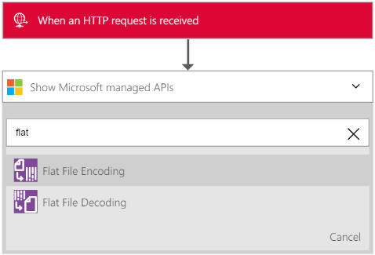

<properties
    pageTitle="Apprendre à coder ou décoder plats fichiers en utilisant les applications Enterprise Integration Pack et logique | Service d’application Microsoft Azure | Microsoft Azure"
    description="Utiliser les fonctionnalités des applications d’entreprise Integration Pack et logique à coder ou décoder fichiers plats"
    services="app-service\logic"
    documentationCenter=".net,nodejs,java"
    authors="msftman"
    manager="erikre"
    editor="cgronlun"/>

<tags 
    ms.service="logic-apps" 
    ms.workload="integration" 
    ms.tgt_pltfrm="na" 
    ms.devlang="na" 
    ms.topic="article" 
    ms.date="07/08/2016" 
    ms.author="deonhe"/>

# Intégration d’entreprise avec des fichiers plats

## Vue d’ensemble

Vous voudrez peut-être coder le contenu XML avant de l’envoyer à un partenaire commercial dans un scénario (B2B) entreprise-entreprise. Dans une application logique effectuée par la fonctionnalité logique applications du Service application Azure, vous pouvez utiliser le connecteur d’encodage du fichier plat pour effectuer cette action. L’application logique que vous créez accessible son XML contenu à partir d’une variété de sources, notamment à partir d’un déclencheur de demande HTTP, à partir d’une autre application ou même à partir d’un des nombreux [connecteurs](../connectors/apis-list.md). Pour plus d’informations sur les applications logique, consultez la [documentation d’applications logique](./app-service-logic-what-are-logic-apps.md "en savoir plus sur les applications logique").  

## Comment créer le connecteur d’encodage du fichier plat

Suivez ces étapes pour ajouter un connecteur à votre application logique d’encodage du fichier plat.

1. Créer une application logique et [liez-le à votre compte de l’intégration](./app-service-logic-enterprise-integration-accounts.md "apprendre à lier un compte de l’intégration à une application logique"). Ce compte contient le schéma que vous utiliserez pour coder les données XML.  
2. Ajouter un déclencheur **- demande HTTP un lors de la demande** dans votre application logique.  
    
3. Ajoutez le fichier plat codage action, comme suit :

    un. Sélectionnez le signe **plus** .

    b. Sélectionnez le lien **Ajouter une action** (apparaît après avoir sélectionné le signe plus).

    c. Dans la zone Rechercher, entrez *plat* pour filtrer toutes les actions à celui que vous voulez utiliser.

    d. Sélectionnez l’option **Codage de fichier plat** à partir de la liste.   
   
4. Dans la boîte de dialogue **Codage de fichier plat** , sélectionnez la zone de texte **contenu** .  
  
5. Sélectionnez la balise de corps en tant que le contenu que vous souhaitez coder. La balise de corps remplit le champ de contenu.     
  
6. Sélectionnez la zone de liste **Nom de schéma** , puis sélectionnez le schéma que vous voulez utiliser pour coder le contenu d’entrée.    
  
7. Enregistrez votre travail.   
  

À ce stade, vous avez terminé la configuration de votre lien codage de fichier plat. Dans une application réels, vous souhaitez peut-être stocker les données au format dans une application métier, par exemple Salesforce. Ou vous pouvez envoyer que les données au format à un commercial partenaire. Vous pouvez facilement ajouter une action pour envoyer la sortie de l’action codage à force de vente, ou à votre interlocuteur, à l’aide de l’une des autres connecteurs fourni.

Vous pouvez maintenant tester le lien en effectuant une demande au point de terminaison HTTP, y compris le contenu XML dans le corps de la demande.  

## Comment créer le fichier plat décodage connecteur

>[AZURE.NOTE] Pour effectuer cette procédure, vous devez disposer d’un fichier de schéma déjà téléchargé dans votre compte d’intégration.

1. Ajouter un déclencheur **- demande HTTP un lors de la demande** dans votre application logique.  
    
2. Ajoutez le fichier plat décodage action, comme suit :

    un. Sélectionnez le signe **plus** .

    b. Sélectionnez le lien **Ajouter une action** (apparaît après avoir sélectionné le signe plus).

    c. Dans la zone Rechercher, entrez *plat* pour filtrer toutes les actions à celui que vous voulez utiliser.

    d. Sélectionnez l’option **Décodage de fichier plat** à partir de la liste.   
   
- Sélectionnez le contrôle de **contenu** . Vous obtenez une liste du contenu à partir des étapes précédentes que vous pouvez utiliser en tant que le contenu à coder. Notez que le *corps* de la requête HTTP entrante n’est pas disponible pour être utilisé comme contenu pour décoder. Vous pouvez également entrer le contenu à coder directement dans le contrôle de **contenu** .     
- Sélectionnez la balise de *corps* . Avez-vous remarqué que la balise de corps figure à présent dans le contrôle de **contenu** .
- Sélectionnez le nom du schéma que vous souhaitez utiliser pour décoder le contenu. La capture d’écran suivante montre que *OrderFile* est le nom de schéma sélectionné. Ce nom de schéma a été téléchargé dans le compte de l’intégration précédemment.

     
- Enregistrez votre travail.  
    

À ce stade, vous avez terminé la configuration de votre fichier plat décodage connecteur. Dans une application réels, vous souhaiterez stocker les données décodées dans une application métier de tels que Salesforce. Vous pouvez facilement ajouter une action pour envoyer le résultat de l’action décodage à force de vente.

Vous pouvez maintenant tester le lien en effectuant une demande au point de terminaison HTTP, y compris le contenu XML à coder dans le corps de la demande.  

## Étapes suivantes
- [En savoir plus sur le Pack de l’intégration d’entreprise] (./app-service-logic-enterprise-integration-overview.md "En savoir plus sur le Pack de l’intégration d’entreprise").  
