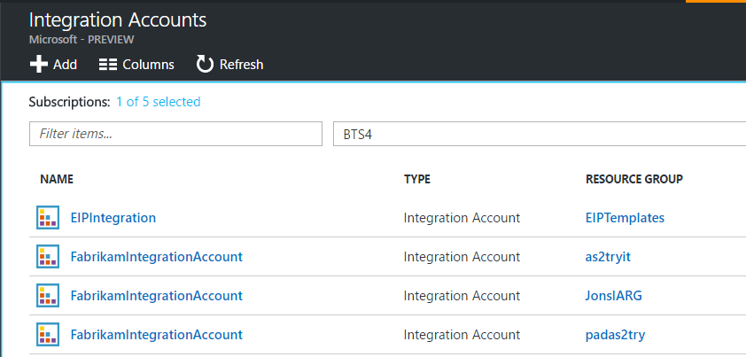
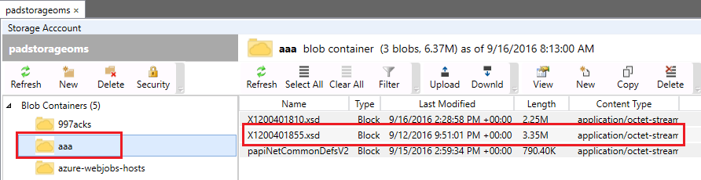
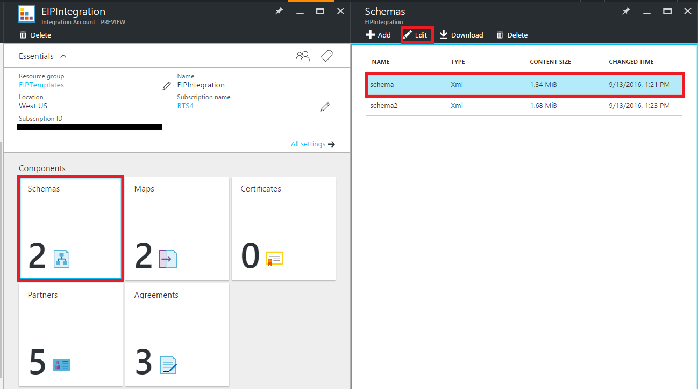

<properties
    pageTitle="Vue d’ensemble des schémas et de l’entreprise Integration Pack | Microsoft Azure"
    description="Découvrez comment utiliser des schémas avec les applications Enterprise Integration Pack et logique"
    services="logic-apps"
    documentationCenter=".net,nodejs,java"
    authors="msftman"
    manager="erikre"
    editor="cgronlun"/>

<tags
    ms.service="logic-apps"
    ms.workload="integration"
    ms.tgt_pltfrm="na"
    ms.devlang="na"
    ms.topic="article"
    ms.date="07/29/2016"
    ms.author="deonhe"/>

# Découvrez les schémas et le Pack de l’intégration d’entreprise  

## Pourquoi utiliser un schéma ?
Utiliser des schémas pour confirmer que vous recevez des documents XML sont valides, avec les données attendues dans un format prédéfini. Schémas sont utilisés pour valider les messages échangés dans un scénario B2B.

## Ajouter un schéma
À partir du portail Azure :  

1. Sélectionnez **plusieurs services**.  
    

2. Dans la zone de recherche filtre, entrez **l’intégration**, puis sélectionnez **Comptes l’intégration** de la liste des résultats.     
  
3. Sélectionnez le **compte de l’intégration** à laquelle vous ajoutez le schéma.    
  

4. Sélectionnez la vignette **schémas** .  
  

### Ajouter un fichier de schéma est inférieure à 2 Mo  

1. Dans la carte de **schémas** qui s’ouvre (à partir de la procédure précédente), sélectionnez **Ajouter**.  
  

2. Entrez un nom pour votre schéma. Ensuite, pour télécharger le fichier de schéma, sélectionnez l’icône de dossier en regard de la zone de texte **schéma** . Une fois que le processus de téléchargement est terminé, sélectionnez **OK**.    
  

### Ajouter un fichier de schéma supérieur à 2 Mo (avec un maximum de 8 Mo)  

Ce processus varie selon le niveau d’accès conteneur blob : **Public** ou **pas de l’accès anonyme**. Pour déterminer ce niveau d’accès, dans l' **Explorateur de stockage Azure**, sous **Conteneurs Blob**, sélectionnez le conteneur blob souhaité. Sélectionnez **sécurité**, puis sélectionnez l’onglet **Niveau d’accès** .

1. Si le niveau d’accès de sécurité blob est **Public**, procédez comme suit.  
    

    un. Télécharger le schéma de stockage, puis copiez l’URI.  
      

    b. Dans **Ajouter un schéma**, sélectionnez **fichier volumineux**et fournir le URI dans la zone de texte **URI contenu** .  
      

2. Si le niveau d’accès de sécurité blob n’est **pas l’accès anonyme**, procédez comme suit.  
    

    un. Télécharger le schéma de stockage.  
    

    b. Générer une signature d’un accès partagé pour le schéma.  
    

    c. Dans **Ajouter un schéma**, sélectionnez **fichier volumineux**et fournir la signature d’un accès partagé URI dans la zone de texte **URI contenu** .  
      

3. Dans la cuillère **schémas** du compte de l’intégration EIP, normalement, le schéma nouvellement ajouté.  

  

## Modifier des schémas
1. Sélectionnez la vignette **schémas** .  
2. Sélectionnez le schéma que vous souhaitez modifier dans la carte de **schémas** qui s’ouvre.
3. Dans la carte **schémas** , sélectionnez **Modifier**.  
    
4. Sélectionnez le fichier de schéma que vous voulez modifier à l’aide de la boîte de dialogue de sélecteur de fichier qui s’ouvre.
5. Sélectionnez **Ouvrir** dans le sélecteur de fichier.  
  
6. Vous recevez une notification indiquant que le téléchargement a réussi.  

## Supprimer des schémas
1. Sélectionnez la vignette **schémas** .  
2. Sélectionnez le schéma que vous voulez supprimer de la carte de **schémas** qui s’ouvre.  
3. Dans la carte de **schémas** , cliquez sur **Supprimer**.
  

4. Pour confirmer votre choix, sélectionnez **Oui**.  
  
5. Enfin, vous pouvez remarquer que la liste des schémas dans la carte de **schémas** actualise, le schéma que vous avez supprimée n’apparaît plus.  
    

## Étapes suivantes

- [En savoir plus sur le Pack de l’intégration d’entreprise] (./app-service-logic-enterprise-integration-overview.md "En savoir plus sur le pack de l’intégration d’entreprise").  
