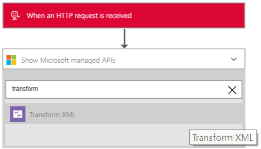

<properties 
    pageTitle="Vue d’ensemble du Pack de l’intégration d’entreprise | Service d’application Microsoft Azure | Microsoft Azure" 
    description="Les fonctionnalités d’entreprise Integration Pack permet d’activer les scénarios d’intégration et processus métier à l’aide du service de l’application Microsoft Azure" 
    services="logic-apps" 
    documentationCenter=".net,nodejs,java"
    authors="msftman" 
    manager="erikre" 
    editor="cgronlun"/>

<tags 
    ms.service="logic-apps" 
    ms.workload="integration" 
    ms.tgt_pltfrm="na" 
    ms.devlang="na" 
    ms.topic="article" 
    ms.date="07/08/2016" 
    ms.author="deonhe"/>

# Intégration d’entreprise avec transformations XML

## Vue d’ensemble
Le lien de transformation de l’intégration entreprise convertit les données d’un format dans un autre format. Par exemple, vous devrez un message entrant contenant la date du jour dans le format YearMonthDay. Vous pouvez utiliser une transformation pour remettre en forme de la date dans le format MonthDayYear.

## Que faire une transformation ?
Une transformation, qui est également connue sous une carte, est constitué d’un schéma XML Source (l’entrée) et un schéma XML cible (le résultat). Vous pouvez utiliser des fonctions différentes pour manipuler ou contrôler les données, y compris manipulations de chaînes, affectations conditionnelle, expressions arithmétiques, formateurs de temps date et même constructions en boucle.

## Comment créer une transformation ?
Vous pouvez créer une transformation/carte à l’aide du Visual Studio [SDK d’intégration d’entreprise](https://aka.ms/vsmapsandschemas). Lorsque vous avez terminé de créer et de tester la transformation, vous chargez la transformation dans votre compte de l’intégration. 

## Comment utiliser une transformation
Après avoir téléchargé la transformation dans votre compte de l’intégration, vous pouvez l’utiliser pour créer une application logique. L’application logique continuera ensuite vos transformations chaque fois que l’application logique est déclenchée (et il est saisie du contenu qui doit être transformé).

**Voici la procédure à suivre une transformation**:

### Conditions préalables 
Dans l’aperçu, vous devez :  

-  [Création d’un conteneur de fonctions Azure] (https://ms.portal.azure.com/#create/Microsoft.FunctionApp "Création d’un conteneur de fonctions Azure")  
-  [Ajouter une fonction au conteneur fonctions Azure] (https://portal.azure.com/#create/Microsoft.Template/uri/https%3A%2F%2Fraw.githubusercontent.com%2FAzure%2Fazure-quickstart-templates%2Fmaster%2F201-logic-app-transform-function%2Fazuredeploy.json "Ce modèle crée une webhook en fonction c# azure fonction avec des fonctionnalités de transformation à utiliser dans les scénarios d’intégration d’applications logique")    
-  Créer un compte de l’intégration et ajouter une carte.  

>[AZURE.TIP] Notez le nom du conteneur Azure fonctions et de la fonction Azure, vous en aurez besoin dans l’étape suivante.  

À présent que vous avez pris en charge les conditions préalables, il est temps de créer votre application logique :  

1. Créer une application logique et [liez-le à votre compte de l’intégration](./app-service-logic-enterprise-integration-accounts.md "apprendre à lier un compte de l’intégration à une application logique") qui contient le mappage.
2. Ajouter un déclencheur **- demande HTTP un lors de la demande** dans votre application de logique  
    
3. Ajouter l’action de **Transformation de code XML** en première sélection **Ajouter une action**   
   
4. Entrez le mot *transformer* dans la zone de recherche pour filtrer toutes les actions à celui que vous souhaitez utiliser  
  
5. Sélectionnez l’action de **Transformation de code XML**   
  
6. Sélectionnez le **Conteneur de la fonction** qui contient la fonction que vous allez utiliser. Il s’agit du nom du conteneur Azure fonctions que vous avez créée précédemment dans ces étapes.
7. Sélectionnez la **fonction** que vous voulez utiliser. Il s’agit du nom de la fonction Azure que vous avez créée.
8. Ajoutez le code XML **contenu** qui vous transforment. Notez que vous pouvez utiliser des données XML que vous recevez dans la demande HTTP en tant que le **contenu**. Dans cet exemple, sélectionnez le corps de la requête HTTP qui a déclenché l’application logique.
9. Sélectionnez le nom de la **carte** que vous souhaitez utiliser pour effectuer la transformation. La carte doit déjà être dans votre compte d’intégration. Dans une étape précédente, vous a déjà votre accès application logique à votre compte de l’intégration qui contient votre carte.
10. Enregistrer votre travail  
 

À ce stade, vous avez terminé la configuration de votre carte. Dans une application réels, vous souhaiterez stocker les données transformées dans une application métier tels que SalesForce. Vous pouvez facilement en tant qu’une action pour envoyer le résultat de la transformation à force de vente. 

Vous pouvez maintenant tester votre fichier de transformation en effectuant une demande au point de terminaison HTTP.  

## Fonctionnalités et des exemples d’utilisation

- La transformation créée dans une carte peut être simple, par exemple la copie d’un nom et l’adresse d’un document vers un autre. Ou bien, vous pouvez créer des transformations plus complexes utilisant les opérations de carte de l’emploi.  
- Plusieurs opérations de carte ou des fonctions sont disponibles, y compris les chaînes, les fonctions date heure et ainsi de suite.  
- Vous pouvez faire une copie de données directe entre les schémas. Dans la Mapper inclus dans le Kit de développement, il est aussi simple qu’en traçant un trait qui relie les éléments dans le schéma source avec leurs équivalents dans le schéma de destination.  
- Lorsque vous créez une carte, vous permet d’afficher une représentation graphique de la carte, montrant les relations et les liens que vous créez.
- Utilisez la fonction de plan de Test pour ajouter un exemple de message XML. D’un simple clic, vous pouvez tester le mappage que vous avez créé et voir la sortie générée.  
- Télécharger des mappages existants  
- Prend en charge au format XML.

## Pour en savoir plus
- [En savoir plus sur le Pack de l’intégration d’entreprise] (./app-service-logic-enterprise-integration-overview.md "En savoir plus sur le Pack de l’intégration d’entreprise")  
- [En savoir plus sur les cartes] (./app-service-logic-enterprise-integration-maps.md "En savoir plus sur l’intégration d’entreprise cartes")  
 