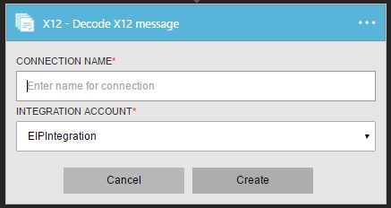
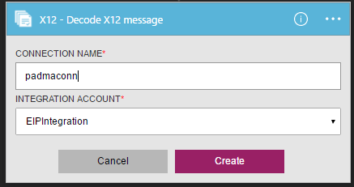
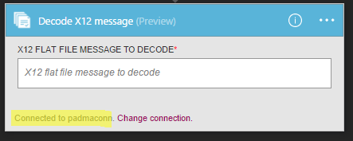
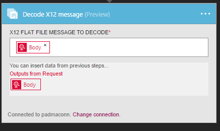

<properties 
    pageTitle="En savoir plus sur Enterprise intégration Pack coder X12 Message Connctor | Service d’application Microsoft Azure | Microsoft Azure" 
    description="Découvrez comment utiliser les partenaires avec les applications Enterprise Integration Pack et logique" 
    services="logic-apps" 
    documentationCenter=".net,nodejs,java"
    authors="padmavc" 
    manager="erikre" 
    editor=""/>

<tags 
    ms.service="logic-apps" 
    ms.workload="integration" 
    ms.tgt_pltfrm="na" 
    ms.devlang="na" 
    ms.topic="article" 
    ms.date="08/15/2016" 
    ms.author="padmavc"/>

# Prise en main décodage X12 Message

Valide EDI et des propriétés spécifiques au partenaire, génère un document XML pour chaque ensemble transaction ainsi d’accusé de réception pour transaction traitée.

## Créer la connexion

### Conditions préalables

* Un compte Azure ; Vous pouvez créer un [compte gratuit](https://azure.microsoft.com/free)

* Un compte de l’intégration est requis pour utiliser décodage X12 message connecteur. Afficher des détails sur la création d’un [Compte de l’intégration](./app-service-logic-enterprise-integration-create-integration-account.md), [partenaires](./app-service-logic-enterprise-integration-partners.md) et [X12 contrat](./app-service-logic-enterprise-integration-x12.md)

### Se connecter au Message décodage X12 à l’aide de la procédure suivante :

1. [Créer une application logique](./app-service-logic-create-a-logic-app.md) fournit un exemple

2. Ce connecteur n’a pas de déclencheurs. Utiliser d’autres déclencheurs pour démarrer l’application logique, par exemple un déclencheur demande.  Dans le concepteur logique application, ajoutez un déclencheur et ajoutez une action.  Sélectionnez Afficher Microsoft API gérées dans le menu déroulant de la liste, puis entrez « x12 » dans la zone de recherche.  Sélectionnez X12 – coder X12 Message

      

3. Si vous n’avez pas encore créé toutes les connexions au compte de l’intégration, vous êtes invité aux détails de connexion

        

4. Entrez les détails du compte de l’intégration.  Propriétés d’un astérisque sont requises

  	| Propriété | Plus d’informations |
  	| -------- | ------- |
  	| Nom de la connexion * | Entrez un nom pour votre connexion |
  	| Intégration compte * | Entrez le nom du compte de l’intégration. Assurez-vous que votre compte de l’intégration et application logique sont au même emplacement Azure |

    Une fois terminé, vos informations de connexion se présenter comme suit
    
     

5. Sélectionnez **créer**
    
6. Notez que la connexion a été créée.

     

7. Sélectionnez X12 plane message fichier décoder

     

## X12 décoder est suivant

* Valide l’enveloppe contre cotation accord partenaire
* Génère un document XML pour chaque ensemble de transactions.
* Valide EDI et des propriétés spécifiques au partenaire
    * Validation structurelle EDI et la validation de schéma étendu
    * Validation de la structure de l’enveloppe échange.
    * Validation du schéma de l’enveloppe par rapport au schéma de contrôle.
    * Validation du schéma des éléments de données de l’ensemble de transactions par rapport au schéma de message.
    * Validation EDI effectuée sur des éléments de données du jeu de transaction 
* Vérifie que les numéros de contrôle de jeu échange, les groupes et les transactions ne sont pas les doublons
    * Vérifie le numéro de contrôle d’échange contre les échanges reçus précédemment.
    * Vérifier le nombre de contrôle de groupe par rapport à d’autres numéros de contrôle de groupe dans l’échange.
    * Vérifie que la transaction définie le nombre de contrôle par rapport à d’autres numéros de contrôle de jeu de transactions dans ce groupe.
* Convertit l’échange entière au format XML 
    * Échange de fractionnement en tant que transaction jeux - suspendre des jeux de transactions erreur : analyse de chaque transaction définie dans un échange dans un document XML distinct. Si une ou plusieurs transaction affecte dans l’échange échouent à la validation, X12 décodage n'interrompt que les jeux de transaction.
    * Échange de fractionnement en tant que transaction jeux - suspendre échange erreur : analyse de chaque transaction définie dans un échange dans un document XML distinct.  Si une ou plusieurs transaction affecte dans l’échange échouent à la validation, X12 décodage interrompt l’échange entière.
    * Conserver échange - suspendre les jeux de transactions erreur : crée un document XML pour l’échange par lots entière. X12 décoder interrompt uniquement les jeux de transaction qui échouent à la validation, tout en continuant à traiter tous les autres transaction définit
    * Conserver échange - suspendre échange erreur : crée un document XML pour l’échange par lots entière. Si une ou plusieurs transaction affecte dans l’échange échouent à la validation, X12 décodage interrompt l’échange entière, 
* Génère un accusé de réception techniques et/ou fonctionnel (le cas échéant).
    * Un accusé de réception technique génère en raison de validation de l’en-tête. L’accusé de réception technique indique l’état du traitement d’un échange en-tête et le code par le destinataire adresse.
    * Un accusé de réception fonctionnel génère en raison de validation de corps. L’accusé de réception fonctionnel signale chaque erreur s’est produite lors du traitement du document reçu

## Étapes suivantes

[En savoir plus sur le Pack de l’intégration d’entreprise] (./app-service-logic-enterprise-integration-overview.md "En savoir plus sur le Pack de l’intégration d’entreprise") 

