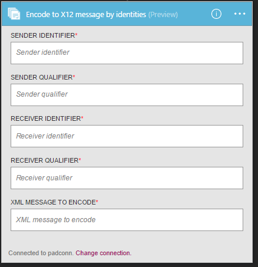

<properties 
    pageTitle="En savoir plus sur Enterprise intégration Pack Encoder X12 Message Connctor | Service d’application Microsoft Azure | Microsoft Azure" 
    description="Découvrez comment utiliser les partenaires avec les applications Enterprise Integration Pack et logique" 
    services="logic-apps" 
    documentationCenter=".net,nodejs,java"
    authors="padmavc" 
    manager="erikre" 
    editor=""/>

<tags 
    ms.service="logic-apps" 
    ms.workload="integration" 
    ms.tgt_pltfrm="na" 
    ms.devlang="na" 
    ms.topic="article" 
    ms.date="08/15/2016" 
    ms.author="padmavc"/>

# Prise en main Encoder X12 Message

Valide EDI et des propriétés spécifiques au partenaire, convertit les messages codés au format XML en jeux de transactions EDI dans l’échange et demande un accusé de réception technique et/ou fonctionnel

## Créer la connexion

### Conditions préalables

* Un compte Azure ; Vous pouvez créer un [compte gratuit](https://azure.microsoft.com/free)

* Un compte de l’intégration est requis pour utiliser Encoder x12 message connecteur. Afficher des détails sur la création d’un [Compte de l’intégration](./app-service-logic-enterprise-integration-create-integration-account.md), [partenaires](./app-service-logic-enterprise-integration-partners.md) et [X12 contrat](./app-service-logic-enterprise-integration-x12.md)

### Se connecter à encoder X12 Message comme suit :

1. [Créer une application logique](./app-service-logic-create-a-logic-app.md) fournit un exemple

2. Ce connecteur n’a pas de déclencheurs. Utiliser d’autres déclencheurs pour démarrer l’application logique, par exemple un déclencheur demande.  Dans le concepteur logique application, ajoutez un déclencheur et ajoutez une action.  Sélectionnez Afficher Microsoft API gérées dans le menu déroulant de la liste, puis entrez « x12 » dans la zone de recherche.  Sélectionnez soit X12-Encoder X12 Message par un nom de contrat ou X12-encoder au message X 12 par identités.  

     

3. Si vous n’avez pas encore créé toutes les connexions au compte de l’intégration, vous êtes invité aux détails de connexion

     

4. Entrez les détails du compte de l’intégration.  Propriétés d’un astérisque sont requises

  	| Propriété | Plus d’informations |
  	| -------- | ------- |
  	| Nom de la connexion * | Entrez un nom pour votre connexion |
  	| Intégration compte * | Entrez le nom du compte de l’intégration. Assurez-vous que votre compte de l’intégration et application logique sont au même emplacement Azure |

    Une fois terminé, vos informations de connexion se présenter comme suit

     

5. Sélectionnez **créer**

6. Notez que la connexion a été créée.

     

#### X12-Encoder X12 Message par le nom de l’accord

7. Sélectionnez X12 contrat à partir du message déroulants et xml à encoder.

     

#### X12-Encoder X12 Message par des identités

7.  Identificateur de l’expéditeur, délimiteurs de l’expéditeur, identificateur récepteur et qualificatif récepteur de fournir comme configuré dans le X12 contrat.  Sélectionnez message xml à encoder

     

## X12 Encoder est suivant :

* Résolution d’accord en correspondance des propriétés de contexte de l’expéditeur et du destinataire.
* Sérialise l’échange EDI, convertir les jeux de transactions EDI dans l’échange messages codée au format XML.
* S’applique segments en-tête et le code du jeu de transaction
* Génère un numéro de contrôle d’échange, un numéro de contrôle de groupe et un numéro de contrôle de jeu transaction pour chaque échange sortant
* Remplace les séparateurs dans les données de charge utile
* Valide EDI et des propriétés spécifiques au partenaire
    * Validation du schéma des éléments de données de l’ensemble de transactions contre le schéma de message
    * Validation EDI exécutée sur les éléments de données de l’ensemble de transactions.
    * Validation étendue effectuée sur des éléments de données du jeu de transaction
* Demande un accusé de réception technique et/ou fonctionnel (le cas échéant).
    * Un accusé de réception technique génère en raison de validation de l’en-tête. L’accusé de réception technique indique l’état du traitement d’un échange en-tête et le code par le destinataire adresse
    * Un accusé de réception fonctionnel génère en raison de validation de corps. L’accusé de réception fonctionnel signale chaque erreur s’est produite lors du traitement du document reçu

## Étapes suivantes

[En savoir plus sur le Pack de l’intégration d’entreprise] (./app-service-logic-enterprise-integration-overview.md "En savoir plus sur le Pack de l’intégration d’entreprise") 

